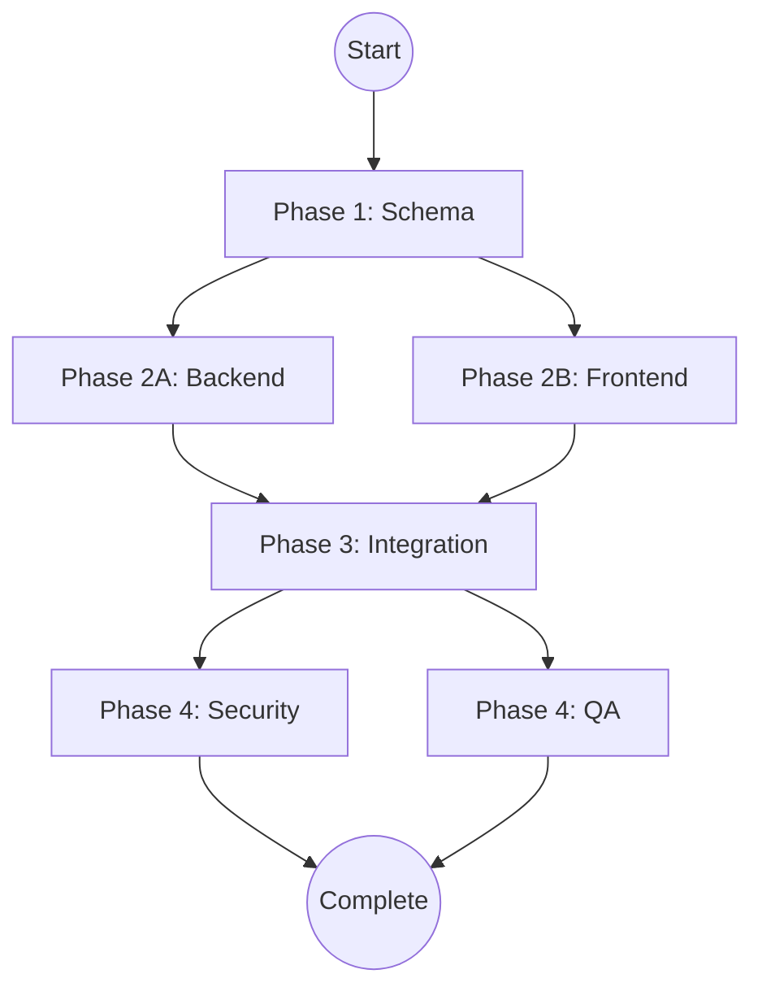

# EXECUTE-ADR: Generate Self-Driving Workflow

**Command**: `/execute-adr NNN`

**Description**: Invokes the **Orchestrator** to synthesize all ADR documentation into a **"Master Execution File"**. This file is a self-contained, executable meta-prompt that manages the entire implementation lifecycle, identifies parallel execution tracks, and contains specific context bundles for every specialized agent.

**Key Innovation**: The generated `ADR-NNN-AGENT_WORKFLOW.md` file becomes a **living, executable document**. If you paste it back into the chat later, the Orchestrator can read the "Current Status" section, understand where you are in the workflow, and resume execution from that point.

---

## 🤖 Instructions for Claude

### Step 1: 🔍 Context Ingestion

**Your Task**: Read and analyze the complete ADR blueprint.

1. **Locate Target Folder**: `docs/adrs/ADR-{NNN}-*/`
2. **Read All Blueprint Documents**:
   - `ADR-{NNN}-DECISION.md` - Extract business requirements, acceptance criteria, and success metrics
   - `ADR-{NNN}-AI_OPPORTUNITIES.md` - Extract mandatory data hooks, API requirements, and future use cases
   - `ADR-{NNN}-UX_SPEC.md` - Extract perceived performance rules, latency budgets, optimistic UI patterns
   - `ADR-{NNN}-TEST_PLAN.md` - Extract security tests, critical user flows, performance thresholds
   - `ADR-{NNN}-IMPLEMENTATION_PLAN.md` - Extract database schema, API endpoints, frontend components, phases

3. **Verify Completeness**: If any document is missing or incomplete, stop and inform the user.

---

### Step 2: 🧠 Orchestrator Agent Invocation

**System Instruction**: Act as the **`orchestrator`** agent with the following specialized capabilities:

**Your Mission**: Generate `ADR-{NNN}-AGENT_WORKFLOW.md` as an **Executable Meta-Prompt**.

**Constraint**: The output file must be structured so that:
- ✅ If pasted back into chat, the Orchestrator can resume control
- ✅ Status tracking is explicit and machine-readable
- ✅ Each agent gets a self-contained prompt bundle
- ✅ Parallel tracks are clearly identified
- ✅ Dependencies are enforced with blocking gates

---

### Step 3: 📊 Dependency Analysis (The Brain)

Analyze the IMPLEMENTATION_PLAN phases and perform the following:

#### 3.1: Identify Parallel Tracks

**Rule**: Two tasks can run in parallel if:
- They operate on different files/systems
- One does not consume the output of the other
- They have no shared database schema dependencies

**Common Parallel Patterns**:
- ✅ `postgres-jsonb-architect` (Schema) can run in parallel with `sdet-test-automation` (Test Plan)
- ✅ `backend-architecture-optimizer` (API) can run in parallel with `react-ai-ux-specialist` (UI Shell) **IF** API contract is mocked
- ❌ `backend-architecture-optimizer` (API) **CANNOT** run in parallel with `postgres-jsonb-architect` (Schema) - Schema blocks API

**Your Task**: Create a dependency graph. Output it as a Mermaid diagram in the workflow file.

#### 3.2: AI Hook Enforcement

**Critical Rule**: Any task involving backend database or API work **MUST** explicitly reference the "Mandatory Data Hooks" from `AI_OPPORTUNITIES.md`.

**How to Enforce**:
1. Find the "Data Prerequisites" or "Mandatory Hooks" section in `AI_OPPORTUNITIES.md`
2. Extract specific requirements (e.g., "User Intent Logging", "Dry Run API", "Filter Metadata")
3. In the prompt bundle for `backend-architecture-optimizer` or `postgres-jsonb-architect`, include:
   ```
   **AI ENFORCEMENT (BLOCKING)**:
   You MUST implement the following data hooks from AI_OPPORTUNITIES.md:
   - {Hook 1}: {Description}
   - {Hook 2}: {Description}

   If any hook is ambiguous, ASK CLARIFYING QUESTIONS before proceeding.
   ```

#### 3.3: UX Rule Enforcement

**Critical Rule**: Any task involving frontend work **MUST** explicitly reference the "Perceived Performance" rules from `UX_SPEC.md`.

**How to Enforce**:
1. Find the "Optimistic UI Rules", "Latency Budgets", and "Loading States" sections in `UX_SPEC.md`
2. In the prompt bundle for `react-ai-ux-specialist`, include:
   ```
   **UX ENFORCEMENT (BLOCKING)**:
   You MUST implement these perceived performance rules:
   - Optimistic Updates: {Rule}
   - Latency Budget: {Target}ms
   - Loading States: {Pattern}

   Code will be rejected if it does not meet these standards.
   ```

#### 3.4: Security Gate Enforcement

**Critical Rule**: Before marking ANY phase as "Complete", the `ai-security-red-teamer` agent **MUST** verify the implementation.

**How to Enforce**:
- Create a "Phase X: Security Gate" after integration
- The prompt bundle must include specific attack scenarios from `TEST_PLAN.md`
- Status cannot move to "Complete" until red team gives approval

---

### Step 4: 📝 Generate the Master Execution File

Using the template below, populate **ALL placeholders** with specific content from the ADR documents.

**Placeholder Format**: `{VARIABLE_NAME}`

**Your Task**: Replace every `{PLACEHOLDER}` with actual content. Do not leave any placeholders unfilled.

**Required Sections**:
1. **Status Header** - Machine-readable current phase
2. **Dependency Graph** - Mermaid diagram
3. **Phase Definitions** - One section per phase
4. **Prompt Bundles** - Self-contained prompts for each agent
5. **Quality Gates** - Security and testing checkpoints

**Prompt Bundle Content Rule**:
When populating `{SUMMARY_OF_...}` placeholders inside a Prompt Bundle:
1. If the source content is technical (SQL, JSON schemas, API definitions), **copy it verbatim**. Do not summarize.
2. If the source content is descriptive (Business goals), you may summarize.
3. Always include the instruction: "Read `docs/adrs/ADR-{NNN}-.../FILENAME.md`" in the bundle so the agent knows where to look if it needs more context.
   
---

### Step 5: 💾 Output Handling

1. **Overwrite**: `docs/adrs/ADR-{NNN}-*/ADR-{NNN}-AGENT_WORKFLOW.md`
2. **Update README**: Update the ADR folder's `README.md` to mark `AGENT_WORKFLOW.md` as "✅ Complete"

---

### Step 6: ✅ Confirmation Output

Display to the user:

```
🎉 **Master Workflow Generated**

📍 **Location**: docs/adrs/ADR-{NNN}-{title}/ADR-{NNN}-AGENT_WORKFLOW.md

⚡ **Execution Summary**:
- Total Phases: {COUNT}
- Parallel Tracks: {COUNT} (Phase {PHASE_NUMBER})
- Blocking Gates: {COUNT}
- Estimated Duration: {DAYS} days

🚀 **Next Steps**:
1. Open the workflow file
2. Copy Phase 1, Task 1.1 prompt bundle
3. Execute it (agent will self-identify from @mention)
4. Return to workflow file and mark task complete
5. Proceed to next task

⚠️ **Important**: DO NOT skip phases. Dependencies are enforced.
```

---

## 📄 Template: The Executable Workflow File

This is what the Orchestrator will generate. Fill in ALL `{PLACEHOLDERS}`.

````markdown
# ADR-{NNN}: {FEATURE_TITLE} - Master Execution File

> **🤖 System Instruction**: If this file is pasted into an LLM context, act as the **Orchestrator**.
> Read the "Current Status" section below and trigger the next appropriate phase.

**Document Type**: Executable Meta-Prompt (Self-Driving Workflow)
**Status**: 🚀 Phase 1 - Ready to Execute
**Last Updated**: {TIMESTAMP}

---

## 📊 Current Status

```json
{
  "currentPhase": 1,
  "currentTask": "1.1",
  "completedTasks": [],
  "blockedTasks": [],
  "parallelTracksActive": false
}
```

**What This Means**:
- ✅ All blueprints are complete
- ⏭️ Ready to execute Phase 1, Task 1.1
- 🚫 No tasks can be skipped
- ⚡ Parallel execution becomes available in Phase {PARALLEL_PHASE_NUMBER}

---

## 🗺️ The Map (Dependency Graph)

**How to Read This**:
- Boxes = Phases or Tasks
- Arrows = "Must complete before"
- Parallel tracks = Side-by-side boxes at same level

```mermaid
graph TD
    Start((Start)) --> Found[Phase 1: Foundation]

    {DEPENDENCY_GRAPH_BODY}

    QA --> Launch[Phase N: Launch]
    Launch --> End((Complete))

    style Start fill:#90EE90
    style End fill:#FFD700
    style Found fill:#87CEEB
```

**Critical Paths**:
- 🔴 Blocking: {LIST_BLOCKING_TASKS}
- 🟢 Parallel: {LIST_PARALLEL_TASKS}

---

## 🟢 Phase 1: {PHASE_1_NAME}

**Goal**: {PHASE_1_GOAL}

**Mode**: 🔴 Blocking (Nothing can proceed until this completes)

**Why This Phase Exists**: {PHASE_1_RATIONALE_FROM_IMPLEMENTATION_PLAN}

---

### 🛠️ Task 1.1: {TASK_1_1_NAME}

**Agent**: `{AGENT_NAME}` (e.g., `postgres-jsonb-architect`)

**Input Dependencies**:
- ✅ {DEPENDENCY_1_FROM_DECISION_MD}
- ✅ {DEPENDENCY_2_FROM_IMPLEMENTATION_PLAN}

**Output Deliverables**:
- 📄 {DELIVERABLE_1} (e.g., "Prisma Schema with AI data hooks")
- 📄 {DELIVERABLE_2} (e.g., "Database migration script")

**Acceptance Criteria** (from DECISION.md):
- ✅ {CRITERIA_1}
- ✅ {CRITERIA_2}

**AI Requirements** (from AI_OPPORTUNITIES.md):
- ✅ {AI_HOOK_1}: {DESCRIPTION}
- ✅ {AI_HOOK_2}: {DESCRIPTION}

---

#### 📋 Prompt Bundle (Copy & Paste This Entire Block)

```text
@{AGENT_NAME}

**SYSTEM CONTEXT**:
You are executing Phase 1, Task 1.1 of ADR-{NNN} ({FEATURE_TITLE}).
You are the FIRST MOVER. All subsequent tasks depend on your output.

**BUSINESS CONTEXT** (from DECISION.md):
{SUMMARY_OF_BUSINESS_REQUIREMENTS_FROM_DECISION_MD}

Key Requirements:
- {REQUIREMENT_1}
- {REQUIREMENT_2}

Success Metrics:
- {METRIC_1}: {TARGET}
- {METRIC_2}: {TARGET}

**TECHNICAL SPECIFICATION** (from IMPLEMENTATION_PLAN.md):
{SUMMARY_OF_DATABASE_SCHEMA_SECTION}

Database Tables Required:
- {TABLE_1}: {FIELDS}
- {TABLE_2}: {FIELDS}

**AI READINESS REQUIREMENTS** (from AI_OPPORTUNITIES.md):
🚨 **MANDATORY**: You MUST implement these data hooks NOW (even if AI features come later):

{EXTRACT_MANDATORY_DATA_HOOKS_SECTION}

Specific Hooks Required:
1. {HOOK_1_NAME}:
   - Purpose: {PURPOSE}
   - Implementation: {TECHNICAL_DETAIL}
   - Example: {CODE_SNIPPET_IF_AVAILABLE}

2. {HOOK_2_NAME}:
   - Purpose: {PURPOSE}
   - Implementation: {TECHNICAL_DETAIL}

**YOUR MISSION**:

**Step 1: Analyze for Ambiguity**
Review the requirements above. If ANY of the following are unclear, STOP and ASK:
- [ ] What JSONB structure is needed for "{VAGUE_REQUIREMENT}"?
- [ ] How should "{FIELD_NAME}" be indexed for the query "{QUERY_DESCRIPTION}"?
- [ ] What is the expected cardinality of "{RELATIONSHIP}"?

**Step 2: Design the Schema**
1. Create Prisma schema (or SQL DDL)
2. Include ALL fields from Technical Specification
3. Add ALL fields from AI Readiness Requirements
4. Define indexes for queries mentioned in IMPLEMENTATION_PLAN

**Step 3: Optimize for Performance**
Based on these expected queries:
{LIST_EXPECTED_QUERIES_FROM_IMPLEMENTATION_PLAN}

Add indexes:
- {INDEX_1}
- {INDEX_2}

**Step 4: Verification Questions**
Before you finalize, answer these:
1. Does this schema support the future AI use case: "{AI_USE_CASE_FROM_AI_OPPORTUNITIES}"?
2. Can we query "{EXAMPLE_QUERY}" in <{LATENCY_TARGET}ms?
3. Are all mandatory hooks implemented?

**DELIVERABLES**:
1. Prisma schema file (or SQL DDL)
2. Migration script
3. Verification answers

**CONSTRAINTS**:
- ❌ Do NOT proceed to implementation code yet
- ❌ Do NOT skip any mandatory AI hooks
- ✅ DO ask clarifying questions if ambiguous
```

**Status**: ⬜ Not Started

**How to Execute**:
1. Copy the prompt bundle above (everything in the code block)
2. Paste into a new chat message
3. Wait for agent output
4. Verify deliverables match acceptance criteria
5. Mark this task as ✅ Complete
6. Commit the schema to git
7. Proceed to Task 1.2

---

### 🛠️ Task 1.2: {TASK_1_2_NAME}

{REPEAT_PATTERN_FOR_ADDITIONAL_TASKS_IN_PHASE_1}

---

## 🟡 Phase 2: {PHASE_2_NAME}

**Goal**: {PHASE_2_GOAL}

**Mode**: ⚡ Parallel Execution Allowed

**Why Parallel**: {EXPLAIN_WHY_THESE_TRACKS_ARE_INDEPENDENT}

**Important**: You may execute Track A and Track B simultaneously in separate chat windows. However, you MUST complete Phase 1 first.

---

### 🛤️ Track A: {TRACK_A_NAME}

**Agent**: `{AGENT_NAME}` (e.g., `backend-architecture-optimizer`)

**Dependencies**:
- ✅ Phase 1 Complete (Schema must exist)

**Deliverables**:
- {DELIVERABLE_1}
- {DELIVERABLE_2}

---

#### 📋 Prompt Bundle (Track A)

```text
@{AGENT_NAME}

**SYSTEM CONTEXT**:
You are executing Phase 2, Track A of ADR-{NNN}.
Phase 1 is COMPLETE. The database schema exists.

**YOUR CONTEXT** (from IMPLEMENTATION_PLAN.md):
{SUMMARY_OF_BACKEND_API_SECTION}

API Endpoints Required:
- {ENDPOINT_1}: {METHOD} {PATH}
  - Purpose: {PURPOSE}
  - Request: {REQUEST_BODY}
  - Response: {RESPONSE_BODY}

- {ENDPOINT_2}: {METHOD} {PATH}
  - Purpose: {PURPOSE}

**AI ENFORCEMENT** (from AI_OPPORTUNITIES.md):
🚨 **MANDATORY**: You MUST implement these data capture hooks in your API code:

{EXTRACT_API_REQUIREMENTS_FROM_AI_OPPORTUNITIES}

Example Implementation:
```typescript
// POST /api/{endpoint}
async function handler(req, res) {
  // REQUIRED: Log user intent
  await logUserIntent({
    userId: req.user.id,
    action: '{ACTION}',
    intent: req.body.query,
    timestamp: new Date()
  });

  // Your business logic here...
}
```

**PERFORMANCE REQUIREMENTS** (from IMPLEMENTATION_PLAN.md):
{EXTRACT_PERFORMANCE_TARGETS}

Target Latency:
- {ENDPOINT_1}: <{LATENCY}ms
- {ENDPOINT_2}: <{LATENCY}ms

Caching Strategy:
{CACHING_STRATEGY_IF_DEFINED}

**YOUR MISSION**:

1. **Implement API Controllers/Services**
   - Follow the endpoint specifications above
   - Use the schema from Phase 1
   - Apply proper error handling

2. **Enforce AI Hooks**
   - Add logging/metadata capture to EVERY endpoint
   - Verify hooks work with unit tests

3. **Optimize for Performance**
   - Implement caching where specified
   - Add database query optimization

**DELIVERABLES**:
1. API controller code
2. Service layer code (if using service pattern)
3. Unit tests for AI hooks
4. Integration tests for endpoints

**VERIFICATION**:
Run these tests to confirm:
- [ ] All AI hooks are firing correctly
- [ ] Latency targets are met
- [ ] Error handling works (try invalid inputs)
```

**Status**: ⬜ Not Started (Blocked by Phase 1)

---

### 🛤️ Track B: {TRACK_B_NAME}

**Agent**: `{AGENT_NAME}` (e.g., `react-ai-ux-specialist`)

**Dependencies**:
- ✅ Phase 1 Complete (API contract defined)
- ⚠️ API implementation can be MOCKED for this track

**Deliverables**:
- {DELIVERABLE_1}
- {DELIVERABLE_2}

---

#### 📋 Prompt Bundle (Track B)

```text
@{AGENT_NAME}

**SYSTEM CONTEXT**:
You are executing Phase 2, Track B of ADR-{NNN}.
You are building the UI shell. The backend is being built in parallel (Track A).

**CRITICAL**: You MUST mock the API calls for now. Use mock data that matches the API contract.

**YOUR CONTEXT** (from IMPLEMENTATION_PLAN.md):
{SUMMARY_OF_FRONTEND_COMPONENTS_SECTION}

Component Tree:
{COMPONENT_HIERARCHY}

**UX ENFORCEMENT** (from UX_SPEC.md):
🚨 **MANDATORY**: Your code MUST implement these perceived performance rules:

{EXTRACT_OPTIMISTIC_UI_RULES_AND_LATENCY_BUDGETS}

Specific Requirements:
1. **Optimistic Updates**: {RULE_DESCRIPTION}
   - Update UI immediately on user action
   - Revert only on error
   - Show subtle loading indicator

2. **Latency Budget**: {TARGET}ms for {INTERACTION}
   - If API takes >{TARGET}ms, show "Taking longer than usual"
   - Provide cancel option for operations >{CANCEL_THRESHOLD}ms

3. **Loading States**: {LOADING_PATTERN}
   - Skeleton screens for >{THRESHOLD}ms
   - Progress indicators for known-duration operations

4. **Accessibility**: {ACCESSIBILITY_REQUIREMENTS}
   - Keyboard navigation required
   - Screen reader support (ARIA labels)
   - Focus management

**STATE MANAGEMENT** (from IMPLEMENTATION_PLAN.md):
{STATE_MANAGEMENT_APPROACH}

**YOUR MISSION**:

1. **Scaffold Components**
   - Create React component files
   - Set up component hierarchy
   - Mock API calls

2. **Implement UX Rules**
   - Add optimistic update logic
   - Create skeleton screen states
   - Implement error recovery

3. **Set Up State**
   - Initialize Zustand/Context store
   - Define state shape
   - Create actions/reducers

**DELIVERABLES**:
1. React component files (.tsx)
2. Storybook stories for loading states
3. Mock data files
4. State management setup

**VERIFICATION**:
Manually test:
- [ ] Does the UI update instantly on user action?
- [ ] Do skeleton screens appear after {THRESHOLD}ms?
- [ ] Can you navigate with keyboard only?
- [ ] Do error states display helpful messages?
```

**Status**: ⬜ Not Started (Blocked by Phase 1)

---

## 🔵 Phase 3: {PHASE_3_NAME}

**Goal**: {PHASE_3_GOAL}

**Mode**: 🔴 Blocking (Integration must complete before testing)

**Prerequisites**:
- ✅ Phase 2, Track A Complete (Backend API exists)
- ✅ Phase 2, Track B Complete (Frontend shell exists)

---

### 🛠️ Task 3.1: The Handshake

**Agent**: `ux-technologist`

**Purpose**: Replace mocked API calls with real API integration and verify perceived performance.

---

#### 📋 Prompt Bundle

```text
@ux-technologist

**SYSTEM CONTEXT**:
You are executing Phase 3, Task 3.1 of ADR-{NNN}.
Both frontend and backend are complete. Now we connect them.

**YOUR MISSION**:

1. **Replace Mock API Calls**
   - Remove mock data
   - Integrate with real API endpoints from Track A
   - Verify data flow works end-to-end

2. **Test Perceived Performance** (from UX_SPEC.md):
{EXTRACT_LATENCY_BUDGETS_AND_PERFORMANCE_RULES}

Verify:
- [ ] Does the grid sort instantly (Optimistic)?
- [ ] If API fails, does user see gentle toast or crash?
- [ ] Is the latency budget of {TARGET}ms met?
- [ ] Do loading states appear at correct thresholds?

3. **Test Edge Cases**:
- [ ] Slow network (throttle to 3G)
- [ ] Timeout scenario (kill backend mid-request)
- [ ] Large dataset (10K+ records)
- [ ] Concurrent requests (multiple users)

**DELIVERABLES**:
1. Integrated frontend code (no more mocks)
2. Performance test results
3. List of UX issues found (if any)

**ACCEPTANCE CRITERIA**:
All tests pass. No crashes. User experience feels instant.
```

**Status**: ⬜ Not Started (Blocked by Phase 2)

---

## 🟣 Phase 4: {PHASE_4_NAME}

**Goal**: {PHASE_4_GOAL}

**Mode**: 🛡️ Quality Gates (Blocking - Nothing ships until these pass)

**Why This Phase Matters**: {RATIONALE_FROM_TEST_PLAN}

---

### 🛡️ Gate 1: Security Red Team

**Agent**: `ai-security-red-teamer`

**Purpose**: Attack the implementation to find vulnerabilities BEFORE production.

---

#### 📋 Prompt Bundle

```text
@ai-security-red-teamer

**SYSTEM CONTEXT**:
You are executing Phase 4, Gate 1 of ADR-{NNN}.
Your job is to BREAK the implementation.

**ATTACK SURFACE** (from TEST_PLAN.md):
{EXTRACT_ADVERSARIAL_TESTING_SCENARIOS}

**YOUR MISSION**:

**Attack 1: SQL Injection**
Target: {ENDPOINT_WITH_USER_INPUT}
Method: {ATTACK_METHOD}
Expected Defense: {EXPECTED_DEFENSE}

Try:
```bash
curl -X POST {API_URL} -d '{SQL_INJECTION_PAYLOAD}'
```

Verify:
- [ ] Does the database query fail safely?
- [ ] Is the table still intact?
- [ ] Does the error message leak schema info?

**Attack 2: XSS via {FEATURE}**
Target: {UI_COMPONENT_WITH_USER_CONTENT}
Method: {ATTACK_METHOD}

Try:
```javascript
{XSS_PAYLOAD}
```

Verify:
- [ ] Is the script escaped/sanitized?
- [ ] Does the DOM reflect raw HTML?
- [ ] Can you execute arbitrary JS?

**Attack 3: IDOR (Insecure Direct Object Reference)**
Target: {API_ENDPOINT_WITH_ID_PARAM}
Method: {ATTACK_METHOD}

Try:
```bash
# As User A, try to access User B's data
curl -H "Authorization: Bearer {USER_A_TOKEN}" {API_URL}/{USER_B_RESOURCE_ID}
```

Verify:
- [ ] Does the API return 403 Forbidden?
- [ ] Is the error message explicit?
- [ ] Can you enumerate valid IDs?

**Attack 4: Rate Limiting Bypass**
{RATE_LIMITING_TEST}

**DELIVERABLES**:
1. Attack report (what worked, what failed)
2. List of vulnerabilities found
3. Recommended fixes

**ACCEPTANCE CRITERIA**:
Zero critical vulnerabilities. All attacks blocked.
```

**Status**: ⬜ Not Started (Blocked by Phase 3)

---

### 🛡️ Gate 2: Quality Assurance

**Agent**: `sdet-test-automation`

**Purpose**: Generate comprehensive test suite and verify critical user flows.

---

#### 📋 Prompt Bundle

```text
@sdet-test-automation

**SYSTEM CONTEXT**:
You are executing Phase 4, Gate 2 of ADR-{NNN}.
All code is complete. Now we lock in correctness with tests.

**CRITICAL USER FLOWS** (from TEST_PLAN.md):
{EXTRACT_CRITICAL_PATH_TESTS}

**YOUR MISSION**:

1. **Generate E2E Tests**

   Flow 1: {FLOW_1_NAME}
   Steps:
   - {STEP_1}
   - {STEP_2}
   - {STEP_3}

   Acceptance:
   - {CRITERIA_1}
   - {CRITERIA_2}

2. **Generate Unit Tests**

   Business Logic: {LIST_FUNCTIONS_TO_TEST}
   - Test {FUNCTION_1} with edge cases: {EDGE_CASE_LIST}
   - Test {FUNCTION_2} with invalid inputs

3. **Generate Integration Tests**

   API Endpoints: {LIST_ENDPOINTS}
   - Test {ENDPOINT_1} with valid data
   - Test {ENDPOINT_2} with missing fields
   - Test authentication failures

**COVERAGE REQUIREMENTS** (from TEST_PLAN.md):
{EXTRACT_COVERAGE_TARGETS}

Target:
- Backend: {BACKEND_COVERAGE}%
- Frontend: {FRONTEND_COVERAGE}%
- Critical paths: 100%

**DELIVERABLES**:
1. E2E test suite (Playwright/Cypress)
2. Unit test suite (Jest/Vitest)
3. Integration test suite (Supertest)
4. Coverage report

**ACCEPTANCE CRITERIA**:
All tests pass. Coverage targets met.
```

**Status**: ⬜ Not Started (Blocked by Phase 3)

---

## 📈 Progress Tracking

**How to Use This Section**:
After completing each task, update the status emoji and record the date.

| Phase | Task | Agent | Status | Completed Date |
|-------|------|-------|--------|----------------|
| 1 | {TASK_1_1_NAME} | {AGENT_1} | ⬜ Not Started | - |
| 1 | {TASK_1_2_NAME} | {AGENT_2} | ⬜ Not Started | - |
| 2A | {TASK_2A_NAME} | {AGENT_3} | ⬜ Not Started | - |
| 2B | {TASK_2B_NAME} | {AGENT_4} | ⬜ Not Started | - |
| 3 | {TASK_3_NAME} | {AGENT_5} | ⬜ Not Started | - |
| 4 | Security Gate | {AGENT_6} | ⬜ Not Started | - |
| 4 | QA Gate | {AGENT_7} | ⬜ Not Started | - |

**Status Legend**:
- ⬜ Not Started
- 🟡 In Progress
- ✅ Complete
- ❌ Blocked
- ⏭️ Skipped (with justification)

---

## 🚀 Execution Checklist

Use this checklist to track your progress through the workflow:

**Phase 1: Foundation**
- [ ] Task 1.1 executed
- [ ] Task 1.1 deliverables committed to git
- [ ] Task 1.2 executed (if exists)
- [ ] Phase 1 review complete

**Phase 2: Build (Parallel Execution)**
- [ ] Track A started
- [ ] Track B started (can run simultaneously)
- [ ] Track A complete
- [ ] Track B complete
- [ ] Phase 2 review complete

**Phase 3: Integration**
- [ ] Task 3.1 executed
- [ ] Integration testing complete
- [ ] Performance verified
- [ ] Phase 3 review complete

**Phase 4: Quality Gates**
- [ ] Security red team complete
- [ ] No critical vulnerabilities found
- [ ] QA test suite complete
- [ ] Coverage targets met
- [ ] Phase 4 review complete

**Launch Preparation**
- [ ] All phases complete
- [ ] Documentation updated
- [ ] README.md reflects new features
- [ ] DEVELOPMENT_LOG.md updated
- [ ] Ready for deployment

---

## 🔄 How to Resume This Workflow

If you need to pause and resume later:

1. **To Resume**: Paste this entire file into a new chat message
2. **Orchestrator will**:
   - Read the "Current Status" section
   - Identify the next incomplete task
   - Provide the prompt bundle for that task
3. **You execute** the provided prompt bundle
4. **Update** the Progress Tracking table
5. **Repeat** until all phases complete

---

## 📚 Related Documentation

- **Decision**: [ADR-{NNN}-DECISION.md](./ADR-{NNN}-DECISION.md)
- **AI Opportunities**: [ADR-{NNN}-AI_OPPORTUNITIES.md](./ADR-{NNN}-AI_OPPORTUNITIES.md)
- **UX Specification**: [ADR-{NNN}-UX_SPEC.md](./ADR-{NNN}-UX_SPEC.md)
- **Test Plan**: [ADR-{NNN}-TEST_PLAN.md](./ADR-{NNN}-TEST_PLAN.md)
- **Implementation Plan**: [ADR-{NNN}-IMPLEMENTATION_PLAN.md](./ADR-{NNN}-IMPLEMENTATION_PLAN.md)

---

**Workflow Generated**: {TIMESTAMP}
**Generated By**: Orchestrator Agent
**ADR Status**: {STATUS}

*This is an executable document. It can be pasted back into chat for resumption.*
````

---

## 🎯 Special Instructions for Orchestrator

### How to Populate Placeholders

**For each `{PLACEHOLDER}`**:
1. Search the relevant ADR document
2. Extract the specific content
3. If content is too long, summarize it to 2-3 paragraphs
4. If content is missing, mark it as `[MISSING: {DOCUMENT_NAME} - {SECTION}]`

### Specific Extraction Rules

**From DECISION.md**:
- `{BUSINESS_REQUIREMENTS}`: Extract the "Problem Statement" and "Requirements" sections
- `{SUCCESS_METRICS}`: Extract the "Success Criteria" section
- `{ACCEPTANCE_CRITERIA}`: Extract acceptance criteria for each requirement

**From AI_OPPORTUNITIES.md**:
- `{MANDATORY_DATA_HOOKS}`: Extract the "Phase 1 Requirements" or "Mandatory Hooks" section
- `{AI_USE_CASES}`: Extract 1-2 future AI scenarios that justify the data hooks

**From UX_SPEC.md**:
- `{OPTIMISTIC_UI_RULES}`: Extract the "Optimistic UI" section
- `{LATENCY_BUDGETS}`: Extract specific latency targets for interactions
- `{LOADING_PATTERNS}`: Extract skeleton screen and loading state requirements

**From TEST_PLAN.md**:
- `{ADVERSARIAL_SCENARIOS}`: Extract SQL injection, XSS, IDOR tests
- `{CRITICAL_USER_FLOWS}`: Extract the E2E test scenarios
- `{COVERAGE_TARGETS}`: Extract the coverage percentage requirements

**From IMPLEMENTATION_PLAN.md**:
- `{PHASE_DEFINITIONS}`: Extract each phase with goal and tasks
- `{AGENT_ASSIGNMENTS}`: Extract which agent is responsible for which task
- `{DELIVERABLES}`: Extract expected outputs for each task

### Dependency Graph Generation

**Rules for Mermaid Syntax**:
1. Use `-->` for "must complete before"
2. Use `:::` for parallel tracks (side-by-side)
3. Color blocking tasks differently than parallel tasks
4. Include phase numbers in node labels

**Example**:


---

## ✅ Confirmation Template

After generating the workflow file, output this exact format:

```
🎉 **Master Workflow Generated Successfully**

📍 **Location**: docs/adrs/ADR-{NNN}-{title}/ADR-{NNN}-AGENT_WORKFLOW.md

⚡ **Execution Summary**:
- Total Phases: {COUNT}
- Total Tasks: {COUNT}
- Parallel Tracks: {COUNT} (Phase {PHASE_NUMBER})
- Blocking Gates: {COUNT}
- Estimated Duration: {DAYS} days (based on {CALCULATION_METHOD})

📊 **Dependency Breakdown**:
- Schema → API (blocking)
- Schema → Frontend (optional - can mock)
- API + Frontend → Integration (blocking)
- Integration → Security + QA (blocking)

🤖 **Agent Assignments**:
- postgres-jsonb-architect: {TASK_COUNT} tasks
- backend-architecture-optimizer: {TASK_COUNT} tasks
- react-ai-ux-specialist: {TASK_COUNT} tasks
- ux-technologist: {TASK_COUNT} tasks
- ai-security-red-teamer: {TASK_COUNT} tasks
- sdet-test-automation: {TASK_COUNT} tasks

🚀 **Next Steps**:
1. Open the workflow file: docs/adrs/ADR-{NNN}-{title}/ADR-{NNN}-AGENT_WORKFLOW.md
2. Scroll to "Phase 1, Task 1.1"
3. Copy the entire prompt bundle (the code block under "📋 Prompt Bundle")
4. Paste it into this chat
5. Wait for the agent to execute
6. Verify deliverables match acceptance criteria
7. Update the Progress Tracking table
8. Proceed to next task

⚠️ **Important Reminders**:
- DO NOT skip phases or tasks (dependencies are enforced)
- DO update the Progress Tracking table after each task
- DO commit deliverables to git after each phase
- DO run security and QA gates before marking complete
- YOU CAN run parallel tracks (Phase {PARALLEL_PHASE}) in separate chat windows

🔗 **Related Files**:
- ADR Index: docs/adrs/README.md
- Documentation Standards: docs/DOCUMENTATION_STANDARDS.md Section 3.5
```

---

**Command Created**: {TIMESTAMP}
**Version**: 1.0
**Orchestrator**: Claude Code
