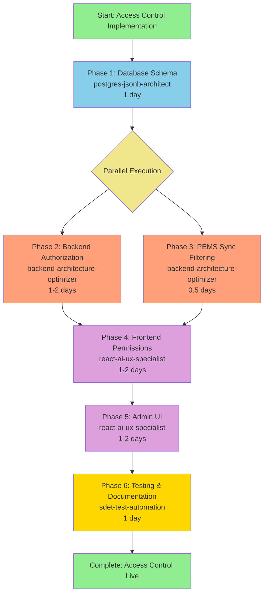

# Agent Workflow: Multi-Tenant Access Control Implementation

**Related**: ADR-005, IMPLEMENTATION-PLAN-ACCESS-CONTROL.md
**Total Duration**: 6-8 days
**Parallelization**: Some phases can run concurrently

---

## 📊 Visual Workflow



---

## 🎯 Phase Breakdown

### Phase 1: Database Schema (Day 1)

**Agent**: `postgres-jsonb-architect`
**Complexity**: HIGH
**Risk**: MEDIUM (schema migration)

**Input Required**:
- Current database schema
- Prisma models
- Migration history

**Deliverables**:
- ✅ Updated `schema.prisma` with access control fields
- ✅ Migration script (`YYYYMMDDHHMMSS_add_access_control.sql`)
- ✅ Seed script for default permissions
- ✅ Migration verification tests
- ✅ Rollback script

**Verification Checklist**:
- [ ] All existing users have default permissions
- [ ] All organizations marked as active
- [ ] No data loss during migration
- [ ] Indexes created for performance
- [ ] Prisma Studio shows new fields

**Command**:
```bash
Task(
  subagent_type: "postgres-jsonb-architect",
  description: "Implement access control schema",
  model: "sonnet"  # Complex schema design
)
```

---

### Phase 2: Backend Authorization (Days 2-3)

**Agent**: `backend-architecture-optimizer`
**Complexity**: HIGH
**Risk**: HIGH (security critical)

**Dependencies**: Phase 1 complete

**Input Required**:
- Updated Prisma schema
- Existing authentication middleware
- API route definitions

**Deliverables**:
- ✅ `middleware/authorize.ts` - Permission checking
- ✅ Updated `authService.ts` - Load permissions on login
- ✅ Authorization applied to all API routes
- ✅ Audit logging for permission changes
- ✅ Unit tests (>80% coverage)

**Verification Checklist**:
- [ ] 401 Unauthorized for unauthenticated requests
- [ ] 403 Forbidden for insufficient permissions
- [ ] Suspended users cannot login
- [ ] Read-only users cannot write data
- [ ] Admin can access all endpoints
- [ ] Authorization adds <50ms overhead

**Command**:
```bash
Task(
  subagent_type: "backend-architecture-optimizer",
  description: "Implement authorization middleware",
  model: "sonnet"  # Security-critical logic
)
```

---

### Phase 3: PEMS Sync Filtering (Day 2 - Parallel with Phase 2)

**Agent**: `backend-architecture-optimizer`
**Complexity**: MEDIUM
**Risk**: LOW (optimization)

**Dependencies**: Phase 1 complete

**Input Required**:
- Updated Prisma schema
- Existing `PemsSyncWorker.ts`
- Organization status fields

**Deliverables**:
- ✅ Updated `PemsSyncWorker.ts` - Filter by status
- ✅ Organization sync status endpoint
- ✅ Sync worker tests
- ✅ Performance benchmarks

**Verification Checklist**:
- [ ] Sync only runs for active organizations
- [ ] Suspended orgs are skipped
- [ ] `enableSync=false` orgs are skipped
- [ ] Sync worker logs show filtered list
- [ ] No performance degradation

**Command**:
```bash
Task(
  subagent_type: "backend-architecture-optimizer",
  description: "Filter PEMS sync by organization status",
  model: "haiku"  # Straightforward optimization
)
```

---

### Phase 4: Frontend Permission Enforcement (Days 4-5)

**Agent**: `react-ai-ux-specialist`
**Complexity**: MEDIUM
**Risk**: MEDIUM (UX critical)

**Dependencies**: Phase 2 complete (needs backend APIs)

**Input Required**:
- Authorization API responses
- Existing React components
- AuthContext

**Deliverables**:
- ✅ Updated `AuthContext.tsx` - Store permissions
- ✅ Permission hooks (`usePermissions`, `useCanWrite`)
- ✅ Updated UI components - Disable controls
- ✅ `PermissionBadge.tsx` - Show current role
- ✅ 403 error handling with helpful messages

**Verification Checklist**:
- [ ] Read-only users see disabled buttons
- [ ] Editor can modify data
- [ ] Admin sees all features
- [ ] Permission badge shows correct role
- [ ] 403 errors show helpful messages
- [ ] No UI lag from permission checks

**Command**:
```bash
Task(
  subagent_type: "react-ai-ux-specialist",
  description: "Enforce permissions in UI",
  model: "sonnet"  # Complex state management
)
```

---

### Phase 5: Admin UI (Days 5-6)

**Agent**: `react-ai-ux-specialist`
**Complexity**: HIGH
**Risk**: LOW (admin-only feature)

**Dependencies**: Phase 2 + Phase 4 complete

**Input Required**:
- Backend admin APIs
- Permission hooks from Phase 4
- Existing admin components

**Deliverables**:
- ✅ `UserManagement.tsx` - CRUD users
- ✅ `OrganizationManagement.tsx` - CRUD orgs
- ✅ `UserOrgPermissions.tsx` - Assign roles
- ✅ `AuditLog.tsx` - View permission history
- ✅ Admin API endpoints (8 new endpoints)

**Verification Checklist**:
- [ ] Admin can create/edit/suspend users
- [ ] Admin can suspend/activate organizations
- [ ] Admin can assign user-org permissions
- [ ] Admin can toggle organization sync
- [ ] Audit log shows all permission changes
- [ ] UI is responsive and intuitive

**Command**:
```bash
Task(
  subagent_type: "react-ai-ux-specialist",
  description: "Build admin UI for access control",
  model: "sonnet"  # Complex UI with forms/tables
)
```

---

### Phase 6: Testing & Documentation (Day 7-8)

**Agent**: `sdet-test-automation`
**Complexity**: MEDIUM
**Risk**: LOW (quality assurance)

**Dependencies**: All phases complete

**Input Required**:
- All implemented code
- Existing test suite
- Documentation templates

**Deliverables**:
- ✅ Unit tests (>80% coverage)
- ✅ Integration tests (authorization flows)
- ✅ E2E tests (UI permission enforcement)
- ✅ `API_AUTHORIZATION.md` - API docs
- ✅ Updated `USER_GUIDE.md` - User permissions
- ✅ Updated `ADMIN_GUIDE.md` - Admin features
- ✅ Testing report with metrics

**Verification Checklist**:
- [ ] Test coverage >80%
- [ ] All test suites passing
- [ ] No security vulnerabilities (OWASP check)
- [ ] Documentation complete and accurate
- [ ] Code review passed
- [ ] Performance benchmarks met

**Command**:
```bash
Task(
  subagent_type: "sdet-test-automation",
  description: "Test access control implementation",
  model: "sonnet"  # Comprehensive test strategy
)
```

---

## ⚡ Parallel Execution Strategy

### Week 1 Timeline

```
Day 1:  Phase 1 (Database Schema)
        └─> Agent: postgres-jsonb-architect

Day 2:  Phase 2 (Backend Auth)      │  Phase 3 (Sync Filtering)
        └─> Agent: backend-opt       │  └─> Agent: backend-opt
                    ↓                │            ↓
Day 3:  Phase 2 continues...         │  Phase 3 complete ✅
                    ↓                │
Day 4:  Phase 2 complete ✅         →  Phase 4 (Frontend Permissions)
                                       └─> Agent: react-ai-ux-specialist
                                                   ↓
Day 5:  Phase 4 continues...         →  Phase 5 (Admin UI)
                    ↓                   └─> Agent: react-ai-ux-specialist
Day 6:  Phase 5 continues...
                    ↓
Day 7:  Phase 5 complete ✅         →  Phase 6 (Testing & Docs)
                                       └─> Agent: sdet-test-automation
Day 8:  Phase 6 complete ✅
```

**Optimization Notes**:
- Phase 2 and 3 can run in parallel (both backend work)
- Phase 4 can start as soon as Phase 2 completes (doesn't need Phase 3)
- Phase 5 can start as soon as Phase 4 has hooks ready
- Estimated 6-8 days depending on complexity discovered

---

## 🚦 Decision Points

### After Phase 1 (Database Schema)

**Go/No-Go Criteria**:
- ✅ Migration runs successfully
- ✅ All existing users have permissions
- ✅ No data loss or corruption
- ✅ Rollback tested and working

**If Issues**: Rollback, fix schema, retry Phase 1

---

### After Phase 2 (Backend Authorization)

**Go/No-Go Criteria**:
- ✅ All API endpoints have authorization
- ✅ Unit tests pass (>80% coverage)
- ✅ Authorization adds <50ms overhead
- ✅ No security vulnerabilities found

**If Issues**: Fix authorization logic before Phase 4

---

### After Phase 4 (Frontend Permissions)

**Go/No-Go Criteria**:
- ✅ Read-only users cannot modify data
- ✅ UI controls disabled appropriately
- ✅ Permission checks don't slow UI
- ✅ 403 errors handled gracefully

**If Issues**: Refine UI logic before Phase 5

---

### After Phase 5 (Admin UI)

**Go/No-Go Criteria**:
- ✅ Admin can manage all users/orgs
- ✅ Permission assignment works
- ✅ Audit log tracks changes
- ✅ UI is intuitive and responsive

**If Issues**: Iterate on admin UI before Phase 6

---

### After Phase 6 (Testing & Documentation)

**Production Readiness Criteria**:
- ✅ Test coverage >80%
- ✅ All documentation complete
- ✅ Security audit passed
- ✅ Performance benchmarks met
- ✅ Stakeholder approval obtained

**If Issues**: Address issues before production deploy

---

## 🔄 Iteration Strategy

### If Timeline Slips

**Option 1: Reduce Scope**
- Skip Phase 5 (Admin UI) initially
- Use database tools for user/org management
- Add Admin UI in future release

**Option 2: Extend Timeline**
- Add 2-3 days to Phase 2 (most complex)
- Maintain quality standards
- Adjust deployment date

**Option 3: Increase Resources**
- Run Phase 2 and 3 truly in parallel (2 agents)
- Requires careful coordination
- Risk of merge conflicts

---

## 📋 Handoff Between Agents

### Phase 1 → Phase 2

**postgres-jsonb-architect** delivers:
- Updated `schema.prisma`
- Migration scripts
- Seed scripts
- Verification report

**backend-architecture-optimizer** receives:
- Database schema documentation
- New field descriptions
- Migration verification results

---

### Phase 2 → Phase 4

**backend-architecture-optimizer** delivers:
- `authorize.ts` middleware
- Updated `authService.ts`
- API endpoint documentation
- Permission data structure

**react-ai-ux-specialist** receives:
- Permission API contract
- JWT token structure
- Error response formats
- Authorization endpoint list

---

### Phase 4 → Phase 5

**react-ai-ux-specialist** (Phase 4) delivers:
- AuthContext with permissions
- Permission hooks
- Updated components

**react-ai-ux-specialist** (Phase 5) receives:
- Same agent continues work
- Uses hooks from Phase 4
- Extends AuthContext if needed

---

### Phase 5 → Phase 6

**react-ai-ux-specialist** delivers:
- Complete admin UI
- Admin API endpoints
- Component documentation

**sdet-test-automation** receives:
- All source code
- Component documentation
- API endpoint list
- Expected behaviors

---

## 🎓 Key Learnings for Future Phases

### Success Factors

1. **Clear Phase Boundaries**: Each phase has clear deliverables
2. **Parallel Execution**: Phases 2 and 3 save 0.5 days
3. **Same Agent Continuity**: Phase 4→5 uses same agent (faster)
4. **Progressive Enhancement**: No breaking changes to existing code

### Risk Mitigation

1. **Database First**: Phase 1 creates foundation, reduces later rework
2. **Security Focus**: Phase 2 is most critical, allocate extra time
3. **Incremental Testing**: Test after each phase, not just at end
4. **Rollback Ready**: Every phase has rollback procedure

---

## 📞 Stakeholder Checkpoints

### Day 1 (After Phase 1)

**Checkpoint**: Database migration complete
**Deliverable**: Migration report
**Decision**: Proceed to Phase 2 or iterate

---

### Day 3 (After Phase 2)

**Checkpoint**: Backend authorization working
**Deliverable**: Authorization test results
**Decision**: Proceed to Phase 4 or fix issues

---

### Day 5 (After Phase 4)

**Checkpoint**: Frontend permissions enforced
**Deliverable**: UI demo video
**Decision**: Proceed to Phase 5 or refine UI

---

### Day 6 (After Phase 5)

**Checkpoint**: Admin UI complete
**Deliverable**: Admin feature walkthrough
**Decision**: Proceed to Phase 6 or iterate

---

### Day 8 (After Phase 6)

**Checkpoint**: Testing complete
**Deliverable**: Test report + documentation
**Decision**: Deploy to production or iterate

---

## 🎯 Success Metrics by Phase

| Phase | Key Metric | Target | Critical? |
|-------|-----------|--------|-----------|
| 1 | Migration success rate | 100% | ✅ YES |
| 2 | Test coverage | >80% | ✅ YES |
| 2 | Authorization overhead | <50ms | ⚠️ WARN |
| 3 | Sync performance | No degradation | ⚠️ WARN |
| 4 | UI responsiveness | <100ms | ⚠️ WARN |
| 5 | Admin feature completeness | 100% | ❌ NO |
| 6 | Overall test coverage | >80% | ✅ YES |
| 6 | Documentation completeness | 100% | ✅ YES |

---

**Status**: Planned
**Ready to Start**: Yes (Phase 1)
**Estimated Completion**: 6-8 days from start

*Document created: 2025-11-26*
*Last updated: 2025-11-26*
