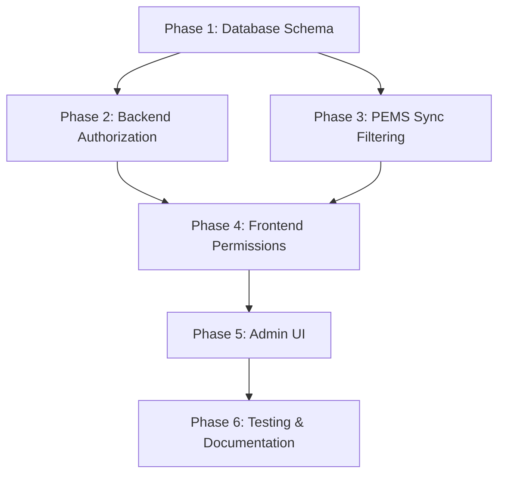

# Implementation Plan: Multi-Tenant Access Control

**Related**: ADR-005 (Multi-Tenant Access Control Architecture)
**Status**: Planned
**Estimated Duration**: 6-8 days
**Dependencies**: Phase 1-3 Complete (PostgreSQL Migration, Sync Worker, Live Merge API)

---

## 📋 Table of Contents

1. [Overview](#overview)
2. [Phase 1: Database Schema Changes](#phase-1-database-schema-changes)
3. [Phase 2: Backend Authorization](#phase-2-backend-authorization)
4. [Phase 3: PEMS Sync Filtering](#phase-3-pems-sync-filtering)
5. [Phase 4: Frontend Permission Enforcement](#phase-4-frontend-permission-enforcement)
6. [Phase 5: Admin UI](#phase-5-admin-ui)
7. [Phase 6: Testing & Documentation](#phase-6-testing--documentation)
8. [Agent Workflow](#agent-workflow)
9. [Rollback Plan](#rollback-plan)

---

## Overview

### Goals

Implement a comprehensive multi-tenant access control system that:

1. ✅ Controls organization service status (active, suspended, archived)
2. ✅ Controls user service status (active, suspended, locked)
3. ✅ Provides granular permissions per user per organization
4. ✅ Filters PEMS sync to only active organizations
5. ✅ Supports shared and dedicated AI providers
6. ✅ Maintains backward compatibility with existing users

### Success Criteria

- [ ] Organizations can be suspended/activated without data loss
- [ ] Users can be suspended/activated immediately
- [ ] Read-only users cannot modify data (enforced in backend + frontend)
- [ ] PEMS sync only runs for active organizations
- [ ] Admin UI allows managing user-organization relationships
- [ ] All existing users continue working after migration
- [ ] Authorization checks add <50ms to API response time

### Key Metrics

| Metric | Target | Measurement |
|--------|--------|-------------|
| Migration Success Rate | 100% | All existing users migrated |
| Authorization Overhead | <50ms | Average API response time increase |
| Test Coverage | >80% | Unit + integration tests |
| Zero Downtime | Yes | Rolling migration strategy |

---

## Phase 1: Database Schema Changes

**Duration**: 1 day
**Agent**: `postgres-jsonb-architect`
**Priority**: CRITICAL
**Dependencies**: None

### Objectives

1. Add new fields to `Organization` model
2. Add new fields to `User` model
3. Enhance `UserOrganization` model with permissions
4. Create migration script with backward compatibility
5. Seed default permissions for existing users

### Database Changes

#### 1.1 Organization Model Updates

**File**: `backend/prisma/schema.prisma`

```prisma
model Organization {
  id                String   @id @default(cuid())
  code              String   @unique
  name              String
  description       String?

  // Service Control (NEW)
  isActive          Boolean  @default(true)
  serviceStatus     String   @default("active") // active, suspended, archived
  enableSync        Boolean  @default(true)     // Control PEMS sync

  // Suspension Tracking (NEW)
  suspendedAt       DateTime?
  suspendedBy       String?   // User ID
  suspensionReason  String?
  archivedAt        DateTime?
  archivedBy        String?

  // Sync Tracking (EXISTING)
  lastSyncAt        DateTime?

  // Timestamps
  createdAt         DateTime @default(now())
  updatedAt         DateTime @updatedAt

  // Relations
  users             UserOrganization[]
  pfaRecords        PfaRecord[]
  apiCredentials    OrganizationApiCredentials[]

  @@index([serviceStatus, enableSync])
  @@index([isActive, serviceStatus])
}
```

#### 1.2 User Model Updates

**File**: `backend/prisma/schema.prisma`

```prisma
model User {
  id                String   @id @default(cuid())
  username          String   @unique
  email             String   @unique
  passwordHash      String

  // Service Control (NEW)
  isActive          Boolean  @default(true)
  serviceStatus     String   @default("active") // active, suspended, locked

  // Suspension Tracking (NEW)
  suspendedAt       DateTime?
  suspendedBy       String?   // User ID who suspended
  suspensionReason  String?

  // Security (NEW)
  failedLoginCount  Int      @default(0)
  lockedAt          DateTime?
  lastLoginAt       DateTime?
  lastLoginIp       String?

  // Timestamps
  createdAt         DateTime @default(now())
  updatedAt         DateTime @updatedAt

  // Relations
  organizations     UserOrganization[]

  @@index([serviceStatus, isActive])
  @@index([username, serviceStatus])
}
```

#### 1.3 UserOrganization Model Enhancement

**File**: `backend/prisma/schema.prisma`

```prisma
model UserOrganization {
  id                String   @id @default(cuid())
  userId            String
  organizationId    String

  // Permission Model (NEW)
  role              String   @default("viewer") // viewer, editor, admin

  // Granular Permissions (NEW)
  canRead           Boolean  @default(true)
  canWrite          Boolean  @default(false)
  canDelete         Boolean  @default(false)
  canManageUsers    Boolean  @default(false)
  canSync           Boolean  @default(false)
  canManageSettings Boolean  @default(false)

  // Status (NEW)
  isActive          Boolean  @default(true)
  grantedAt         DateTime @default(now())
  grantedBy         String?  // User ID who granted access
  revokedAt         DateTime?
  revokedBy         String?  // User ID who revoked access

  // Relations
  user              User         @relation(fields: [userId], references: [id], onDelete: Cascade)
  organization      Organization @relation(fields: [organizationId], references: [id], onDelete: Cascade)

  @@unique([userId, organizationId])
  @@index([userId, isActive])
  @@index([organizationId, isActive])
  @@index([role])
}
```

### Migration Strategy

#### Step 1: Create Migration

**File**: `backend/prisma/migrations/YYYYMMDDHHMMSS_add_access_control/migration.sql`

```sql
-- Add Organization fields
ALTER TABLE "Organization" ADD COLUMN "serviceStatus" TEXT NOT NULL DEFAULT 'active';
ALTER TABLE "Organization" ADD COLUMN "enableSync" BOOLEAN NOT NULL DEFAULT true;
ALTER TABLE "Organization" ADD COLUMN "suspendedAt" TIMESTAMP;
ALTER TABLE "Organization" ADD COLUMN "suspendedBy" TEXT;
ALTER TABLE "Organization" ADD COLUMN "suspensionReason" TEXT;
ALTER TABLE "Organization" ADD COLUMN "archivedAt" TIMESTAMP;
ALTER TABLE "Organization" ADD COLUMN "archivedBy" TEXT;

-- Add User fields
ALTER TABLE "User" ADD COLUMN "serviceStatus" TEXT NOT NULL DEFAULT 'active';
ALTER TABLE "User" ADD COLUMN "suspendedAt" TIMESTAMP;
ALTER TABLE "User" ADD COLUMN "suspendedBy" TEXT;
ALTER TABLE "User" ADD COLUMN "suspensionReason" TEXT;
ALTER TABLE "User" ADD COLUMN "failedLoginCount" INTEGER NOT NULL DEFAULT 0;
ALTER TABLE "User" ADD COLUMN "lockedAt" TIMESTAMP;
ALTER TABLE "User" ADD COLUMN "lastLoginAt" TIMESTAMP;
ALTER TABLE "User" ADD COLUMN "lastLoginIp" TEXT;

-- Add UserOrganization fields
ALTER TABLE "UserOrganization" ADD COLUMN "role" TEXT NOT NULL DEFAULT 'viewer';
ALTER TABLE "UserOrganization" ADD COLUMN "canRead" BOOLEAN NOT NULL DEFAULT true;
ALTER TABLE "UserOrganization" ADD COLUMN "canWrite" BOOLEAN NOT NULL DEFAULT false;
ALTER TABLE "UserOrganization" ADD COLUMN "canDelete" BOOLEAN NOT NULL DEFAULT false;
ALTER TABLE "UserOrganization" ADD COLUMN "canManageUsers" BOOLEAN NOT NULL DEFAULT false;
ALTER TABLE "UserOrganization" ADD COLUMN "canSync" BOOLEAN NOT NULL DEFAULT false;
ALTER TABLE "UserOrganization" ADD COLUMN "canManageSettings" BOOLEAN NOT NULL DEFAULT false;
ALTER TABLE "UserOrganization" ADD COLUMN "isActive" BOOLEAN NOT NULL DEFAULT true;
ALTER TABLE "UserOrganization" ADD COLUMN "grantedAt" TIMESTAMP NOT NULL DEFAULT CURRENT_TIMESTAMP;
ALTER TABLE "UserOrganization" ADD COLUMN "grantedBy" TEXT;
ALTER TABLE "UserOrganization" ADD COLUMN "revokedAt" TIMESTAMP;
ALTER TABLE "UserOrganization" ADD COLUMN "revokedBy" TEXT;

-- Create indexes for performance
CREATE INDEX "Organization_serviceStatus_enableSync_idx" ON "Organization"("serviceStatus", "enableSync");
CREATE INDEX "Organization_isActive_serviceStatus_idx" ON "Organization"("isActive", "serviceStatus");
CREATE INDEX "User_serviceStatus_isActive_idx" ON "User"("serviceStatus", "isActive");
CREATE INDEX "User_username_serviceStatus_idx" ON "User"("username", "serviceStatus");
CREATE INDEX "UserOrganization_userId_isActive_idx" ON "UserOrganization"("userId", "isActive");
CREATE INDEX "UserOrganization_organizationId_isActive_idx" ON "UserOrganization"("organizationId", "isActive");
CREATE INDEX "UserOrganization_role_idx" ON "UserOrganization"("role");

-- Migrate existing data: Set admin users to 'admin' role with all permissions
UPDATE "UserOrganization"
SET
  role = 'admin',
  canRead = true,
  canWrite = true,
  canDelete = true,
  canManageUsers = true,
  canSync = true,
  canManageSettings = true
WHERE "userId" IN (SELECT id FROM "User" WHERE username IN ('admin', 'RRECTOR'));

-- Migrate existing data: Set regular users to 'editor' role
UPDATE "UserOrganization"
SET
  role = 'editor',
  canRead = true,
  canWrite = true,
  canDelete = false,
  canManageUsers = false,
  canSync = false,
  canManageSettings = false
WHERE "userId" NOT IN (SELECT id FROM "User" WHERE username IN ('admin', 'RRECTOR'));
```

#### Step 2: Seed Default Permissions

**File**: `backend/prisma/seed-access-control.ts`

```typescript
import { PrismaClient } from '@prisma/client';

const prisma = new PrismaClient();

async function seedAccessControl() {
  console.log('Seeding access control permissions...');

  // Define role templates
  const roleTemplates = {
    admin: {
      canRead: true,
      canWrite: true,
      canDelete: true,
      canManageUsers: true,
      canSync: true,
      canManageSettings: true,
    },
    editor: {
      canRead: true,
      canWrite: true,
      canDelete: false,
      canManageUsers: false,
      canSync: false,
      canManageSettings: false,
    },
    viewer: {
      canRead: true,
      canWrite: false,
      canDelete: false,
      canManageUsers: false,
      canSync: false,
      canManageSettings: false,
    },
  };

  // Apply role templates to existing UserOrganization records
  for (const [role, permissions] of Object.entries(roleTemplates)) {
    const updated = await prisma.userOrganization.updateMany({
      where: { role },
      data: permissions,
    });
    console.log(`✅ Updated ${updated.count} ${role} records`);
  }

  console.log('Access control seeding complete');
}

seedAccessControl()
  .catch((e) => {
    console.error('Error seeding access control:', e);
    process.exit(1);
  })
  .finally(async () => {
    await prisma.$disconnect();
  });
```

### Verification

```bash
# Run migration
cd backend
npx prisma migrate dev --name add_access_control

# Verify schema
npx prisma db push

# Run seed script
npx tsx prisma/seed-access-control.ts

# Check results
npx prisma studio
```

---

## Phase 2: Backend Authorization

**Duration**: 1-2 days
**Agent**: `backend-architecture-optimizer`
**Priority**: HIGH
**Dependencies**: Phase 1 complete

### Objectives

1. Create authorization middleware
2. Implement permission checking utilities
3. Update authentication flow to load permissions
4. Add authorization to all API endpoints
5. Add audit logging for permission changes

### Files to Create/Modify

#### 2.1 Authorization Middleware

**File**: `backend/src/middleware/authorize.ts`

```typescript
import { Request, Response, NextFunction } from 'express';
import { PrismaClient } from '@prisma/client';

const prisma = new PrismaClient();

export interface AuthorizedRequest extends Request {
  user?: {
    id: string;
    username: string;
    serviceStatus: string;
  };
  permissions?: {
    organizationId: string;
    role: string;
    canRead: boolean;
    canWrite: boolean;
    canDelete: boolean;
    canManageUsers: boolean;
    canSync: boolean;
    canManageSettings: boolean;
  };
}

/**
 * Middleware to check if user has access to organization
 */
export function requireOrganizationAccess(requiredPermission?: keyof typeof permissions) {
  return async (req: AuthorizedRequest, res: Response, next: NextFunction) => {
    const { user } = req;
    const organizationId = req.params.orgId || req.body.organizationId;

    if (!user) {
      return res.status(401).json({ error: 'Authentication required' });
    }

    if (!organizationId) {
      return res.status(400).json({ error: 'Organization ID required' });
    }

    try {
      // Check user service status
      const userRecord = await prisma.user.findUnique({
        where: { id: user.id },
        select: { serviceStatus: true, isActive: true },
      });

      if (!userRecord || !userRecord.isActive || userRecord.serviceStatus !== 'active') {
        return res.status(403).json({ error: 'User account is not active' });
      }

      // Check organization service status
      const org = await prisma.organization.findUnique({
        where: { id: organizationId },
        select: { serviceStatus: true, isActive: true },
      });

      if (!org || !org.isActive || org.serviceStatus !== 'active') {
        return res.status(403).json({ error: 'Organization is not active' });
      }

      // Check user-organization relationship and permissions
      const userOrg = await prisma.userOrganization.findUnique({
        where: {
          userId_organizationId: {
            userId: user.id,
            organizationId: organizationId,
          },
        },
      });

      if (!userOrg || !userOrg.isActive) {
        return res.status(403).json({ error: 'Access denied to this organization' });
      }

      // Check specific permission if required
      if (requiredPermission && !userOrg[requiredPermission]) {
        return res.status(403).json({
          error: `Permission denied: ${requiredPermission} required`
        });
      }

      // Attach permissions to request for later use
      req.permissions = {
        organizationId,
        role: userOrg.role,
        canRead: userOrg.canRead,
        canWrite: userOrg.canWrite,
        canDelete: userOrg.canDelete,
        canManageUsers: userOrg.canManageUsers,
        canSync: userOrg.canSync,
        canManageSettings: userOrg.canManageSettings,
      };

      next();
    } catch (error) {
      console.error('Authorization error:', error);
      res.status(500).json({ error: 'Internal server error' });
    }
  };
}

/**
 * Middleware to require admin role for system-wide operations
 */
export function requireAdmin() {
  return async (req: AuthorizedRequest, res: Response, next: NextFunction) => {
    const { user } = req;

    if (!user) {
      return res.status(401).json({ error: 'Authentication required' });
    }

    try {
      // Check if user has admin role in any organization
      const adminOrg = await prisma.userOrganization.findFirst({
        where: {
          userId: user.id,
          role: 'admin',
          isActive: true,
        },
      });

      if (!adminOrg) {
        return res.status(403).json({ error: 'Admin access required' });
      }

      next();
    } catch (error) {
      console.error('Admin check error:', error);
      res.status(500).json({ error: 'Internal server error' });
    }
  };
}
```

#### 2.2 Update Authentication Service

**File**: `backend/src/services/authService.ts`

Add permissions loading to login response:

```typescript
export async function login(username: string, password: string) {
  // ... existing validation ...

  // Load user's organization permissions
  const userOrganizations = await prisma.userOrganization.findMany({
    where: {
      userId: user.id,
      isActive: true,
    },
    include: {
      organization: {
        select: {
          id: true,
          code: true,
          name: true,
          serviceStatus: true,
        },
      },
    },
  });

  // Filter to only active organizations
  const activeOrganizations = userOrganizations.filter(
    (uo) => uo.organization.serviceStatus === 'active'
  );

  if (activeOrganizations.length === 0) {
    throw new Error('No active organizations available');
  }

  // Generate JWT with permissions
  const token = jwt.sign(
    {
      userId: user.id,
      username: user.username,
      organizations: activeOrganizations.map((uo) => ({
        organizationId: uo.organizationId,
        role: uo.role,
        permissions: {
          canRead: uo.canRead,
          canWrite: uo.canWrite,
          canDelete: uo.canDelete,
          canManageUsers: uo.canManageUsers,
          canSync: uo.canSync,
          canManageSettings: uo.canManageSettings,
        },
      })),
    },
    JWT_SECRET,
    { expiresIn: '7d' }
  );

  // Update last login
  await prisma.user.update({
    where: { id: user.id },
    data: {
      lastLoginAt: new Date(),
      lastLoginIp: req.ip,
      failedLoginCount: 0, // Reset on successful login
    },
  });

  return { token, user, organizations: activeOrganizations };
}
```

#### 2.3 Apply Authorization to API Routes

**File**: `backend/src/routes/pfaDataRoutes.ts`

```typescript
import { requireOrganizationAccess } from '../middleware/authorize';

router.get(
  '/api/pfa/:orgId',
  authenticate,
  requireOrganizationAccess('canRead'),
  pfaDataController.getMergedData
);

router.post(
  '/api/pfa/:orgId/draft',
  authenticate,
  requireOrganizationAccess('canWrite'),
  pfaDataController.saveDraft
);

router.post(
  '/api/pfa/:orgId/commit',
  authenticate,
  requireOrganizationAccess('canWrite'),
  pfaDataController.commitDraft
);

router.delete(
  '/api/pfa/:orgId/:id',
  authenticate,
  requireOrganizationAccess('canDelete'),
  pfaDataController.deleteRecord
);

router.post(
  '/api/sync/:orgId',
  authenticate,
  requireOrganizationAccess('canSync'),
  syncController.triggerSync
);
```

### Testing

```bash
# Unit tests
npm test -- authorize.test.ts

# Integration tests
npm test -- api-authorization.test.ts
```

---

## Phase 3: PEMS Sync Filtering

**Duration**: 0.5 days
**Agent**: `backend-architecture-optimizer`
**Priority**: MEDIUM
**Dependencies**: Phase 1 complete

### Objectives

1. Filter PEMS sync to only active organizations
2. Update sync worker to respect `enableSync` flag
3. Add sync status tracking per organization
4. Prevent sync for suspended/archived organizations

### Files to Modify

#### 3.1 Update PemsSyncWorker

**File**: `backend/src/workers/PemsSyncWorker.ts`

```typescript
export class PemsSyncWorker {
  async syncAllOrganizations() {
    console.log('[PemsSyncWorker] Starting sync for active organizations...');

    // Only sync organizations that are:
    // 1. Active (isActive = true)
    // 2. In service (serviceStatus = 'active')
    // 3. Sync enabled (enableSync = true)
    const organizations = await prisma.organization.findMany({
      where: {
        isActive: true,
        serviceStatus: 'active',
        enableSync: true,
      },
      include: {
        apiCredentials: {
          where: {
            apiConfiguration: {
              operationType: 'read',
              usage: 'pems',
            },
          },
        },
      },
    });

    console.log(`[PemsSyncWorker] Found ${organizations.length} organizations to sync`);

    for (const org of organizations) {
      try {
        // Check if org has PEMS credentials
        const pemsCredential = org.apiCredentials.find(
          (cred) => cred.apiConfiguration.usage === 'pems'
        );

        if (!pemsCredential) {
          console.warn(`[PemsSyncWorker] No PEMS API configured for ${org.code}, skipping`);
          continue;
        }

        // Perform sync
        await this.syncOrganization(org.id, pemsCredential);

        // Update last sync timestamp
        await prisma.organization.update({
          where: { id: org.id },
          data: { lastSyncAt: new Date() },
        });

        console.log(`[PemsSyncWorker] ✅ Synced ${org.code} successfully`);
      } catch (error) {
        console.error(`[PemsSyncWorker] ❌ Failed to sync ${org.code}:`, error);
        // Continue with next organization
      }
    }

    console.log('[PemsSyncWorker] Sync completed');
  }
}
```

#### 3.2 Add Sync Status Endpoint

**File**: `backend/src/controllers/organizationController.ts`

```typescript
export async function getOrganizationSyncStatus(req: Request, res: Response) {
  const { orgId } = req.params;

  const org = await prisma.organization.findUnique({
    where: { id: orgId },
    select: {
      id: true,
      code: true,
      name: true,
      serviceStatus: true,
      enableSync: true,
      lastSyncAt: true,
    },
  });

  if (!org) {
    return res.status(404).json({ error: 'Organization not found' });
  }

  const syncEnabled =
    org.serviceStatus === 'active' &&
    org.enableSync === true;

  res.json({
    organizationId: org.id,
    code: org.code,
    name: org.name,
    syncEnabled,
    lastSyncAt: org.lastSyncAt,
    serviceStatus: org.serviceStatus,
  });
}
```

### Testing

```bash
# Test sync filtering
npm test -- pems-sync-filtering.test.ts
```

---

## Phase 4: Frontend Permission Enforcement

**Duration**: 1-2 days
**Agent**: `react-ai-ux-specialist`
**Priority**: HIGH
**Dependencies**: Phase 2 complete

### Objectives

1. Update AuthContext to store permissions
2. Create permission hooks (`usePermissions`, `useCanWrite`)
3. Disable UI controls for read-only users
4. Show permission indicators in UI
5. Handle 403 errors gracefully

### Files to Create/Modify

#### 4.1 Update AuthContext

**File**: `contexts/AuthContext.tsx`

```typescript
interface Permission {
  organizationId: string;
  role: string;
  canRead: boolean;
  canWrite: boolean;
  canDelete: boolean;
  canManageUsers: boolean;
  canSync: boolean;
  canManageSettings: boolean;
}

interface AuthContextType {
  user: User | null;
  permissions: Permission[];
  currentOrgPermission: Permission | null;
  login: (username: string, password: string) => Promise<void>;
  logout: () => void;
  switchOrganization: (orgId: string) => void;
  hasPermission: (permission: keyof Permission, orgId?: string) => boolean;
}

export function AuthProvider({ children }: { children: React.ReactNode }) {
  const [user, setUser] = useState<User | null>(null);
  const [permissions, setPermissions] = useState<Permission[]>([]);
  const [currentOrgId, setCurrentOrgId] = useState<string | null>(null);

  const currentOrgPermission = permissions.find(
    (p) => p.organizationId === currentOrgId
  );

  const hasPermission = (permission: keyof Permission, orgId?: string) => {
    const targetOrgId = orgId || currentOrgId;
    const perm = permissions.find((p) => p.organizationId === targetOrgId);
    return perm?.[permission] || false;
  };

  const login = async (username: string, password: string) => {
    const response = await apiClient.login(username, password);
    setUser(response.user);
    setPermissions(response.organizations.map(org => ({
      organizationId: org.organizationId,
      role: org.role,
      ...org.permissions,
    })));
    setCurrentOrgId(response.organizations[0]?.organizationId);
  };

  return (
    <AuthContext.Provider
      value={{
        user,
        permissions,
        currentOrgPermission,
        login,
        logout,
        switchOrganization: setCurrentOrgId,
        hasPermission,
      }}
    >
      {children}
    </AuthContext.Provider>
  );
}
```

#### 4.2 Create Permission Hooks

**File**: `hooks/usePermissions.ts`

```typescript
export function usePermissions() {
  const { permissions, currentOrgPermission, hasPermission } = useAuth();
  return { permissions, currentOrgPermission, hasPermission };
}

export function useCanWrite() {
  const { hasPermission } = useAuth();
  return hasPermission('canWrite');
}

export function useCanDelete() {
  const { hasPermission } = useAuth();
  return hasPermission('canDelete');
}

export function useCanSync() {
  const { hasPermission } = useAuth();
  return hasPermission('canSync');
}
```

#### 4.3 Update CommandDeck Component

**File**: `components/CommandDeck.tsx`

```tsx
export function CommandDeck({ selectedIds, onUpdateAssets }: CommandDeckProps) {
  const canWrite = useCanWrite();
  const canDelete = useCanDelete();

  return (
    <div className="command-deck">
      {/* Read-only indicator */}
      {!canWrite && (
        <div className="read-only-banner">
          <Info className="w-4 h-4" />
          <span>Read-only access - modifications disabled</span>
        </div>
      )}

      {/* Bulk operations - disabled if no write permission */}
      <button
        onClick={handleShiftTime}
        disabled={!canWrite || selectedIds.size === 0}
        className={!canWrite ? 'opacity-50 cursor-not-allowed' : ''}
      >
        Shift Time
      </button>

      <button
        onClick={handleDelete}
        disabled={!canDelete || selectedIds.size === 0}
        className={!canDelete ? 'opacity-50 cursor-not-allowed' : ''}
      >
        Delete
      </button>
    </div>
  );
}
```

#### 4.4 Add Permission Indicator

**File**: `components/PermissionBadge.tsx`

```tsx
export function PermissionBadge() {
  const { currentOrgPermission } = usePermissions();

  if (!currentOrgPermission) return null;

  const roleColors = {
    admin: 'bg-purple-100 text-purple-800',
    editor: 'bg-green-100 text-green-800',
    viewer: 'bg-gray-100 text-gray-800',
  };

  return (
    <div className={`px-2 py-1 rounded text-xs font-medium ${roleColors[currentOrgPermission.role]}`}>
      {currentOrgPermission.role.toUpperCase()}
    </div>
  );
}
```

### Testing

```bash
# Visual regression tests
npm test -- permission-ui.test.tsx

# E2E permission tests
npm test -- e2e/read-only-access.test.ts
```

---

## Phase 5: Admin UI

**Duration**: 1-2 days
**Agent**: `react-ai-ux-specialist`
**Priority**: MEDIUM
**Dependencies**: Phase 2, 4 complete

### Objectives

1. Create User Management UI
2. Create Organization Management UI
3. Create User-Organization Permission Management
4. Add suspension/activation controls
5. Add audit log viewer

### Components to Create

#### 5.1 User Management Component

**File**: `components/admin/UserManagement.tsx`

Features:
- List all users with service status
- Suspend/activate users
- Edit user details
- View user's organization access
- Reset passwords

#### 5.2 Organization Management Component

**File**: `components/admin/OrganizationManagement.tsx`

Features:
- List all organizations with service status
- Suspend/activate organizations
- Toggle sync enable/disable
- View sync statistics
- Manage organization settings

#### 5.3 User-Organization Permission Manager

**File**: `components/admin/UserOrgPermissions.tsx`

Features:
- Assign users to organizations
- Set role (viewer/editor/admin)
- Customize granular permissions
- Revoke access
- View permission history

#### 5.4 Audit Log Viewer

**File**: `components/admin/AuditLog.tsx`

Features:
- View permission changes
- Filter by user/organization/action
- Export audit logs
- Search by date range

### API Endpoints Needed

```typescript
// User management
GET    /api/admin/users
POST   /api/admin/users
PUT    /api/admin/users/:id
DELETE /api/admin/users/:id
POST   /api/admin/users/:id/suspend
POST   /api/admin/users/:id/activate

// Organization management
GET    /api/admin/organizations
POST   /api/admin/organizations
PUT    /api/admin/organizations/:id
POST   /api/admin/organizations/:id/suspend
POST   /api/admin/organizations/:id/activate
PUT    /api/admin/organizations/:id/sync-toggle

// Permission management
GET    /api/admin/user-organizations
POST   /api/admin/user-organizations
PUT    /api/admin/user-organizations/:id
DELETE /api/admin/user-organizations/:id

// Audit logs
GET    /api/admin/audit-logs
```

---

## Phase 6: Testing & Documentation

**Duration**: 1 day
**Agent**: `sdet-test-automation`
**Priority**: HIGH
**Dependencies**: All phases complete

### Testing Strategy

#### Unit Tests

**Coverage**: >80%

Files to test:
- `backend/src/middleware/authorize.ts`
- `backend/src/services/authService.ts`
- `hooks/usePermissions.ts`

#### Integration Tests

**File**: `backend/tests/integration/authorization.test.ts`

Test cases:
- [ ] Login with active user returns permissions
- [ ] Login with suspended user fails
- [ ] API request with insufficient permissions returns 403
- [ ] Organization suspension blocks access
- [ ] Read-only user cannot write data
- [ ] Admin can manage users/orgs
- [ ] PEMS sync skips suspended organizations

#### E2E Tests

**File**: `tests/e2e/access-control.test.ts`

Test scenarios:
- [ ] Read-only user sees disabled edit buttons
- [ ] Editor can modify data
- [ ] Admin can access all features
- [ ] Suspended user cannot login
- [ ] Organization suspension hides data

### Documentation Updates

#### Files to Update

1. **API Documentation**: `backend/docs/API_AUTHORIZATION.md` (new)
2. **User Guide**: `docs/USER_GUIDE.md` (update permissions section)
3. **Admin Guide**: `docs/ADMIN_GUIDE.md` (add user/org management)
4. **CLAUDE.md**: Update authentication section
5. **README.md**: Update features section

---

## Agent Workflow

### Phase Execution Order



### Agent Assignments

| Phase | Agent | Rationale | Duration |
|-------|-------|-----------|----------|
| 1 | `postgres-jsonb-architect` | Database schema expert, migration strategy | 1 day |
| 2 | `backend-architecture-optimizer` | Node.js backend, middleware, authorization | 1-2 days |
| 3 | `backend-architecture-optimizer` | Sync worker, query optimization | 0.5 days |
| 4 | `react-ai-ux-specialist` | React hooks, UI state management | 1-2 days |
| 5 | `react-ai-ux-specialist` | Complex admin UI, forms, tables | 1-2 days |
| 6 | `sdet-test-automation` | Comprehensive testing strategy | 1 day |

### Parallel Execution Opportunities

**Can Run in Parallel**:
- Phase 2 (Backend) + Phase 3 (Sync) - Both backend work
- Phase 4 (Frontend) can start after Phase 2 completes (doesn't need Phase 3)

**Sequential Dependencies**:
- Phase 1 must complete before all others
- Phase 5 needs Phase 2 + Phase 4 (needs backend APIs + frontend hooks)
- Phase 6 needs all phases complete

### Task Tool Invocations

**Phase 1**:
```typescript
Task({
  subagent_type: "postgres-jsonb-architect",
  description: "Implement access control schema",
  prompt: `
    See: docs/implementation/IMPLEMENTATION-PLAN-ACCESS-CONTROL.md Phase 1

    Tasks:
    1. Update Prisma schema with new fields for Organization, User, UserOrganization
    2. Create migration script with backward compatibility
    3. Create seed script for default permissions
    4. Verify all existing users/orgs migrate successfully
    5. Test indexes for query performance
  `
})
```

**Phase 2**:
```typescript
Task({
  subagent_type: "backend-architecture-optimizer",
  description: "Implement authorization middleware",
  prompt: `
    See: docs/implementation/IMPLEMENTATION-PLAN-ACCESS-CONTROL.md Phase 2

    Tasks:
    1. Create authorize.ts middleware with permission checking
    2. Update authService.ts to load permissions on login
    3. Apply authorization to all API routes
    4. Add audit logging for permission changes
    5. Write unit tests for authorization logic
  `
})
```

**Phase 3**:
```typescript
Task({
  subagent_type: "backend-architecture-optimizer",
  description: "Filter PEMS sync by organization status",
  prompt: `
    See: docs/implementation/IMPLEMENTATION-PLAN-ACCESS-CONTROL.md Phase 3

    Tasks:
    1. Update PemsSyncWorker to filter by serviceStatus + enableSync
    2. Add organization sync status endpoint
    3. Test sync worker skips suspended organizations
    4. Verify performance with 28+ organizations
  `
})
```

**Phase 4**:
```typescript
Task({
  subagent_type: "react-ai-ux-specialist",
  description: "Enforce permissions in UI",
  prompt: `
    See: docs/implementation/IMPLEMENTATION-PLAN-ACCESS-CONTROL.md Phase 4

    Tasks:
    1. Update AuthContext to store permissions
    2. Create usePermissions, useCanWrite, useCanDelete hooks
    3. Update CommandDeck to disable operations for read-only users
    4. Add PermissionBadge component to show current role
    5. Handle 403 errors with helpful messages
  `
})
```

**Phase 5**:
```typescript
Task({
  subagent_type: "react-ai-ux-specialist",
  description: "Build admin UI for access control",
  prompt: `
    See: docs/implementation/IMPLEMENTATION-PLAN-ACCESS-CONTROL.md Phase 5

    Tasks:
    1. Create UserManagement component with suspend/activate
    2. Create OrganizationManagement component with sync toggle
    3. Create UserOrgPermissions component for role assignment
    4. Create AuditLog viewer
    5. Add all required admin API endpoints
  `
})
```

**Phase 6**:
```typescript
Task({
  subagent_type: "sdet-test-automation",
  description: "Test access control implementation",
  prompt: `
    See: docs/implementation/IMPLEMENTATION-PLAN-ACCESS-CONTROL.md Phase 6

    Tasks:
    1. Write unit tests for authorization middleware (>80% coverage)
    2. Write integration tests for API authorization
    3. Write E2E tests for UI permission enforcement
    4. Update all documentation (API, User Guide, Admin Guide)
    5. Create testing report with coverage metrics
  `
})
```

---

## Rollback Plan

### Pre-Implementation Checklist

- [ ] Database backup created
- [ ] Git branch created: `feature/access-control`
- [ ] Current system documented
- [ ] Rollback procedure tested

### Rollback Steps

If critical issues arise:

1. **Immediate Rollback** (within 1 hour):
   ```bash
   git checkout master
   git branch -D feature/access-control
   npx prisma migrate reset --force
   npm run seed
   ```

2. **Partial Rollback** (after deployment):
   - Run down migration: `npx prisma migrate down`
   - Restore database from backup
   - Revert application code to previous version

3. **Data Preservation**:
   - All new fields have default values (won't break existing code)
   - No data deleted (only additions)
   - Organizations/users continue working with default permissions

---

## Success Metrics

### Functional Metrics

- [ ] All existing users can login after migration
- [ ] Read-only users cannot modify data (verified in UI + backend)
- [ ] Suspended users cannot login
- [ ] Suspended organizations are hidden from sync
- [ ] Admin can manage all users/organizations
- [ ] Permissions are enforced consistently

### Performance Metrics

| Metric | Target | Actual |
|--------|--------|--------|
| Authorization overhead | <50ms | TBD |
| Login time | <500ms | TBD |
| Permission check query time | <20ms | TBD |
| UI render time (with permissions) | <100ms | TBD |

### Quality Metrics

- [ ] Test coverage >80%
- [ ] Zero security vulnerabilities (OWASP check)
- [ ] Documentation complete
- [ ] Code review passed

---

**Status**: Planned
**Next Step**: Begin Phase 1 with postgres-jsonb-architect agent
**Estimated Completion**: 6-8 days from start

*Document created: 2025-11-26*
*Last updated: 2025-11-26*
