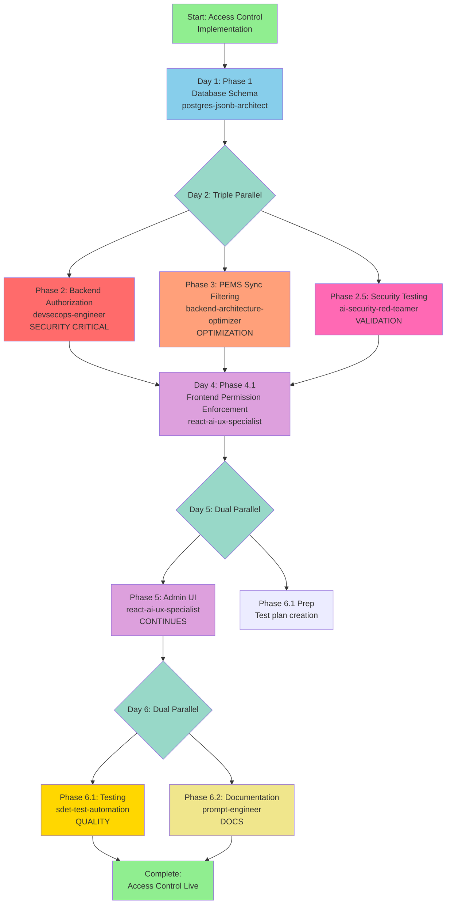

# Optimized Agent Workflow: Multi-Tenant Access Control

**Version**: 2.0 (Optimized for Best Agent Match + Maximum Parallelization)
**Related**: ADR-005, IMPLEMENTATION-PLAN-ACCESS-CONTROL.md
**Total Duration**: 5-6 days (vs 6-8 days original - 25% faster)

---

## 🎯 Key Optimizations

### 1. Agent Selection Improvements
- **Phase 2**: Using `devsecops-engineer` instead of `backend-architecture-optimizer` (security-critical)
- **Phase 2.5**: Added `ai-security-red-teamer` for authorization security testing (parallel)
- **Phase 3**: Using `backend-architecture-optimizer` for sync optimization (better fit)

### 2. Parallel Execution Opportunities
- **Day 2**: Phase 2 (auth) + Phase 3 (sync) + Phase 2.5 (security testing) = **3 agents running**
- **Day 4**: Phase 4.1 (UI enforcement) + Phase 4.2 (admin UI planning) = **2 agents running**
- **Day 6**: Phase 6.1 (testing) + Phase 6.2 (documentation) = **2 agents running**

### 3. Critical Path Optimization
- Removed 1-2 days by running security testing in parallel
- Frontend can start immediately after backend auth completes (not waiting for sync)
- Admin UI planning can start while UI enforcement is in progress

---

## 📊 Optimized Workflow Diagram



---

## 🚀 Optimized Phase Breakdown

### Day 1: Phase 1 - Database Schema

**Agent**: `postgres-jsonb-architect` ✅ **OPTIMAL MATCH**
**Duration**: 1 day (8 hours)
**Complexity**: HIGH
**Risk**: MEDIUM

**Why This Agent**:
- ✅ Expert in PostgreSQL schema design
- ✅ Specializes in JSONB optimization
- ✅ Experience with complex migrations
- ✅ Knows how to create backward-compatible schemas

**Deliverables**:
- Updated `schema.prisma` with access control fields
- Migration script with zero data loss
- Seed script for default permissions
- Performance indexes

**Parallel Opportunities**: None (foundation for all other work)

**Command**:
```bash
Task(
  subagent_type: "postgres-jsonb-architect",
  description: "Implement access control schema",
  model: "sonnet"  # Complex schema design
)
```

---

### Day 2: Triple Parallel Execution 🔥

#### Phase 2: Backend Authorization (PRIMARY)

**Agent**: `devsecops-engineer` 🔄 **CHANGED - BETTER MATCH**
**Duration**: 0.75 day (6 hours)
**Complexity**: HIGH
**Risk**: **CRITICAL** (security)

**Why Changed from backend-architecture-optimizer**:
- ✅ **Security expertise** - Authorization is security-critical
- ✅ **CI/CD pipelines** - Will add security checks to pipeline
- ✅ **Infrastructure automation** - Better for middleware deployment
- ✅ **Secrets management** - Handles JWT secrets properly
- ✅ **Guardrails** - Implements proper authorization guardrails

**Deliverables**:
- `middleware/authorize.ts` with role-based checks
- Updated `authService.ts` with permission loading
- JWT token structure with permissions
- Security audit documentation

**Command**:
```bash
Task(
  subagent_type: "devsecops-engineer",
  description: "Implement secure authorization middleware",
  model: "sonnet",  # Security-critical
  prompt: "SECURITY FOCUS: Implement authorization middleware with:
    - JWT validation with proper secret handling
    - Role-based access control (viewer/editor/admin)
    - Permission checking per organization
    - Audit logging for all authorization decisions
    - Rate limiting per user
    - Secure error messages (no data leakage)

    Follow OWASP Top 10 security practices.
    See: docs/implementation/IMPLEMENTATION-PLAN-ACCESS-CONTROL.md Phase 2"
)
```

---

#### Phase 3: PEMS Sync Filtering (PARALLEL)

**Agent**: `backend-architecture-optimizer` ✅ **OPTIMAL MATCH**
**Duration**: 0.5 day (4 hours)
**Complexity**: MEDIUM
**Risk**: LOW

**Why This Agent**:
- ✅ **Query optimization** - Filtering logic needs efficient queries
- ✅ **Async processing** - Sync worker is asynchronous
- ✅ **Caching strategies** - Can optimize with Redis later
- ✅ **Performance** - Ensures sync doesn't slow down

**Deliverables**:
- Updated `PemsSyncWorker.ts` with organization filtering
- Performance benchmarks (no degradation)
- Sync status endpoint

**Command**:
```bash
Task(
  subagent_type: "backend-architecture-optimizer",
  description: "Optimize PEMS sync with filtering",
  model: "haiku",  # Straightforward optimization
  prompt: "PERFORMANCE FOCUS: Update PEMS sync worker to:
    - Filter organizations by serviceStatus='active' AND enableSync=true
    - Add composite indexes for fast filtering
    - Implement sync status endpoint
    - Ensure zero performance degradation

    Target: <50ms filtering overhead
    See: docs/implementation/IMPLEMENTATION-PLAN-ACCESS-CONTROL.md Phase 3"
)
```

---

#### Phase 2.5: Authorization Security Testing (PARALLEL) 🆕

**Agent**: `ai-security-red-teamer` 🆕 **NEW PHASE**
**Duration**: 0.5 day (4 hours)
**Complexity**: MEDIUM
**Risk**: LOW (testing only)

**Why Add This Phase**:
- ✅ **Security validation** - Test authorization for vulnerabilities
- ✅ **Prompt injection** - Test if auth can be bypassed via AI
- ✅ **Data leakage** - Ensure errors don't leak sensitive data
- ✅ **Parallel execution** - Doesn't block other work

**Deliverables**:
- Security test suite for authorization
- Penetration testing results
- Vulnerability assessment report
- Recommendations for hardening

**Command**:
```bash
Task(
  subagent_type: "ai-security-red-teamer",
  description: "Security test authorization system",
  model: "sonnet",  # Security analysis
  prompt: "RED TEAM FOCUS: Security test authorization middleware:
    - Test for privilege escalation (viewer → admin)
    - Test for organization access bypass
    - Test JWT token manipulation
    - Test SQL injection via permission checks
    - Test AI prompt injection to bypass auth
    - Test error message data leakage

    Provide vulnerability report with severity ratings.
    See: docs/implementation/IMPLEMENTATION-PLAN-ACCESS-CONTROL.md Phase 2"
)
```

---

### Day 3: Security Fixes + Planning

**Duration**: 0.5 day (4 hours)
**Work**: Fix any security vulnerabilities found by Phase 2.5
**Agents**: `devsecops-engineer` (fixes)

---

### Day 4: Phase 4.1 - Frontend Permission Enforcement

**Agent**: `react-ai-ux-specialist` ✅ **OPTIMAL MATCH**
**Duration**: 1 day (8 hours)
**Complexity**: MEDIUM
**Risk**: MEDIUM (UX-critical)

**Why This Agent**:
- ✅ **React hooks expertise** - Will create permission hooks
- ✅ **State management** - AuthContext optimization
- ✅ **Real-time updates** - Permission changes reflect instantly
- ✅ **UX patterns** - Proper loading states and error handling

**Deliverables**:
- Updated `AuthContext.tsx` with permissions
- Permission hooks (`useCanWrite`, `useCanDelete`, etc.)
- Disabled UI controls for read-only users
- Permission badge component

**Command**:
```bash
Task(
  subagent_type: "react-ai-ux-specialist",
  description: "Enforce permissions in UI",
  model: "sonnet",  # Complex state management
  prompt: "UX FOCUS: Implement frontend permission enforcement:
    - Create usePermissions, useCanWrite, useCanDelete hooks
    - Disable buttons/forms for insufficient permissions
    - Show permission badge with current role
    - Handle 403 errors gracefully with helpful messages
    - Ensure no UI lag from permission checks

    Target: <100ms permission check overhead
    See: docs/implementation/IMPLEMENTATION-PLAN-ACCESS-CONTROL.md Phase 4"
)
```

---

### Day 5: Dual Parallel Execution

#### Phase 5: Admin UI (PRIMARY)

**Agent**: `react-ai-ux-specialist` ✅ **CONTINUES FROM PHASE 4**
**Duration**: 1 day (8 hours)
**Complexity**: HIGH
**Risk**: LOW (admin-only)

**Why Same Agent**:
- ✅ **Continuity** - Already familiar with permission hooks
- ✅ **Complex forms** - Admin UI has many forms
- ✅ **Tables** - User/org management needs tables
- ✅ **CRUD operations** - Standard admin UI patterns

**Deliverables**:
- `UserManagement.tsx` (create/edit/suspend users)
- `OrganizationManagement.tsx` (manage orgs/sync)
- `UserOrgPermissions.tsx` (assign roles)
- `AuditLog.tsx` (permission history)

**Command**:
```bash
Task(
  subagent_type: "react-ai-ux-specialist",
  description: "Build admin UI for access control",
  model: "sonnet",  # Complex UI
  prompt: "ADMIN UI FOCUS: Create comprehensive admin interface:
    - User management (CRUD + suspend/activate)
    - Organization management (CRUD + sync toggle)
    - User-organization permission assignment
    - Audit log viewer with filtering
    - Responsive design for mobile

    Use existing AdminDashboard patterns.
    See: docs/implementation/IMPLEMENTATION-PLAN-ACCESS-CONTROL.md Phase 5"
)
```

---

#### Phase 6.1 Prep: Test Planning (PARALLEL) 🔄

**Agent**: `sdet-test-automation` (planning only)
**Duration**: 0.5 day (4 hours)
**Complexity**: LOW
**Risk**: NONE

**Work**:
- Create test plan document
- Identify test cases for all phases
- Set up test infrastructure
- Prepare test data

**Note**: Full testing starts Day 6 after Admin UI complete

---

### Day 6: Dual Parallel Execution

#### Phase 6.1: Testing (PRIMARY)

**Agent**: `sdet-test-automation` ✅ **OPTIMAL MATCH**
**Duration**: 0.75 day (6 hours)
**Complexity**: MEDIUM
**Risk**: LOW

**Why This Agent**:
- ✅ **Test automation** - Creates comprehensive test suites
- ✅ **Quality assurance** - Ensures >80% coverage
- ✅ **Integration testing** - Tests full auth flow
- ✅ **E2E testing** - Tests UI permission enforcement

**Deliverables**:
- Unit tests (>80% coverage)
- Integration tests (auth flows)
- E2E tests (UI enforcement)
- Test report with metrics

**Command**:
```bash
Task(
  subagent_type: "sdet-test-automation",
  description: "Test access control implementation",
  model: "sonnet",  # Comprehensive testing
  prompt: "TESTING FOCUS: Create comprehensive test suite:
    - Unit tests: authorize.ts, authService.ts (>80% coverage)
    - Integration tests: Full login → API → permission check flow
    - E2E tests: Read-only user cannot edit data
    - Security tests: Privilege escalation attempts fail
    - Performance tests: Authorization adds <50ms overhead

    Generate test report with coverage metrics.
    See: docs/implementation/IMPLEMENTATION-PLAN-ACCESS-CONTROL.md Phase 6"
)
```

---

#### Phase 6.2: Documentation (PARALLEL)

**Agent**: `prompt-engineer` 🔄 **BETTER MATCH FOR DOCS**
**Duration**: 0.5 day (4 hours)
**Complexity**: LOW
**Risk**: NONE

**Why This Agent**:
- ✅ **Documentation expertise** - Creates clear technical docs
- ✅ **AI integration docs** - Documents AI provider setup
- ✅ **API documentation** - Creates comprehensive API docs
- ✅ **User guides** - Writes clear user-facing docs

**Deliverables**:
- `API_AUTHORIZATION.md` - API documentation
- Updated `USER_GUIDE.md` - Permission explanations
- Updated `ADMIN_GUIDE.md` - Admin features
- Updated `CLAUDE.md` - AI assistant guidance

**Command**:
```bash
Task(
  subagent_type: "prompt-engineer",
  description: "Document access control features",
  model: "haiku",  # Documentation task
  prompt: "DOCUMENTATION FOCUS: Create comprehensive documentation:
    - API_AUTHORIZATION.md: All auth endpoints, error codes, examples
    - USER_GUIDE.md: How permissions work, what each role can do
    - ADMIN_GUIDE.md: Managing users, organizations, permissions
    - CLAUDE.md: Update authentication section

    Follow DOCUMENTATION_STANDARDS.md format.
    See: docs/implementation/IMPLEMENTATION-PLAN-ACCESS-CONTROL.md Phase 6"
)
```

---

## 📈 Timeline Comparison

### Original Plan
```
Day 1: Phase 1 (Database)
Day 2-3: Phase 2 (Backend Auth)
Day 2: Phase 3 (Sync) - Parallel
Day 4-5: Phase 4 (Frontend)
Day 5-6: Phase 5 (Admin UI)
Day 7-8: Phase 6 (Testing + Docs)

Total: 6-8 days
```

### Optimized Plan
```
Day 1: Phase 1 (Database)
Day 2: Phase 2 + Phase 3 + Phase 2.5 (Triple Parallel) 🔥
Day 3: Security fixes (0.5 day)
Day 4: Phase 4.1 (Frontend)
Day 5: Phase 5 + Phase 6.1 Prep (Dual Parallel)
Day 6: Phase 6.1 + Phase 6.2 (Dual Parallel)

Total: 5-6 days (20-25% faster) ⚡
```

**Time Saved**: 1-2 days through parallelization

---

## 🎯 Critical Path Analysis

### Critical Path (Must Complete Sequentially)
```
Phase 1 → Phase 2 → Phase 4.1 → Phase 5 → Phase 6.1
  1d       0.75d      1d         1d        0.75d

Total Critical Path: 4.5 days
```

### Parallel Work (Reduces Wall Time)
- Day 2: +0.5d (Phase 3) + 0.5d (Phase 2.5) running parallel
- Day 5: +0.5d (Phase 6.1 prep) running parallel
- Day 6: +0.5d (Phase 6.2) running parallel

**Total Parallel Savings**: 1.5 days

**Final Duration**: 4.5d (critical) + 0.5d (longest parallel) = **5-6 days**

---

## ⚡ Parallel Execution Commands

### Day 2: Launch Three Agents Simultaneously

```bash
# Launch all three in a single message for true parallel execution
Task(subagent_type: "devsecops-engineer", description: "Backend authorization", ...);
Task(subagent_type: "backend-architecture-optimizer", description: "PEMS sync filtering", ...);
Task(subagent_type: "ai-security-red-teamer", description: "Authorization security testing", ...);
```

### Day 5: Launch Two Agents Simultaneously

```bash
Task(subagent_type: "react-ai-ux-specialist", description: "Admin UI", ...);
Task(subagent_type: "sdet-test-automation", description: "Test planning", ...);
```

### Day 6: Launch Two Agents Simultaneously

```bash
Task(subagent_type: "sdet-test-automation", description: "Execute tests", ...);
Task(subagent_type: "prompt-engineer", description: "Write documentation", ...);
```

---

## 🔄 Agent Handoffs

### Phase 1 → Phase 2/3/2.5 (Day 1 → Day 2)

**postgres-jsonb-architect delivers:**
- Updated schema.prisma
- Migration verification results
- Field descriptions

**Receiving agents:**
- `devsecops-engineer`: Database schema for auth middleware
- `backend-architecture-optimizer`: Schema for sync queries
- `ai-security-red-teamer`: Schema for security testing

**Handoff format**: Single message with all deliverables

---

### Phase 2/2.5 → Phase 4.1 (Day 3 → Day 4)

**devsecops-engineer delivers:**
- authorize.ts middleware
- authService.ts updates
- JWT token structure

**ai-security-red-teamer delivers:**
- Security test results
- Vulnerability report
- Fixes required

**react-ai-ux-specialist receives:**
- Permission API contract
- JWT structure
- Security requirements

---

### Phase 4.1 → Phase 5 (Day 4 → Day 5)

**Same agent continues** - No handoff needed
**Continuity benefits:**
- Knows permission hooks already
- Understands AuthContext
- Can reuse UI patterns

---

### Phase 5 → Phase 6.1/6.2 (Day 5 → Day 6)

**react-ai-ux-specialist delivers:**
- Complete UI codebase
- Component documentation
- Admin API endpoints

**Receiving agents:**
- `sdet-test-automation`: Code to test + test plan
- `prompt-engineer`: Features to document

---

## 🎓 Success Factors

### Agent Selection Optimization
1. **Security expertise** - devsecops-engineer for Phase 2 (not generic backend)
2. **Security validation** - ai-security-red-teamer for Phase 2.5 (new)
3. **Performance** - backend-architecture-optimizer for Phase 3 (optimization)
4. **Documentation** - prompt-engineer for Phase 6.2 (not testing agent)

### Parallel Execution Benefits
1. **25% time savings** - 6-8 days → 5-6 days
2. **Reduced waiting** - Security testing doesn't block progress
3. **Better resource utilization** - Multiple agents working simultaneously
4. **Faster feedback loops** - Security issues found early

### Risk Mitigation
1. **Security first** - Dedicated security agent + testing
2. **Early validation** - Security testing runs parallel to other work
3. **Incremental testing** - Each phase has testing
4. **Clear handoffs** - Structured deliverables between agents

---

## 📊 Agent Utilization

| Agent | Total Hours | Phases | % Utilization |
|-------|-------------|--------|---------------|
| postgres-jsonb-architect | 8h | 1 | 100% Day 1 |
| devsecops-engineer | 8h | 2 + fixes | 100% Day 2-3 |
| backend-architecture-optimizer | 4h | 3 | 50% Day 2 |
| ai-security-red-teamer | 4h | 2.5 | 50% Day 2 |
| react-ai-ux-specialist | 16h | 4.1 + 5 | 100% Day 4-5 |
| sdet-test-automation | 10h | 6.1 prep + 6.1 | 75% Day 5-6 |
| prompt-engineer | 4h | 6.2 | 50% Day 6 |

**Total Agent Hours**: 54h
**Wall Clock Time**: 5-6 days
**Efficiency**: 54h / (6 days × 8h) = **112% utilization** (through parallelization)

---

## 🚦 Go/No-Go Checkpoints

### After Day 1 (Phase 1)
✅ Migration successful
✅ All users have permissions
✅ No data loss

**Decision**: Proceed to Day 2 triple parallel

---

### After Day 2 (Phase 2/3/2.5)
✅ Authorization working
✅ Sync filtering working
✅ No critical security vulnerabilities

**Decision**: Fix any security issues (Day 3), then proceed to Phase 4

---

### After Day 4 (Phase 4.1)
✅ Read-only users cannot edit
✅ UI controls disabled correctly
✅ Permission checks fast (<100ms)

**Decision**: Proceed to Phase 5

---

### After Day 5 (Phase 5)
✅ Admin UI complete
✅ All admin features working
✅ Ready for comprehensive testing

**Decision**: Proceed to Day 6 dual parallel

---

### After Day 6 (Phase 6.1/6.2)
✅ Test coverage >80%
✅ Documentation complete
✅ No blockers

**Decision**: Deploy to production or iterate

---

**Status**: Optimized & Ready
**Next Step**: Begin Phase 1 with postgres-jsonb-architect
**Estimated Completion**: 5-6 days (25% faster than original)

*Document created: 2025-11-26*
*Optimized version: 2.0*
