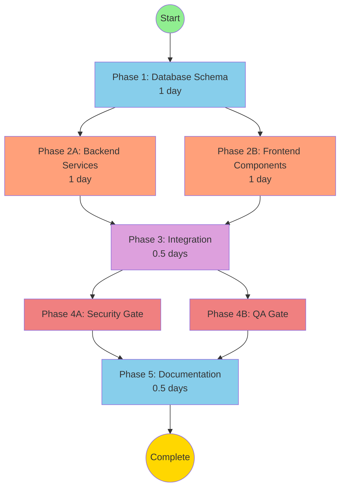

# ADR-006: API Server and Endpoint Architecture - Master Execution File

> **🤖 System Instruction**: If this file is pasted into an LLM context, act as the **Orchestrator**.
> Read the "Current Status" section below and trigger the next appropriate phase.

**Document Type**: Executable Meta-Prompt (Self-Driving Workflow)
**Status**: 🚀 Phase 1 - Ready to Execute
**Last Updated**: 2025-11-26
**Total Estimated Duration**: 3.5 days

---

## 📊 Current Status

```json
{
  "currentPhase": 1,
  "currentTask": "1.1",
  "completedTasks": [],
  "blockedTasks": [],
  "parallelTracksActive": false
}
```

**What This Means**:
- ✅ All blueprints are complete
- ⏭️ Ready to execute Phase 1, Task 1.1
- 🚫 No tasks can be skipped
- ⚡ Parallel execution becomes available in Phase 2

---

## 🗺️ The Map (Dependency Graph)

**How to Read This**:
- Boxes = Phases or Tasks
- Arrows = "Must complete before"
- Parallel tracks = Side-by-side boxes at same level



**Critical Paths**:
- 🔴 **Blocking**: Phase 1 → Phase 2 → Phase 3 → Phase 4 → Phase 5
- 🟢 **Parallel**: Phase 2A (Backend) and Phase 2B (Frontend) can run simultaneously
- 🛡️ **Gates**: Phase 4A (Security) and Phase 4B (QA) must both complete before Phase 5

---

## 🟢 Phase 1: Database Schema & Migration

**Goal**: Create two-tier architecture (ApiServer → ApiEndpoint) with AI data hooks

**Mode**: 🔴 Blocking (Nothing can proceed until this completes)

**Why This Phase Exists**: The database schema is the foundation. Backend services need the ApiServer and ApiEndpoint models to exist before they can implement CRUD operations. Frontend components can mock the API, but the migration script must run first to convert existing data.

**Success Criteria**:
- Migration runs successfully in <5 seconds
- All 7 PEMS configs converted to 1 server + 7 endpoints
- DataSourceMappings updated to point to ApiEndpoint
- Rollback script tested and verified
- All AI data hooks implemented (endpoint test logging, metadata tracking, health aggregation)

---

### 🛠️ Task 1.1: Create Prisma Schema with AI Hooks

**Agent**: `postgres-jsonb-architect`

**Input Dependencies**:
- ✅ IMPLEMENTATION_PLAN.md Section 2 (Database Schema)
- ✅ AI_OPPORTUNITIES.md Section 2 (Mandatory Data Hooks)

**Output Deliverables**:
- 📄 Prisma schema with 3 new models: ApiServer, ApiEndpoint, EndpointTestResult
- 📄 Updated DataSourceMapping model (points to ApiEndpoint)
- 📄 Migration file generated

**Acceptance Criteria** (from DECISION.md):
- ✅ ApiServer stores credentials once (not 7×)
- ✅ ApiEndpoint references serverId and constructs URL from server.baseUrl + endpoint.path
- ✅ EndpointTestResult stores detailed test telemetry (AI Hook requirement)
- ✅ Credentials encrypted (authKeyEncrypted, authValueEncrypted fields)

**AI Requirements** (from AI_OPPORTUNITIES.md):
- ✅ **Hook 1: Endpoint Test Result Logging** - EndpointTestResult model must store:
  - testTimestamp, success, responseTimeMs, statusCode
  - errorType, errorMessage
  - requestUrl, requestMethod, requestHeaders, requestPayload (for AI analysis)
  - responseSample (first 1KB)
  - contextData (JSON: serverHealthBefore, otherEndpointsStatus, userAction)

- ✅ **Hook 2: Endpoint Metadata Tracking** - ApiEndpoint model must include:
  - firstTestedAt, lastTestedAt, testCount, successCount, failureCount
  - avgResponseTimeMs, lastKnownGoodAt, lastErrorMessage, lastErrorAt

- ✅ **Hook 3: Server Health Aggregation** - ApiServer model must include:
  - healthStatus (healthy/degraded/down), healthScore (0-100)
  - totalEndpoints, healthyEndpoints, degradedEndpoints, downEndpoints
  - lastHealthCheckAt

---

#### 📋 Prompt Bundle (Copy & Paste This Entire Block)

```text
@postgres-jsonb-architect

**SYSTEM CONTEXT**:
You are executing Phase 1, Task 1.1 of ADR-006 (API Server and Endpoint Architecture).
You are the FIRST MOVER. All subsequent tasks depend on your output.

**BUSINESS CONTEXT** (from DECISION.md):
Current implementation duplicates PEMS server credentials across 7 separate API configurations. We need a two-tier architecture (Server → Endpoints) with individual endpoint testing and error tracking capabilities.

**Key Business Requirements**:
- Reduce credential entry from 7× to 1× per server
- Enable per-endpoint testing with specific error messages
- Support multiple API servers (PEMS, ESS, Procurement) with same architecture
- Maintain security: credentials must remain encrypted

**Success Metrics**:
- Credential entry: 1× per server (down from 7×)
- Time to add new endpoint: 30 seconds (down from 5 minutes)
- URL construction overhead: <1ms
- Migration time: <5 seconds

**TECHNICAL SPECIFICATION** (from IMPLEMENTATION_PLAN.md Section 2):

**Create 3 New Models**:

1. **ApiServer Model**:
   - id (UUID), organizationId (FK to Organization)
   - name (e.g., "PEMS Production"), baseUrl (e.g., "https://pems.example.com:443/axis/restservices")
   - authType (default "basic"), authKeyEncrypted (username encrypted), authValueEncrypted (password encrypted)
   - commonHeaders (JSON string: tenant, gridCode, gridId)
   - healthStatus ("healthy"/"degraded"/"down"/"untested"), healthScore (0-100), lastHealthCheckAt
   - status ("active"/"inactive"/"untested"), createdAt, updatedAt
   - Relation: endpoints (ApiEndpoint[])
   - Unique constraint: (organizationId, name)
   - Index: organizationId

2. **ApiEndpoint Model**:
   - id (UUID), serverId (FK to ApiServer, CASCADE delete)
   - name (e.g., "Assets"), path (e.g., "/assets")
   - entity ("asset_master"/"users"/"classifications"), operationType ("read"/"write"/"read-write")
   - feeds (JSON string), customHeaders (JSON string, optional endpoint-specific overrides)
   - status ("healthy"/"degraded"/"down"/"untested")
   - firstTestedAt, lastTestedAt, testCount, successCount, failureCount
   - avgResponseTimeMs, lastKnownGoodAt, lastErrorMessage, lastErrorAt
   - createdAt, updatedAt
   - Relation: dataSourceMappings (DataSourceMapping[]), testResults (EndpointTestResult[])
   - Unique constraint: (serverId, path)
   - Indexes: serverId, entity

3. **EndpointTestResult Model** (AI Hook):
   - id (UUID), endpointId (FK to ApiEndpoint, CASCADE delete)
   - testTimestamp, success (boolean), responseTimeMs, statusCode
   - errorType ("NETWORK_TIMEOUT"/"AUTH_FAILURE"/"NOT_FOUND"/"SERVER_ERROR"), errorMessage
   - requestUrl, requestMethod ("GET"/"POST"), requestHeaders (JSON), requestPayload (JSON)
   - responseHeaders (JSON), responseSample (first 1KB)
   - contextData (JSON: { serverHealthBefore, otherEndpointsStatus, userAction })
   - Indexes: endpointId, testTimestamp

**Update Existing Model**:

4. **DataSourceMapping** (add new field, keep old for migration):
   - apiEndpointId (nullable FK to ApiEndpoint, SET NULL on delete)
   - apiConfigurationId (nullable FK to ApiConfiguration, keep for migration)

**AI READINESS REQUIREMENTS** (from AI_OPPORTUNITIES.md Section 2):
🚨 **MANDATORY**: You MUST implement these data hooks NOW (even if AI features come later):

**Hook 1: Endpoint Test Result Logging**
- Purpose: Enable AI to analyze patterns, detect anomalies, predict failures
- Implementation: EndpointTestResult model stores:
  - Test outcome: testTimestamp, success, responseTimeMs, statusCode
  - Error details: errorType, errorMessage
  - Request/response capture: requestUrl, requestMethod, requestHeaders, requestPayload, responseHeaders, responseSample (first 1KB)
  - Context: contextData JSON field storing { serverHealthBefore, otherEndpointsStatus: ["healthy", "healthy", "down"], userAction: "manual_test" | "scheduled_sync" | "api_call" }
- Why: AI can correlate failures across endpoints (e.g., "All endpoints failed after credential change")

**Hook 2: Endpoint Metadata Tracking**
- Purpose: Track endpoint usage, performance, reliability metrics
- Implementation: ApiEndpoint model includes:
  - firstTestedAt, lastTestedAt, testCount, successCount, failureCount
  - avgResponseTimeMs (average latency), lastKnownGoodAt (last successful test)
  - lastErrorMessage, lastErrorAt
- Why: AI can identify slow/unreliable endpoints and suggest optimizations

**Hook 3: Server Health Aggregation**
- Purpose: Track overall server health based on endpoint statuses
- Implementation: ApiServer model includes:
  - healthStatus: "healthy" | "degraded" | "down" (computed from endpoints)
  - healthScore: 0-100 (percentage of successful endpoint tests)
  - totalEndpoints, healthyEndpoints, degradedEndpoints, downEndpoints (counts)
  - lastHealthCheckAt: When health was last computed
- Why: AI can detect systemic server issues vs individual endpoint failures

**YOUR MISSION**:

**Step 1: Analyze for Ambiguity**
Review the requirements above. If ANY of the following are unclear, STOP and ASK:
- [ ] Should healthStatus be computed or manually set?
- [ ] What is the exact structure of contextData JSON? (Example provided: { serverHealthBefore: "healthy", otherEndpointsStatus: ["healthy", "down"], userAction: "manual_test" })
- [ ] Should commonHeaders and customHeaders be TEXT or JSONB?
- [ ] What cascade behavior for ApiServer → ApiEndpoint deletion? (Spec says CASCADE)

**Step 2: Design the Prisma Schema**
1. Create 3 new models: ApiServer, ApiEndpoint, EndpointTestResult
2. Update DataSourceMapping to add apiEndpointId field
3. Include ALL fields from Technical Specification
4. Add ALL fields from AI Readiness Requirements (data hooks)
5. Define proper indexes for queries:
   - ApiServer: index on organizationId
   - ApiEndpoint: indexes on serverId and entity
   - EndpointTestResult: indexes on endpointId and testTimestamp
6. Use proper relations: ApiServer has many ApiEndpoint, ApiEndpoint has many EndpointTestResult

**Step 3: Optimize for Performance**
Based on expected queries:
- Query 1: "Get all endpoints for server X" → Index on ApiEndpoint.serverId
- Query 2: "Get test history for endpoint Y" → Index on EndpointTestResult.endpointId and testTimestamp
- Query 3: "Find all endpoints for entity Z" → Index on ApiEndpoint.entity
- Query 4: "Get all servers for organization W" → Index on ApiServer.organizationId

Add these indexes to your schema.

**Step 4: Generate Migration**
After creating the Prisma schema, generate the migration file:
```bash
npx prisma migrate dev --name api_server_endpoint_architecture
```

**Step 5: Verification Questions**
Before you finalize, answer these:
1. Does this schema support the future AI use case: "Predictive endpoint failure detection"? (YES - EndpointTestResult stores historical test data for pattern analysis)
2. Can we query "All failed tests in last 7 days for endpoint X" in <100ms? (YES - index on endpointId + testTimestamp)
3. Are all mandatory AI hooks implemented? (Check: EndpointTestResult exists, ApiEndpoint has metadata fields, ApiServer has health aggregation fields)

**DELIVERABLES**:
1. Updated Prisma schema file (backend/prisma/schema.prisma)
2. Migration file generated (backend/prisma/migrations/.../migration.sql)
3. Verification answers (paste here in chat)

**CONSTRAINTS**:
- ❌ Do NOT proceed to implementation code yet (services/controllers)
- ❌ Do NOT skip any mandatory AI hooks
- ✅ DO ask clarifying questions if ambiguous
- ✅ DO use proper TypeScript types (String, Int, Boolean, DateTime)
- ✅ DO use proper Prisma syntax (@relation, @default, @unique, @@index)

**Reference Documents** (if you need more context):
- Read `docs/adrs/ADR-006-api-server-and-endpoint-architecture/ADR-006-IMPLEMENTATION_PLAN.md` Section 2 for full schema details
- Read `docs/adrs/ADR-006-api-server-and-endpoint-architecture/ADR-006-AI_OPPORTUNITIES.md` Section 2 for AI hook justifications
```

**Status**: ⬜ Not Started

**How to Execute**:
1. Copy the prompt bundle above (everything in the code block)
2. Paste into a new chat message
3. Wait for agent output (Prisma schema + migration file)
4. Verify deliverables match acceptance criteria
5. Run migration: `cd backend && npx prisma migrate dev --name api_server_endpoint_architecture`
6. Mark this task as ✅ Complete
7. Commit the schema and migration to git
8. Proceed to Task 1.2

---

### 🛠️ Task 1.2: Create Migration Script

**Agent**: `backend-architecture-optimizer`

**Input Dependencies**:
- ✅ Task 1.1 Complete (Prisma schema exists)
- ✅ IMPLEMENTATION_PLAN.md Section 4 (Migration Strategy)

**Output Deliverables**:
- 📄 Migration script: `backend/scripts/migrate-api-servers.ts`
- 📄 Rollback script: `backend/scripts/rollback-api-servers.ts`
- 📄 Helper functions: `extractBaseUrl()`, `extractPath()`, `extractEntity()`

**Acceptance Criteria**:
- ✅ Script converts existing 7 ApiConfiguration records to 1 ApiServer + 7 ApiEndpoint records
- ✅ Credentials transferred (authKeyEncrypted, authValueEncrypted)
- ✅ DataSourceMappings updated to point to ApiEndpoint (apiEndpointId set, apiConfigurationId cleared)
- ✅ Old ApiConfiguration records archived (status set to "archived", not deleted)
- ✅ Migration completes in <5 seconds

---

#### 📋 Prompt Bundle (Copy & Paste This Entire Block)

```text
@backend-architecture-optimizer

**SYSTEM CONTEXT**:
You are executing Phase 1, Task 1.2 of ADR-006 (API Server and Endpoint Architecture).
Task 1.1 is COMPLETE. The Prisma schema with ApiServer, ApiEndpoint, and EndpointTestResult models now exists.

**YOUR MISSION**: Create a migration script that converts the existing 7 PEMS API configurations to the new two-tier architecture.

**BUSINESS CONTEXT**:
We have 7 separate `ApiConfiguration` records for PEMS APIs (Assets, Users, Categories, Organizations, Manufacturers, PFA Read, PFA Write). All 7 store identical credentials. We need to consolidate them into:
- 1 ApiServer record (stores credentials once)
- 7 ApiEndpoint records (one for each API, references the server)
- Update all DataSourceMappings to point to the new ApiEndpoint records

**TECHNICAL SPECIFICATION** (from IMPLEMENTATION_PLAN.md Section 4):

**Migration Algorithm**:

**Step 1: Find Existing PEMS Configs**
```typescript
const pemsConfigs = await prisma.apiConfiguration.findMany({
  where: {
    name: { contains: 'PEMS' },
    organizationId: 'pems-global'
  }
});
```

**Step 2: Extract Common Server Details**
From the first config, extract:
- `baseUrl` = extractBaseUrl(firstConfig.url)
  - Example: "https://us1.eam.hxgnsmartcloud.com:443/axis/restservices/assets" → "https://us1.eam.hxgnsmartcloud.com:443/axis/restservices"
  - Algorithm: Remove the last path segment (everything after the last "/")
- `authKeyEncrypted` = firstConfig.authKeyEncrypted (username)
- `authValueEncrypted` = firstConfig.authValueEncrypted (password)
- `commonHeaders` = firstConfig.customHeaders (tenant, gridCode, gridId)

**Step 3: Create ApiServer**
```typescript
const server = await prisma.apiServer.create({
  data: {
    organizationId: firstConfig.organizationId,
    name: 'PEMS Production',
    baseUrl: baseUrl,
    authType: 'basic',
    authKeyEncrypted: firstConfig.authKeyEncrypted,
    authValueEncrypted: firstConfig.authValueEncrypted,
    commonHeaders: firstConfig.customHeaders,
    status: firstConfig.status
  }
});
```

**Step 4: Create ApiEndpoint for Each Config**
For each of the 7 configs:
```typescript
for (const config of pemsConfigs) {
  const path = extractPath(config.url);
  // Example: "https://.../restservices/assets" → "/assets"

  const entity = extractEntity(config.usage);
  // Map: PEMS_ASSETS → "asset_master", PEMS_CLASSES → "classifications", etc.

  const endpoint = await prisma.apiEndpoint.create({
    data: {
      serverId: server.id,
      name: config.name.replace('PEMS - ', ''), // "PEMS - Assets" → "Assets"
      path: path,
      entity: entity,
      operationType: config.operationType,
      feeds: config.feeds,
      status: config.status,
      firstTestedAt: config.firstSyncAt, // Copy existing metrics if available
      lastTestedAt: config.lastSyncAt
    }
  });

  // Step 5: Update DataSourceMappings
  await prisma.dataSourceMapping.updateMany({
    where: { apiConfigurationId: config.id },
    data: {
      apiEndpointId: endpoint.id,
      apiConfigurationId: null // Clear old reference
    }
  });
}
```

**Step 6: Archive Old ApiConfiguration Records**
DO NOT DELETE. Soft delete by setting status to "archived":
```typescript
await prisma.apiConfiguration.updateMany({
  where: { id: { in: pemsConfigs.map(c => c.id) } },
  data: { status: 'archived' }
});
```

**Helper Functions**:

1. **extractBaseUrl(fullUrl: string): string**
   - Input: "https://us1.eam.hxgnsmartcloud.com:443/axis/restservices/assets"
   - Output: "https://us1.eam.hxgnsmartcloud.com:443/axis/restservices"
   - Algorithm: Parse URL, split pathname by "/", remove last segment, reconstruct

2. **extractPath(fullUrl: string): string**
   - Input: "https://us1.eam.hxgnsmartcloud.com:443/axis/restservices/assets"
   - Output: "/assets"
   - Algorithm: Parse URL, get last path segment, prepend "/"

3. **extractEntity(usage: string): string**
   - Input: "PEMS_ASSETS"
   - Output: "asset_master"
   - Algorithm: Use mapping:
     ```typescript
     const map: Record<string, string> = {
       'PEMS_ASSETS': 'asset_master',
       'PEMS_CLASSES': 'classifications',
       'PEMS_MANUFACTURERS': 'manufacturers',
       'PEMS_ORGANIZATIONS': 'organizations',
       'PEMS_PFA_READ': 'pfa',
       'PEMS_PFA_WRITE': 'pfa',
       'PEMS_USER_SYNC': 'users'
     };
     return map[usage] || 'unknown';
     ```

**Rollback Script**:
Create a separate rollback script that:
1. Restores ApiConfiguration records (status: "archived" → "active")
2. Restores DataSourceMappings (set apiConfigurationId, clear apiEndpointId)
3. Deletes ApiServer (CASCADE will delete ApiEndpoint and EndpointTestResult)

**DELIVERABLES**:
1. Migration script: `backend/scripts/migrate-api-servers.ts`
2. Rollback script: `backend/scripts/rollback-api-servers.ts`
3. Test execution:
   - Run migration on development database
   - Verify 1 server + 7 endpoints created
   - Verify DataSourceMappings updated
   - Run rollback
   - Verify original state restored

**VERIFICATION CHECKLIST**:
After running migration:
- [ ] `await prisma.apiServer.count()` returns 1
- [ ] `await prisma.apiEndpoint.count()` returns 7
- [ ] `await prisma.apiConfiguration.findMany({ where: { status: 'archived' } })` returns 7 records
- [ ] `await prisma.dataSourceMapping.findMany()` all have apiEndpointId set, apiConfigurationId null
- [ ] Migration completes in <5 seconds

**PERFORMANCE TARGET**:
- Migration must complete in <5 seconds (benchmark from TEST_PLAN.md)

**Reference Documents** (if you need more context):
- Read `docs/adrs/ADR-006-api-server-and-endpoint-architecture/ADR-006-IMPLEMENTATION_PLAN.md` Section 4 for full migration details
- Read `docs/adrs/ADR-006-api-server-and-endpoint-architecture/ADR-006-TEST_PLAN.md` Flow 4 for migration test assertions
```

**Status**: ⬜ Not Started (Blocked by Task 1.1)

**How to Execute**:
1. Ensure Task 1.1 is complete (Prisma schema exists)
2. Copy the prompt bundle above
3. Paste into chat
4. Wait for migration script + rollback script
5. Test migration on development database
6. Verify all assertions pass
7. Mark task as ✅ Complete
8. Commit scripts to git
9. Proceed to Phase 2

---

## 🟡 Phase 2: Backend & Frontend Build (Parallel Execution)

**Goal**: Implement API services and UI components simultaneously

**Mode**: ⚡ Parallel Execution Allowed

**Why Parallel**: Backend services and frontend components are independent. Backend can implement CRUD operations for ApiServer/ApiEndpoint while frontend builds the UI shell with mocked API calls. They integrate in Phase 3.

**Important**: You MUST complete Phase 1 first. Once Phase 1 is done, you may execute Track A (Backend) and Track B (Frontend) simultaneously in separate chat windows.

---

### 🛤️ Track A: Backend Services & APIs

**Agent**: `backend-architecture-optimizer`

**Dependencies**:
- ✅ Phase 1 Complete (Database schema exists, migration script tested)

**Deliverables**:
- 📄 `backend/src/services/apiServerService.ts` - CRUD operations for ApiServer
- 📄 `backend/src/services/apiEndpointService.ts` - CRUD operations for ApiEndpoint + testing logic
- 📄 `backend/src/routes/serverRoutes.ts` - Server management routes
- 📄 `backend/src/routes/endpointRoutes.ts` - Endpoint management routes
- 📄 Unit tests (>95% coverage)

---

#### 📋 Prompt Bundle (Track A - Backend)

```text
@backend-architecture-optimizer

**SYSTEM CONTEXT**:
You are executing Phase 2, Track A of ADR-006 (API Server and Endpoint Architecture).
Phase 1 is COMPLETE. The database schema exists (ApiServer, ApiEndpoint, EndpointTestResult models).

**YOUR MISSION**: Implement backend services and API endpoints for server and endpoint management.

**BUSINESS REQUIREMENTS** (from DECISION.md):
- Admins configure credentials once per server (not 7 times)
- Admins test individual endpoints with specific error messages
- Adding new endpoints takes 30 seconds (not 5 minutes)
- System constructs URLs from server.baseUrl + endpoint.path

**TECHNICAL SPECIFICATION** (from IMPLEMENTATION_PLAN.md Section 3):

**API Endpoints to Implement**:

**Server Management**:
1. `GET /api/servers` - List all servers for organization
2. `POST /api/servers` - Create new server (encrypt credentials before storage)
3. `PUT /api/servers/:id` - Update server
4. `DELETE /api/servers/:id` - Delete server (cascades to endpoints)
5. `POST /api/servers/:id/test` - Test server connection (tests all endpoints)

**Endpoint Management**:
6. `GET /api/servers/:serverId/endpoints` - List endpoints for server
7. `POST /api/servers/:serverId/endpoints` - Create endpoint
8. `PUT /api/servers/:serverId/endpoints/:id` - Update endpoint
9. `DELETE /api/servers/:serverId/endpoints/:id` - Delete endpoint
10. `POST /api/servers/:serverId/endpoints/:id/test` - Test individual endpoint (AI Hook: creates EndpointTestResult record)

**Bulk Operations**:
11. `POST /api/servers/:serverId/endpoints/test-all` - Test all endpoints sequentially
12. `GET /api/servers/:serverId/health` - Get server health summary (AI Hook)
13. `GET /api/servers/:serverId/endpoints/:endpointId/history?days=7` - Get test history (AI Hook)

**Service Layer Architecture**:

**apiServerService.ts**:
```typescript
export class ApiServerService {
  async createServer(data: CreateServerDto): Promise<ApiServer> {
    // IMPORTANT: Encrypt authKey and authValue before storage
    const encrypted = {
      authKeyEncrypted: encrypt(data.authKey),
      authValueEncrypted: encrypt(data.authValue)
    };
    return prisma.apiServer.create({ data: { ...data, ...encrypted } });
  }

  async testServer(id: string): Promise<ServerTestResult> {
    // Test all endpoints, aggregate results
    const endpoints = await prisma.apiEndpoint.findMany({ where: { serverId: id } });
    const results = await Promise.all(endpoints.map(ep => this.testEndpoint(ep.id)));
    const healthScore = (results.filter(r => r.success).length / results.length) * 100;
    return { success: healthScore > 50, healthScore, results };
  }

  constructUrl(server: ApiServer, endpoint: ApiEndpoint): string {
    // PERFORMANCE TARGET: <1ms
    const baseUrl = server.baseUrl.replace(/\/$/, '');
    const path = endpoint.path.replace(/^\//, '');
    return `${baseUrl}/${path}`;
  }
}
```

**apiEndpointService.ts**:
```typescript
export class ApiEndpointService {
  async testEndpoint(id: string, dryRun: boolean = false): Promise<EndpointTestResult> {
    const endpoint = await prisma.apiEndpoint.findUnique({
      where: { id },
      include: { server: true }
    });

    const url = constructUrl(endpoint.server, endpoint);
    const startTime = Date.now();

    try {
      const response = await fetch(url, {
        method: 'GET', // or endpoint.method if stored
        headers: buildRequestHeaders(endpoint.server, endpoint)
      });

      const responseTimeMs = Date.now() - startTime;

      // AI HOOK: Create EndpointTestResult record
      const testResult = await prisma.endpointTestResult.create({
        data: {
          endpointId: id,
          testTimestamp: new Date(),
          success: response.ok,
          responseTimeMs,
          statusCode: response.status,
          requestUrl: url,
          requestMethod: 'GET',
          requestHeaders: JSON.stringify(Object.fromEntries(response.headers)),
          responseSample: (await response.text()).substring(0, 1024), // First 1KB
          contextData: JSON.stringify({
            serverHealthBefore: endpoint.server.healthStatus,
            otherEndpointsStatus: await this.getOtherEndpointsStatus(endpoint.serverId, id),
            userAction: dryRun ? 'dry_run' : 'manual_test'
          })
        }
      });

      // AI HOOK: Update endpoint metadata
      await this.updateEndpointMetrics(id, testResult);

      return testResult;
    } catch (error) {
      // Handle error, create failed test result
      const testResult = await prisma.endpointTestResult.create({
        data: {
          endpointId: id,
          success: false,
          errorType: 'NETWORK_TIMEOUT',
          errorMessage: error.message,
          // ... other fields
        }
      });

      await this.updateEndpointMetrics(id, testResult);
      return testResult;
    }
  }

  async updateEndpointMetrics(id: string, result: EndpointTestResult): Promise<void> {
    // AI HOOK: Update endpoint metadata based on test result
    const endpoint = await prisma.apiEndpoint.findUnique({ where: { id } });
    const newTestCount = endpoint.testCount + 1;
    const newSuccessCount = endpoint.successCount + (result.success ? 1 : 0);
    const newFailureCount = endpoint.failureCount + (result.success ? 0 : 1);

    // Compute new average response time
    const newAvgResponseTimeMs = result.success
      ? Math.round((endpoint.avgResponseTimeMs * endpoint.testCount + result.responseTimeMs) / newTestCount)
      : endpoint.avgResponseTimeMs;

    // Update status based on recent success rate
    const successRate = newSuccessCount / newTestCount;
    const newStatus = successRate > 0.9 ? 'healthy' : successRate > 0.5 ? 'degraded' : 'down';

    await prisma.apiEndpoint.update({
      where: { id },
      data: {
        testCount: newTestCount,
        successCount: newSuccessCount,
        failureCount: newFailureCount,
        avgResponseTimeMs: newAvgResponseTimeMs,
        status: newStatus,
        lastTestedAt: new Date(),
        lastKnownGoodAt: result.success ? new Date() : endpoint.lastKnownGoodAt,
        lastErrorMessage: result.success ? null : result.errorMessage,
        lastErrorAt: result.success ? null : new Date()
      }
    });
  }
}
```

**AI ENFORCEMENT** (from AI_OPPORTUNITIES.md):
🚨 **MANDATORY**: Implement these data capture hooks in your API code:

**Hook 1: Endpoint Test Result Logging**
- Every endpoint test MUST create an EndpointTestResult record
- Store: testTimestamp, success, responseTimeMs, statusCode, errorType, errorMessage
- Store request details: requestUrl, requestMethod, requestHeaders, requestPayload
- Store response details: responseHeaders, responseSample (first 1KB)
- Store context: serverHealthBefore, otherEndpointsStatus, userAction

**Hook 2: Endpoint Metadata Updates**
- After every test, update ApiEndpoint metrics:
  - testCount, successCount, failureCount (increment)
  - avgResponseTimeMs (compute new average)
  - status (compute from success rate: >90% = healthy, >50% = degraded, else down)
  - lastTestedAt, lastKnownGoodAt, lastErrorMessage, lastErrorAt

**Hook 3: Server Health Aggregation**
- When testing all endpoints (testServer), compute server health:
  - healthScore = (successfulEndpoints / totalEndpoints) * 100
  - healthStatus = healthScore > 90 ? "healthy" : healthScore > 50 ? "degraded" : "down"
  - Update ApiServer: healthScore, healthStatus, lastHealthCheckAt

**PERFORMANCE REQUIREMENTS**:
- URL construction: <1ms (from UX_SPEC.md Rule 2)
- Single endpoint test: <500ms (from UX_SPEC.md Rule 2)
- Test all endpoints (7): <10 seconds (from TEST_PLAN.md Benchmark 3)

**SECURITY REQUIREMENTS** (from TEST_PLAN.md):
- Credentials MUST be encrypted before storage (use existing encrypt/decrypt utilities)
- API responses MUST NOT expose authKeyEncrypted or authValueEncrypted fields
- Input validation required (use Zod schemas)
- IDOR protection: Verify user has access to organization before returning server/endpoint data

**DELIVERABLES**:
1. `backend/src/services/apiServerService.ts`
2. `backend/src/services/apiEndpointService.ts`
3. `backend/src/routes/serverRoutes.ts`
4. `backend/src/routes/endpointRoutes.ts`
5. `backend/src/controllers/serverController.ts` (if using controller pattern)
6. `backend/src/controllers/endpointController.ts`
7. Unit tests (>95% coverage)

**VERIFICATION CHECKLIST**:
- [ ] All 13 API endpoints return 200 for valid input
- [ ] Credentials encrypted before storage
- [ ] Credentials NOT exposed in API responses
- [ ] URL construction benchmarked at <1ms
- [ ] EndpointTestResult records created on every test
- [ ] Endpoint metadata updated after every test
- [ ] Server health computed correctly
- [ ] SQL injection tests pass (from TEST_PLAN.md Attack 1)
- [ ] IDOR tests pass (from TEST_PLAN.md Attack 3)
- [ ] Unit test coverage >95%

**Reference Documents**:
- Read `docs/adrs/ADR-006-api-server-and-endpoint-architecture/ADR-006-IMPLEMENTATION_PLAN.md` Section 3 for full API specification
- Read `docs/adrs/ADR-006-api-server-and-endpoint-architecture/ADR-006-AI_OPPORTUNITIES.md` Section 2 for AI hook requirements
- Read `docs/adrs/ADR-006-api-server-and-endpoint-architecture/ADR-006-TEST_PLAN.md` Section 2 for security test scenarios
```

**Status**: ⬜ Not Started (Blocked by Phase 1)

**How to Execute**:
1. Ensure Phase 1 is complete
2. Copy the prompt bundle above
3. Paste into chat (can run in parallel with Track B)
4. Wait for service files + routes + tests
5. Run unit tests: `npm run test`
6. Verify coverage >95%
7. Mark task as ✅ Complete
8. Commit to git
9. Wait for Track B to complete before proceeding to Phase 3

---

### 🛤️ Track B: Frontend Components

**Agent**: `react-ai-ux-specialist`

**Dependencies**:
- ✅ Phase 1 Complete (API contract defined from IMPLEMENTATION_PLAN.md)
- ⚠️ API implementation can be MOCKED for this track (integration happens in Phase 3)

**Deliverables**:
- 📄 Refactored `components/admin/ApiConnectivity.tsx` with hierarchical server → endpoints view
- 📄 `components/admin/ServerCard.tsx` - Expandable server card
- 📄 `components/admin/EndpointRow.tsx` - Endpoint row with test button
- 📄 Mock API data matching backend contract
- 📄 React Query integration
- 📄 Component tests (>70% coverage)

---

#### 📋 Prompt Bundle (Track B - Frontend)

```text
@react-ai-ux-specialist

**SYSTEM CONTEXT**:
You are executing Phase 2, Track B of ADR-006 (API Server and Endpoint Architecture).
You are building the UI shell. The backend is being built in parallel (Track A).

**CRITICAL**: You MUST mock the API calls for now. Use mock data that matches the API contract from IMPLEMENTATION_PLAN.md.

**YOUR MISSION**: Build a hierarchical server → endpoints view with optimistic UI for endpoint testing.

**BUSINESS REQUIREMENTS** (from DECISION.md):
- Admins see servers and their endpoints in a hierarchical tree
- Admins can expand/collapse servers to view endpoints
- Admins can test individual endpoints with a "Test" button
- Admins can test all endpoints at once with a "Test All" button
- Status updates appear instantly (optimistic UI)

**UX SPECIFICATION** (from UX_SPEC.md):

**UI Structure** (hierarchical view):
```
┌─────────────────────────────────────────────────────────┐
│ API Servers                                    [+ Add]  │
├─────────────────────────────────────────────────────────┤
│ ▼ PEMS Production                         [Test All]    │
│   Status: ●●●●●●○ (6/7 healthy)                        │
│   Base URL: https://pems.example.com                    │
│   Last Tested: 2 minutes ago                            │
│                                                          │
│   ├─ ✅ Assets (215ms)                     [Test]       │
│   ├─ ✅ Users (187ms)                      [Test]       │
│   ├─ ✅ Categories (142ms)                 [Test]       │
│   ├─ ✅ Organizations (201ms)              [Test]       │
│   ├─ ✅ Manufacturers (178ms)              [Test]       │
│   ├─ ✅ PFA Data (Read) (325ms)            [Test]       │
│   └─ ❌ PFA Data (Write) - 404 Not Found   [Test]       │
│                                                          │
│ ▶ ESS Integration                          [Test All]   │
│   Status: Not tested                                    │
└─────────────────────────────────────────────────────────┘
```

**Component Hierarchy**:
```
<ApiConnectivity>
  ├─ <ServerList>
  │    ├─ <ServerCard> (expandable)
  │    │    ├─ <ServerHeader>
  │    │    │    ├─ Server Name
  │    │    │    ├─ Health Indicator (●●●●●●○ 6/7)
  │    │    │    └─ "Test All" Button
  │    │    └─ <EndpointList> (shown when expanded)
  │    │         └─ <EndpointRow> (repeatable)
  │    │              ├─ Status Icon (✅/❌/⏳)
  │    │              ├─ Name + Latency
  │    │              └─ "Test" Button
  │    └─ "+ Add Server" Button
  └─ <ServerModal> (create/edit)
```

**UX ENFORCEMENT** (from UX_SPEC.md):
🚨 **MANDATORY**: Your code MUST implement these perceived performance rules:

**Rule 1: Optimistic Updates**
When user clicks "Test" button:
- IMMEDIATELY (0ms): Show "Testing..." status on endpoint row
- IMMEDIATELY (0ms): Show subtle loading spinner
- IMMEDIATELY (0ms): Disable test button (prevent duplicate requests)
- AFTER SERVER (500ms): Show success icon (✅) or error icon (❌)
- AFTER SERVER (500ms): Update status text: "Healthy (215ms)" or "Failed: 404 Not Found"
- AFTER SERVER (500ms): Re-enable test button
- ON ERROR: Revert status to previous state, show error toast

**Rule 2: Latency Budget**
| Interaction | Target | Max Acceptable | Strategy |
|-------------|--------|----------------|----------|
| Expand server | <16ms | 50ms | Optimistic expand |
| Test single endpoint | <500ms | 2000ms | Show progress |
| Save server | <200ms | 500ms | Optimistic save |

**Rule 3: Loading States**
- Skeleton screens for server list while loading
- Progress bar for "Test All" operation
- Never show blank white screen

**Rule 4: Accessibility**
- Keyboard navigation: Tab through servers and endpoints
- Screen reader support: ARIA labels for all interactive elements
- Color + icon + text for status (never rely on color alone)

**Accessibility Requirements**:
```html
<button
  aria-label="Expand PEMS Production server to view 7 endpoints"
  aria-expanded="false"
  aria-controls="server-endpoints-pems"
>
  <ChevronRight aria-hidden="true" />
  PEMS Production
</button>

<div role="status" aria-live="polite" aria-atomic="true">
  Assets endpoint test completed. Status: Healthy. Response time: 215 milliseconds.
</div>
```

**State Management** (from IMPLEMENTATION_PLAN.md Section 5):

**React Query Keys**:
```typescript
['servers', organizationId]                    // List of servers
['server', serverId]                           // Single server details
['endpoints', serverId]                        // Endpoints for server
['endpoint-health', endpointId]                // Endpoint health status
['endpoint-test-history', endpointId, days]    // Test history (AI Hook)
```

**Optimistic Update Pattern**:
```typescript
const testEndpointMutation = useMutation(['testEndpoint'], testEndpoint, {
  onMutate: async (endpointId) => {
    // Optimistic update: Set status to "testing"
    await queryClient.cancelQueries(['endpoints', serverId]);
    const previous = queryClient.getQueryData(['endpoints', serverId]);
    queryClient.setQueryData(['endpoints', serverId], (old: Endpoint[]) =>
      old.map(ep => ep.id === endpointId ? { ...ep, status: 'testing' } : ep)
    );
    return { previous };
  },
  onError: (err, variables, context) => {
    // Revert optimistic update
    queryClient.setQueryData(['endpoints', serverId], context.previous);
    toast.error('Test failed: Network error');
  },
  onSuccess: (result, endpointId) => {
    // Update with real result
    queryClient.invalidateQueries(['endpoints', serverId]);
    queryClient.invalidateQueries(['endpoint-health', endpointId]);
    toast.success(`Endpoint test ${result.success ? 'passed' : 'failed'}`);
  }
});
```

**Mock Data** (use this while backend is being built):
```typescript
const mockServers: ApiServer[] = [
  {
    id: 'server-1',
    name: 'PEMS Production',
    baseUrl: 'https://pems.example.com:443/axis/restservices',
    healthStatus: 'healthy',
    healthScore: 85,
    status: 'active'
  }
];

const mockEndpoints: ApiEndpoint[] = [
  { id: 'ep-1', serverId: 'server-1', name: 'Assets', path: '/assets', status: 'healthy', avgResponseTimeMs: 215 },
  { id: 'ep-2', serverId: 'server-1', name: 'Users', path: '/usersetup', status: 'healthy', avgResponseTimeMs: 187 },
  { id: 'ep-3', serverId: 'server-1', name: 'Categories', path: '/categories', status: 'healthy', avgResponseTimeMs: 142 },
  { id: 'ep-4', serverId: 'server-1', name: 'Organizations', path: '/organization', status: 'healthy', avgResponseTimeMs: 201 },
  { id: 'ep-5', serverId: 'server-1', name: 'Manufacturers', path: '/manufacturers', status: 'healthy', avgResponseTimeMs: 178 },
  { id: 'ep-6', serverId: 'server-1', name: 'PFA Data (Read)', path: '/griddata', status: 'healthy', avgResponseTimeMs: 325 },
  { id: 'ep-7', serverId: 'server-1', name: 'PFA Data (Write)', path: '/UserDefinedScreenService', status: 'down', lastErrorMessage: '404 Not Found' }
];
```

**DELIVERABLES**:
1. Refactored `components/admin/ApiConnectivity.tsx` (hierarchical view)
2. `components/admin/ServerCard.tsx` (expandable card component)
3. `components/admin/EndpointRow.tsx` (endpoint row with test button)
4. Mock API data files
5. React Query integration
6. Component tests (>70% coverage)

**VERIFICATION CHECKLIST**:
- [ ] Hierarchical view renders correctly (servers with nested endpoints)
- [ ] Expand/collapse animation <200ms
- [ ] "Test" button shows "Testing..." immediately (optimistic UI)
- [ ] Result appears in <500ms (mocked response)
- [ ] Keyboard navigation works (Tab through servers and endpoints)
- [ ] Screen reader announces status changes (ARIA live regions)
- [ ] Status uses color + icon + text (not color alone)
- [ ] Empty state shows when no servers configured
- [ ] Component tests pass, coverage >70%

**Reference Documents**:
- Read `docs/adrs/ADR-006-api-server-and-endpoint-architecture/ADR-006-UX_SPEC.md` for full UX specification
- Read `docs/adrs/ADR-006-api-server-and-endpoint-architecture/ADR-006-IMPLEMENTATION_PLAN.md` Section 5 for component architecture
```

**Status**: ⬜ Not Started (Blocked by Phase 1)

**How to Execute**:
1. Ensure Phase 1 is complete
2. Copy the prompt bundle above
3. Paste into chat (can run in parallel with Track A)
4. Wait for refactored components + mock data
5. Run component tests: `npm run test:components`
6. Verify coverage >70%
7. Mark task as ✅ Complete
8. Commit to git
9. Wait for Track A to complete before proceeding to Phase 3

---

## 🔵 Phase 3: Integration & UX Validation

**Goal**: Connect frontend to backend, verify perceived performance

**Mode**: 🔴 Blocking (Must complete before testing)

**Prerequisites**:
- ✅ Phase 2, Track A Complete (Backend API exists)
- ✅ Phase 2, Track B Complete (Frontend shell exists)

**Agent**: `ux-technologist`

**Deliverables**:
- 📄 Integrated frontend code (no more mocks, uses real API)
- 📄 Performance test results
- 📄 List of UX issues found (if any)

---

### 🛠️ Task 3.1: The Handshake

**Purpose**: Replace mocked API calls with real API integration and verify perceived performance.

---

#### 📋 Prompt Bundle

```text
@ux-technologist

**SYSTEM CONTEXT**:
You are executing Phase 3, Task 3.1 of ADR-006 (API Server and Endpoint Architecture).
Both frontend and backend are complete. Now we connect them and verify UX.

**YOUR MISSION**: Replace mock API calls with real backend integration, then test perceived performance.

**Step 1: Replace Mock API Calls**
- Remove mock data from frontend
- Integrate with real API endpoints:
  - GET /api/servers
  - POST /api/servers/:serverId/endpoints/:endpointId/test
  - POST /api/servers/:serverId/endpoints/test-all
- Verify data flow works end-to-end

**Step 2: Test Perceived Performance** (from UX_SPEC.md):

**Latency Budgets to Verify**:
| Interaction | Target | Max Acceptable |
|-------------|--------|----------------|
| Expand server | <16ms | 50ms |
| Test single endpoint | <500ms | 2000ms |
| Test all endpoints | <2000ms | 10000ms |
| Save server | <200ms | 500ms |

**UX Rules to Verify**:
1. **Optimistic Updates**: Does UI update instantly when user clicks "Test"?
   - Expected: "Testing..." status appears at 0ms
   - Expected: Actual result appears at ~200-500ms
   - Test: Click "Test" button, observe status change timing

2. **Error Recovery**: If API fails, does user see gentle error (not crash)?
   - Test: Disconnect network, click "Test", observe error toast
   - Expected: Error message shown, previous status restored, no crash

3. **Loading States**: Do skeleton screens appear at correct thresholds?
   - Expected: Server list shows skeleton if loading >500ms
   - Expected: "Test All" shows progress bar with real-time updates

4. **Accessibility**: Can user navigate with keyboard only?
   - Test: Tab through all interactive elements
   - Expected: Focus visible, Enter key triggers actions

**Step 3: Test Edge Cases**:
- [ ] **Slow network**: Throttle to 3G, test endpoint
  - Expected: Shows "Testing..." for longer, then result appears
  - Expected: No timeout errors, graceful handling

- [ ] **Timeout scenario**: Kill backend mid-request
  - Expected: Error toast: "Request timed out. Try again."
  - Expected: Status reverted to previous state

- [ ] **Multiple concurrent tests**: Click "Test" on 3 endpoints rapidly
  - Expected: All 3 show "Testing..." immediately
  - Expected: Results appear independently as each completes

- [ ] **Large server list**: Mock 20 servers with 7 endpoints each (140 total endpoints)
  - Expected: List renders without lag
  - Expected: Expand/collapse still <50ms

**Performance Measurement**:
Use browser DevTools Performance tab to measure:
```typescript
// In your test:
const startTime = performance.now();
// Trigger action (e.g., expand server)
const endTime = performance.now();
console.log(`Expand took ${endTime - startTime}ms`); // Should be <50ms
```

**DELIVERABLES**:
1. Integrated frontend code (no mocks)
2. Performance test results (paste timing measurements)
3. List of UX issues found:
   - Issue 1: [Description] - Severity: High/Medium/Low
   - Issue 2: [Description] - Severity: High/Medium/Low
   - ...

**ACCEPTANCE CRITERIA**:
- [ ] All tests pass (no crashes)
- [ ] User experience feels instant (latency budgets met)
- [ ] Error handling works (no blank screens)
- [ ] Accessibility works (keyboard navigation, screen reader)
- [ ] No critical UX issues (High severity issues must be fixed)

**Reference Documents**:
- Read `docs/adrs/ADR-006-api-server-and-endpoint-architecture/ADR-006-UX_SPEC.md` Section 4 for visual feedback patterns
```

**Status**: ⬜ Not Started (Blocked by Phase 2)

**How to Execute**:
1. Ensure Phase 2 (Track A & B) complete
2. Copy the prompt bundle above
3. Paste into chat
4. Wait for integrated code + performance report
5. Review UX issues list
6. Fix any High severity issues before proceeding
7. Mark task as ✅ Complete
8. Commit integrated code to git
9. Proceed to Phase 4 (Quality Gates)

---

## 🟣 Phase 4: Quality Gates (Security & QA)

**Goal**: Verify security and correctness before launch

**Mode**: 🛡️ Quality Gates (Blocking - Nothing ships until these pass)

**Why This Phase Matters**: Security vulnerabilities and functional bugs caught here prevent production incidents. Both security and QA gates must pass before documentation phase.

---

### 🛡️ Gate 1: Security Red Team

**Agent**: `ai-security-red-teamer`

**Purpose**: Attack the implementation to find vulnerabilities BEFORE production.

---

#### 📋 Prompt Bundle

```text
@ai-security-red-teamer

**SYSTEM CONTEXT**:
You are executing Phase 4, Gate 1 of ADR-006 (API Server and Endpoint Architecture).
Your job is to BREAK the implementation and find security vulnerabilities.

**ATTACK SURFACE** (from TEST_PLAN.md Section 2):

**Attack 1: SQL Injection via Server Name**
Target: POST /api/servers endpoint (server name field)
Method: Inject SQL command in name field

Try:
```bash
curl -X POST http://localhost:3001/api/servers \
  -H "Authorization: Bearer <token>" \
  -H "Content-Type: application/json" \
  -d '{ "name": "'"'"'; DROP TABLE api_servers; --", "baseUrl": "https://test.com" }'
```

Verify:
- [ ] Does the database query fail safely?
- [ ] Is the api_servers table still intact?
- [ ] Does the error message leak schema info? (Should NOT reveal table names)

**Attack 2: Credential Exposure in API Response**
Target: GET /api/servers/:id endpoint
Method: Try to read encrypted credentials

Try:
```bash
curl -X GET http://localhost:3001/api/servers/<server-id> \
  -H "Authorization: Bearer <token>"
```

Verify:
- [ ] Is `authKeyEncrypted` field ABSENT from response? (MUST be filtered out)
- [ ] Is `authValueEncrypted` field ABSENT from response? (MUST be filtered out)
- [ ] Are public fields still present? (baseUrl, name, healthStatus should be visible)

**Attack 3: IDOR (Insecure Direct Object Reference)**
Target: GET /api/servers/:id endpoint
Method: User A tries to access User B's server

Try:
```bash
# As User A (BECH organization):
curl -X GET http://localhost:3001/api/servers/<user-b-server-id> \
  -H "Authorization: Bearer <user-a-token>"
```

Verify:
- [ ] Does the API return 403 Forbidden? (MUST reject cross-org access)
- [ ] Is the error message explicit? (e.g., "PERMISSION_DENIED")
- [ ] Can you enumerate valid server IDs? (Should NOT be possible)

**Attack 4: Endpoint Path Traversal**
Target: POST /api/servers/:serverId/endpoints endpoint (path field)
Method: Inject path traversal in endpoint path

Try:
```bash
curl -X POST http://localhost:3001/api/servers/<server-id>/endpoints \
  -H "Authorization: Bearer <token>" \
  -H "Content-Type: application/json" \
  -d '{ "name": "Evil", "path": "../../etc/passwd", "entity": "asset_master" }'
```

Verify:
- [ ] Does endpoint creation fail? (MUST validate path format)
- [ ] If endpoint is created, does testing it fail safely?
- [ ] Is the constructed URL sanitized? (Should NOT contain "../")

**Attack 5: Rate Limiting Bypass**
Target: POST /api/servers endpoint
Method: Spam endpoint with 100 requests

Try:
```bash
for i in {1..100}; do
  curl -X POST http://localhost:3001/api/servers \
    -H "Authorization: Bearer <token>" \
    -H "Content-Type: application/json" \
    -d "{\"name\":\"Test$i\",\"baseUrl\":\"https://test$i.com\"}" &
done
wait
```

Verify:
- [ ] Are some requests blocked with 429 (Too Many Requests)?
- [ ] Does rate limiting apply per-user or per-IP?
- [ ] Can an attacker bypass by changing IP? (Should have both IP and user rate limits)

**DELIVERABLES**:
1. Attack report (markdown format):
   ```
   ## Attack Results

   ### Attack 1: SQL Injection
   - Status: ✅ BLOCKED / ❌ VULNERABLE
   - Details: [What happened]
   - Evidence: [Screenshot or curl output]

   ### Attack 2: Credential Exposure
   - Status: ✅ BLOCKED / ❌ VULNERABLE
   - Details: [What happened]
   - Evidence: [API response showing filtered fields]
   ```

2. List of vulnerabilities found (if any):
   - Vulnerability 1: [Title] - Severity: Critical/High/Medium/Low
   - Recommended fix: [How to fix]

3. Security scorecard:
   - Critical vulnerabilities: 0 (MUST be 0 to pass gate)
   - High vulnerabilities: 0 (MUST be 0 to pass gate)
   - Medium vulnerabilities: <3 (acceptable if documented)
   - Low vulnerabilities: <10 (acceptable)

**ACCEPTANCE CRITERIA**:
Zero critical or high severity vulnerabilities. All attacks blocked.

**Reference Documents**:
- Read `docs/adrs/ADR-006-api-server-and-endpoint-architecture/ADR-006-TEST_PLAN.md` Section 2 for full security test scenarios
```

**Status**: ⬜ Not Started (Blocked by Phase 3)

**How to Execute**:
1. Ensure Phase 3 is complete
2. Copy the prompt bundle above
3. Paste into chat
4. Wait for attack report
5. Review vulnerabilities list
6. Fix any Critical or High severity vulnerabilities
7. Re-run security tests
8. Mark gate as ✅ Complete only when all attacks blocked
9. Proceed to Gate 2 (QA)

---

### 🛡️ Gate 2: Quality Assurance

**Agent**: `sdet-test-automation`

**Purpose**: Generate comprehensive test suite and verify critical user flows.

---

#### 📋 Prompt Bundle

```text
@sdet-test-automation

**SYSTEM CONTEXT**:
You are executing Phase 4, Gate 2 of ADR-006 (API Server and Endpoint Architecture).
All code is complete. Now we lock in correctness with tests.

**CRITICAL USER FLOWS** (from TEST_PLAN.md Section 1):

**Flow 1: Create Server and Add Endpoints (Happy Path)**
Steps:
1. Navigate to API Connectivity page
2. Click "+ Add Server"
3. Fill form: Name="PEMS Production", BaseURL="https://pems.example.com", Auth Type="Basic", Username="APIUSER", Password="password123", Tenant="BECHTEL_DEV"
4. Click "Save Server"
5. Click "+ Add Endpoint"
6. Fill form: Name="Assets", Path="/assets", Entity="asset_master", Operation="read"
7. Click "Save Endpoint"
8. Repeat for 6 more endpoints

Acceptance:
- Server list contains "PEMS Production"
- Endpoint count is 7
- Credentials are encrypted in database (not plaintext)
- Base URL is correct

**Flow 2: Test Individual Endpoint**
Steps:
1. Expand "PEMS Production" server
2. Click "Test" button on "Assets" endpoint
3. Wait for test result

Acceptance:
- Test button shows loading state immediately
- Response time <2000ms
- Status indicator visible (✅ or ❌)
- Status text shows latency or error message

**Flow 3: Test All Endpoints (Bulk Test)**
Steps:
1. Click "Test All" button on server
2. Observe progress modal
3. Wait for completion

Acceptance:
- Progress modal visible
- Progress bar updates in real-time
- All 7 endpoints tested
- Summary message shows "X/7 passed"

**Flow 4: Migrate Existing API Configs**
Steps:
1. Verify 7 existing ApiConfiguration records exist
2. Run migration script: `npm run migrate:api-servers`
3. Verify migration results

Acceptance:
- Old ApiConfiguration count = 0 (archived)
- New ApiServer count = 1
- New ApiEndpoint count = 7
- Credentials transferred to ApiServer
- DataSourceMappings updated (apiEndpointId set, apiConfigurationId null)
- Migration completes in <5 seconds

**YOUR MISSION**:

**1. Generate E2E Tests**
Write Playwright/Cypress tests for all 4 critical flows above.

**2. Generate Unit Tests**
Test business logic:
- `constructUrl(server, endpoint)` function
  - Test: baseUrl with trailing slash → removes it
  - Test: path with leading slash → removes it
  - Test: Result is valid URL

- `updateEndpointMetrics(id, result)` function
  - Test: Success increments successCount, updates avgResponseTimeMs
  - Test: Failure increments failureCount, sets lastErrorMessage
  - Test: Status changes based on success rate (>90% = healthy, >50% = degraded, else down)

- `extractBaseUrl(fullUrl)` helper
  - Test: "https://example.com:443/api/v1/assets" → "https://example.com:443/api/v1"

**3. Generate Integration Tests**
Test API endpoints:
- POST /api/servers with valid data → returns 201, credentials encrypted
- POST /api/servers with invalid data → returns 400, error message
- POST /api/servers/:serverId/endpoints/:endpointId/test → creates EndpointTestResult record
- POST /api/servers/:serverId/endpoints/:endpointId/test with dryRun=true → no EndpointTestResult created

**COVERAGE REQUIREMENTS** (from TEST_PLAN.md Section 5):

Target:
- Server/Endpoint Services: 95%
- API Endpoints: 90%
- Migration Script: 100% (CRITICAL)
- React Components: 70%

Critical code paths (MUST have 100% coverage):
- backend/src/services/apiServerService.ts
- backend/src/services/apiEndpointService.ts
- backend/scripts/migrate-api-servers.ts
- backend/src/utils/urlConstructor.ts

**DELIVERABLES**:
1. E2E test suite (Playwright or Cypress)
2. Unit test suite (Jest or Vitest)
3. Integration test suite (Supertest for API tests)
4. Coverage report (run `npm run test:coverage`)

**ACCEPTANCE CRITERIA**:
- [ ] All E2E tests pass (4/4 flows)
- [ ] All unit tests pass
- [ ] All integration tests pass
- [ ] Coverage targets met:
  - Server/Endpoint Services: ≥95%
  - API Endpoints: ≥90%
  - Migration Script: 100%
  - React Components: ≥70%

**Reference Documents**:
- Read `docs/adrs/ADR-006-api-server-and-endpoint-architecture/ADR-006-TEST_PLAN.md` for full test scenarios
```

**Status**: ⬜ Not Started (Blocked by Phase 3)

**How to Execute**:
1. Ensure Phase 3 is complete
2. Copy the prompt bundle above
3. Paste into chat
4. Wait for test suite files
5. Run tests: `npm run test`
6. Review coverage report
7. Fix any failing tests
8. Fix any coverage gaps (especially migration script - MUST be 100%)
9. Mark gate as ✅ Complete only when all tests pass and coverage targets met
10. Commit test files to git
11. Proceed to Phase 5 (Documentation)

---

## 📈 Progress Tracking

**How to Use This Section**:
After completing each task, update the status emoji and record the date.

| Phase | Task | Agent | Status | Completed Date |
|-------|------|-------|--------|----------------|
| 1 | Create Prisma Schema | `postgres-jsonb-architect` | ⬜ Not Started | - |
| 1 | Create Migration Script | `backend-architecture-optimizer` | ⬜ Not Started | - |
| 2A | Backend Services & APIs | `backend-architecture-optimizer` | ⬜ Not Started | - |
| 2B | Frontend Components | `react-ai-ux-specialist` | ⬜ Not Started | - |
| 3 | Integration & UX Validation | `ux-technologist` | ⬜ Not Started | - |
| 4 | Security Gate | `ai-security-red-teamer` | ⬜ Not Started | - |
| 4 | QA Gate | `sdet-test-automation` | ⬜ Not Started | - |
| 5 | Documentation | `documentation-synthesizer` | ⬜ Not Started | - |

**Status Legend**:
- ⬜ Not Started
- 🟡 In Progress
- ✅ Complete
- ❌ Blocked
- ⏭️ Skipped (with justification)

---

## 🚀 Execution Checklist

Use this checklist to track your progress through the workflow:

**Phase 1: Foundation**
- [ ] Task 1.1 executed (Prisma schema created)
- [ ] Task 1.1 deliverables committed to git
- [ ] Task 1.2 executed (migration script created)
- [ ] Task 1.2 tested (migration runs successfully in <5 seconds)
- [ ] Phase 1 review complete

**Phase 2: Build (Parallel Execution)**
- [ ] Track A started (Backend services)
- [ ] Track B started (Frontend components) - can run simultaneously
- [ ] Track A complete (API endpoints implemented, tests pass, coverage >95%)
- [ ] Track B complete (UI components implemented, tests pass, coverage >70%)
- [ ] Phase 2 review complete

**Phase 3: Integration**
- [ ] Task 3.1 executed (mock data replaced with real API)
- [ ] Integration testing complete (data flows end-to-end)
- [ ] Performance verified (latency budgets met)
- [ ] UX issues addressed (no High severity issues remaining)
- [ ] Phase 3 review complete

**Phase 4: Quality Gates**
- [ ] Security red team complete (all attacks blocked)
- [ ] No critical or high vulnerabilities found
- [ ] QA test suite complete (all tests pass)
- [ ] Coverage targets met (>95% backend services, >70% frontend)
- [ ] Phase 4 review complete

**Phase 5: Documentation**
- [ ] TECHNICAL_DOCS.md completed (as-built documentation)
- [ ] Migration guide written
- [ ] API reference updated
- [ ] README.md updated (if applicable)
- [ ] DEVELOPMENT_LOG.md updated

**Launch Preparation**
- [ ] All phases complete
- [ ] All tests passing
- [ ] No critical issues outstanding
- [ ] Documentation accurate
- [ ] Ready for deployment

---

## 🔄 How to Resume This Workflow

If you need to pause and resume later:

1. **To Resume**: Paste this entire file into a new chat message
2. **Orchestrator will**:
   - Read the "Current Status" section
   - Check the Progress Tracking table
   - Identify the next incomplete task
   - Provide the prompt bundle for that task
3. **You execute** the provided prompt bundle
4. **Update** the Progress Tracking table (mark task as ✅ Complete)
5. **Repeat** until all phases complete

---

## 📚 Related Documentation

- **Decision**: [ADR-006-DECISION.md](./ADR-006-DECISION.md)
- **AI Opportunities**: [ADR-006-AI_OPPORTUNITIES.md](./ADR-006-AI_OPPORTUNITIES.md)
- **UX Specification**: [ADR-006-UX_SPEC.md](./ADR-006-UX_SPEC.md)
- **Test Plan**: [ADR-006-TEST_PLAN.md](./ADR-006-TEST_PLAN.md)
- **Implementation Plan**: [ADR-006-IMPLEMENTATION_PLAN.md](./ADR-006-IMPLEMENTATION_PLAN.md)
- **Technical Docs**: [ADR-006-TECHNICAL_DOCS.md](./ADR-006-TECHNICAL_DOCS.md) (to be completed in Phase 5)

---

**Workflow Generated**: 2025-11-26
**Generated By**: Orchestrator Agent
**ADR Status**: 🏗️ In Design → 🚀 Ready to Execute
**Total Phases**: 5
**Total Tasks**: 8
**Parallel Tracks**: 2 (Phase 2A + 2B)
**Estimated Duration**: 3.5 days

*This is an executable document. It can be pasted back into chat for resumption.*
