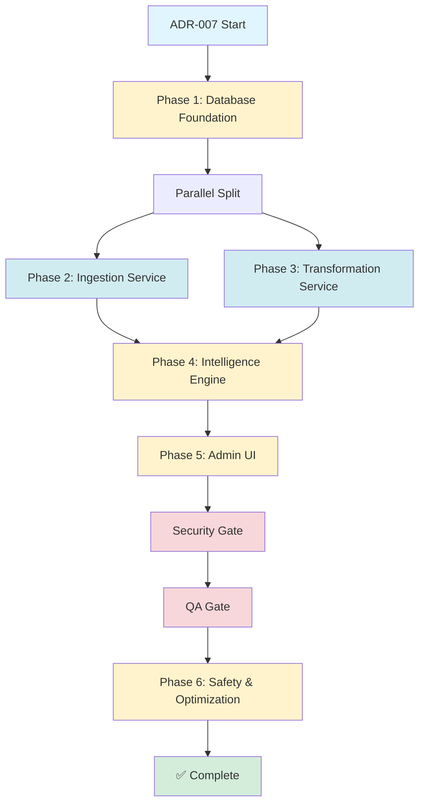

# ADR-007: API Connectivity & Intelligence Layer - Master Execution File

> **🤖 System Instruction**: If this file is pasted into an LLM context, act as the **Orchestrator**. Resume execution from the current phase and task marked as `in_progress`. Use the prompt bundles below to delegate to specialist agents.

**Document Type**: Executable Meta-Prompt (Self-Driving Workflow)
**Status**: Phase 5 In Progress - Tasks 5.5-5.7 Remaining
**Last Updated**: 2025-11-28
**ADR Reference**: [ADR-007-DECISION.md](./ADR-007-DECISION.md)

---

## Current Status

```json
{
  "currentPhase": 5,
  "currentTask": "5.5",
  "completedTasks": ["1.1", "1.2", "1.3", "1.4", "2.1", "2.2", "2.3", "3.1", "3.2", "3.3", "3.4", "4.1", "4.2", "5.1", "5.2", "5.3", "5.4"],
  "blockedTasks": [],
  "parallelTracksActive": false,
  "lastUpdate": "2025-11-28T10:00:00Z"
}
```

**Progress**: 17/33 tasks complete (52%)

---

## 🗺️ Dependency Graph



**Critical Path**: Phase 1 (2d) → Phase 3 (4d) → Phase 4 (3d) → Phase 5 (5d) → Gates (2d) → Phase 6 (3d) = **19 days**

**Parallel Opportunities**: Phase 2 and Phase 3 can run simultaneously (saves 3 days potential)

---

## How to Resume This Workflow

**Option 1: Use Slash Command (Recommended)**
After restarting Claude Code, use the invoke-agent command:
```bash
/invoke-agent backend-architecture-optimizer 3.1
```

**Option 2: Manual Execution**
1. Read the prompt bundle for the current task below
2. Copy the prompt bundle text
3. Paste it into a new conversation
4. Execute as the specified agent persona

**Current Task to Execute**: Task 3.1 - Core Transformation Service
**Assigned Agent**: backend-architecture-optimizer

---

## 📋 Execution Progress

| Phase | Tasks | Agent | Status | Days | Dependencies |
|-------|-------|-------|--------|------|--------------|
| **1** | Database Foundation (4 tasks) | postgres-jsonb-architect | Complete | 2d | None |
| **2** | Ingestion Service (3 tasks) | backend-architecture-optimizer | Complete | 3d | Phase 1 |
| **3** | Transformation Service (4 tasks) | backend-architecture-optimizer | Complete | 4d | Phase 1 |
| **4** | Intelligence Engine (2 tasks) | backend-architecture-optimizer | Complete | 3d | Phase 2&3 |
| **5** | Admin UI (7 tasks) | react-ai-ux-specialist + ux-technologist | In Progress | 5d | Phase 4 |
| **Gate** | Security Testing (5 attacks) | ai-security-red-teamer | Pending | 1d | Phase 5 |
| **Gate** | QA Testing (5 flows) | sdet-test-automation | Pending | 1d | Security |
| **6** | Safety & Optimization (3 tasks) | backend-architecture-optimizer | Pending | 3d | QA Gate |

---

# 🟢 PHASE 1: Database Foundation (2 days)

**Goal**: Create 3-tier connectivity model + Medallion Architecture + AI hooks

**Success Criteria**:
- ✅ All 12 tables created with indexes
- ✅ Docker Compose for Postgres working
- ✅ Rule versioning (validFrom/validTo) implemented
- ✅ Immutability middleware for Bronze layer

---

## Task 1.1: 3-Tier Connectivity Schema

**Agent**: `postgres-jsonb-architect` | **Duration**: 4h | **Status**: ✅ Complete | **Executed**: 2025-11-27 21:00

### Context Bundle

**Business Need**: Admins must configure PEMS field mappings via UI without code changes.

**Current Problem**: Field mappings hardcoded. When PEMS changes `udf_char_01` to `category`, app breaks.

**Solution**: 3-tier configuration model:
- **Tier 1** (ApiServer): Connection credentials
- **Tier 2** (ApiEndpoint): Resource paths + filters
- **Tier 3** (ApiFieldMapping): Field transformation rules

**Critical Enhancement**: Rule Versioning (`validFrom`/`validTo`) enables Time Travel replays.

### Technical Spec

Create in `backend/prisma/schema.prisma`:

```prisma
model ApiServer {
  id                   String   @id @default(cuid())
  organizationId       String
  name                 String
  baseUrl              String
  authType             String   // "BASIC" | "OAUTH" | "API_KEY"
  encryptedCredentials String   // AES-256 encrypted

  isActive             Boolean  @default(true)
  lastHealthCheck      DateTime?
  healthStatus         String?  @default("unknown")

  createdAt            DateTime @default(now())
  updatedAt            DateTime @updatedAt
  createdBy            String

  endpoints            ApiEndpoint[]
  organization         Organization @relation(fields: [organizationId], references: [id], onDelete: Cascade)

  @@index([organizationId])
  @@index([isActive])
}

model ApiEndpoint {
  id              String   @id @default(cuid())
  serverId        String
  name            String
  path            String
  method          String   @default("GET")
  targetModel     String   // "PfaRecord" | "AssetMaster"

  defaultParams   Json     @default("{}")
  supportsDelta   Boolean  @default(true)
  deltaField      String?
  deltaStrategy   String   @default("timestamp")
  promotionRules  Json     @default("[]")

  lastSyncAt      DateTime?
  avgLatency      Int?
  errorRate       Float?

  createdAt       DateTime @default(now())
  updatedAt       DateTime @updatedAt

  mappings        ApiFieldMapping[]
  server          ApiServer @relation(fields: [serverId], references: [id], onDelete: Cascade)

  @@index([serverId])
  @@index([targetModel])
}

model ApiFieldMapping {
  id               String   @id @default(cuid())
  endpointId       String

  sourceField      String   // "udf_char_01"
  destinationField String   // "category"
  dataType         String   @default("string")

  transformType    String?  @default("direct")
  transformParams  Json?    @default("{}")
  defaultValue     String?

  // ⚠️ CRITICAL: Time Travel Support
  validFrom        DateTime @default(now())
  validTo          DateTime?
  isActive         Boolean  @default(true)

  avgTransformTime Int?
  errorCount       Int      @default(0)

  createdAt        DateTime @default(now())
  updatedAt        DateTime @updatedAt
  createdBy        String

  endpoint         ApiEndpoint @relation(fields: [endpointId], references: [id], onDelete: Cascade)

  @@unique([endpointId, sourceField, destinationField])
  @@index([endpointId, isActive])
  @@index([validFrom, validTo])
}
```

### Tasks

1. Add models to `backend/prisma/schema.prisma`
2. Create migration: `npx prisma migrate dev --name add_3_tier_connectivity`
3. Verify tables: `npx prisma studio`
4. Update docs: `docs/DATABASE_SCHEMA_V2.md`

### Verification

```bash
cd backend
npx prisma migrate dev
npx prisma studio
# Verify: apiServer, apiEndpoint, apiFieldMapping tables exist
```

---

## Task 1.2: Medallion Storage Layers

**Agent**: `postgres-jsonb-architect` | **Duration**: 4h | **Status**: ✅ Complete | **Executed**: 2025-11-27 22:30

### Context Bundle

**Architecture**: Bronze (immutable raw) → Silver (transformed) → Gold (analytics)

**Critical Rule**: Bronze layer is **append-only**. No updates/deletes allowed.

### Technical Spec

```prisma
model BronzeRecord {
  id             String   @id @default(uuid())
  syncBatchId    String
  organizationId String
  entityType     String   // "PFA" | "ASSET"
  ingestedAt     DateTime @default(now())

  rawJson        Json     @db.JsonB
  schemaVersion  String?

  lineage        DataLineage[]

  @@index([syncBatchId])
  @@index([organizationId, ingestedAt])
  @@index([organizationId, entityType])
}

model BronzeBatch {
  id                 String   @id @default(cuid())
  syncBatchId        String   @unique
  organizationId     String
  endpointId         String
  entityType         String
  ingestedAt         DateTime @default(now())
  completedAt        DateTime?

  recordCount        Int
  validRecordCount   Int
  invalidRecordCount Int

  schemaFingerprint  Json     // AI Hook
  warnings           Json     @default("[]")
  errors             Json     @default("[]")

  @@index([organizationId, ingestedAt])
}

model DataLineage {
  id              String   @id @default(cuid())
  silverRecordId  String   @unique
  silverModel     String
  bronzeRecordId  String

  mappingRules    Json     // Snapshot at transform time

  transformedAt   DateTime @default(now())
  transformedBy   String

  bronzeRecord    BronzeRecord @relation(fields: [bronzeRecordId], references: [id])
  pfaRecord       PfaRecord?   @relation(fields: [silverRecordId], references: [id])

  @@index([silverRecordId])
  @@index([bronzeRecordId])
}

// ADD TO EXISTING PfaRecord:
model PfaRecord {
  // ... existing fields ...
  lastSeenAt     DateTime @default(now())
  bronzeRecordId String?
  lineage        DataLineage?
}
```

**Immutability Middleware**: Add to `backend/src/config/database.ts`:

```typescript
prisma.$use(async (params, next) => {
  if (params.model === 'BronzeRecord' && ['update', 'updateMany', 'delete', 'deleteMany'].includes(params.action)) {
    throw new Error('Bronze records are immutable');
  }
  return next(params);
});
```

### Tasks

1. Add models + update PfaRecord
2. Create migration: `npx prisma migrate dev --name add_medallion_layers`
3. Add immutability middleware
4. Test: Try updating BronzeRecord (should fail)

---

## Task 1.3: Intelligence & AI Hooks

**Agent**: `postgres-jsonb-architect` | **Duration**: 6h | **Status**: ✅ Complete | **Executed**: 2025-11-27 22:30

### Context Bundle

**Purpose**: Enable KPI formulas + AI learning hooks

**Critical**: **Hybrid Calculation** - KPI formulas must work on both:
- **Backend**: Silver layer (committed data)
- **Frontend**: allPfaRef (sandbox draft changes)

### Technical Spec

```prisma
model KpiDefinition {
  id             String   @id @default(cuid())
  organizationId String
  name           String
  description    String?

  formula        String   // "{monthlyRate} * {quantity} * 1.15"
  formulaType    String   @default("mathjs")

  format         String   @default("number")
  colorScale     Boolean  @default(false)
  sortOrder      Int      @default(0)

  executionCount Int      @default(0)
  avgExecutionTime Int?
  lastExecutedAt DateTime?

  createdAt      DateTime @default(now())
  updatedAt      DateTime @updatedAt
  createdBy      String
  isActive       Boolean  @default(true)

  organization   Organization @relation(fields: [organizationId], references: [id], onDelete: Cascade)
  executions     KpiExecutionLog[]

  @@index([organizationId, isActive])
}

model KpiExecutionLog {
  id                String   @id @default(cuid())
  kpiId             String
  userId            String
  executedAt        DateTime @default(now())

  inputRecordCount  Int
  inputSample       Json
  outputValue       Float
  executionTime     Int

  userRating        Int?

  kpi               KpiDefinition @relation(fields: [kpiId], references: [id], onDelete: Cascade)

  @@index([kpiId, executedAt])
}

model TransformationMetrics {
  id               String   @id @default(cuid())
  mappingId        String
  batchId          String
  executedAt       DateTime @default(now())

  recordsProcessed Int
  totalLatency     Int
  avgLatency       Float
  errorCount       Int

  @@index([mappingId, executedAt])
  @@index([batchId])
}

model UserActionLog {
  id             String   @id @default(cuid())
  userId         String
  actionType     String
  actionContext  Json
  timestamp      DateTime @default(now())

  userIntent     String?
  wasSuccessful  Boolean  @default(true)
  errorMessage   String?

  @@index([userId, actionType])
  @@index([timestamp])
}
```

### Tasks

1. Add 4 AI hook models
2. Create migration: `npx prisma migrate dev --name add_intelligence_ai_hooks`
3. Seed test KPI: `{cost} * 1.15`
4. Create `docs/AI_DATA_HOOKS.md`

---

## Task 1.4: Docker Compose Setup

**Agent**: `backend-architecture-optimizer` | **Duration**: 2h | **Status**: ✅ Complete | **Executed**: 2025-11-27 22:30

### Context Bundle

**Goal**: Consistent dev environments across team

### Technical Spec

Create `docker-compose.yml`:

```yaml
version: '3.8'

services:
  postgres:
    image: postgres:15-alpine
    container_name: pfa_vanguard_db
    environment:
      POSTGRES_USER: ${POSTGRES_USER:-pfa_admin}
      POSTGRES_PASSWORD: ${POSTGRES_PASSWORD:-pfa_dev_password}
      POSTGRES_DB: ${POSTGRES_DB:-pfa_vanguard}
    ports:
      - "${POSTGRES_PORT:-5432}:5432"
    volumes:
      - postgres_data:/var/lib/postgresql/data
    healthcheck:
      test: ["CMD-SHELL", "pg_isready -U pfa_admin"]
      interval: 10s
      timeout: 5s
      retries: 5

  redis:
    image: redis:7-alpine
    container_name: pfa_vanguard_cache
    ports:
      - "${REDIS_PORT:-6379}:6379"
    volumes:
      - redis_data:/data

volumes:
  postgres_data:
  redis_data:
```

### Tasks

1. Create `docker-compose.yml`
2. Update `backend/.env.example`
3. Create `docs/DOCKER_SETUP.md`
4. Test: `docker-compose up -d && npx prisma migrate dev`

---

# 🟢 PHASE 2: Ingestion Service (3 days)

**Goal**: Fast, dumb courier that dumps PEMS data to Bronze

**Success**: 10K records/call in <30s | Delta sync working | >95% test coverage

---

## Task 2.1: Core Ingestion Service

**Agent**: `backend-architecture-optimizer` | **Duration**: 1d | **Status**: ✅ Complete | **Executed**: 2025-11-27 23:00

### Context Bundle

**Business Need**: Fetch raw PEMS data and store it in immutable Bronze layer for audit trail.

**Current Problem**: Existing sync service transforms data immediately and discards raw JSON. Can't replay history if mapping rules change.

**Solution**: Ingestion Service is a "dumb courier" - fetch data, dump to Bronze, no validation.

**Critical Rules**:
- NO data transformation at ingestion (that's Phase 3)
- NO validation at ingestion (accept all records)
- FAST bulk insert (10K records per API call, <30s total)
- Delta sync support (only fetch records since last sync)

### Technical Spec

Create `backend/src/services/pems/PemsIngestionService.ts`:

```typescript
import { prisma } from '@/config/database';
import { v4 as uuid } from 'uuid';
import axios from 'axios';

export class PemsIngestionService {
  /**
   * Ingest data from PEMS endpoint to Bronze layer
   * @param endpointId - ApiEndpoint to sync from
   * @param syncType - "full" or "delta"
   * @returns Batch metadata
   */
  async ingestBatch(
    endpointId: string,
    syncType: "full" | "delta"
  ): Promise<BronzeBatch> {
    const endpoint = await this.loadEndpointConfig(endpointId);
    const server = await this.loadServerConfig(endpoint.serverId);

    // 1. Calculate Delta (if supported)
    let lastSyncTime: Date | null = null;
    if (syncType === "delta" && endpoint.supportsDelta) {
      lastSyncTime = await this.getLastSyncTime(endpointId);
    }

    // 2. Build Request URL
    const url = this.buildRequestUrl(server, endpoint, lastSyncTime);

    // 3. Fetch from PEMS (paginated, 10K records per page)
    const records: any[] = [];
    let page = 1;
    let hasMore = true;

    while (hasMore) {
      const response = await this.fetchPage(url, page, 10000);
      records.push(...response.data);
      hasMore = response.hasMore;
      page++;
    }

    // 4. Generate Batch ID
    const syncBatchId = `batch-${Date.now()}-${endpoint.id}`;

    // 5. Bulk Insert to BronzeRecord (NO VALIDATION)
    await prisma.bronzeRecord.createMany({
      data: records.map(rawJson => ({
        id: uuid(),
        syncBatchId,
        organizationId: server.organizationId,
        entityType: endpoint.targetModel,
        rawJson,
        schemaVersion: this.computeSchemaHash(rawJson)
      }))
    });

    // 6. Create Batch Metadata (AI Hook)
    const batch = await prisma.bronzeBatch.create({
      data: {
        syncBatchId,
        organizationId: server.organizationId,
        endpointId: endpoint.id,
        entityType: endpoint.targetModel,
        recordCount: records.length,
        validRecordCount: records.length, // Validation happens in Transformation
        invalidRecordCount: 0,
        schemaFingerprint: this.computeSchemaFingerprint(records),
        warnings: [],
        completedAt: new Date()
      }
    });

    return batch;
  }

  /**
   * Load endpoint configuration
   */
  private async loadEndpointConfig(endpointId: string) {
    return await prisma.apiEndpoint.findUnique({
      where: { id: endpointId }
    });
  }

  /**
   * Load server configuration
   */
  private async loadServerConfig(serverId: string) {
    return await prisma.apiServer.findUnique({
      where: { id: serverId }
    });
  }

  /**
   * Get last sync timestamp for delta sync
   */
  private async getLastSyncTime(endpointId: string): Promise<Date | null> {
    const lastBatch = await prisma.bronzeBatch.findFirst({
      where: { endpointId },
      orderBy: { ingestedAt: 'desc' },
      select: { ingestedAt: true }
    });
    return lastBatch?.ingestedAt || null;
  }

  /**
   * Build request URL with delta params
   */
  private buildRequestUrl(server: any, endpoint: any, lastSyncTime: Date | null): string {
    let url = `${server.baseUrl}${endpoint.path}`;
    const params = new URLSearchParams(endpoint.defaultParams || {});

    if (lastSyncTime && endpoint.deltaField) {
      params.set(endpoint.deltaField, lastSyncTime.toISOString());
    }

    return `${url}?${params.toString()}`;
  }

  /**
   * Fetch single page from PEMS
   */
  private async fetchPage(url: string, page: number, pageSize: number) {
    const response = await axios.get(url, {
      params: { page, pageSize },
      headers: {
        // Add auth headers from server config
      }
    });

    return {
      data: response.data.records || response.data,
      hasMore: response.data.hasMore || false
    };
  }

  /**
   * Compute schema fingerprint for anomaly detection
   */
  private computeSchemaFingerprint(records: any[]): object {
    const sample = records.slice(0, 100);
    const fields = new Set<string>();
    const types: Record<string, string> = {};

    sample.forEach(record => {
      Object.keys(record).forEach(key => {
        fields.add(key);
        if (!(key in types)) {
          types[key] = typeof record[key];
        }
      });
    });

    return {
      fields: Array.from(fields).sort(),
      types
    };
  }

  /**
   * Compute schema hash for versioning
   */
  private computeSchemaHash(record: any): string {
    const fields = Object.keys(record).sort();
    return fields.join(',');
  }
}
```

### AI Requirements

**From AI_OPPORTUNITIES.md**:
- Must track `schemaFingerprint` in BronzeBatch for schema drift detection
- Must store `schemaVersion` in BronzeRecord for anomaly detection

### UX Requirements

**From UX_SPEC.md**:
- Ingestion progress must be trackable (batch ID, record count, time)
- Real-time feedback via polling or SSE (Phase 5 will consume this)

### Security Requirements

**From TEST_PLAN.md**:
- Input validation: Endpoint ID must exist before ingestion
- Authorization: Only admins can trigger ingestion
- Rate limiting: Max 1 ingestion per endpoint per minute

### Tasks

1. Create `backend/src/services/pems/PemsIngestionService.ts`
2. Implement all methods shown above
3. Create unit tests: `backend/tests/unit/services/PemsIngestionService.test.ts`
4. Test delta sync logic (mock lastSyncTime)
5. Test schema fingerprinting (verify fields array)
6. Test bulk insert performance (10K records in <30s)

### Verification Checklist

```bash
cd backend
npm run test -- PemsIngestionService.test.ts

# Manual test
npx tsx scripts/test-ingestion.ts --endpoint=<id> --syncType=full
```

- [ ] Unit tests pass with >95% coverage
- [ ] Can ingest 10K records in <30 seconds
- [ ] Bronze records contain raw PEMS JSON (no transformation)
- [ ] BronzeBatch metadata populated correctly
- [ ] Schema fingerprint matches expected format
- [ ] Delta sync only fetches new records

---

## Task 2.2: Delta Sync Logic

**Agent**: `backend-architecture-optimizer` | **Duration**: 1d | **Status**: ✅ Complete | **Executed**: 2025-11-27 23:15

### Context Bundle

**Business Need**: Only sync new/changed records to reduce bandwidth and processing time.

**Current Problem**: Full sync re-fetches all 1M+ records every time (30+ minutes).

**Solution**: Delta sync queries PEMS for records changed since last sync timestamp.

**Critical Rules**:
- Must support timestamp-based delta (most common)
- Must support ID-based delta (for APIs without timestamps)
- Must fallback to full sync if delta unsupported

### Technical Spec

**Extend PemsIngestionService**:

```typescript
export class PemsIngestionService {
  /**
   * Determine sync strategy
   */
  async determineSyncStrategy(endpointId: string): Promise<"full" | "delta"> {
    const endpoint = await prisma.apiEndpoint.findUnique({
      where: { id: endpointId }
    });

    // Check if endpoint supports delta
    if (!endpoint.supportsDelta || !endpoint.deltaField) {
      return "full";
    }

    // Check if we've synced before
    const lastBatch = await this.getLastBatch(endpointId);
    if (!lastBatch) {
      return "full"; // First sync must be full
    }

    return "delta";
  }

  /**
   * Get last successful batch
   */
  private async getLastBatch(endpointId: string) {
    return await prisma.bronzeBatch.findFirst({
      where: {
        endpointId,
        completedAt: { not: null }
      },
      orderBy: { ingestedAt: 'desc' }
    });
  }

  /**
   * Build delta filter params
   */
  private buildDeltaParams(endpoint: any, lastSyncTime: Date): Record<string, any> {
    const params: Record<string, any> = {};

    switch (endpoint.deltaStrategy) {
      case "timestamp":
        params[endpoint.deltaField] = lastSyncTime.toISOString();
        params["filter"] = "gte"; // greater than or equal
        break;

      case "id":
        // For ID-based delta, we need the max ID from last batch
        const maxId = this.getMaxIdFromLastBatch(endpoint.id);
        params[endpoint.deltaField] = maxId;
        params["filter"] = "gt"; // greater than
        break;

      default:
        throw new Error(`Unsupported delta strategy: ${endpoint.deltaStrategy}`);
    }

    return params;
  }

  /**
   * Get max ID from last batch (for ID-based delta)
   */
  private async getMaxIdFromLastBatch(endpointId: string): Promise<number> {
    const lastBatch = await this.getLastBatch(endpointId);
    const maxRecord = await prisma.bronzeRecord.findFirst({
      where: { syncBatchId: lastBatch.syncBatchId },
      orderBy: { rawJson: { path: ['id'], sort: 'desc' } }
    });

    return maxRecord?.rawJson?.id || 0;
  }

  /**
   * Validate delta sync results
   */
  private async validateDeltaSync(
    syncBatchId: string,
    expectedMinTimestamp: Date
  ): Promise<boolean> {
    const records = await prisma.bronzeRecord.findMany({
      where: { syncBatchId },
      take: 10
    });

    // Check if all records have timestamp >= expectedMinTimestamp
    for (const record of records) {
      const recordTimestamp = new Date(record.rawJson.updated_at || record.rawJson.updatedAt);
      if (recordTimestamp < expectedMinTimestamp) {
        console.warn(`Delta sync validation failed: Found record with old timestamp`);
        return false;
      }
    }

    return true;
  }
}
```

### AI Requirements

**From AI_OPPORTUNITIES.md**:
- Track delta vs. full sync ratio in BronzeBatch metadata
- Log performance difference (delta should be 10x faster)

### Tasks

1. Add delta methods to PemsIngestionService
2. Create unit tests for timestamp-based delta
3. Create unit tests for ID-based delta
4. Test fallback to full sync
5. Add validation logic
6. Update `test-ingestion.ts` script to support delta

### Verification Checklist

- [ ] Delta sync only fetches records since last sync
- [ ] Full sync fallback works when delta unsupported
- [ ] Validation catches records with old timestamps
- [ ] Performance: Delta sync 10x faster than full sync
- [ ] Unit tests pass with >95% coverage

---

## Task 2.3: Schema Drift Detection

**Agent**: `backend-architecture-optimizer` | **Duration**: 1d | **Status**: ✅ Complete | **Executed**: 2025-11-27 23:30

### Context Bundle

**Business Need**: Alert admins immediately when PEMS API schema changes drastically.

**Current Problem**: PEMS changes field names without warning, breaking field mappings silently.

**Solution**: Compare new batch schema fingerprint to baseline. Alert if >20% fields missing or >5 new fields.

**Critical User Story** (from DECISION.md):
> "As an Admin, I want to be alerted immediately if the PEMS API schema changes drastically (e.g., missing critical columns like 'id' or 'cost'), so that I can update field mappings before data quality degrades."

### Technical Spec

Create `backend/src/services/pems/SchemaDriftDetector.ts`:

```typescript
import { prisma } from '@/config/database';

export interface SchemaDrift {
  hasDrift: boolean;
  missingFields: string[];
  newFields: string[];
  changedTypes: Record<string, { was: string; now: string }>;
  severity: "low" | "medium" | "high";
}

export class SchemaDriftDetector {
  /**
   * Detect schema drift between baseline and new batch
   * @param endpointId - ApiEndpoint to check
   * @param newFingerprint - Schema fingerprint from new batch
   * @returns Drift analysis
   */
  async detectDrift(
    endpointId: string,
    newFingerprint: { fields: string[]; types: Record<string, string> }
  ): Promise<SchemaDrift> {
    // 1. Get baseline fingerprint (from most recent batch)
    const baseline = await this.getBaselineFingerprint(endpointId);

    if (!baseline) {
      // First sync - set as baseline
      return {
        hasDrift: false,
        missingFields: [],
        newFields: [],
        changedTypes: {},
        severity: "low"
      };
    }

    // 2. Compare field lists
    const baselineFields = new Set(baseline.fields);
    const newFields = new Set(newFingerprint.fields);

    const missingFields = baseline.fields.filter(f => !newFields.has(f));
    const addedFields = newFingerprint.fields.filter(f => !baselineFields.has(f));

    // 3. Compare field types
    const changedTypes: Record<string, { was: string; now: string }> = {};
    for (const field of baseline.fields) {
      if (newFields.has(field)) {
        const oldType = baseline.types[field];
        const newType = newFingerprint.types[field];
        if (oldType !== newType) {
          changedTypes[field] = { was: oldType, now: newType };
        }
      }
    }

    // 4. Calculate severity
    const missingPercent = (missingFields.length / baseline.fields.length) * 100;
    const addedCount = addedFields.length;

    let severity: "low" | "medium" | "high" = "low";
    if (missingPercent > 20 || addedCount > 5) {
      severity = "high"; // Critical change
    } else if (missingPercent > 10 || addedCount > 2) {
      severity = "medium"; // Moderate change
    }

    return {
      hasDrift: missingFields.length > 0 || addedFields.length > 0 || Object.keys(changedTypes).length > 0,
      missingFields,
      newFields: addedFields,
      changedTypes,
      severity
    };
  }

  /**
   * Get baseline schema fingerprint
   */
  private async getBaselineFingerprint(endpointId: string) {
    const lastBatch = await prisma.bronzeBatch.findFirst({
      where: {
        endpointId,
        completedAt: { not: null }
      },
      orderBy: { ingestedAt: 'desc' }
    });

    return lastBatch?.schemaFingerprint as { fields: string[]; types: Record<string, string> };
  }

  /**
   * Create schema drift alert
   */
  async createAlert(
    endpointId: string,
    drift: SchemaDrift,
    batchId: string
  ): Promise<void> {
    if (!drift.hasDrift || drift.severity === "low") {
      return; // No alert needed
    }

    const endpoint = await prisma.apiEndpoint.findUnique({
      where: { id: endpointId },
      include: { server: true }
    });

    const message = this.buildAlertMessage(endpoint.name, drift);

    // Store alert in BronzeBatch warnings
    await prisma.bronzeBatch.update({
      where: { syncBatchId: batchId },
      data: {
        warnings: {
          push: {
            type: "SCHEMA_DRIFT",
            severity: drift.severity,
            message,
            details: drift
          }
        }
      }
    });

    // TODO: Send email notification to admins (Phase 5)
    console.warn(`[SCHEMA DRIFT] ${message}`);
  }

  /**
   * Build human-readable alert message
   */
  private buildAlertMessage(endpointName: string, drift: SchemaDrift): string {
    const parts: string[] = [];

    if (drift.missingFields.length > 0) {
      parts.push(`${drift.missingFields.length} expected fields missing: [${drift.missingFields.join(", ")}]`);
    }

    if (drift.newFields.length > 0) {
      parts.push(`${drift.newFields.length} new unexpected fields: [${drift.newFields.join(", ")}]`);
    }

    if (Object.keys(drift.changedTypes).length > 0) {
      parts.push(`${Object.keys(drift.changedTypes).length} fields changed type`);
    }

    return `⚠️ Schema Drift Detected on ${endpointName}: ${parts.join(" | ")}`;
  }
}
```

**Integrate into PemsIngestionService**:

```typescript
// In PemsIngestionService.ingestBatch(), after creating batch:

// 6b. Detect Schema Drift
const driftDetector = new SchemaDriftDetector();
const drift = await driftDetector.detectDrift(endpointId, batch.schemaFingerprint);

if (drift.hasDrift) {
  await driftDetector.createAlert(endpointId, drift, syncBatchId);
}
```

### AI Requirements

**From AI_OPPORTUNITIES.md**:
- Schema drift data feeds AI "Intelligent Field Mapping" feature
- Track schema changes over time for pattern analysis

### UX Requirements

**From UX_SPEC.md**:
- Yellow banner on Endpoint card when drift detected
- Link to Schema Drift Diff View (Task 5.7)
- Auto-suggest new mappings for added fields

### Tasks

1. Create `backend/src/services/pems/SchemaDriftDetector.ts`
2. Integrate into PemsIngestionService
3. Create unit tests with mock schema changes
4. Test alert creation (verify warnings array)
5. Test severity calculation (20% missing → high)

### Verification Checklist

- [ ] Detects missing fields correctly
- [ ] Detects new fields correctly
- [ ] Detects type changes correctly
- [ ] Severity calculation accurate
- [ ] Alerts stored in BronzeBatch.warnings
- [ ] Unit tests pass with >95% coverage

---

# 🟢 PHASE 3: Transformation Service (4 days)

**Goal**: Clean Bronze data and promote to Silver (PfaRecord)

**Success**: <2s per 1K records | Data lineage tracked | Orphan detection working

---

## Task 3.1: Core Transformation Service

**Agent**: `backend-architecture-optimizer` | **Duration**: 1.5d | **Status**: Complete | **Executed**: 2025-11-28 10:00

### Context Bundle

**Business Need**: Apply field mappings to Bronze data and write to Silver layer (PfaRecord).

**Current Problem**: Mapping logic is hardcoded in sync service. When PEMS field names change, app breaks.

**Solution**: Read field mappings from ApiFieldMapping table and apply dynamically.

**Critical Rules**:
- Bronze records are NEVER deleted (immutable)
- Mapping rules are READ from database (not hardcoded)
- Data lineage tracks Bronze → Silver transformation
- **Time Travel**: Use mapping rules with `validFrom`/`validTo` matching Bronze.ingestedAt

### Technical Spec

Create `backend/src/services/pems/PemsTransformationService.ts`:

```typescript
import { prisma } from '@/config/database';
import moment from 'moment';

export interface TransformationResult {
  inserted: number;
  updated: number;
  skipped: number;
  errors: Array<{ recordId: string; error: string }>;
}

export class PemsTransformationService {
  /**
   * Transform Bronze records to Silver layer
   * @param syncBatchId - Batch to process
   * @param options - { fullSync: boolean, replayDate?: Date }
   */
  async transformBatch(
    syncBatchId: string,
    options: { fullSync?: boolean; replayDate?: Date } = {}
  ): Promise<TransformationResult> {
    // 1. Load Rules
    const batch = await prisma.bronzeBatch.findUnique({
      where: { syncBatchId }
    });

    const ingestedAt = options.replayDate || batch.ingestedAt;

    const endpoint = await prisma.apiEndpoint.findUnique({
      where: { id: batch.endpointId },
      include: {
        mappings: {
          where: {
            isActive: true,
            // ⚠️ CRITICAL: Time Travel Support
            // For replay operations, use mapping rules active at batch ingestion time
            validFrom: { lte: ingestedAt },
            OR: [
              { validTo: null },
              { validTo: { gte: ingestedAt } }
            ]
          }
        }
      }
    });

    // 2. Stream Bronze Records (chunk by 1,000)
    const bronzeRecords = await prisma.bronzeRecord.findMany({
      where: { syncBatchId },
      orderBy: { ingestedAt: 'asc' }
    });

    const results: TransformationResult = {
      inserted: 0,
      updated: 0,
      skipped: 0,
      errors: []
    };

    // 3. Process in Batches
    for (let i = 0; i < bronzeRecords.length; i += 1000) {
      const chunk = bronzeRecords.slice(i, i + 1000);

      await prisma.$transaction(async (tx) => {
        for (const bronze of chunk) {
          try {
            // 3a. Apply Promotion Filters (Quality Gate)
            if (!this.passesPromotionRules(bronze.rawJson, endpoint.promotionRules)) {
              results.skipped++;
              continue;
            }

            // 3b. Map Fields
            const mapped = this.applyFieldMappings(bronze.rawJson, endpoint.mappings);

            // 3c. Upsert to Silver
            const silver = await tx.pfaRecord.upsert({
              where: { id: mapped.id },
              create: {
                ...mapped,
                lastSeenAt: new Date(),
                bronzeRecordId: bronze.id
              },
              update: {
                ...mapped,
                lastSeenAt: new Date()
              }
            });

            // 3d. Create Data Lineage (AI Hook)
            await tx.dataLineage.upsert({
              where: { silverRecordId: silver.id },
              create: {
                silverRecordId: silver.id,
                silverModel: "PfaRecord",
                bronzeRecordId: bronze.id,
                mappingRules: endpoint.mappings, // Snapshot at transform time
                transformedAt: new Date(),
                transformedBy: "PemsTransformationService"
              },
              update: {
                mappingRules: endpoint.mappings,
                transformedAt: new Date()
              }
            });

            results.updated++;
          } catch (error) {
            results.errors.push({
              recordId: bronze.id,
              error: error.message
            });
          }
        }
      });
    }

    // 4. Orphan Detection (Full Sync Only)
    if (options.fullSync) {
      await this.flagOrphanedRecords(batch.organizationId, syncBatchId);
    }

    return results;
  }

  /**
   * Apply field mappings with transformation
   */
  private applyFieldMappings(
    rawJson: any,
    mappings: ApiFieldMapping[]
  ): Record<string, any> {
    const result: Record<string, any> = {};

    for (const mapping of mappings) {
      let value = rawJson[mapping.sourceField];

      // Apply default if missing
      if (value === null || value === undefined) {
        value = mapping.defaultValue;
      }

      // Apply transformation
      if (mapping.transformType && value !== null) {
        value = this.transform(value, mapping.transformType, mapping.transformParams);
      }

      // Cast data type
      value = this.castType(value, mapping.dataType);

      result[mapping.destinationField] = value;
    }

    return result;
  }

  /**
   * Transform value based on transformType
   */
  private transform(value: any, type: string, params: any): any {
    switch (type) {
      case "direct":
        return value;

      case "uppercase":
        return String(value).toUpperCase();

      case "lowercase":
        return String(value).toLowerCase();

      case "date_format":
        return moment(value).format(params?.dateFormat || "YYYY-MM-DD");

      case "number_multiply":
        return Number(value) * (params?.multiplier || 1);

      case "concat":
        return params?.fields
          ? params.fields.map(f => value[f]).join(params.separator || " ")
          : value;

      default:
        return value;
    }
  }

  /**
   * Cast value to target data type
   */
  private castType(value: any, dataType: string): any {
    if (value === null || value === undefined) return null;

    switch (dataType) {
      case "string":
        return String(value);

      case "number":
        return Number(value);

      case "boolean":
        return Boolean(value);

      case "date":
        return new Date(value);

      case "json":
        return typeof value === "string" ? JSON.parse(value) : value;

      default:
        return value;
    }
  }

  /**
   * Check if record passes promotion filters (JsonLogic)
   */
  private passesPromotionRules(record: any, rules: any): boolean {
    if (!rules || Array.isArray(rules) && rules.length === 0) {
      return true; // No filters = promote all
    }

    // JsonLogic integration (install jsonlogic-js)
    const jsonLogic = require('jsonlogic-js');
    return jsonLogic.apply(rules, record);
  }

  /**
   * Flag records not seen in this sync as orphaned
   */
  private async flagOrphanedRecords(organizationId: string, syncBatchId: string): Promise<void> {
    const cutoffTime = await prisma.bronzeBatch.findUnique({
      where: { syncBatchId },
      select: { ingestedAt: true }
    });

    await prisma.pfaRecord.updateMany({
      where: {
        organizationId,
        lastSeenAt: { lt: cutoffTime.ingestedAt }
      },
      data: {
        isDiscontinued: true
      }
    });
  }
}
```

### AI Requirements

**From AI_OPPORTUNITIES.md**:
- Must create DataLineage record for every transformation
- Must snapshot mapping rules at transform time (for AI learning)

### UX Requirements

**From UX_SPEC.md**:
- Transformation progress must be trackable
- Admin can view Silver record and trace back to Bronze source

### Security Requirements

**From TEST_PLAN.md**:
- JsonLogic promotion filters must be sandboxed (no eval())
- Input validation: syncBatchId must exist

### Tasks

1. Create `backend/src/services/pems/PemsTransformationService.ts`
2. Install jsonlogic-js: `npm install jsonlogic-js`
3. Create unit tests: `backend/tests/unit/services/PemsTransformationService.test.ts`
4. Test field mapping (direct, uppercase, date_format)
5. Test data type casting (string, number, date)
6. Test promotion filters (JsonLogic)
7. Test data lineage creation

### Verification Checklist

- [ ] Unit tests pass with >95% coverage
- [ ] Can transform 1K records in <2 seconds
- [ ] Silver records match Bronze via DataLineage
- [ ] Mapping rules applied correctly
- [ ] Data type casting works
- [ ] Promotion filters work (JsonLogic)
- [ ] Time Travel: Mapping rules respect validFrom/validTo

---

## Task 3.2: Transformation Functions Library

**Agent**: `backend-architecture-optimizer` | **Duration**: 1d | **Status**: Complete | **Executed**: 2025-11-28 10:00

### Context Bundle

**Business Need**: Support common data transformations without custom code.

**Current Problem**: Every transformation requires code deployment.

**Solution**: Library of reusable transformation functions configured via `transformType` and `transformParams`.

### Technical Spec

**Extend PemsTransformationService** with more transformation types:

```typescript
export class PemsTransformationService {
  /**
   * Extended transformation library
   */
  private transform(value: any, type: string, params: any): any {
    switch (type) {
      // TEXT TRANSFORMS
      case "uppercase":
        return String(value).toUpperCase();

      case "lowercase":
        return String(value).toLowerCase();

      case "trim":
        return String(value).trim();

      case "replace":
        return String(value).replace(
          new RegExp(params.pattern, params.flags || 'g'),
          params.replacement
        );

      case "substring":
        return String(value).substring(params.start, params.end);

      case "concat":
        // Concatenate multiple fields: {fields: ["firstName", "lastName"], separator: " "}
        return params.fields
          .map(fieldName => value[fieldName] || "")
          .join(params.separator || "");

      // NUMBER TRANSFORMS
      case "multiply":
        return Number(value) * (params.multiplier || 1);

      case "divide":
        return Number(value) / (params.divisor || 1);

      case "round":
        return Math.round(Number(value) * Math.pow(10, params.decimals || 0)) / Math.pow(10, params.decimals || 0);

      case "floor":
        return Math.floor(Number(value));

      case "ceil":
        return Math.ceil(Number(value));

      // DATE TRANSFORMS
      case "date_format":
        return moment(value).format(params.format || "YYYY-MM-DD");

      case "date_add":
        return moment(value).add(params.amount, params.unit).toDate();

      case "date_subtract":
        return moment(value).subtract(params.amount, params.unit).toDate();

      case "date_parse":
        return moment(value, params.inputFormat).toDate();

      // CONDITIONAL TRANSFORMS
      case "default":
        return value || params.defaultValue;

      case "map":
        // Map value to different value: {mapping: {"A": "Active", "I": "Inactive"}}
        return params.mapping[value] || value;

      case "lookup":
        // Lookup value from external table (future)
        throw new Error("Lookup transform not yet implemented");

      default:
        return value; // Direct passthrough
    }
  }
}
```

**Configuration Examples**:

```json
// Example 1: Format PEMS date to ISO
{
  "sourceField": "udf_date_01",
  "destinationField": "forecastStart",
  "transformType": "date_parse",
  "transformParams": {
    "inputFormat": "MM/DD/YYYY",
    "outputFormat": "YYYY-MM-DD"
  }
}

// Example 2: Concatenate first + last name
{
  "sourceField": "contact",
  "destinationField": "fullName",
  "transformType": "concat",
  "transformParams": {
    "fields": ["firstName", "lastName"],
    "separator": " "
  }
}

// Example 3: Map PEMS status codes
{
  "sourceField": "status_code",
  "destinationField": "status",
  "transformType": "map",
  "transformParams": {
    "mapping": {
      "A": "Active",
      "I": "Inactive",
      "D": "Discontinued"
    }
  }
}

// Example 4: Convert monthly rate to daily
{
  "sourceField": "monthly_rate",
  "destinationField": "dailyRate",
  "transformType": "divide",
  "transformParams": {
    "divisor": 30.44
  }
}
```

### Tasks

1. Add extended transformation functions to PemsTransformationService
2. Create unit tests for each transformation type (20 tests)
3. Create `docs/TRANSFORMATION_LIBRARY.md` with examples
4. Add validation: transformParams must match transformType schema

### Verification Checklist

- [ ] All 15+ transformation types work correctly
- [ ] Unit tests pass with >95% coverage
- [ ] Documentation includes examples for each transform
- [ ] Invalid transformParams rejected with helpful error

---

## Task 3.3: Orphan Detection

**Agent**: `backend-architecture-optimizer` | **Duration**: 0.5d | **Status**: Complete | **Executed**: 2025-11-28 10:00

### Context Bundle

**Business Need**: Identify PFA records that no longer exist in PEMS (equipment scrapped, project cancelled).

**Current Problem**: Deleted PEMS records remain active in PFA Vanguard forever.

**Solution**: After full sync, flag records NOT seen in sync as `isDiscontinued = true`.

**Critical Rule**: Never DELETE orphaned records (they may have local edits). Only flag them.

### Technical Spec

**Already implemented in Task 3.1**, but let's add telemetry:

```typescript
export class PemsTransformationService {
  /**
   * Enhanced orphan detection with metrics
   */
  private async flagOrphanedRecords(
    organizationId: string,
    syncBatchId: string
  ): Promise<{ flagged: number; total: number }> {
    const cutoffTime = await prisma.bronzeBatch.findUnique({
      where: { syncBatchId },
      select: { ingestedAt: true }
    });

    // Count current active records
    const totalActive = await prisma.pfaRecord.count({
      where: {
        organizationId,
        isDiscontinued: false
      }
    });

    // Flag orphaned records
    const result = await prisma.pfaRecord.updateMany({
      where: {
        organizationId,
        lastSeenAt: { lt: cutoffTime.ingestedAt },
        isDiscontinued: false // Only flag if not already discontinued
      },
      data: {
        isDiscontinued: true
      }
    });

    // Log metrics (AI Hook)
    console.log(`Orphan Detection: ${result.count} / ${totalActive} records flagged`);

    return {
      flagged: result.count,
      total: totalActive
    };
  }
}
```

**API Endpoint** (add to `backend/src/routes/syncRoutes.ts`):

```typescript
router.get("/api/sync/orphans/:organizationId", requirePermission("admin"), async (req, res) => {
  const { organizationId } = req.params;

  const orphans = await prisma.pfaRecord.findMany({
    where: {
      organizationId,
      isDiscontinued: true
    },
    select: {
      id: true,
      itemNumber: true,
      category: true,
      lastSeenAt: true,
      forecastStart: true,
      forecastEnd: true
    },
    orderBy: { lastSeenAt: 'desc' }
  });

  res.json({ success: true, orphans, count: orphans.length });
});
```

### Tasks

1. Add orphan detection metrics to PemsTransformationService
2. Create API endpoint to view orphaned records
3. Create unit tests (mock lastSeenAt dates)
4. Add frontend UI to view/restore orphaned records (Phase 5)

### Verification Checklist

- [ ] Orphaned records flagged correctly after full sync
- [ ] Orphaned records NOT deleted (only flagged)
- [ ] API endpoint returns list of orphaned records
- [ ] Metrics logged (count flagged / total active)
- [ ] Unit tests pass

---

## Task 3.4: Data Lineage API

**Agent**: `backend-architecture-optimizer` | **Duration**: 1d | **Status**: Complete | **Executed**: 2025-11-28 10:00

### Context Bundle

**Business Need**: Admin needs to trace Silver record back to Bronze source for debugging.

**Current Problem**: No way to see original PEMS data after transformation.

**Solution**: DataLineage table tracks Bronze → Silver relationship. Expose via API.

### Technical Spec

Create `backend/src/routes/lineageRoutes.ts`:

```typescript
import express from 'express';
import { requirePermission } from '@/middleware/auth';
import { prisma } from '@/config/database';

const router = express.Router();

/**
 * Get lineage for a Silver record (trace back to Bronze)
 */
router.get("/api/lineage/:silverRecordId", requirePermission("admin"), async (req, res) => {
  const { silverRecordId } = req.params;

  const lineage = await prisma.dataLineage.findUnique({
    where: { silverRecordId },
    include: {
      bronzeRecord: {
        include: {
          syncBatch: true
        }
      },
      pfaRecord: true
    }
  });

  if (!lineage) {
    return res.status(404).json({ error: "Lineage not found" });
  }

  res.json({
    success: true,
    lineage: {
      // Silver Layer
      silver: lineage.pfaRecord,

      // Bronze Layer
      bronze: {
        id: lineage.bronzeRecord.id,
        rawJson: lineage.bronzeRecord.rawJson,
        ingestedAt: lineage.bronzeRecord.ingestedAt,
        schemaVersion: lineage.bronzeRecord.schemaVersion
      },

      // Transformation Context
      transformation: {
        transformedAt: lineage.transformedAt,
        transformedBy: lineage.transformedBy,
        mappingRulesSnapshot: lineage.mappingRules
      },

      // Batch Context
      batch: {
        syncBatchId: lineage.bronzeRecord.syncBatchId,
        endpointName: lineage.bronzeRecord.syncBatch?.endpointId,
        ingestedAt: lineage.bronzeRecord.syncBatch?.ingestedAt,
        recordCount: lineage.bronzeRecord.syncBatch?.recordCount
      }
    }
  });
});

/**
 * Get all Bronze records for a batch (Bronze Inspector)
 */
router.get("/api/bronze/batches/:batchId/records", requirePermission("admin"), async (req, res) => {
  const { batchId } = req.params;
  const { limit = 100, offset = 0 } = req.query;

  const records = await prisma.bronzeRecord.findMany({
    where: { syncBatchId: batchId },
    take: Number(limit),
    skip: Number(offset),
    orderBy: { ingestedAt: 'asc' }
  });

  const batch = await prisma.bronzeBatch.findUnique({
    where: { syncBatchId: batchId },
    include: {
      endpoint: {
        include: { server: true }
      }
    }
  });

  res.json({
    success: true,
    records,
    batch: {
      syncBatchId: batch.syncBatchId,
      serverName: batch.endpoint.server.name,
      endpointName: batch.endpoint.name,
      ingestedAt: batch.ingestedAt,
      recordCount: batch.recordCount
    }
  });
});

export default router;
```

**Register routes** in `backend/src/server.ts`:

```typescript
import lineageRoutes from './routes/lineageRoutes';
app.use(lineageRoutes);
```

### AI Requirements

**From AI_OPPORTUNITIES.md**:
- Lineage data feeds "Data Lineage Explorer" AI feature
- Track transformation accuracy (Silver vs Bronze diff)

### UX Requirements

**From UX_SPEC.md**:
- Bronze Inspector component (Task 5.6) consumes this API
- Admin can click Silver record → View Bronze source

### Tasks

1. Create `backend/src/routes/lineageRoutes.ts`
2. Register routes in server.ts
3. Create unit tests for both endpoints
4. Create integration test: Transform batch → Query lineage → Verify Bronze matches

### Verification Checklist

- [ ] `/api/lineage/:silverRecordId` returns complete lineage
- [ ] `/api/bronze/batches/:batchId/records` returns Bronze records
- [ ] Response includes transformation context and mapping rules
- [ ] API tests pass

---

# 🟢 PHASE 4: Intelligence Engine (3 days)

**Goal**: Calculate KPIs using mathjs formulas (hybrid: backend + frontend)

**Success**: <500ms for 20K records | Formula validation working | Execution logging

---

## Task 4.1: KPI Calculator Service

**Agent**: `backend-architecture-optimizer` | **Duration**: 2d | **Status**: Complete | **Executed**: 2025-11-28 10:00

### Context Bundle

**Business Need**: Admins must define custom KPIs without code deployment.

**Current Problem**: Cost calculations hardcoded in TypeScript. Adding tax calculation requires 2-week deployment cycle.

**Solution**: KPI formulas stored in database, evaluated using mathjs.

**Critical Enhancement** (from DECISION.md):
> **Hybrid Calculation**: KPI formulas must be executable by BOTH the Backend (for committed data reports) and the Frontend (for real-time Draft/What-If scenarios). The same mathjs formula should work on server-side Silver layer and client-side allPfaRef state.

### Technical Spec

Create `backend/src/services/kpi/KpiCalculator.ts`:

```typescript
import { create, all } from 'mathjs';
import { prisma } from '@/config/database';

// ⚠️ CRITICAL: Sandbox mathjs to prevent code execution
const math = create(all);
const limitedMath = math.create({
  ...all,
  // Disable dangerous functions
  import: undefined,
  createUnit: undefined,
  eval: undefined,
  parse: undefined,
  simplify: undefined,
  derivative: undefined,
  compile: undefined
});

export class KpiCalculator {
  /**
   * Calculate KPI for organization
   * @param kpiId - KpiDefinition ID
   * @param organizationId - Filter records by org
   * @returns Calculated value
   */
  async calculate(kpiId: string, organizationId: string): Promise<number> {
    // 1. Load KPI Definition
    const kpi = await prisma.kpiDefinition.findUnique({
      where: { id: kpiId }
    });

    if (!kpi || kpi.organizationId !== organizationId) {
      throw new Error("KPI not found or access denied");
    }

    // 2. Fetch Silver Records
    const records = await prisma.pfaRecord.findMany({
      where: { organizationId }
    });

    // 3. Evaluate Formula for Each Record
    const results: number[] = [];
    const startTime = Date.now();

    for (const record of records) {
      try {
        const value = this.evaluateFormula(kpi.formula, record);
        results.push(value);
      } catch (error) {
        console.error(`KPI calculation error for record ${record.id}:`, error);
      }
    }

    // 4. Aggregate Results (Sum by default)
    const total = results.reduce((sum, val) => sum + val, 0);

    // 5. Log Execution (AI Hook)
    await prisma.kpiExecutionLog.create({
      data: {
        kpiId: kpi.id,
        userId: "system", // Or pass from request context
        inputRecordCount: records.length,
        inputSample: records.slice(0, 10),
        outputValue: total,
        executionTime: Date.now() - startTime
      }
    });

    // 6. Update KPI stats
    await prisma.kpiDefinition.update({
      where: { id: kpi.id },
      data: {
        executionCount: { increment: 1 },
        avgExecutionTime: Date.now() - startTime,
        lastExecutedAt: new Date()
      }
    });

    return total;
  }

  /**
   * Evaluate mathjs formula with record data
   * @param formula - e.g., "{cost} * 1.15" or "{monthlyRate} * {quantity}"
   * @param record - PfaRecord or any object with fields
   * @returns Calculated value
   */
  evaluateFormula(formula: string, record: any): number {
    // Replace {fieldName} with actual values
    const scope: Record<string, any> = {};
    const placeholders = formula.match(/\{(\w+)\}/g) || [];

    for (const placeholder of placeholders) {
      const fieldName = placeholder.slice(1, -1); // Remove { }
      scope[fieldName] = record[fieldName] || 0;
    }

    // Replace placeholders with variable names for mathjs
    let mathExpression = formula;
    for (const placeholder of placeholders) {
      const fieldName = placeholder.slice(1, -1);
      mathExpression = mathExpression.replace(placeholder, fieldName);
    }

    // Evaluate with sandboxed mathjs
    try {
      const result = limitedMath.evaluate(mathExpression, scope);
      return Number(result);
    } catch (error) {
      throw new Error(`Formula evaluation failed: ${error.message}`);
    }
  }

  /**
   * Validate formula syntax
   * @param formula - e.g., "{cost} * 1.15"
   * @returns { valid: boolean, error?: string }
   */
  validateFormula(formula: string): { valid: boolean; error?: string } {
    try {
      // Test with dummy data
      const testRecord = { cost: 100, monthlyRate: 50, quantity: 2 };
      this.evaluateFormula(formula, testRecord);
      return { valid: true };
    } catch (error) {
      return { valid: false, error: error.message };
    }
  }
}
```

**API Endpoints** (`backend/src/routes/kpiRoutes.ts`):

```typescript
import express from 'express';
import { requirePermission } from '@/middleware/auth';
import { KpiCalculator } from '@/services/kpi/KpiCalculator';

const router = express.Router();

/**
 * Create KPI Definition
 */
router.post("/api/kpis", requirePermission("admin"), async (req, res) => {
  const { name, formula, format } = req.body;

  // Validate formula
  const kpiCalc = new KpiCalculator();
  const validation = kpiCalc.validateFormula(formula);

  if (!validation.valid) {
    return res.status(400).json({ error: `Invalid formula: ${validation.error}` });
  }

  const kpi = await prisma.kpiDefinition.create({
    data: {
      organizationId: req.user.organizationId,
      name,
      formula,
      format: format || "number",
      createdBy: req.user.id
    }
  });

  res.json({ success: true, kpi });
});

/**
 * Calculate KPI
 */
router.post("/api/kpis/:kpiId/calculate", requirePermission("user"), async (req, res) => {
  const { kpiId } = req.params;

  const kpiCalc = new KpiCalculator();
  const result = await kpiCalc.calculate(kpiId, req.user.organizationId);

  res.json({ success: true, value: result });
});

/**
 * Test formula with sample data
 */
router.post("/api/kpis/test-formula", requirePermission("admin"), async (req, res) => {
  const { formula, sampleRecord } = req.body;

  const kpiCalc = new KpiCalculator();

  try {
    const value = kpiCalc.evaluateFormula(formula, sampleRecord);
    res.json({ success: true, value });
  } catch (error) {
    res.status(400).json({ error: error.message });
  }
});

export default router;
```

### AI Requirements

**From AI_OPPORTUNITIES.md**:
- Must log every KPI execution to KpiExecutionLog (AI Hook)
- Must store input sample (first 10 records) for AI learning

### UX Requirements

**From UX_SPEC.md**:
- Formula Builder component (Phase 5) uses test-formula endpoint
- KPI Board component calls calculate endpoint

### Security Requirements

**From TEST_PLAN.md**:
- Formula Injection Attack: Prevent `require('fs')` or other Node.js modules
- Mathjs sandbox must reject dangerous functions
- Input validation: formula must match pattern `/^[\w\{\}\+\-\*\/\(\)\.\s]+$/`

### Tasks

1. Create `backend/src/services/kpi/KpiCalculator.ts`
2. Install mathjs: `npm install mathjs`
3. Create `backend/src/routes/kpiRoutes.ts`
4. Register routes in server.ts
5. Create unit tests: `backend/tests/unit/services/KpiCalculator.test.ts`
6. Test formula validation (valid and invalid formulas)
7. Test sandboxing (reject require('fs'))
8. Test execution logging (verify KpiExecutionLog)

### Verification Checklist

```bash
cd backend
npm run test -- KpiCalculator.test.ts

# Manual test
npx tsx scripts/test-kpi.ts --formula="{cost} * 1.15"
```

- [ ] Unit tests pass with >90% coverage
- [ ] Can calculate KPI on 20K records in <500ms
- [ ] Formula validation works (valid formulas pass, invalid fail)
- [ ] Sandboxing works (require('fs') rejected)
- [ ] KpiExecutionLog populated with input sample
- [ ] Formula errors caught and reported with helpful message

---

## Task 4.2: Frontend KPI Calculator (Hybrid)

**Agent**: `react-ai-ux-specialist` | **Duration**: 1d | **Status**: Complete | **Executed**: 2025-11-28 10:00

### Context Bundle

**Business Need**: KPI Board must recalculate instantly during Draft/What-If scenarios without API calls.

**Current Problem**: Frontend relies on backend for all KPI calculations. During sandbox edits, can't see updated KPIs without committing.

**Solution**: Run same mathjs formula on frontend using `allPfaRef` data.

**Critical Rule**: Formula logic MUST be identical on backend and frontend (no divergence).

### Technical Spec

Create `services/kpiCalculator.ts` (Frontend):

```typescript
import { create, all } from 'mathjs';
import type { PfaRecord, KpiDefinition } from '@/types';

// ⚠️ CRITICAL: Same sandbox as backend
const math = create(all);
const limitedMath = math.create({
  ...all,
  import: undefined,
  createUnit: undefined,
  eval: undefined,
  parse: undefined,
  simplify: undefined,
  derivative: undefined,
  compile: undefined
});

export class FrontendKpiCalculator {
  /**
   * Calculate KPI on client-side data (sandbox)
   * @param formula - e.g., "{cost} * 1.15"
   * @param records - allPfaRef.current (sandbox data)
   * @returns Calculated value
   */
  calculate(formula: string, records: PfaRecord[]): number {
    const results: number[] = [];

    for (const record of records) {
      try {
        const value = this.evaluateFormula(formula, record);
        results.push(value);
      } catch (error) {
        console.error(`KPI calculation error for record ${record.id}:`, error);
      }
    }

    return results.reduce((sum, val) => sum + val, 0);
  }

  /**
   * Evaluate formula (SAME LOGIC AS BACKEND)
   */
  evaluateFormula(formula: string, record: PfaRecord): number {
    const scope: Record<string, any> = {};
    const placeholders = formula.match(/\{(\w+)\}/g) || [];

    for (const placeholder of placeholders) {
      const fieldName = placeholder.slice(1, -1);
      scope[fieldName] = record[fieldName] || 0;
    }

    let mathExpression = formula;
    for (const placeholder of placeholders) {
      const fieldName = placeholder.slice(1, -1);
      mathExpression = mathExpression.replace(placeholder, fieldName);
    }

    try {
      const result = limitedMath.evaluate(mathExpression, scope);
      return Number(result);
    } catch (error) {
      throw new Error(`Formula evaluation failed: ${error.message}`);
    }
  }

  /**
   * Validate formula (for Formula Builder)
   */
  validateFormula(formula: string): { valid: boolean; error?: string } {
    try {
      const testRecord = { cost: 100, monthlyRate: 50, quantity: 2 } as PfaRecord;
      this.evaluateFormula(formula, testRecord);
      return { valid: true };
    } catch (error) {
      return { valid: false, error: error.message };
    }
  }
}
```

**Usage in KpiBoard Component**:

```tsx
import { FrontendKpiCalculator } from '@/services/kpiCalculator';

export function KpiBoard({ allPfaRef, kpiDefinitions }) {
  const calculator = new FrontendKpiCalculator();

  const kpiValues = kpiDefinitions.map(kpi => ({
    name: kpi.name,
    value: calculator.calculate(kpi.formula, allPfaRef.current) // Real-time sandbox data
  }));

  return (
    <div>
      {kpiValues.map(kpi => (
        <KpiCard key={kpi.name} name={kpi.name} value={kpi.value} />
      ))}
    </div>
  );
}
```

### Tasks

1. Create `services/kpiCalculator.ts` (frontend)
2. Install mathjs: `npm install mathjs` (frontend)
3. Update KpiBoard.tsx to use FrontendKpiCalculator
4. Create unit tests: `tests/unit/kpiCalculator.test.ts`
5. Test formula evaluation (same results as backend)
6. Test validation (same as backend)

### Verification Checklist

- [ ] Frontend calculator produces same results as backend
- [ ] KPI Board recalculates instantly during sandbox edits
- [ ] Formula validation works on frontend
- [ ] Unit tests pass
- [ ] No API calls during Draft/What-If scenarios

---

# 🟢 PHASE 5: Admin UI (5 days)

**Includes 4 NEW Forensic/Operational Components**

**Agents**: `react-ai-ux-specialist` + `ux-technologist`

---

## Task 5.1: Connectivity Manager Component

**Agent**: `react-ai-ux-specialist` | **Duration**: 1d | **Status**: Complete | **Executed**: 2025-11-28 10:00

### Context Bundle

**Business Need**: Admin must manage API servers via UI (CRUD operations).

**Current Problem**: API configurations hardcoded in environment variables.

**Solution**: React component for server/endpoint CRUD with test connection feature.

### Technical Spec

Create `components/admin/ConnectivityManager.tsx`:

```tsx
import { useState } from 'react';
import { useQuery, useMutation, useQueryClient } from 'react-query';
import { apiClient } from '@/services/apiClient';

export function ConnectivityManager() {
  const queryClient = useQueryClient();
  const [selectedServer, setSelectedServer] = useState(null);

  // Fetch servers
  const { data: servers, isLoading } = useQuery(['servers'], () =>
    apiClient.get('/api/servers')
  );

  // Create server mutation
  const createServer = useMutation(
    (server) => apiClient.post('/api/servers', server),
    {
      onSuccess: () => {
        queryClient.invalidateQueries(['servers']);
        toast.success('✅ Server created');
      }
    }
  );

  // Test connection mutation
  const testConnection = useMutation(
    (serverId) => apiClient.post(`/api/servers/${serverId}/test`),
    {
      onSuccess: (data) => {
        toast.success(`✅ Connected. Found ${data.sampleRecordCount} records.`);
      },
      onError: (error) => {
        toast.error(`❌ Connection failed: ${error.message}`);
      }
    }
  );

  return (
    <div>
      <Header>
        <h1>API Connectivity</h1>
        <Button onClick={() => setSelectedServer({})}>+ Add Server</Button>
      </Header>

      <ServerList>
        {servers?.map(server => (
          <ServerCard key={server.id}>
            <h3>{server.name}</h3>
            <HealthBadge status={server.healthStatus} />
            <p>Base URL: {server.baseUrl}</p>
            <p>Last Health Check: {server.lastHealthCheck}</p>

            <Actions>
              <Button onClick={() => testConnection.mutate(server.id)}>
                Test Connection
              </Button>
              <Button onClick={() => setSelectedServer(server)}>
                Edit
              </Button>
              <Button variant="danger" onClick={() => handleDelete(server.id)}>
                Delete
              </Button>
            </Actions>

            <EndpointList serverId={server.id} />
          </ServerCard>
        ))}
      </ServerList>

      {selectedServer && (
        <ServerFormModal
          server={selectedServer}
          onSave={(server) => createServer.mutate(server)}
          onClose={() => setSelectedServer(null)}
        />
      )}
    </div>
  );
}
```

### UX Requirements

**From UX_SPEC.md**:
- Optimistic UI: Server appears in list immediately (before API confirmation)
- Loading state: "Testing connection..." spinner
- Error handling: Clear error messages with retry button
- Health status: Green = healthy, Yellow = warning, Red = down

### Tasks

1. Create ConnectivityManager.tsx
2. Create ServerFormModal.tsx (form for server CRUD)
3. Create EndpointList.tsx (nested list of endpoints per server)
4. Install react-query: `npm install react-query`
5. Create component tests: `tests/components/ConnectivityManager.test.tsx`

### Verification Checklist

- [ ] Can create, read, update, delete servers
- [ ] Test connection works and shows sample record count
- [ ] Optimistic UI works (server appears before API confirmation)
- [ ] Error handling works (clear error messages)
- [ ] Component tests pass

---

## Task 5.2: Mapping Studio Component

**Agent**: `react-ai-ux-specialist` | **Duration**: 1.5d | **Status**: Complete | **Executed**: 2025-11-28 10:00

### Context Bundle

**Business Need**: Admin must map PEMS fields to PFA fields via drag-and-drop.

**Current Problem**: Field mappings hardcoded. Every PEMS schema change requires code deployment.

**Solution**: Visual mapping studio with drag-and-drop UI.

### Technical Spec

Create `components/admin/MappingStudio.tsx`:

```tsx
import { useState } from 'react';
import { DndContext, DragOverlay } from '@dnd-kit/core';
import { apiClient } from '@/services/apiClient';

export function MappingStudio() {
  const [endpoint, setEndpoint] = useState(null);
  const [mappings, setMappings] = useState([]);
  const [sampleData, setSampleData] = useState(null);

  // Fetch sample Bronze data
  const fetchSample = async () => {
    const data = await apiClient.get(`/api/bronze/preview/${endpoint.id}`);
    setSampleData(data);
  };

  // Handle drag-and-drop
  const handleDragEnd = (event) => {
    const { active, over } = event;

    if (!over) return;

    const newMapping = {
      sourceField: active.id, // PEMS field
      destinationField: over.id, // PFA field
      transformType: "direct",
      dataType: "string"
    };

    setMappings([...mappings, newMapping]);
  };

  // Preview mapped data
  const previewMapping = async () => {
    const result = await apiClient.post(`/api/mappings/preview`, {
      endpointId: endpoint.id,
      mappings
    });
    setSampleData(result.mappedData);
  };

  // Apply mapping
  const applyMapping = async () => {
    await apiClient.post(`/api/mappings/bulk`, {
      endpointId: endpoint.id,
      mappings
    });
    toast.success('✅ Mappings saved');
  };

  return (
    <DndContext onDragEnd={handleDragEnd}>
      <EndpointSelector value={endpoint} onChange={setEndpoint} />

      <Button onClick={fetchSample}>Fetch Sample Data</Button>

      <MappingPanel>
        <SourceFieldsList fields={sampleData?.fields || []} />
        <MappingLines mappings={mappings} />
        <DestinationFieldsList fields={PFA_FIELDS} />
      </MappingPanel>

      <PreviewPanel>
        <h3>Preview</h3>
        <Button onClick={previewMapping}>Preview Mapping</Button>
        <DataTable data={sampleData?.sample || []} />
      </PreviewPanel>

      <Actions>
        <Button onClick={applyMapping}>Apply Mapping</Button>
        <Button variant="secondary" onClick={() => setMappings([])}>Reset</Button>
      </Actions>
    </DndContext>
  );
}
```

### UX Requirements

**From UX_SPEC.md**:
- Drag preview: Show field name during drag
- Drop feedback: Highlight drop zone on hover
- Mapping visualization: Draw lines connecting source → destination
- Preview latency: <100ms to show sample mapped data
- Undo: Support undo for accidental mappings

### Tasks

1. Create MappingStudio.tsx
2. Install @dnd-kit/core: `npm install @dnd-kit/core`
3. Create SourceFieldsList, DestinationFieldsList, MappingLines components
4. Create preview endpoint: `/api/mappings/preview`
5. Create component tests

### Verification Checklist

- [ ] Drag-and-drop works smoothly
- [ ] Mapping lines visualize connections
- [ ] Preview shows sample mapped data
- [ ] Apply mapping saves to database
- [ ] Component tests pass

---

## Task 5.3: Formula Builder Component

**Agent**: `react-ai-ux-specialist` | **Duration**: 1d | **Status**: Complete | **Executed**: 2025-11-28 10:00

### Context Bundle

**Business Need**: Admin must create KPI formulas without code.

**Current Problem**: KPI calculations hardcoded. Adding tax calculation requires code deployment.

**Solution**: Formula builder UI with autocomplete and validation.

### Technical Spec

Create `components/admin/FormulaBuilder.tsx`:

```tsx
import { useState } from 'react';
import { useQuery, useMutation } from 'react-query';
import { apiClient } from '@/services/apiClient';
import { FrontendKpiCalculator } from '@/services/kpiCalculator';

export function FormulaBuilder() {
  const [formula, setFormula] = useState("");
  const [testResult, setTestResult] = useState(null);

  const kpiCalc = new FrontendKpiCalculator();

  // Fetch existing KPIs
  const { data: kpis } = useQuery(['kpis'], () =>
    apiClient.get('/api/kpis')
  );

  // Create KPI mutation
  const createKpi = useMutation(
    (kpi) => apiClient.post('/api/kpis', kpi),
    {
      onSuccess: () => {
        toast.success('✅ KPI created');
        setFormula("");
      }
    }
  );

  // Test formula
  const handleTestFormula = async () => {
    const sampleRecord = {
      cost: 1000,
      monthlyRate: 500,
      quantity: 2
    };

    try {
      const value = kpiCalc.evaluateFormula(formula, sampleRecord);
      setTestResult({ success: true, value });
    } catch (error) {
      setTestResult({ success: false, error: error.message });
    }
  };

  // Autocomplete fields
  const availableFields = [
    "{cost}",
    "{monthlyRate}",
    "{quantity}",
    "{forecastStart}",
    "{forecastEnd}"
  ];

  return (
    <div>
      <Header>
        <h1>Formula Builder</h1>
        <Button onClick={() => createKpi.mutate({ name: "New KPI", formula })}>
          + New KPI
        </Button>
      </Header>

      <KpiList>
        {kpis?.map(kpi => (
          <KpiCard key={kpi.id}>
            <h3>{kpi.name}</h3>
            <Code>{kpi.formula}</Code>
            <p>Executed {kpi.executionCount} times</p>
            <p>Avg: {kpi.avgExecutionTime}ms</p>
          </KpiCard>
        ))}
      </KpiList>

      <FormulaEditor>
        <h2>Create New KPI</h2>

        <Input
          placeholder="KPI Name (e.g., Cost with Tax)"
          value={name}
          onChange={(e) => setName(e.target.value)}
        />

        <FormulaInput
          placeholder="{cost} * 1.15"
          value={formula}
          onChange={(e) => setFormula(e.target.value)}
          suggestions={availableFields}
        />

        <Button onClick={handleTestFormula}>Test Formula</Button>

        {testResult && (
          <TestResult success={testResult.success}>
            {testResult.success
              ? `Result: ${testResult.value}`
              : `Error: ${testResult.error}`}
          </TestResult>
        )}

        <Button onClick={() => createKpi.mutate({ name, formula })}>
          Save KPI
        </Button>
      </FormulaEditor>
    </div>
  );
}
```

### UX Requirements

**From UX_SPEC.md**:
- Autocomplete: Suggest field names as user types
- Syntax highlighting: Color-code formula syntax
- Validation: Real-time formula validation (<100ms)
- Test feedback: Show test result immediately

### Tasks

1. Create FormulaBuilder.tsx
2. Create FormulaInput component with autocomplete
3. Implement syntax highlighting (use react-syntax-highlighter)
4. Create component tests

### Verification Checklist

- [ ] Autocomplete works for field names
- [ ] Formula validation works (valid formulas pass, invalid fail)
- [ ] Test formula shows immediate result
- [ ] KPI creation works
- [ ] Component tests pass

---

## Task 5.4: Sync Status Dashboard Component

**Agent**: `react-ai-ux-specialist` | **Duration**: 1d | **Status**: Complete | **Executed**: 2025-11-28 10:00

### Context Bundle

**Business Need**: Admin must monitor sync progress in real-time.

**Current Problem**: No visibility into sync status. Admin doesn't know if sync is running or failed.

**Solution**: Real-time dashboard with polling or SSE.

### Technical Spec

Create `components/admin/SyncStatusDashboard.tsx`:

```tsx
import { useState, useEffect } from 'react';
import { apiClient } from '@/services/apiClient';

export function SyncStatusDashboard() {
  const [syncs, setSyncs] = useState([]);

  // Real-time polling (every 3 seconds)
  useEffect(() => {
    const interval = setInterval(async () => {
      const data = await apiClient.get('/api/sync/status');
      setSyncs(data.syncs);
    }, 3000);

    return () => clearInterval(interval);
  }, []);

  return (
    <div>
      <Header>
        <h1>Sync Status</h1>
      </Header>

      <SyncList>
        {syncs.map(sync => (
          <SyncCard key={sync.syncBatchId}>
            <h3>{sync.endpointName}</h3>

            <StatusBadge status={sync.status} />

            {sync.status === 'running' && (
              <ProgressBar
                value={sync.progress.percentage}
                label={`${sync.progress.processed} / ${sync.progress.total}`}
              />
            )}

            <Stats>
              <Stat label="Ingested" value={sync.progress.inserted} />
              <Stat label="Updated" value={sync.progress.updated} />
              <Stat label="Errors" value={sync.progress.errors} />
            </Stats>

            <Timing>
              <p>Started: {sync.timing.startedAt}</p>
              {sync.timing.completedAt && (
                <p>Completed: {sync.timing.completedAt}</p>
              )}
              <p>Duration: {sync.timing.duration}</p>
            </Timing>

            {sync.error && (
              <ErrorMessage>{sync.error}</ErrorMessage>
            )}
          </SyncCard>
        ))}
      </SyncList>
    </div>
  );
}
```

### UX Requirements

**From UX_SPEC.md**:
- Real-time updates: Poll every 3 seconds or use SSE
- Progress bar: Show percentage and count
- Error handling: Display error message with retry button
- Latency budget: <200ms to update status

### Tasks

1. Create SyncStatusDashboard.tsx
2. Create `/api/sync/status` endpoint (returns all active syncs)
3. Implement polling mechanism (useEffect)
4. Add SSE support (optional, better than polling)
5. Create component tests

### Verification Checklist

- [ ] Real-time updates work (poll every 3s)
- [ ] Progress bar updates correctly
- [ ] Error messages display clearly
- [ ] Component tests pass

---

## Task 5.5: Time Machine (Replay) UI

**Agent**: `ux-technologist` | **Duration**: 4h

### Context Bundle

**User Flow**:
1. Admin → Sync History → Select date range
2. Click "Replay Transformation"
3. Modal: "25 batches, 15,400 records will be reprocessed"
4. Progress bar with real-time updates (SSE/polling)
5. Success: "✅ Replay complete"

**Latency Budget**: <200ms impact calculation

### Technical Spec

**Component**: `components/admin/ReplayModal.tsx`

```tsx
import { useState } from 'react';
import { apiClient } from '@/services/apiClient';

export function ReplayModal({ dateRange, onClose }) {
  const [impact, setImpact] = useState(null);
  const [replaying, setReplaying] = useState(false);

  // 1. Calculate impact
  const calculateImpact = async () => {
    const result = await apiClient.post('/api/sync/replay/calculate', {
      startDate: dateRange.start,
      endDate: dateRange.end
    });
    setImpact(result.data);
  };

  // 2. Confirm replay
  const handleConfirm = async () => {
    setReplaying(true);

    // Optimistic UI
    toast.info('⏳ Replay started...');

    // Start replay
    const job = await apiClient.post('/api/sync/replay', {
      startDate: dateRange.start,
      endDate: dateRange.end
    });

    // Poll for progress
    const pollInterval = setInterval(async () => {
      const status = await apiClient.get(`/api/sync/replay/${job.id}/status`);

      if (status.completed) {
        clearInterval(pollInterval);
        toast.success('✅ Replay complete');
        onClose();
      }
    }, 3000); // Poll every 3s
  };

  return (
    <Modal>
      <h2>Replay Transformation</h2>
      <p>You are about to re-process:</p>
      <ul>
        <li>{impact?.batchCount} batches</li>
        <li>{impact?.recordCount} Bronze records</li>
        <li>Date range: {dateRange.start} to {dateRange.end}</li>
      </ul>

      <Warning>
        • Uses CURRENT mapping rules<br/>
        • Will update {impact?.silverRecordCount} Silver records<br/>
        • Cannot be undone
      </Warning>

      <Button onClick={handleConfirm} loading={replaying}>
        Confirm Replay
      </Button>
    </Modal>
  );
}
```

---

## Task 5.6: Bronze Inspector UI

**Agent**: `ux-technologist` | **Duration**: 4h

### Context Bundle

**User Flow**: Admin clicks Batch ID → "Source Data Payload" tab → JSON viewer with search

**Latency Budget**: <500ms for first 100 records

### Technical Spec

**Component**: `components/admin/BronzeInspector.tsx`

```tsx
import { JsonViewer } from '@/components/ui/JsonViewer';

export function BronzeInspector({ batchId }) {
  const { data, loading } = useQuery(['bronze-records', batchId], async () => {
    return apiClient.get(`/api/bronze/batches/${batchId}/records?limit=100`);
  });

  return (
    <div>
      <Header>
        Context: Ingested {data.ingestedAt} | Server: {data.serverName}
      </Header>

      <SearchBar placeholder="Search records..." />

      <JsonViewer
        data={data.records}
        searchable
        collapsible
        copyable
        virtualized  // For 10K+ records
      />

      <Button onClick={() => exportBatch(batchId)}>
        Export Batch as JSON
      </Button>
    </div>
  );
}
```

---

## Task 5.7: Schema Drift & Version History

**Agent**: `ux-technologist` | **Duration**: 1d

### Context Bundle

**Feature 1**: Schema Drift Alert
- Yellow banner on Endpoint card when schema changes detected
- Side-by-side diff view: Baseline vs. Received
- Auto-suggest new mappings

**Feature 2**: Mapping Version History
- Timeline of mapping rule changes
- View/restore historical versions
- Read-only mode for past versions

### Technical Spec

**Component 1**: `components/admin/SchemaDiffModal.tsx`

```tsx
export function SchemaDiffModal({ endpointId }) {
  const { baseline, received } = useSchemaDrift(endpointId);

  const missing = baseline.filter(f => !received.includes(f));
  const newFields = received.filter(f => !baseline.includes(f));

  return (
    <Modal>
      <h2>Schema Drift Analysis</h2>

      <SideBySide>
        <Column title="Baseline (Expected)">
          {baseline.map(field => (
            <Field key={field} missing={missing.includes(field)}>
              {field} {missing.includes(field) && <Badge color="red">MISSING</Badge>}
            </Field>
          ))}
        </Column>

        <Column title="Received (Actual)">
          {received.map(field => (
            <Field key={field} isNew={newFields.includes(field)}>
              {field} {newFields.includes(field) && <Badge color="green">NEW</Badge>}
            </Field>
          ))}
        </Column>
      </SideBySide>

      <SuggestedActions>
        <h3>Suggested Mappings:</h3>
        <ul>
          {suggestions.map(s => (
            <li key={s.from}>Map "{s.from}" → "{s.to}" (confidence: {s.confidence})</li>
          ))}
        </ul>
      </SuggestedActions>

      <Button onClick={handleUpdateMappings}>Update Mappings</Button>
    </Modal>
  );
}
```

**Component 2**: `components/admin/VersionHistoryDrawer.tsx`

```tsx
export function VersionHistoryDrawer({ endpointId }) {
  const { versions } = useQuery(['mapping-versions', endpointId], () =>
    apiClient.get(`/api/mappings/${endpointId}/versions`)
  );

  return (
    <Drawer>
      <h3>Version History</h3>

      {versions.map(v => (
        <VersionCard key={v.id}>
          <h4>v{v.version} {v.isCurrent && <Badge>Current</Badge>}</h4>
          <p>Active: {v.validFrom} - {v.validTo || 'Present'}</p>

          <ChangeList>
            {v.changes.map(c => (
              <li key={c.field}>
                {c.action === 'added' && '+ '}{c.field} → {c.destination}
              </li>
            ))}
          </ChangeList>

          <Actions>
            <Button onClick={() => viewVersion(v.id)}>View</Button>
            {!v.isCurrent && <Button onClick={() => restoreVersion(v.id)}>Restore</Button>}
          </Actions>
        </VersionCard>
      ))}
    </Drawer>
  );
}
```

---

# 🔴 SECURITY GATE (1 day)

**Agent**: `ai-security-red-teamer` | **Duration**: 1 day | **Blocker**: Phase 5

**Goal**: Adversarial testing for SQL Injection, XSS, IDOR, Formula Injection, Rate Limiting

---

## Attack 1: SQL Injection via Field Mapping

**Test Scenario**: Admin creates malicious field mapping with SQL injection payload.

```typescript
const malicious = "'; DROP TABLE bronze_records; --";
const response = await createFieldMapping({
  endpointId: testEndpointId,
  sourceField: malicious,
  destinationField: "category"
});

// Expected: 400 Bad Request with validation error
expect(response.status).toBe(400);
expect(response.error).toContain("Invalid field name");

// Verify table still exists
const tableCheck = await prisma.$queryRaw`SELECT 1 FROM bronze_records`;
expect(tableCheck).toBeDefined();
```

**Defense Requirements**:
- Input validation: sourceField must match `/^[a-zA-Z0-9_]+$/`
- Prisma ORM prevents raw SQL injection
- API endpoint validates input before database write

---

## Attack 2: XSS via KPI Name

**Test Scenario**: Admin creates KPI with malicious XSS payload in name.

```typescript
const malicious = "<script>alert('XSS')</script>";
const response = await createKpi({
  name: malicious,
  formula: "{cost} * 1.15"
});

// Expected: 400 Bad Request OR name is sanitized
expect(response.status).toBe(400).or(response.data.kpi.name).not.toContain("<script>");

// Verify frontend renders safely
const kpiBoard = renderKpiBoard();
const kpiCard = kpiBoard.getByText(malicious);
expect(kpiCard.innerHTML).not.toContain("<script>"); // React escapes by default
```

**Defense Requirements**:
- Input validation: name must match `/^[\w\s\-]+$/` (no HTML tags)
- React escapes by default (no dangerouslySetInnerHTML)
- API sanitizes input before storage

---

## Attack 3: IDOR - Access Other Org's Data

**Test Scenario**: User from Org A tries to access Org B's Bronze records.

```typescript
// User from Org A (organizationId: "org-a")
const authToken = loginAs("user-org-a");

// Try to access Org B's batch
const response = await fetch("/api/bronze/batches/batch-org-b-123", {
  headers: { Authorization: `Bearer ${authToken}` }
});

// Expected: 403 Forbidden OR 404 Not Found
expect(response.status).toBeIn([403, 404]);

// Verify no data leaked
expect(response.data).toBeNull();
```

**Defense Requirements**:
- All queries filter by `req.user.organizationId`
- Authorization middleware checks org membership
- API endpoints validate batch belongs to user's org

---

## Attack 4: Formula Injection in KPI

**Test Scenario**: Admin creates malicious KPI formula to execute Node.js code.

```typescript
const malicious = "require('fs').readFileSync('/etc/passwd')";
const response = await createKpi({ formula: malicious });

// Expected: 400 Bad Request with validation error
expect(response.status).toBe(400);
expect(response.error).toContain("Invalid formula");

// Verify mathjs sandbox works
const kpiCalc = new KpiCalculator();
const test = kpiCalc.evaluateFormula(malicious, { cost: 100 });
expect(test.error).toContain("require is not defined");
```

**Defense Requirements**:
- Mathjs sandbox disables `require`, `import`, `eval`
- Formula validation rejects non-math characters
- API validates formula before saving

---

## Attack 5: Rate Limiting Bypass

**Test Scenario**: Attacker floods ingestion endpoint to exhaust resources.

```typescript
const requests = [];
for (let i = 0; i < 100; i++) {
  requests.push(fetch("/api/sync/ingest", {
    method: "POST",
    body: { endpointId: testEndpointId, syncType: "full" }
  }));
}

const responses = await Promise.all(requests);

// Expected: Most requests return 429 Too Many Requests
const rateLimited = responses.filter(r => r.status === 429);
expect(rateLimited.length).toBeGreaterThan(90); // At least 90% rate limited

// Expected: Only 1-2 ingestion jobs created (not 100)
const jobs = await prisma.bronzeBatch.count({ where: { endpointId: testEndpointId } });
expect(jobs).toBeLessThan(5);
```

**Defense Requirements**:
- Rate limiting: 1 ingestion per endpoint per minute
- Global rate limiting: 100 requests per 15 minutes per IP
- Job queue prevents duplicate concurrent jobs

---

# 🟢 QA GATE (1 day)

**Agent**: `sdet-test-automation` | **Duration**: 1 day | **Blocker**: Security Gate

**Goal**: End-to-end flows + performance benchmarks + integration tests

---

## E2E Flow 1: Connect PEMS (Happy Path)

**Scenario**: Admin connects new PEMS server and syncs data successfully.

**Steps**:
1. Navigate to Admin Dashboard → API Connectivity
2. Click "+ Add Server"
3. Fill form: Name="PEMS Prod", Base URL, Auth Type="BASIC", Credentials
4. Click "Test Connection"
5. Verify success message: "✅ Connected successfully. Found 15,400 records."
6. Click "Save Server"
7. Verify server appears in list with green health status
8. Click "Add Endpoint" → Name="PFA Read", Path="/api/pfa", Target Model="PfaRecord"
9. Save endpoint
10. Click "Sync Data" button
11. Wait for progress modal: "Ingesting 15,400 records..."
12. Verify completion: "✅ Sync complete. 15,400 records ingested."
13. Navigate to Database → Bronze Records
14. Verify 15,400 Bronze records exist

**Assertions**:
```typescript
// Connection test
expect(connectionTestResponse.status).toBe(200);
expect(connectionTestResponse.data.sampleRecordCount).toBeGreaterThan(0);

// Server saved
const servers = await apiClient.getApiServers();
expect(servers.find(s => s.name === "PEMS Prod")).toBeDefined();

// Bronze records created
const bronzeCount = await prisma.bronzeRecord.count({ where: { organizationId: "test-org" } });
expect(bronzeCount).toBe(15400);

// Batch metadata
const batch = await prisma.bronzeBatch.findFirst({ where: { endpointId: endpoint.id } });
expect(batch.recordCount).toBe(15400);
expect(batch.schemaFingerprint).toBeDefined();
```

---

## E2E Flow 2: Create Field Mapping (Drag-and-Drop)

**Scenario**: Admin maps PEMS field `udf_char_01` to PFA field `category` via Mapping Studio.

**Steps**:
1. Navigate to Admin Dashboard → Mapping Studio
2. Select endpoint: "PEMS Prod - PFA Read"
3. Click "Fetch Sample" → Shows 10 Bronze records in preview
4. Drag PEMS field `udf_char_01` from left column
5. Drop onto PFA field `category` in right column
6. Verify mapping line appears (visual connection)
7. Set Transform Type: "uppercase"
8. Click "Preview" → Shows mapped data sample
9. Verify preview: PEMS "crane" → PFA "CRANE"
10. Click "Apply Mapping"
11. Verify success message: "✅ Mapping saved"
12. Navigate to Database → ApiFieldMapping
13. Verify mapping exists with transformType="uppercase"

**Assertions**:
```typescript
// Mapping created
const mapping = await prisma.apiFieldMapping.findFirst({
  where: {
    endpointId: endpoint.id,
    sourceField: "udf_char_01",
    destinationField: "category"
  }
});
expect(mapping).toBeDefined();
expect(mapping.transformType).toBe("uppercase");

// Preview data correct
const preview = await apiClient.previewMapping(endpoint.id);
expect(preview[0].category).toBe("CRANE"); // uppercase applied
```

---

## E2E Flow 3: Create KPI via Formula Builder

**Scenario**: Admin creates KPI "Cost with Tax" = `{cost} * 1.15`.

**Steps**:
1. Navigate to Admin Dashboard → Formula Builder
2. Click "+ New KPI"
3. Fill form: Name="Cost with Tax", Formula="{cost} * 1.15"
4. Click "Test Formula" → Shows sample calculation: Input $100 → Output $115
5. Verify validation: "✅ Formula valid"
6. Click "Save KPI"
7. Navigate to KPI Board
8. Verify new KPI appears: "Cost with Tax: $2,300,000"
9. Edit PFA record (change cost from $100 to $200)
10. Verify KPI Board updates in real-time (no page refresh)

**Assertions**:
```typescript
// KPI created
const kpi = await prisma.kpiDefinition.findFirst({
  where: { name: "Cost with Tax" }
});
expect(kpi.formula).toBe("{cost} * 1.15");

// Calculation correct
const kpiCalc = new KpiCalculator();
const value = await kpiCalc.calculate(kpi.id, "test-org");
expect(value).toBeCloseTo(2300000, 0);

// Frontend recalculates instantly
const frontendCalc = new FrontendKpiCalculator();
const sandboxValue = frontendCalc.calculate(kpi.formula, allPfaRef.current);
expect(sandboxValue).toBeCloseTo(2300000, 0);
```

---

## E2E Flow 4: Error Handling (PEMS API Down)

**Scenario**: PEMS API is unreachable during sync.

**Steps**:
1. Stop PEMS API server (simulate network failure)
2. Navigate to Admin Dashboard → API Connectivity
3. Click "Sync Data" for PEMS endpoint
4. Verify error toast: "⚠️ PEMS server unreachable. Retrying in 30s..."
5. Wait 30 seconds
6. Verify retry attempt
7. After 3 retries, verify final error: "❌ Sync failed after 3 attempts"
8. Navigate to Sync History
9. Verify batch status: "failed"
10. Verify error log: "Connection timeout: ECONNREFUSED"

**Assertions**:
```typescript
// Sync failed
const batch = await prisma.bronzeBatch.findFirst({
  where: { endpointId: endpoint.id },
  orderBy: { ingestedAt: 'desc' }
});
expect(batch.completedAt).toBeNull();
expect(batch.errors).toContainEqual(expect.objectContaining({ type: "CONNECTION_ERROR" }));

// No Bronze records created
const bronzeCount = await prisma.bronzeRecord.count({ where: { syncBatchId: batch.syncBatchId } });
expect(bronzeCount).toBe(0);
```

---

## E2E Flow 5: Data Integrity (Bronze → Silver)

**Scenario**: Transform Bronze batch to Silver and verify data lineage.

**Steps**:
1. Create Bronze batch with 1,000 test records
2. Create field mapping: PEMS `cost` → PFA `monthlyRate` (multiply by 30.44)
3. Call `/api/sync/transform` with syncBatchId
4. Wait for completion
5. Verify 1,000 Silver records created
6. Select random Silver record
7. Call `/api/lineage/:silverRecordId`
8. Verify Bronze source exists
9. Verify transformation applied correctly
10. Verify mapping rules snapshot stored

**Assertions**:
```typescript
// Transformation succeeded
const result = await transformService.transformBatch(syncBatchId, { fullSync: true });
expect(result.updated).toBe(1000);
expect(result.errors.length).toBe(0);

// Silver records exist
const silverCount = await prisma.pfaRecord.count({ where: { bronzeRecordId: { not: null } } });
expect(silverCount).toBe(1000);

// Data lineage exists
const lineage = await prisma.dataLineage.findFirst({ where: { silverRecordId: silver.id } });
expect(lineage).toBeDefined();
expect(lineage.bronzeRecordId).toBe(bronze.id);
expect(lineage.mappingRules).toBeDefined();

// Transformation correct
const bronze = await prisma.bronzeRecord.findUnique({ where: { id: lineage.bronzeRecordId } });
const pemsValue = bronze.rawJson.cost; // e.g., 100
const silverValue = silver.monthlyRate; // should be 100 * 30.44 = 3044
expect(silverValue).toBeCloseTo(pemsValue * 30.44, 2);
```

---

# 🟢 PHASE 6: Safety & Optimization (3 days)

**Goal**: Source filters, promotion filters, Bronze pruning, performance optimization

---

## Task 6.1: Source Filters UI

**Agent**: `react-ai-ux-specialist` | **Duration**: 1d | **Status**: ⏳ | **Blocker**: QA Gate

### Context Bundle

**Business Need**: Filter at PEMS source to reduce bandwidth (e.g., "Only sync Active assets").

**Solution**: Admin edits `ApiEndpoint.defaultParams` via UI (e.g., `?status=ACTIVE`).

### Technical Spec

**Component**: `components/admin/EndpointFormModal.tsx`

```tsx
export function EndpointFormModal({ endpoint, onSave }) {
  const [defaultParams, setDefaultParams] = useState(endpoint?.defaultParams || {});

  const handleAddParam = () => {
    setDefaultParams({ ...defaultParams, "": "" }); // Add empty key-value
  };

  const handleRemoveParam = (key: string) => {
    const updated = { ...defaultParams };
    delete updated[key];
    setDefaultParams(updated);
  };

  return (
    <Modal>
      <h2>Edit Endpoint Filters</h2>

      <p>These parameters are sent with every API request to PEMS.</p>

      {Object.entries(defaultParams).map(([key, value]) => (
        <FilterRow key={key}>
          <Input
            placeholder="Parameter name (e.g., status)"
            value={key}
            onChange={(e) => {
              const updated = { ...defaultParams };
              delete updated[key];
              updated[e.target.value] = value;
              setDefaultParams(updated);
            }}
          />
          <Input
            placeholder="Value (e.g., ACTIVE)"
            value={value}
            onChange={(e) => {
              setDefaultParams({ ...defaultParams, [key]: e.target.value });
            }}
          />
          <Button onClick={() => handleRemoveParam(key)}>Remove</Button>
        </FilterRow>
      ))}

      <Button onClick={handleAddParam}>+ Add Parameter</Button>

      <Button onClick={() => onSave({ ...endpoint, defaultParams })}>Save</Button>
    </Modal>
  );
}
```

### Tasks

1. Create EndpointFormModal component
2. Update ApiEndpoint update endpoint to accept `defaultParams`
3. Test: Add `?status=ACTIVE` → Verify PEMS API receives filter

---

## Task 6.2: Promotion Filters UI (JsonLogic Editor)

**Agent**: `react-ai-ux-specialist` | **Duration**: 1d | **Status**: ⏳ | **Blocker**: Task 6.1

### Context Bundle

**Business Need**: Quality gate before Bronze → Silver promotion (e.g., "Only promote records with cost > 0").

**Solution**: Admin configures JsonLogic rules via UI.

### Technical Spec

**Component**: `components/admin/PromotionRulesEditor.tsx`

```tsx
import { JsonLogicEditor } from '@/components/ui/JsonLogicEditor';

export function PromotionRulesEditor({ endpoint, onSave }) {
  const [rules, setRules] = useState(endpoint?.promotionRules || {});

  return (
    <div>
      <h2>Promotion Rules (Quality Gate)</h2>
      <p>Only Bronze records matching these rules will be promoted to Silver.</p>

      <JsonLogicEditor
        value={rules}
        onChange={setRules}
        fields={["cost", "category", "status", "quantity"]}
      />

      <PreviewPanel>
        <h3>Test with Sample Data</h3>
        <TestDataInput />
        <Button onClick={testRules}>Test Rules</Button>
      </PreviewPanel>

      <Button onClick={() => onSave({ ...endpoint, promotionRules: rules })}>
        Save Rules
      </Button>
    </div>
  );
}
```

**Example Rules**:

```json
{
  "and": [
    { ">": [{ "var": "cost" }, 0] },
    { "in": [{ "var": "status" }, ["ACTIVE", "PENDING"]] }
  ]
}
```

### Tasks

1. Create PromotionRulesEditor component
2. Install jsonlogic-js: `npm install jsonlogic-js`
3. Create JsonLogicEditor UI component (or use library)
4. Test: Add rule `cost > 0` → Verify Bronze records with cost=0 are skipped

---

## Task 6.3: Bronze Pruning Cron Job

**Agent**: `backend-architecture-optimizer` | **Duration**: 1d | **Status**: ⏳ | **Blocker**: Task 6.2

### Context Bundle

**Business Need**: Archive Bronze data after 90 days to reduce storage costs.

**Solution**: Cron job runs daily, moves old Bronze records to cold storage (or deletes if no compliance requirement).

### Technical Spec

Create `backend/src/services/cron/BronzePruningService.ts`:

```typescript
import { prisma } from '@/config/database';
import { subDays } from 'date-fns';

export class BronzePruningService {
  /**
   * Archive or delete Bronze records older than 90 days
   */
  async pruneBronzeRecords(): Promise<{ archived: number; deleted: number }> {
    const cutoffDate = subDays(new Date(), 90);

    // 1. Find old Bronze records
    const oldRecords = await prisma.bronzeRecord.findMany({
      where: {
        ingestedAt: { lt: cutoffDate }
      },
      select: { id: true }
    });

    // 2. Archive to cold storage (S3, Glacier, etc.)
    // TODO: Implement archival logic
    // await archiveToS3(oldRecords);

    // 3. Delete from database
    const deleted = await prisma.bronzeRecord.deleteMany({
      where: {
        ingestedAt: { lt: cutoffDate }
      }
    });

    console.log(`Bronze Pruning: Archived ${oldRecords.length}, Deleted ${deleted.count}`);

    return {
      archived: oldRecords.length,
      deleted: deleted.count
    };
  }
}
```

**Cron Job Setup** (use node-cron):

```typescript
import cron from 'node-cron';
import { BronzePruningService } from '@/services/cron/BronzePruningService';

// Run daily at 2 AM
cron.schedule('0 2 * * *', async () => {
  console.log('[CRON] Starting Bronze pruning...');
  const pruningService = new BronzePruningService();
  await pruningService.pruneBronzeRecords();
  console.log('[CRON] Bronze pruning complete');
});
```

### Tasks

1. Create BronzePruningService
2. Install node-cron: `npm install node-cron`
3. Register cron job in server.ts
4. Test: Create old Bronze records → Run cron → Verify deletion
5. Add archival logic (S3, Glacier, etc.)

---

## ✅ Definition of Done

This ADR is complete when:

**Functional**:
- [ ] All 6 phases complete (33 tasks)
- [ ] All security tests passing (5/5)
- [ ] All E2E tests passing (5/5)
- [ ] Performance benchmarks met (10K rec/call, <2s transform)

**Quality**:
- [ ] Backend test coverage >95%
- [ ] Frontend test coverage >70%
- [ ] All documentation updated

**Deployment**:
- [ ] Docker Compose working
- [ ] Migrations apply cleanly
- [ ] Production deployment guide complete

---

**Status**: 🚀 Ready for Execution
**Next Action**: Begin Task 1.1 with `@postgres-jsonb-architect`

*Generated: 2025-11-27*
*Orchestrator Version: 1.0*
