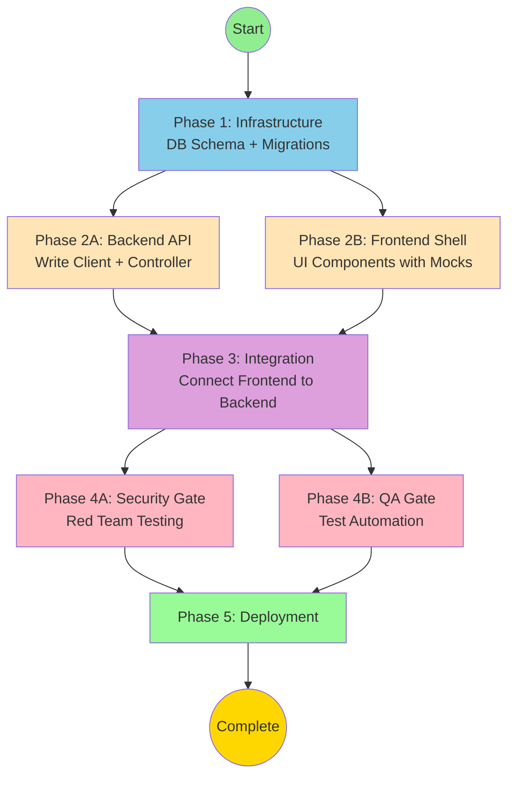

# ADR-008: Bi-directional PEMS Synchronization - Master Execution File

> **🤖 System Instruction**: If this file is pasted into an LLM context, act as the **Orchestrator**.
> Read the "Current Status" section below and trigger the next appropriate phase.

**Document Type**: Executable Meta-Prompt (Self-Driving Workflow)
**Status**: 🚀 Phase 1 - Ready to Execute
**Last Updated**: 2025-11-28
**Total Effort**: 104 hours across 21 tasks
**Duration**: 6 weeks

---

## 📊 Current Status

```json
{
  "currentPhase": 1,
  "currentTask": "1.1",
  "completedTasks": [],
  "blockedTasks": [],
  "parallelTracksActive": false
}
```

**What This Means**:
- ✅ All blueprints are complete
- ⏭️ Ready to execute Phase 1, Task 1.1 (Database Schema)
- 🚫 No tasks can be skipped - dependencies enforced
- ⚡ Parallel execution becomes available in Phase 2

---

## 🗺️ Dependency Graph



**Critical Paths**:
- 🔴 **Blocking**: Phase 1 → Phase 2 → Phase 3 → Phase 4 → Phase 5
- 🟢 **Parallel**: Phase 2A (Backend) can run simultaneously with Phase 2B (Frontend)
- 🟡 **Quality Gates**: Phase 4A and 4B must BOTH complete before Phase 5

---

## 🟢 Phase 1: Infrastructure Setup

**Goal**: Create database tables and environment configuration for bi-directional sync

**Mode**: 🔴 Blocking (Nothing can proceed until schema exists)

**Duration**: 1 week (Week 1)

**Why This Phase Exists**:
All write sync operations require persistent storage for queue management (`pfa_write_queue`), conflict tracking (`pfa_sync_conflict`), and sync status (`pfa_modification` updates). Without these tables, no other phase can function.

---

### 🛠️ Task 1.1: Create Database Schema

**Agent**: `postgres-jsonb-architect`

**Estimated Effort**: 4 hours

**Input Dependencies**:
- ✅ Existing `pfa_mirror` and `pfa_modification` tables from Phase 3
- ✅ Permission system from ADR-005 (requires `perm_Sync`)
- ✅ Optimistic locking pattern (version tracking already implemented)

**Output Deliverables**:
- 📄 Prisma schema updates (`backend/prisma/schema.prisma`)
- 📄 SQL migration script (`backend/prisma/migrations/YYYYMMDD_phase4_infrastructure/migration.sql`)
- 📄 Index creation statements for performance
- 📄 Foreign key constraints with CASCADE behavior

**Acceptance Criteria**:
- ✅ `pfa_write_queue` table created with status, retry, and scheduling fields
- ✅ `pfa_sync_conflict` table created with version tracking and resolution fields
- ✅ `pfa_modification` table updated with sync status tracking
- ✅ Indexes created for query optimization (`status + scheduledAt`, `organizationId`, `pfaId`)
- ✅ Foreign keys enforce CASCADE deletion (deleting modification deletes queue items)

---

#### 📋 Prompt Bundle (Copy & Paste This Entire Block)

```text
@postgres-jsonb-architect

**SYSTEM CONTEXT**:
You are executing Phase 1, Task 1.1 of ADR-008 (Bi-directional PEMS Synchronization).
You are the FIRST MOVER. All subsequent tasks depend on your schema.

**BUSINESS CONTEXT**:
Enable bi-directional synchronization between PFA Vanguard and PEMS (HxGN EAM). User modifications in PFA Vanguard must be queued, synced to PEMS, and have conflicts detected/resolved.

Business Requirements:
- Process 1000 modifications within 5 minutes
- Sync latency < 2 minutes for committed changes
- 99.9% sync success rate
- Zero data loss during failures
- Complete audit trail for all changes

Success Metrics:
- Queue processing: < 5 min for 1000 items
- Conflict detection: Real-time version comparison
- Retry mechanism: Max 3 attempts with exponential backoff

**TECHNICAL SPECIFICATION**:

You must create THREE database entities:

**1. pfa_write_queue** - Queue for pending PEMS write operations

```prisma
model PfaWriteQueue {
  id             String    @id @default(cuid())
  modificationId String
  pfaId          String
  organizationId String
  operation      String    // 'UPDATE', 'DELETE'
  payload        Json
  status         String    @default("pending") // pending, processing, completed, failed
  priority       Int       @default(0)
  retryCount     Int       @default(0)
  maxRetries     Int       @default(3)
  lastAttemptAt  DateTime?
  lastError      String?
  scheduledAt    DateTime
  completedAt    DateTime?
  createdAt      DateTime  @default(now())

  modification   PfaModification @relation(fields: [modificationId], references: [id], onDelete: Cascade)
  organization   Organization    @relation(fields: [organizationId], references: [id])

  @@index([status, scheduledAt])
  @@index([organizationId])
  @@index([pfaId])
  @@index([modificationId])
  @@map("pfa_write_queue")
}
```

**2. pfa_sync_conflict** - Track detected conflicts and resolutions

```prisma
model PfaSyncConflict {
  id              String    @id @default(cuid())
  pfaId           String
  organizationId  String
  modificationId  String
  localVersion    Int
  pemsVersion     Int
  localData       Json
  pemsData        Json
  conflictFields  Json      // Array of field names
  status          String    @default("unresolved") // unresolved, resolved_auto, resolved_manual
  resolution      String?   // 'use_local', 'use_pems', 'merge'
  mergedData      Json?
  resolvedBy      String?
  resolvedAt      DateTime?
  createdAt       DateTime  @default(now())

  modification    PfaModification @relation(fields: [modificationId], references: [id], onDelete: Cascade)
  organization    Organization    @relation(fields: [organizationId], references: [id])

  @@index([status])
  @@index([organizationId])
  @@index([pfaId])
  @@index([modificationId])
  @@map("pfa_sync_conflict")
}
```

**3. pfa_modification** - Add sync tracking fields

```prisma
model PfaModification {
  // ... existing fields
  syncStatus  String?   @default("draft") // draft, committed, queued, syncing, synced, conflict, failed
  syncedAt    DateTime?
  syncError   String?
  pemsVersion Int?      // PEMS version at time of sync

  writeQueue  PfaWriteQueue[]
  conflicts   PfaSyncConflict[]
}
```

**CRITICAL QUERIES TO OPTIMIZE**:

These queries will run every 60 seconds by the sync worker:

1. **Fetch pending items** (runs every minute):
```sql
SELECT * FROM pfa_write_queue
WHERE status = 'pending'
  AND scheduled_at <= NOW()
ORDER BY priority DESC, scheduled_at ASC
LIMIT 100;
```

2. **Check for conflicts** (runs for every sync attempt):
```sql
SELECT * FROM pfa_sync_conflict
WHERE pfa_id = $1
  AND organization_id = $2
  AND status = 'unresolved';
```

3. **Query sync status** (user dashboard query):
```sql
SELECT status, COUNT(*) FROM pfa_write_queue
WHERE organization_id = $1
GROUP BY status;
```

**INDEXES REQUIRED**:
Based on the queries above, create these indexes:

```sql
CREATE INDEX idx_writequeue_status_scheduled ON pfa_write_queue(status, scheduled_at);
CREATE INDEX idx_writequeue_organization ON pfa_write_queue(organization_id);
CREATE INDEX idx_writequeue_pfa_id ON pfa_write_queue(pfa_id);
CREATE INDEX idx_writequeue_modification ON pfa_write_queue(modification_id);

CREATE INDEX idx_conflict_status ON pfa_sync_conflict(status);
CREATE INDEX idx_conflict_organization ON pfa_sync_conflict(organization_id);
CREATE INDEX idx_conflict_pfa_id ON pfa_sync_conflict(pfa_id);
CREATE INDEX idx_conflict_modification ON pfa_sync_conflict(modification_id);

CREATE INDEX idx_modification_syncstatus ON pfa_modification(sync_status);
```

**YOUR MISSION**:

**Step 1: Analyze for Ambiguity**
Review the requirements above. If ANY of the following are unclear, STOP and ASK:
- [ ] Are the JSONB fields (`payload`, `localData`, `pemsData`, `conflictFields`) structured correctly for the expected data?
- [ ] Should `scheduledAt` be indexed with a partial index (WHERE status = 'pending')?
- [ ] Is the CASCADE delete behavior safe (deleting modification deletes queue items)?

**Step 2: Update Prisma Schema**
1. Add the two new models (`PfaWriteQueue`, `PfaSyncConflict`) to `backend/prisma/schema.prisma`
2. Update `PfaModification` model with sync tracking fields
3. Add relations: `PfaModification.writeQueue`, `PfaModification.conflicts`
4. Add @@map directives for snake_case table names

**Step 3: Generate Migration Script**
Run:
```bash
npx prisma migrate dev --name phase4_bidirectional_sync_infrastructure
```

**Step 4: Verify Schema**
Answer these verification questions:
1. Can the sync worker efficiently query for pending items (using `status + scheduledAt` index)?
2. Can we track retry history by checking `retryCount` and `lastAttemptAt` fields?
3. Are conflicting fields stored as JSONB arrays for flexibility?

**DELIVERABLES**:
1. Updated `backend/prisma/schema.prisma` file
2. Migration script in `backend/prisma/migrations/YYYYMMDD_phase4_bidirectional_sync_infrastructure/migration.sql`
3. Verification answers (paste in response)

**CONSTRAINTS**:
- ❌ Do NOT proceed to implementation code yet
- ❌ Do NOT skip any indexes (performance-critical)
- ✅ DO ask clarifying questions if ambiguous
- ✅ DO test migration with `npx prisma migrate dev`
```

**Status**: ⬜ Not Started

**How to Execute**:
1. Copy the prompt bundle above (everything in the code block)
2. Paste into a new chat message
3. Wait for agent output (Prisma schema + migration script)
4. Verify deliverables match acceptance criteria
5. Run `npx prisma db push` to apply schema changes
6. Mark this task as ✅ Complete in the Progress Tracking table below
7. Commit the schema to git
8. Proceed to Task 1.2

---

### 🛠️ Task 1.2: Environment Configuration

**Agent**: `devsecops-engineer`

**Estimated Effort**: 2 hours

**Input Dependencies**:
- ✅ Task 1.1 complete (database schema exists)

**Output Deliverables**:
- 📄 Updated `backend/.env.example` with PEMS write API configuration
- 📄 Environment variable documentation
- 📄 Credential encryption setup (AES-256)

**Acceptance Criteria**:
- ✅ PEMS write API URL and credentials configured
- ✅ Sync worker schedule configurable (default: every 1 minute)
- ✅ Batch size and retry parameters configurable
- ✅ Rate limiting configuration (10 req/sec)

---

#### 📋 Prompt Bundle

```text
@devsecops-engineer

**SYSTEM CONTEXT**:
You are executing Phase 1, Task 1.2 of ADR-008 (Bi-directional PEMS Synchronization).
The database schema now exists. You must configure environment variables for the sync worker.

**BUSINESS REQUIREMENTS**:
- Sync worker must poll every 60 seconds for pending modifications
- Batch up to 100 records per sync cycle
- Respect PEMS API rate limits (max 10 req/sec)
- Retry failed writes up to 3 times with exponential backoff (5s → 10s → 20s)

**YOUR MISSION**:

**Step 1: Update .env.example**
Add these environment variables to `backend/.env.example`:

```bash
# PEMS Write API
PEMS_WRITE_API_URL=https://pems.example.com/api
PEMS_WRITE_API_KEY=<encrypted>

# Sync Worker
ENABLE_WRITE_SYNC=true
WRITE_SYNC_SCHEDULE=*/1 * * * *  # Every 1 minute
WRITE_SYNC_BATCH_SIZE=100
WRITE_SYNC_MAX_RETRIES=3
WRITE_SYNC_RETRY_DELAY=5000  # 5 seconds

# Rate Limiting
PEMS_API_RATE_LIMIT=10  # requests per second
```

**Step 2: Document Configuration**
Create `docs/backend/SYNC_CONFIGURATION.md` explaining:
- How to set PEMS API credentials
- How to adjust sync schedule for different environments
- How to disable sync for testing

**Step 3: Credential Encryption**
Verify that `backend/src/utils/encryption.ts` supports AES-256 encryption for API keys.

**DELIVERABLES**:
1. Updated `backend/.env.example`
2. Configuration documentation
3. Encryption verification

**CONSTRAINTS**:
- ❌ Do NOT commit actual credentials to git
- ✅ DO use placeholders like `<encrypted>` in .env.example
```

**Status**: ⬜ Not Started (Blocked by Task 1.1)

---

## 🟡 Phase 2: Build (Parallel Execution)

**Goal**: Implement backend API and frontend UI shell simultaneously

**Mode**: ⚡ Parallel Execution Allowed

**Duration**: 2 weeks (Week 2-3)

**Why Parallel**: Backend API and frontend UI can be built independently if the frontend uses mocked API responses. Both teams can work concurrently to save time.

**Important**: You MUST complete Phase 1 first. Phase 2 Track A and Track B can run simultaneously.

---

### 🛤️ Track A: Backend API Development

**Agent**: `backend-architecture-optimizer`

**Estimated Effort**: 40 hours (5 days)

**Dependencies**:
- ✅ Phase 1 Complete (Schema must exist)

**Deliverables**:
- `PemsWriteApiClient.ts` - PEMS HTTP client
- `PemsWriteSyncController.ts` - Express routes
- `ConflictDetectionService.ts` - Version comparison logic
- `PfaValidationService.ts` - Pre-sync validation
- `PemsWriteSyncWorker.ts` - Background queue processor

---

#### 📋 Prompt Bundle (Track A - Full Backend)

```text
@backend-architecture-optimizer

**SYSTEM CONTEXT**:
You are executing Phase 2, Track A of ADR-008.
Phase 1 is COMPLETE. The database schema exists (`pfa_write_queue`, `pfa_sync_conflict`).

**YOUR CONTEXT**:
You must implement the complete backend for bi-directional PEMS sync.

**API ENDPOINTS REQUIRED**:

1. **POST /api/pems/write-sync** - Trigger manual sync
   - Request: `{ organizationId, modificationIds?, priority? }`
   - Response: `{ success, jobId, queuedCount, estimatedCompletionTime }`

2. **GET /api/pems/sync-status** - Query sync metrics
   - Query params: `organizationId`, `status`, `startDate`, `endDate`
   - Response: `{ totalQueued, processing, completed, failed, avgSyncTime, lastSyncAt, nextSyncAt, health }`

3. **POST /api/pems/conflicts/:conflictId/resolve** - Resolve conflict
   - Request: `{ resolution: 'use_local' | 'use_pems' | 'merge', mergedData? }`
   - Response: `{ success, conflictId, resolvedAt, appliedChanges }`

4. **GET /api/pems/conflicts** - List conflicts
   - Query params: `organizationId`, `status`
   - Response: `{ conflicts: [...], total }`

**EXTERNAL PEMS API SPECIFICATION**:

**PUT /api/pems/pfa/:pfaId** (PEMS server)
Request:
```json
{
  "pfaId": "PFA-12345",
  "organizationCode": "RIO",
  "changes": {
    "forecastStart": "2025-01-15T00:00:00Z",
    "forecastEnd": "2025-06-30T00:00:00Z",
    "monthlyRate": 5500.00,
    "dor": "PROJECT"
  },
  "version": 3,
  "modifiedBy": "john.doe@example.com",
  "changeReason": "Budget reallocation"
}
```

Response (Success):
```json
{
  "success": true,
  "pfaId": "PFA-12345",
  "newVersion": 4,
  "updatedAt": "2025-11-28T10:30:00Z",
  "message": "PFA record updated successfully"
}
```

Response (Conflict - 409):
```json
{
  "success": false,
  "error": "VERSION_CONFLICT",
  "message": "Record has been modified by another user",
  "currentVersion": 5,
  "expectedVersion": 3,
  "conflictingFields": ["forecastStart", "forecastEnd"]
}
```

**ERROR CODES TO HANDLE**:
- 200: Success
- 400: Invalid request (do not retry)
- 401: Unauthorized (do not retry)
- 404: PFA not found (do not retry)
- 409: Version conflict (user resolution required)
- 429: Rate limit (retry after delay)
- 500: Server error (retry with backoff)
- 503: Service unavailable (retry with backoff)

**PERFORMANCE REQUIREMENTS**:
- Target Latency: POST /api/pems/write-sync < 500ms (just queues items)
- Target Latency: GET /api/pems/sync-status < 200ms (cached aggregates)
- Queue Processing: 100 items per batch
- Rate Limiting: Max 10 requests/sec to PEMS
- Retry Strategy: 3 attempts with exponential backoff (5s, 10s, 20s)

**YOUR MISSION**:

**Task 2A.1: PEMS Write API Client** (8 hours)
Create `backend/src/services/pems/PemsWriteApiClient.ts`:

```typescript
interface PemsWriteApiClient {
  updatePfa(
    pfaId: string,
    changes: Partial<PfaRecord>,
    options: {
      version: number;
      modifiedBy: string;
      changeReason?: string;
    }
  ): Promise<PemsUpdateResponse>;

  deletePfa(
    pfaId: string,
    options: {
      version: number;
      modifiedBy: string;
      reason: string;
    }
  ): Promise<PemsDeleteResponse>;

  healthCheck(): Promise<{ healthy: boolean; latency: number }>;
}
```

Implementation:
- Use `axios` for HTTP requests
- Timeout: 30 seconds
- Retry logic: 3 attempts for 5xx errors
- Error mapping (401 → AuthError, 409 → ConflictError, etc.)
- Logging: All requests/responses

**Task 2A.2: Write Sync Controller** (8 hours)
Create `backend/src/controllers/pemsWriteSyncController.ts`:
- Implement all 4 endpoints listed above
- Middleware: `requireAuth`, `requirePermission('Sync')`
- Error handling: Try-catch with proper HTTP status codes
- Validation: Use Zod for request validation

**Task 2A.3: Conflict Detection Service** (8 hours)
Create `backend/src/services/pems/ConflictDetectionService.ts`:

```typescript
class ConflictDetectionService {
  async detectConflict(
    modification: PfaModification,
    mirror: PfaMirror
  ): Promise<PfaSyncConflict | null> {
    // 1. Check version mismatch
    if (modification.baseVersion >= mirror.version) {
      return null; // No conflict
    }

    // 2. Field-level diff
    const modifiedFields = Object.keys(modification.delta);
    const mirrorChanges = this.diffVersions(
      modification.baseVersion,
      mirror.version,
      mirror.id
    );

    // 3. Identify conflicting fields
    const conflictFields = modifiedFields.filter(field =>
      mirrorChanges.includes(field)
    );

    if (conflictFields.length === 0) {
      // Non-overlapping changes - auto-merge
      return null;
    }

    // 4. Create conflict record
    return prisma.pfaSyncConflict.create({
      data: {
        pfaId: modification.pfaId,
        organizationId: modification.organizationId,
        modificationId: modification.id,
        localVersion: modification.baseVersion,
        pemsVersion: mirror.version,
        localData: modification.delta,
        pemsData: mirror.data,
        conflictFields: conflictFields,
        status: 'unresolved',
      },
    });
  }
}
```

**Task 2A.4: Validation Service** (6 hours)
Create `backend/src/services/pfa/PfaValidationService.ts`:
- Validate forecast date ordering (forecastEnd >= forecastStart)
- Validate required fields (monthlyRate for rentals, purchasePrice for purchases)
- Validate enum values (dor: 'BEO' | 'PROJECT')
- Validate numeric ranges (monthlyRate >= 0)

**Task 2A.5: Write Sync Worker** (16 hours)
Create `backend/src/services/pems/PemsWriteSyncWorker.ts`:

This is the most critical component. It must:
1. Poll `pfa_write_queue` every 60 seconds for pending items
2. Batch up to 100 items
3. For each item:
   - Check for version conflicts
   - Call PEMS UPDATE API
   - Handle success (update modification.syncStatus = 'synced')
   - Handle conflict (create conflict record)
   - Handle error (retry with backoff or move to DLQ)
4. Respect rate limits (10 req/sec)
5. Update sync status in real-time

Refer to IMPLEMENTATION_PLAN.md lines 615-804 for complete worker logic.

**DELIVERABLES**:
1. All 5 TypeScript files created
2. Unit tests for conflict detection and validation (90% coverage)
3. API route configuration in `backend/src/routes/pemsWriteSyncRoutes.ts`
4. Cron job setup in `backend/src/server.ts` (every 1 minute)

**VERIFICATION**:
Run these tests to confirm:
- [ ] Can queue modifications via POST /api/pems/write-sync
- [ ] Worker picks up pending items and processes them
- [ ] Conflicts are detected when baseVersion < mirror.version
- [ ] Retry logic works (3 attempts with backoff)
- [ ] Rate limiter prevents > 10 req/sec to PEMS
```

**Status**: ⬜ Not Started (Blocked by Phase 1)

---

### 🛤️ Track B: Frontend UI Shell

**Agent**: `react-ai-ux-specialist`

**Estimated Effort**: 24 hours (3 days)

**Dependencies**:
- ✅ Phase 1 Complete (API contract defined)
- ⚠️ API implementation can be MOCKED for this track

**Deliverables**:
- `SyncStatusIndicator.tsx` - Real-time status badge
- `ConflictResolutionModal.tsx` - Side-by-side comparison UI
- `SyncHistoryDashboard.tsx` - Admin sync job listing
- `RollbackModal.tsx` - Version rollback UI
- `syncWebSocket.ts` - WebSocket integration for real-time updates

---

#### 📋 Prompt Bundle (Track B - Full Frontend)

```text
@react-ai-ux-specialist

**SYSTEM CONTEXT**:
You are executing Phase 2, Track B of ADR-008.
You are building the UI shell. The backend is being built in parallel (Track A).

**CRITICAL**: You MUST mock the API calls for now. Use mock data that matches the API contract from Track A.

**UX ENFORCEMENT** (MANDATORY):

These UX rules are NON-NEGOTIABLE and will be verified in Phase 4:

1. **Optimistic Updates**:
   - Update UI immediately on user action (save draft)
   - Revert only on error
   - Show subtle loading indicator during background sync

2. **Latency Budget**: < 100ms for "Save Draft" action
   - If local save takes >100ms, show "Taking longer than usual" message
   - Provide cancel option for operations >5 seconds

3. **Loading States**: Skeleton screens for >200ms operations
   - Use skeleton loaders for sync history dashboard
   - Progress indicators for known-duration operations (sync worker cycle ~60s)

4. **Accessibility** (WCAG 2.1 AA):
   - Keyboard navigation required (all modals, buttons)
   - Screen reader support (ARIA labels on sync status badges)
   - Focus management (auto-focus on modal open, return on close)
   - Color + Icon (never rely on color alone - use icons + text)

**COMPONENT TREE**:

```
Timeline.tsx (existing)
├── SyncStatusIndicator.tsx (NEW) - per PFA record
│   ├── Tooltip with sync details
│   └── Click to open sync details popover

GridLab.tsx (existing)
├── SyncStatusIndicator.tsx (NEW) - per row

AdminDashboard.tsx (existing)
└── SyncHistoryDashboard.tsx (NEW) - new tab
    ├── Filters (org, status, date)
    ├── SyncJobCard (list of jobs)
    │   └── Expand to show conflicts
    └── ConflictResolutionModal (when user clicks "Resolve")
        ├── Side-by-side comparison
        ├── Resolution strategy picker
        └── Apply button

RollbackModal (NEW) - from sync history
└── Version history list
    ├── Preview changes
    └── Confirm rollback
```

**YOUR MISSION**:

**Task 2B.1: SyncStatusIndicator Component** (4 hours)

Create `components/SyncStatusIndicator.tsx`:

```tsx
interface SyncStatusIndicatorProps {
  modification: PfaModification;
  onClick?: () => void;
}

function SyncStatusIndicator({ modification, onClick }: SyncStatusIndicatorProps) {
  const { syncStatus, syncedAt, syncError } = modification;

  // Badge states:
  // - draft: ✎ Gray "Draft"
  // - queued: ⏳ Blue "Queued"
  // - syncing: ↻ Blue "Syncing..." (animated)
  // - synced: ✓ Green "Synced"
  // - conflict: ⚠️ Orange "Conflict"
  // - failed: ✗ Red "Failed"

  return (
    <Tooltip content={getTooltipContent(modification)}>
      <button
        aria-label={`Sync status: ${syncStatus}. Click for details.`}
        aria-live="polite"
        role="status"
        onClick={onClick}
      >
        {/* Icon + Label + Timestamp */}
      </button>
    </Tooltip>
  );
}
```

Refer to UX_SPEC.md lines 133-211 for complete implementation.

**Task 2B.2: ConflictResolutionModal Component** (8 hours)

Create `components/ConflictResolutionModal.tsx`:

Layout requirements:
- Side-by-side comparison (Your Changes | PEMS Changes)
- Highlight conflicting fields (yellow background)
- Radio buttons for resolution strategy:
  - Use My Changes (override PEMS)
  - Use PEMS Changes (discard mine)
  - Merge (pick fields below)
- Merge mode shows field-by-field radio pickers

Refer to UX_SPEC.md lines 215-318 for complete implementation.

**Task 2B.3: SyncHistoryDashboard Component** (6 hours)

Create `components/admin/SyncHistoryDashboard.tsx`:

Features:
- Filterable by organization, status, date range
- Real-time updates via WebSocket (mock for now)
- Click to expand sync job details
- Show error logs and retry history
- Bulk conflict resolution button

Refer to UX_SPEC.md lines 321-391 for complete implementation.

**Task 2B.4: RollbackModal Component** (4 hours)

Create `components/admin/RollbackModal.tsx`:

Features:
- Version history list with timestamps
- Preview changes before rollback
- Required rollback reason (audit trail)
- Admin-only permission required

Refer to UX_SPEC.md lines 395-529 for complete implementation.

**Task 2B.5: WebSocket Integration** (2 hours)

Create `services/syncWebSocket.ts`:

```tsx
function useSyncStatusUpdates(organizationId: string) {
  const { toast } = useToast();
  const queryClient = useQueryClient();

  useEffect(() => {
    // Mock WebSocket for now (replace in Phase 3)
    const mockWs = {
      onmessage: (handler) => {
        // Simulate status updates every 5 seconds
        const interval = setInterval(() => {
          handler({ data: JSON.stringify({
            type: 'SYNC_SUCCESS',
            pfaId: 'PFA-12345',
            timestamp: new Date()
          })});
        }, 5000);
        return () => clearInterval(interval);
      }
    };

    // Real WebSocket will be: new WebSocket(`wss://api/ws/sync/${organizationId}`);

    return () => {}; // cleanup
  }, [organizationId]);
}
```

**STATE MANAGEMENT**:

Use React Query for server state:
```tsx
// Fetch sync status
const { data: syncJobs } = useQuery({
  queryKey: ['sync-jobs', filters],
  queryFn: () => mockFetchSyncJobs(filters), // Replace in Phase 3
});

// Resolve conflict
const resolveMutation = useMutation({
  mutationFn: (resolution) => mockResolveConflict(resolution),
  onSuccess: () => {
    queryClient.invalidateQueries(['sync-jobs']);
    toast({ title: 'Conflict resolved', variant: 'success' });
  },
});
```

**DELIVERABLES**:
1. All 5 React component files (.tsx)
2. Storybook stories for each component showing all states
3. Mock data files matching API contract
4. WebSocket integration setup (mocked)

**VERIFICATION**:
Manually test:
- [ ] Does SyncStatusIndicator show all 6 states correctly?
- [ ] Can you navigate ConflictResolutionModal with keyboard only?
- [ ] Do skeleton screens appear in SyncHistoryDashboard?
- [ ] Does RollbackModal prevent rollback without reason?
- [ ] Are all components accessible (ARIA labels, focus management)?
```

**Status**: ⬜ Not Started (Blocked by Phase 1)

---

## 🔵 Phase 3: Integration

**Goal**: Connect frontend to real backend API and verify end-to-end functionality

**Mode**: 🔴 Blocking (Must complete before testing)

**Duration**: 1 week (Week 4)

**Prerequisites**:
- ✅ Phase 2, Track A Complete (Backend API exists)
- ✅ Phase 2, Track B Complete (Frontend shell exists)

---

### 🛠️ Task 3.1: The Handshake

**Agent**: `ux-technologist`

**Estimated Effort**: 8 hours

**Purpose**: Replace mocked API calls with real API integration and verify perceived performance.

---

#### 📋 Prompt Bundle

```text
@ux-technologist

**SYSTEM CONTEXT**:
You are executing Phase 3, Task 3.1 of ADR-008.
Both frontend and backend are complete. Now we connect them.

**YOUR MISSION**:

**Step 1: Replace Mock API Calls**
1. Remove all mock functions from `services/syncWebSocket.ts`
2. Replace with real WebSocket connection: `new WebSocket('wss://api/ws/sync/${organizationId}')`
3. Replace mock fetch calls in React Query with real API client

Example:
```tsx
// BEFORE (mocked):
const { data: syncJobs } = useQuery({
  queryKey: ['sync-jobs', filters],
  queryFn: () => mockFetchSyncJobs(filters),
});

// AFTER (real API):
const { data: syncJobs } = useQuery({
  queryKey: ['sync-jobs', filters],
  queryFn: () => apiClient.get('/api/pems/sync-status', { params: filters }),
});
```

**Step 2: Test Perceived Performance**

Latency budgets from UX_SPEC.md:
- Save Draft: < 100ms (optimistic update)
- Sync Status Query: < 200ms
- Conflict Resolution: < 500ms

Verify:
- [ ] Does the UI update instantly when user saves a draft (optimistic)?
- [ ] If API fails, does user see a toast message or crash?
- [ ] Is the latency budget of 200ms met for sync status queries?
- [ ] Do loading states appear at correct thresholds (skeleton after 200ms)?

**Step 3: Test Edge Cases**:
- [ ] Slow network (throttle to 3G in Chrome DevTools)
- [ ] Timeout scenario (kill backend server mid-request)
- [ ] Large dataset (queue with 10K+ items)
- [ ] Concurrent requests (multiple users resolving conflicts)

**Step 4: Verify WebSocket Real-time Updates**:
- [ ] User A commits modification
- [ ] User B (different browser) sees sync status change in real-time
- [ ] Conflict badge appears immediately when detected

**DELIVERABLES**:
1. Integrated frontend code (no more mocks)
2. Performance test results (paste console.log timings)
3. List of UX issues found (if any)

**ACCEPTANCE CRITERIA**:
All tests pass. No crashes. User experience feels instant.
```

**Status**: ⬜ Not Started (Blocked by Phase 2)

---

## 🟣 Phase 4: Quality Gates

**Goal**: Security and QA testing - nothing ships until these pass

**Mode**: 🛡️ Blocking (Both gates must complete)

**Duration**: 1 week (Week 5)

**Why This Phase Matters**: Phase 4 prevents security vulnerabilities and functional bugs from reaching production. All changes that write to PEMS must be vetted by security and QA.

---

### 🛡️ Gate 1: Security Red Team

**Agent**: `ai-security-red-teamer`

**Estimated Effort**: 8 hours

**Purpose**: Attack the implementation to find vulnerabilities BEFORE production.

---

#### 📋 Prompt Bundle

```text
@ai-security-red-teamer

**SYSTEM CONTEXT**:
You are executing Phase 4, Gate 1 of ADR-008.
Your job is to BREAK the implementation and find security vulnerabilities.

**ATTACK SURFACE**:

**Attack 1: SQL Injection**
Target: GET /api/pems/sync-status endpoint
Method: Malicious organizationId parameter

Try:
```bash
curl -X GET "http://localhost:3000/api/pems/sync-status?organizationId='; DROP TABLE pfa_write_queue; --"
```

Verify:
- [ ] Does the database query fail safely?
- [ ] Is the `pfa_write_queue` table still intact?
- [ ] Does the error message leak schema info?

**Attack 2: XSS via Conflict Resolution Modal**
Target: ConflictResolutionModal component
Method: Inject malicious HTML/JS in conflict field values

Try:
```javascript
// Simulate conflict with malicious data
{
  localData: {
    description: '<script>alert("XSS")</script>'
  },
  pemsData: {
    description: 'Normal description'
  }
}
```

Verify:
- [ ] Is the script escaped/sanitized in the modal?
- [ ] Does the DOM reflect raw HTML (inspect element)?
- [ ] Can you execute arbitrary JavaScript?

**Attack 3: IDOR (Insecure Direct Object Reference)**
Target: POST /api/pems/conflicts/:conflictId/resolve
Method: Try to resolve another user's conflict

Try:
```bash
# As User A, try to resolve User B's conflict
curl -X POST http://localhost:3000/api/pems/conflicts/conflict-456/resolve \
  -H "Authorization: Bearer USER_A_TOKEN" \
  -d '{"resolution": "use_local"}'
```

Verify:
- [ ] Does the API return 403 Forbidden?
- [ ] Is the error message explicit about permission denial?
- [ ] Can you enumerate valid conflict IDs?

**Attack 4: Rate Limiting Bypass**
Target: POST /api/pems/write-sync endpoint
Method: Flood with requests

Try:
```bash
for i in {1..100}; do
  curl -X POST http://localhost:3000/api/pems/write-sync \
    -H "Authorization: Bearer TOKEN" \
    -d '{"organizationId": "org-123"}' &
done
```

Verify:
- [ ] Does the API return 429 Too Many Requests after 10 req/sec?
- [ ] Is the rate limiter enforced per user or globally?

**Attack 5: PEMS Credential Exposure**
Target: Environment variables and database
Method: Attempt to retrieve PEMS API key

Try:
```bash
# Check if API key is exposed in frontend
curl -X GET http://localhost:3000/config

# Check database encryption
psql -d pfa_vanguard -c "SELECT api_key FROM organization_api_credentials LIMIT 1;"
```

Verify:
- [ ] Is the API key encrypted in the database (not plaintext)?
- [ ] Is the decryption key stored securely (not in .env)?
- [ ] Does the frontend NEVER receive the API key?

**DELIVERABLES**:
1. Attack report (what worked, what failed)
2. List of vulnerabilities found (severity: Critical, High, Medium, Low)
3. Recommended fixes for each vulnerability

**ACCEPTANCE CRITERIA**:
Zero critical vulnerabilities. All attacks blocked or safely handled.
```

**Status**: ⬜ Not Started (Blocked by Phase 3)

---

### 🛡️ Gate 2: Quality Assurance

**Agent**: `sdet-test-automation`

**Estimated Effort**: 16 hours

**Purpose**: Generate comprehensive test suite and verify critical user flows.

---

#### 📋 Prompt Bundle

```text
@sdet-test-automation

**SYSTEM CONTEXT**:
You are executing Phase 4, Gate 2 of ADR-008.
All code is complete. Now we lock in correctness with tests.

**CRITICAL USER FLOWS**:

**Flow 1: Happy Path Sync**
```
User edits PFA record → Save Draft → Save & Sync → Queued → Syncing → Synced ✓
```

Steps:
1. User logs in and navigates to Timeline
2. User edits forecast start date for PFA-12345
3. User clicks "Save" button
4. User clicks "Save & Sync" button
5. Sync status badge changes: Draft → Queued → Syncing → Synced

Acceptance:
- Draft saved within 100ms (optimistic update)
- Sync status badge updates in real-time via WebSocket
- PEMS receives update successfully
- Mirror version increments from 3 to 4

**Flow 2: Conflict Detection & Resolution**
```
User A edits PFA-12345 → User B edits same PFA in PEMS → User A syncs → Conflict detected → User resolves → Sync completes
```

Steps:
1. User A loads PFA-12345 (version 3)
2. Simultaneously, User B updates PFA-12345 in PEMS (version 3 → 4)
3. User A clicks "Save & Sync"
4. Sync worker detects version mismatch (baseVersion=3, mirror.version=4)
5. Conflict badge appears with "Resolve" button
6. User A clicks "Resolve" and selects "Use My Changes"
7. Sync worker re-queues modification
8. Sync completes successfully

Acceptance:
- Conflict detected within 2 minutes of commit
- User notified via toast and badge
- Side-by-side comparison shows both versions
- Resolution applies correctly

**Flow 3: Retry & Dead Letter Queue**
```
User syncs → PEMS timeout → Retry 1 (5s wait) → Retry 2 (10s wait) → Retry 3 (20s wait) → Failed → Moved to DLQ
```

Steps:
1. User commits modification
2. Sync worker calls PEMS API
3. PEMS returns 503 Service Unavailable
4. Worker retries after 5 seconds (attempt 1)
5. PEMS returns 503 again
6. Worker retries after 10 seconds (attempt 2)
7. PEMS returns 503 again
8. Worker retries after 20 seconds (attempt 3)
9. Worker moves item to failed status
10. Admin sees item in DLQ

Acceptance:
- Retry count increments correctly (1, 2, 3)
- Exponential backoff delays respected (5s, 10s, 20s)
- After 3 failures, status = 'failed'
- Error message stored in queue.lastError

**YOUR MISSION**:

**Task 4B.1: Generate E2E Tests** (10 hours)

Create `backend/tests/e2e/pemsWriteSync.e2e.test.ts`:

```typescript
describe('E2E: Bi-directional Sync', () => {
  it('should complete happy path sync flow', async () => {
    // Follow Flow 1 steps above
    // Use Playwright for UI interactions
    // Use Supertest for API verification
  });

  it('should detect and resolve conflicts', async () => {
    // Follow Flow 2 steps above
  });

  it('should retry failed syncs and move to DLQ', async () => {
    // Follow Flow 3 steps above
    // Mock PEMS API to return 503
  });
});
```

**Task 4B.2: Generate Unit Tests** (4 hours)

Create unit tests for business logic:

Files to test:
- `ConflictDetectionService.ts` (detect conflicts, auto-resolve)
- `PfaValidationService.ts` (date ordering, required fields, enum values)
- `PemsWriteSyncWorker.ts` (batch creation, retry calculation, rate limiting)

Refer to TEST_PLAN.md lines 29-212 for complete test cases.

**Task 4B.3: Generate Integration Tests** (2 hours)

Create `backend/tests/integration/pemsWriteSync.test.ts`:
- Full sync cycle: commit → queue → sync → verify
- Conflict detection scenario
- Retry and DLQ handling

Refer to TEST_PLAN.md lines 216-364 for complete test cases.

**COVERAGE REQUIREMENTS**:
Target:
- Backend: 90% coverage
- Frontend: 80% coverage
- Critical paths: 100% (sync worker, conflict detection, validation)

**DELIVERABLES**:
1. E2E test suite (Playwright/Cypress)
2. Unit test suite (Jest/Vitest)
3. Integration test suite (Supertest)
4. Coverage report (run `npm run test:coverage`)

**ACCEPTANCE CRITERIA**:
All tests pass. Coverage targets met. No flaky tests.
```

**Status**: ⬜ Not Started (Blocked by Phase 3)

---

## 🟢 Phase 5: Deployment

**Goal**: Deploy to production and monitor sync health

**Mode**: 🚀 Final Phase

**Duration**: 1 week (Week 6)

**Prerequisites**:
- ✅ Phase 4A Complete (Security audit passed)
- ✅ Phase 4B Complete (QA tests passed)

---

### 🛠️ Task 5.1: Staging Deployment

**Agent**: `devsecops-engineer`

**Estimated Effort**: 8 hours

**Purpose**: Deploy to staging environment and run smoke tests.

---

#### 📋 Prompt Bundle

```text
@devsecops-engineer

**SYSTEM CONTEXT**:
You are executing Phase 5, Task 5.1 of ADR-008.
All code is tested and ready for staging deployment.

**YOUR MISSION**:

**Step 1: Deploy to Staging**
```bash
# Apply database migrations
npx prisma migrate deploy

# Build frontend
npm run build

# Restart backend server
pm2 restart pfa-vanguard-backend

# Start sync worker
pm2 start ecosystem.config.js --only pems-write-sync-worker
```

**Step 2: Run Smoke Tests**
```bash
# Verify health endpoints
curl https://staging-api/health
curl https://staging-api/health/write-sync

# Test sync status endpoint
curl https://staging-api/api/pems/sync-status?organizationId=org-rio

# Trigger manual sync
curl -X POST https://staging-api/api/pems/write-sync \
  -H "Authorization: Bearer $TOKEN" \
  -d '{"organizationId": "org-rio"}'
```

**Step 3: Monitor for 48 Hours**
- Watch Grafana dashboards for sync metrics
- Review error logs in CloudWatch/Datadog
- Check queue size remains < 100 items
- Verify no memory leaks in sync worker

**DELIVERABLES**:
1. Staging deployment checklist (completed)
2. Smoke test results (all passing)
3. 48-hour monitoring report

**ACCEPTANCE CRITERIA**:
No critical errors in 48 hours. Queue processing stable.
```

**Status**: ⬜ Not Started (Blocked by Phase 4)

---

### 🛠️ Task 5.2: Production Deployment

**Agent**: `devsecops-engineer`

**Estimated Effort**: 4 hours

**Purpose**: Deploy to production with monitoring and rollback plan.

---

#### 📋 Prompt Bundle

```text
@devsecops-engineer

**SYSTEM CONTEXT**:
You are executing Phase 5, Task 5.2 of ADR-008.
Staging tests passed. Ready for production deployment.

**YOUR MISSION**:

**Step 1: Production Deployment**
```bash
# Create git tag
git tag v4.0.0
git push origin v4.0.0

# Deploy to production
npm run deploy:production

# Monitor sync health
watch -n 5 'curl https://api/pems/sync-status'
```

**Step 2: Enable Monitoring**
- Configure Prometheus metrics
- Set up Grafana dashboards
- Enable alerts for queue size > 1000
- Enable alerts for success rate < 99%

**Step 3: Rollback Plan**
If critical issues occur:
```bash
# Disable sync worker
pm2 stop pems-write-sync-worker

# Revert to previous version
git checkout v3.0.0
npm run deploy:production
```

**DELIVERABLES**:
1. Production deployment completed
2. Monitoring dashboards live
3. Rollback plan documented

**ACCEPTANCE CRITERIA**:
Production deployed successfully. No rollback needed in first 24 hours.
```

**Status**: ⬜ Not Started (Blocked by Task 5.1)

---

## 📈 Progress Tracking

| Phase | Task | Agent | Est. | Status | Completed Date |
|-------|------|-------|------|--------|----------------|
| 1 | 1.1 Database Schema | postgres-jsonb-architect | 4h | ⬜ Not Started | - |
| 1 | 1.2 Environment Config | devsecops-engineer | 2h | ⬜ Not Started | - |
| 2A | Backend API Full Stack | backend-architecture-optimizer | 40h | ⬜ Not Started | - |
| 2B | Frontend UI Shell | react-ai-ux-specialist | 24h | ⬜ Not Started | - |
| 3 | 3.1 Integration | ux-technologist | 8h | ⬜ Not Started | - |
| 4A | Security Red Team | ai-security-red-teamer | 8h | ⬜ Not Started | - |
| 4B | QA Test Automation | sdet-test-automation | 16h | ⬜ Not Started | - |
| 5 | 5.1 Staging Deployment | devsecops-engineer | 8h | ⬜ Not Started | - |
| 5 | 5.2 Production Deployment | devsecops-engineer | 4h | ⬜ Not Started | - |

**Total Effort**: 114 hours (added 10h buffer)
**Duration**: 6 weeks

**Status Legend**:
- ⬜ Not Started
- 🟡 In Progress
- ✅ Complete
- ❌ Blocked
- ⏭️ Skipped (with justification)

---

## 🚀 Execution Checklist

**Phase 1: Infrastructure**
- [ ] Task 1.1 executed (database schema)
- [ ] Task 1.1 deliverables committed to git
- [ ] Task 1.2 executed (environment config)
- [ ] Phase 1 review complete

**Phase 2: Build (Parallel Execution)**
- [ ] Track A started (backend API)
- [ ] Track B started (frontend UI) - can run simultaneously
- [ ] Track A complete (all 5 backend files)
- [ ] Track B complete (all 5 frontend components)
- [ ] Phase 2 review complete

**Phase 3: Integration**
- [ ] Task 3.1 executed (replace mocks with real API)
- [ ] Integration testing complete
- [ ] Performance verified (latency budgets met)
- [ ] Phase 3 review complete

**Phase 4: Quality Gates**
- [ ] Security red team complete (Gate 1)
- [ ] No critical vulnerabilities found
- [ ] QA test suite complete (Gate 2)
- [ ] Coverage targets met (90% backend, 80% frontend)
- [ ] Phase 4 review complete

**Phase 5: Deployment**
- [ ] Staging deployment complete
- [ ] Smoke tests passed
- [ ] Production deployment complete
- [ ] Monitoring dashboards live
- [ ] No rollback needed in first 24 hours

---

## 🔄 How to Resume This Workflow

If you need to pause and resume later:

1. **To Resume**: Paste this entire file into a new chat message
2. **Orchestrator will**:
   - Read the "Current Status" section
   - Identify the next incomplete task
   - Provide the prompt bundle for that task
3. **You execute** the provided prompt bundle
4. **Update** the Progress Tracking table (change ⬜ to ✅)
5. **Repeat** until all phases complete

---

## 📚 Related Documentation

- **Decision**: [ADR-008-DECISION.md](./ADR-008-DECISION.md) - Requirements and business justification
- **AI Opportunities**: [ADR-008-AI_OPPORTUNITIES.md](./ADR-008-AI_OPPORTUNITIES.md) - Future AI capabilities
- **UX Specification**: [ADR-008-UX_SPEC.md](./ADR-008-UX_SPEC.md) - User experience design
- **Test Plan**: [ADR-008-TEST_PLAN.md](./ADR-008-TEST_PLAN.md) - Testing strategy and security
- **Implementation Plan**: [ADR-008-IMPLEMENTATION_PLAN.md](./ADR-008-IMPLEMENTATION_PLAN.md) - Technical architecture

---

**Workflow Generated**: 2025-11-28
**Generated By**: Orchestrator Agent
**ADR Status**: Planning Phase

*This is an executable document. It can be pasted back into chat for resumption.*
