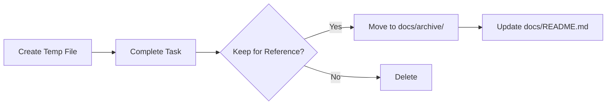

# PFA Vanguard Documentation Standards

## 1. Overview & Core Principles

This document defines how we create, structure, and maintain all project documentation for PFA Vanguard. It ensures documentation is consistent, easy to find, and always up-to-date.

### Core Principles

1. **Single Source of Truth (SSOT):** Consolidate all information into well-defined documents. No scattered information.
2. **Living Documents:** Documentation must be updated in real-time as requirements, architecture, and code evolve.
3. **No Documentation Sprawl:** Never create new top-level `docs/` documents. Use organized subfolders: `backend/`, `frontend/`, `adrs/`, `implementation/`, `user/`.
4. **Documentation-First Workflow:** For architectural changes, update documentation before implementing code.
5. **CLAUDE.md as Primary Reference:** The root `CLAUDE.md` file serves as the comprehensive project guide for AI assistants and developers.

### Relationship with CODING_STANDARDS.md

| Documentation Standards | Coding Standards |
|------------------------|------------------|
| Where to put files | How to write code |
| How to organize documentation | How to format code |
| What documentation to maintain | Naming conventions in code |
| File structure for docs | Code structure and patterns |
| When to update documentation | TypeScript/React best practices |

---

## 2. Project Structure & Documentation Files

### Folder Structure

```
PFA2.2/
├── CLAUDE.md                          # 🌟 Primary project guide for AI assistants
│
├── docs/                              # All project documentation
│   ├── README.md                      # 📖 Documentation catalog (v2.0)
│   ├── ARCHITECTURE.md                # Living technical design
│   ├── ARCHITECTURE_CHANGELOG.md      # Change history
│   ├── CODING_STANDARDS.md            # Code style guide
│   ├── DOCUMENTATION_STANDARDS.md     # This document
│   ├── DEVELOPMENT_LOG.md             # Development tracking
│   ├── TESTING_LOG.md                 # Testing tracking
│   │
│   ├── backend/                       # 🔧 Backend-specific documentation
│   │   ├── README.md                  # Backend doc index
│   │   ├── API_REFERENCE.md           # REST API endpoints
│   │   ├── MIGRATION-GUIDE-POSTGRESQL.md  # Database migration
│   │   ├── DATABASE_MONITORING.md     # Performance monitoring
│   │   └── SECRETS_MANAGEMENT.md      # Production secrets
│   │
│   ├── frontend/                      # 🎨 Frontend-specific documentation
│   │   ├── README.md                  # Frontend doc index
│   │   ├── COMPONENTS.md              # Component catalog (planned)
│   │   ├── STATE_MANAGEMENT.md        # Sandbox pattern (planned)
│   │   └── HOOKS.md                   # Custom hooks (planned)
│   │
│   ├── adrs/                          # 📐 Architecture Decision Records
│   │   ├── README.md                  # ADR index and process
│   │   ├── ADR-004-database-architecture-hybrid/
│   │   │   ├── ADR-004-DECISION.md            # Decision record (what & why)
│   │   │   ├── ADR-004-IMPLEMENTATION_PLAN.md # Implementation steps
│   │   │   ├── ADR-004-AGENT_WORKFLOW.md      # Agent orchestration
│   │   │   └── ADR-004-TECHNICAL_DOCS.md      # What was implemented
│   │   ├── ADR-005-multi-tenant-access-control/
│   │   │   ├── ADR-005-DECISION.md            # Decision record (what & why)
│   │   │   ├── ADR-005-IMPLEMENTATION_PLAN.md # Implementation steps
│   │   │   ├── ADR-005-AGENT_WORKFLOW.md      # Agent orchestration
│   │   │   └── ADR-005-TECHNICAL_DOCS.md      # What was implemented
│   │   └── template/                  # ADR template folder
│   │       ├── ADR-NNN-DECISION.md            # Template for decision
│   │       ├── ADR-NNN-IMPLEMENTATION_PLAN.md # Template for implementation
│   │       ├── ADR-NNN-AGENT_WORKFLOW.md      # Template for workflow
│   │       └── ADR-NNN-TECHNICAL_DOCS.md      # Template for tech docs
│   │
│   ├── implementation/                # 🛠️ Implementation plans
│   │   ├── README.md                  # Implementation plan index
│   │   ├── IMPLEMENTATION-PLAN-MIRROR-DELTA.md
│   │   └── PRODUCTION_DEPLOYMENT_OPTIONS.md
│   │
│   ├── user/                          # 👥 End-user documentation
│   │   ├── README.md                  # User doc index
│   │   ├── USER_GUIDE.md              # End-user instructions (planned)
│   │   ├── TROUBLESHOOTING_GUIDE.md   # Common issues (planned)
│   │   └── ADMIN_GUIDE.md             # Administrator manual (planned)
│   │
│   └── archive/                       # 📦 Historical documentation
│       └── 2025-11/                   # Monthly archives
│           ├── README.md
│           └── [archived files]
│
├── backend/                           # Express.js backend
│   ├── prisma/
│   │   ├── schema.prisma              # Database schema (SSOT)
│   │   ├── migrations/                # Database migrations
│   │   └── seed.ts                    # Seed data
│   ├── src/
│   │   ├── controllers/               # Route controllers
│   │   ├── services/                  # Business logic
│   │   ├── routes/                    # API routes
│   │   └── middleware/                # Express middleware
│   ├── scripts/                       # Utility scripts
│   │   ├── db/                        # Database utilities
│   │   └── sync/                      # Sync utilities
│   └── README.md                      # Backend setup guide
│
├── components/                        # React UI components
│   ├── admin/                         # Admin dashboard components
│   └── [component files]
│
├── contexts/                          # React contexts
├── services/                          # Frontend API clients
├── utils.ts                           # Business logic utilities
├── types.ts                           # Shared TypeScript types
└── mockData.ts                        # Static data for development
```

### Documentation Files

| Document | Purpose | When Created | Update Frequency |
|----------|---------|--------------|------------------|
| **Root Level** |||
| `CLAUDE.md` | Primary project guide | Day 1 | Weekly or after major changes |
| **Core Documentation** |||
| `docs/README.md` | Documentation catalog (v2.0) | Day 1 | When docs added/removed |
| `docs/ARCHITECTURE.md` | Living technical design | Day 1 | Updated continuously |
| `docs/ARCHITECTURE_CHANGELOG.md` | Change history | Day 1 | Updated with architectural changes |
| `docs/CODING_STANDARDS.md` | Code style guide | Day 1 | Rarely (major standards changes) |
| `docs/DOCUMENTATION_STANDARDS.md` | Documentation guide | Day 1 | Rarely (process improvements) |
| `docs/DEVELOPMENT_LOG.md` | Development tracking | Day 1 | Daily during active development |
| `docs/TESTING_LOG.md` | Testing tracking | Day 1 | Updated with test execution |
| **Backend Documentation** |||
| `docs/backend/README.md` | Backend doc index | Day 1 | When backend docs added/removed |
| `docs/backend/API_REFERENCE.md` | Backend API endpoints | Day 1 | When endpoints added/modified |
| `docs/backend/SECRETS_MANAGEMENT.md` | Production secrets | Pre-production | Updated with security changes |
| `docs/backend/MIGRATION-GUIDE-POSTGRESQL.md` | Database migration | As needed | Updated with migrations |
| `docs/backend/DATABASE_MONITORING.md` | Performance monitoring | Production | Updated with monitoring changes |
| **Frontend Documentation** |||
| `docs/frontend/README.md` | Frontend doc index | Day 1 | When frontend docs added/removed |
| `docs/frontend/COMPONENTS.md` | React component guide | Day 1 | When components added/modified |
| `docs/frontend/STATE_MANAGEMENT.md` | Sandbox pattern deep dive | Sprint 7 | When state management changes |
| `docs/frontend/HOOKS.md` | Custom hooks reference | As needed | When hooks added/modified |
| **Architecture Decisions** |||
| `docs/adrs/README.md` | ADR index and process | Day 1 | When ADRs added |
| `docs/adrs/*.md` | Architecture decisions | As decisions made | Immutable once accepted |
| **Implementation Plans** |||
| `docs/implementation/README.md` | Implementation plan index | Day 1 | When plans added/removed |
| `docs/implementation/*.md` | Feature implementation plans | As needed | Updated during implementation |
| **User Documentation** |||
| `docs/user/README.md` | User doc index | Day 1 | When user docs added/removed |
| `docs/user/USER_GUIDE.md` | End-user instructions | Beta phase | Updated with feature releases |
| `docs/user/ADMIN_GUIDE.md` | Administrator manual | Beta phase | Updated with admin features |
| `docs/user/TROUBLESHOOTING_GUIDE.md` | Common issues and solutions | Beta phase | Updated with known issues |

---

## 3. Core Documentation Files

### 3.1 Primary Project Guide (`CLAUDE.md`)

**Location:** Project root (`/CLAUDE.md`)

**Purpose:** Comprehensive project guide for AI assistants (Claude Code) and developers. This is the **single most important documentation file** and should be consulted first.

**Required Sections:**
1. **Quick Start** - Setup instructions and login credentials
2. **Project Overview** - Purpose, tech stack, data scale
3. **Essential Domain Concepts** - PFA lifecycle, field groups, cost calculation
4. **Critical Architecture Patterns** - Sandbox pattern, bulk operations, drag-and-drop, multi-org isolation
5. **Key Files** - File-by-file breakdown with line counts and critical functions
6. **Common Tasks** - How-to guides for frequent operations
7. **Known Issues** - Current limitations and technical debt
8. **Production Checklist** - Pre-deployment requirements

**Update When:**
- New architectural patterns introduced
- Critical files added or significantly changed
- Domain concepts evolve
- Known issues discovered or resolved
- Production requirements change

**Format:** Highly structured markdown with code examples and cross-references.

---

### 3.2 Documentation Catalog (`docs/README.md`)

Lists all documentation files with descriptions and links.

**Required Structure:**
```markdown
# Project Documentation

> **Primary Reference:** See [CLAUDE.md](../CLAUDE.md) for comprehensive project guide

## Core Documentation
- [ARCHITECTURE.md](ARCHITECTURE.md) - Technical design
- [API.md](API.md) - Backend API endpoints
- [COMPONENTS.md](COMPONENTS.md) - React component guide
- [DEVELOPMENT_LOG.md](DEVELOPMENT_LOG.md) - Development tracking
- [TESTING_LOG.md](TESTING_LOG.md) - Testing tracking

## Standards & Guidelines
- [CODING_STANDARDS.md](CODING_STANDARDS.md) - Code style
- [DOCUMENTATION_STANDARDS.md](DOCUMENTATION_STANDARDS.md) - Documentation guide

## Architecture Decisions
- [ADR-001](ADRs/ADR-001-sandbox-pattern.md) - Sandbox pattern decision
- [ADR-002](ADRs/ADR-002-multi-org-isolation.md) - Multi-organization isolation

## User Documentation
- [USER_GUIDE.md](USER_GUIDE.md) - End-user instructions
- [ADMIN_GUIDE.md](ADMIN_GUIDE.md) - Administrator manual
- [DEPLOYMENT_GUIDE.md](DEPLOYMENT_GUIDE.md) - Deployment procedures
```

**Update When:** Adding, removing, or significantly changing any documentation file.

---

### 3.3 Architecture Document (`docs/ARCHITECTURE.md`)

The primary technical design document. Must be updated BEFORE implementing architectural changes.

**Required Sections:**
1. **System Overview** - Business purpose, tech stack, key metrics
2. **Architecture Patterns** - Sandbox pattern, multi-org isolation, drag-and-drop
3. **Data Model** - Prisma schema, key entities, relationships
4. **Frontend Architecture** - React components, state management, contexts
5. **Backend Architecture** - Express routes, controllers, services, middleware
6. **API Design** - RESTful endpoints, authentication, error handling
7. **Integration Points** - PEMS sync, AI providers (Gemini, OpenAI, Claude)
8. **Security** - JWT authentication, password hashing, API key management
9. **Performance** - Virtual scrolling, batch processing, caching strategies
10. **Deployment** - Development/production environments, database migrations

**Update When:**
- Prisma schema changes (migrations)
- New React components or patterns added
- API endpoints added/modified
- External integration changes (PEMS, AI)
- Authentication/security changes
- Performance optimizations implemented

---

### 3.4 Architecture Changelog (`docs/ARCHITECTURE_CHANGELOG.md`)

Tracks significant changes to ARCHITECTURE.md.

**Format:**
```markdown
# Architecture Changelog

## [Version] - YYYY-MM-DD

### Added
- New components, patterns, or integrations

### Changed
- Modified designs or approaches

### Removed
- Deprecated components or patterns

### Impact
- Effects on existing functionality
- Migration requirements
- Breaking changes
```

**Update When:** Making significant architectural changes.

---

### 3.5 Architecture Decision Records (`docs/adrs/`)

Documents significant architectural decisions with context and rationale.

**⚠️ IMPORTANT: Each ADR must have its own folder with 7 required documents (Blueprint Container).**

**Folder Structure:** `docs/adrs/ADR-NNN-descriptive-title/`

This structure moves beyond simple text files; it creates a structured **"Blueprint Container"** where every aspect of a feature—from business intent to AI readiness—is isolated and defined before a single line of code is written.

**Required Documents in Each ADR Folder:**

⚠️ **IMPORTANT**: All files must be prefixed with `ADR-NNN-` (e.g., `ADR-005-DECISION.md`)

1. **`ADR-NNN-DECISION.md`** - The "Why" & Business Logic (The Foundation)
   - **Purpose:** Single source of truth for business requirements and architectural choice
   - **Status:** Proposed/Accepted/Superseded/Deprecated/Implemented
   - **Context & Drivers:** What problem are we solving? Why now?
   - **User Stories:** Specific "As a [role], I want [action]" statements
   - **Acceptance Criteria:** Binary Pass/Fail conditions for the feature
   - **Decision:** The specific architectural approach chosen
   - **Consequences:** Positive, negative, and neutral impacts
   - **Alternatives Considered:** Other options and why they were rejected

2. **`ADR-NNN-AI_OPPORTUNITIES.md`** - The "Future-Proofing" & Data Hooks (The AI Readiness Layer)
   - **Purpose:** Identify "sockets" required today so AI features can be plugged in tomorrow without a rewrite
   - **Future Use Cases:** Brainstorming list of how an Agent or LLM might utilize this feature later
   - **Data Prerequisites:** Specific fields or logging structures required *now* to train/guide AI later
   - **API Requirements:** Granularity needed for an Agent to control this feature
   - **AI Integration Points:** Where can AI augment or automate this feature

3. **`ADR-NNN-UX_SPEC.md`** - The "Feel" & Interaction Model (The Interaction Model)
   - **Purpose:** Define "Perceived Performance" and user behavior
   - **Optimistic UI Rules:** How UI should update *before* server responds
   - **Loading States:** Specific skeleton screens or spinners for every async state
   - **Error Handling:** How to fail gracefully
   - **Latency Budgets:** Maximum allowed time for interactions
   - **Accessibility Requirements:** WCAG compliance, keyboard navigation, screen readers

4. **`ADR-NNN-TEST_PLAN.md`** - The "Guardrails" & Security (The Guardrails)
   - **Purpose:** Define exactly how feature will be verified for correctness, security, and performance
   - **Adversarial Scenarios:** Specific "attacks" to test
   - **Load Testing:** Performance thresholds
   - **Critical Path Tests:** Exact user flows that *must* pass for feature to launch
   - **Data Integrity:** How to verify data isn't corrupted during valid operations
   - **Security Testing:** Authentication, authorization, input validation, rate limiting

5. **`ADR-NNN-IMPLEMENTATION_PLAN.md`** - The "How" (Technical Blueprint)
   - **Purpose:** Detailed technical instructions consolidating Backend, Frontend, and Database designs
   - **Database Schema:** DDL statements, indexes, JSONB structures
   - **API Specification:** Endpoints, request/response payloads, error codes
   - **Component Hierarchy:** React component tree, state management choice
   - **Dependencies:** Libraries or external services required
   - **Phases:** Breakdown of implementation steps with deliverables
   - **Timeline:** Estimated duration per phase
   - **Success Criteria:** How to verify completion

6. **`ADR-NNN-AGENT_WORKFLOW.md`** - The "Schedule" (Execution Logistics)
   - **Purpose:** Transform implementation plan into sequence of tasks for agent swarm
   - **Agent Assignments:** Which agents do what (with best agent selection)
   - **Dependency Graph:** What must happen first
   - **Parallel Tracks:** Tasks that can be executed simultaneously
   - **Checkpoints:** When QA or Security reviews must occur
   - **Context Files:** Which specific files act as input for each task
   - **Timeline Optimization:** Critical path analysis for fastest completion
   - **Task Commands:** Ready-to-use Task() invocations with specific prompts

7. **`ADR-NNN-TECHNICAL_DOCS.md`** - The "As-Built" (Living Record)
   - **Purpose:** Document the "As-Built" reality after implementation
   - **What Was Implemented:** Actual files created/modified
   - **System Context:** High-level diagram of how feature fits into app
   - **Key Patterns:** Explanations of non-standard code
   - **Key Changes:** Database schema, API endpoints, components
   - **Deviations from Plan:** What changed during implementation
   - **Troubleshooting:** Common issues and how to debug them
   - **Maintenance:** Routine tasks required
   - **Lessons Learned:** What worked, what didn't
   - **Future Improvements:** Known issues or enhancements
   - **Created After**: Implementation is complete

**Create When:** Making significant architectural decisions that affect:
- State management patterns (e.g., sandbox pattern, ref-based state)
- Data flow architecture (e.g., multi-org isolation)
- Integration approaches (e.g., PEMS sync strategy)
- Performance strategies (e.g., virtual scrolling, batch processing)
- Security decisions (e.g., JWT authentication, API key storage)

**Example ADR Folder for PFA Vanguard:**
```
docs/adrs/ADR-005-multi-tenant-access-control/
├── README.md                          # Folder overview & navigation
├── ADR-005-DECISION.md                # The "Why" - RBAC decision
├── ADR-005-AI_OPPORTUNITIES.md        # Future AI integration points
├── ADR-005-UX_SPEC.md                 # Interaction model & perceived performance
├── ADR-005-TEST_PLAN.md               # Security & testing guardrails
├── ADR-005-IMPLEMENTATION_PLAN.md     # The "How" - 6-phase technical blueprint
├── ADR-005-AGENT_WORKFLOW.md          # The "Schedule" - Optimized execution
└── ADR-005-TECHNICAL_DOCS.md          # The "As-Built" - (Created after implementation)
```

**ADR Creation Workflow (7-Document Blueprint):**

1. **Requirements & Planning Phase** (Agent: `product-requirements-analyst`):
   - Create ADR folder: `docs/adrs/ADR-NNN-descriptive-title/`
   - Write `ADR-NNN-DECISION.md` with business requirements and architectural choice
   - Define user stories, acceptance criteria, and decision drivers
   - Status: **Proposed**

2. **AI Readiness Phase** (Agent: `ai-systems-architect` or `prompt-engineer`):
   - Write `ADR-NNN-AI_OPPORTUNITIES.md` identifying future AI integration points
   - Define data hooks, API granularity, and AI use cases
   - Ensure feature is "AI-ready" without rewrite

3. **UX Design Phase** (Agent: `react-ai-ux-specialist` or `ux-technologist`):
   - Write `ADR-NNN-UX_SPEC.md` defining interaction model
   - Specify optimistic UI, loading states, error handling, latency budgets
   - Define accessibility requirements

4. **Testing & Security Phase** (Agent: `ai-security-red-teamer` + `sdet-test-automation`):
   - Write `ADR-NNN-TEST_PLAN.md` with security and testing requirements
   - Define adversarial scenarios, load testing, critical path tests
   - Specify data integrity checks and security testing

5. **Technical Planning Phase** (Agent: `postgres-jsonb-architect` + `backend-architecture-optimizer` + `react-ai-ux-specialist`):
   - Write `ADR-NNN-IMPLEMENTATION_PLAN.md` with detailed technical blueprint
   - Define database schema, API endpoints, component hierarchy
   - Break into phases with deliverables and timeline

6. **Execution Planning Phase** (Agent: `orchestrator`):
   - Write `ADR-NNN-AGENT_WORKFLOW.md` with agent assignments and dependencies
   - Identify parallel execution opportunities
   - Optimize timeline with critical path analysis
   - Provide ready-to-use Task() commands

7. **Approval Phase**:
   - Review all 6 planning documents with stakeholders
   - Update ADR-NNN-DECISION.md status to **Accepted** after approval
   - Implementation can begin

8. **Implementation Phase**:
   - Follow ADR-NNN-IMPLEMENTATION_PLAN.md phases
   - Use ADR-NNN-AGENT_WORKFLOW.md for agent coordination
   - Execute tests from ADR-NNN-TEST_PLAN.md
   - Track progress in DEVELOPMENT_LOG.md

9. **Documentation Phase** (Agent: `documentation-synthesizer`):
   - Write `ADR-NNN-TECHNICAL_DOCS.md` documenting what was implemented
   - Include deviations from plan, lessons learned, troubleshooting guides
   - Update ADR-NNN-DECISION.md status to **Implemented**
   - Link from ARCHITECTURE.md to the ADR folder

**Use `/plan-adr` command to automatically create the 7-document structure.**

---

### 3.6 API Documentation (`docs/backend/API_REFERENCE.md`)

Documents all backend API endpoints with request/response formats.

**Required Structure:**
```markdown
# Backend API Documentation

## Base URL
- Development: `http://localhost:3001/api`
- Production: `https://api.pfavanguard.com/api`

## Authentication
All protected endpoints require JWT token:
```
Authorization: Bearer <token>
```

## Endpoints

### Authentication
#### POST /api/auth/login
Login with username and password.

**Request:**
```json
{
  "username": "admin",
  "password": "admin123"
}
```

**Response:**
```json
{
  "token": "eyJhbGc...",
  "user": {
    "id": 1,
    "username": "admin",
    "role": "admin",
    "organizationId": 1
  }
}
```

[Continue for all endpoints...]
```

**Update When:**
- Adding new endpoints
- Modifying request/response formats
- Changing authentication requirements
- Adding query parameters or filters

---

### 3.7 Component Documentation (`docs/frontend/COMPONENTS.md`)

Catalogs all React components with props, usage, and patterns.

**Required Structure:**
```markdown
# React Component Guide

## Architecture Patterns

### Sandbox Pattern
Components receive data through `allPfaRef.current` and update via `updatePfaRecords()`.

### Multi-Organization Isolation
Components filter data based on `currentUser.organizationId`.

## Component Catalog

### Core Components

#### `App.tsx`
**Purpose:** Root state manager implementing sandbox pattern
**Key Functions:**
- `updatePfaRecords()` - All mutations flow here
- `pushHistory()` - Undo/redo stack management
- `handleSubmitChanges()` - Commit sandbox to baseline

**Props:** None (root component)

#### `Timeline.tsx`
**Purpose:** Gantt chart with drag-and-drop
**Props:**
```typescript
{
  assets: PfaRecord[];
  onUpdateAsset: (id, updates) => void;
  onUpdateAssets: (updates[]) => void;
  scale: 'Day' | 'Week' | 'Month' | 'Year';
}
```

[Continue for all major components...]
```

**Update When:**
- Adding new components
- Changing component props
- Modifying architectural patterns
- Adding new features to existing components

---

## 4. Development & Testing Logs

### 4.1 Development Log (`docs/DEVELOPMENT_LOG.md`)

Tracks every development deliverable from planning through production.

**Status Definitions:**

| Status | Meaning | Modifiable | Next Status |
|--------|---------|------------|-------------|
| **PENDING** | Planned, not started | N/A | IN PROGRESS |
| **IN PROGRESS** | Currently developing | Yes | ON TESTING |
| **ON TESTING** | Complete, being tested | No | COMPLETED |
| **COMPLETED** | Tested, deployed to dev/qa | Cautiously | LOCKED |
| **LOCKED** 🔒 | Production-ready, frozen | **NO** | - |
| **ARCHIVED** | No longer needed | N/A | - |

**LOCKED Status Rules:**
- Cannot be modified without formal change control
- Production-ready and approved
- Changes require new deliverable entry
- Must reference production deployment date and version tag

**Required Format:**
```markdown
# Development Log

**Last Updated:** YYYY-MM-DD
**Total Deliverables:** Count by Status
**Current Sprint:** Sprint Name/Number

## Quick Status View

### 🔴 IN PROGRESS
- [DEV-003] - Feature Name

### 🟡 ON TESTING
- [DEV-002] - Feature Name

### 🟢 COMPLETED
- [DEV-001] - Feature Name

### 🔒 LOCKED
- [DEV-001] - Feature Name (Deployed: YYYY-MM-DD, v1.2.0)

## Detailed Delivery Log

### [DEV-001] Feature Name
**Status:** 🔒 LOCKED
**Priority:** Critical | High | Medium | Low
**Type:** Feature | Bug Fix | Refactor | Performance
**Assigned To:** Developer Name
**Started:** YYYY-MM-DD
**Completed:** YYYY-MM-DD
**Locked:** YYYY-MM-DD
**Production Deploy:** YYYY-MM-DD (v1.2.0)

**Description:**
Brief description of the deliverable and its business value.

**Frontend Changes:**
- Components: Timeline.tsx, CommandDeck.tsx
- Contexts: AuthContext.tsx
- Utils: utils.ts (calculateCost function)
- Types: types.ts (PfaRecord interface)

**Backend Changes:**
- Controllers: pemsSyncController.ts
- Services: PemsSyncService.ts
- Routes: /api/pems/sync (new endpoint)
- Migrations: 20251125_add_sync_tracking.ts
- Models: ApiConfiguration (schema update)

**Dependencies:**
- [DEV-XXX] Prerequisite feature
- External: Prisma 5.x, React 19

**Testing:**
- See [TEST-001], [TEST-002] in TESTING_LOG.md
- Manual testing completed: [Date]
- Code review completed: [Date]

**Documentation Updates:**
- CLAUDE.md - Added PEMS sync section
- API.md - Documented new endpoints
- ARCHITECTURE.md - Updated integration points

**Change History:**
| Date | Author | Change | Status Change |
|------|--------|--------|---------------|
| YYYY-MM-DD | Name | Initial implementation | PENDING → IN PROGRESS |
| YYYY-MM-DD | Name | Code review fixes | IN PROGRESS → ON TESTING |
| YYYY-MM-DD | Name | Testing passed | ON TESTING → COMPLETED |
| YYYY-MM-DD | Name | Production deploy | COMPLETED → LOCKED |

**Notes:**
- Breaking changes (if any)
- Migration notes
- Known issues or technical debt
- Future enhancements
```

**Update When:**
- Starting development
- Creating/modifying components, services, or API endpoints
- Running database migrations
- Changing status
- Completing work
- Deploying to production
- Adding dependencies or external integrations

---

### 4.2 Testing Log (`docs/TESTING_LOG.md`)

Tracks all testing activities with complete test execution history.

**Status Definitions:**

| Status | Meaning | Next Status |
|--------|---------|-------------|
| **PENDING** | Planned, not written | IN PROGRESS |
| **IN PROGRESS** | Being written | READY |
| **READY** | Written, not executed | PASS/FAIL |
| **PASS** ✅ | Executed successfully | - |
| **FAIL** ❌ | Execution failed | IN PROGRESS |
| **BLOCKED** 🚫 | Cannot execute yet | READY |
| **ARCHIVED** | No longer relevant | - |

**Required Format:**
```markdown
# Testing Log

**Last Updated:** YYYY-MM-DD
**Total Tests:** Count by Status
**Test Coverage:** XX% (from coverage report)

## Quick Status View

### ✅ PASS
- [TEST-001] - Test Name

### 🔄 IN PROGRESS
- [TEST-002] - Test Name

### 🚫 BLOCKED
- [TEST-003] - Test Name

## Detailed Test Log

### [TEST-001] Test Name
**Status:** ✅ PASS
**Test Type:** Unit | Integration | E2E | Manual
**Test Framework:** Vitest | Jest | Playwright | Manual
**Related Deliverable:** [DEV-001]
**Test Owner:** Name
**Created:** YYYY-MM-DD
**Test Files:**
- `tests/unit/calculateCost.test.ts`
- `tests/integration/pemsSyncService.test.ts`
- `tests/e2e/timeline-drag-drop.spec.ts`

**Description:**
What the test validates and why it's important.

**Test Coverage:**
- ✅ Happy path scenarios
- ✅ Edge cases (empty data, null values, boundary conditions)
- ✅ Error handling (network failures, invalid input)
- ✅ Performance (large datasets, concurrent operations)

**Test Execution History:**
| Run Date | Status | Duration | Tests | Passed | Failed | Notes |
|----------|--------|----------|-------|--------|--------|-------|
| YYYY-MM-DD | ✅ PASS | 45s | 23 | 23 | 0 | All scenarios passed |
| YYYY-MM-DD | ❌ FAIL | 38s | 23 | 22 | 1 | Drag-drop race condition |

**Change History:**
| Date | Author | Change | Status Change |
|------|--------|--------|---------------|
| YYYY-MM-DD | Name | Created test suite | PENDING → IN PROGRESS |
| YYYY-MM-DD | Name | Added edge cases | IN PROGRESS → READY |
| YYYY-MM-DD | Name | First execution | READY → PASS |

**Notes:**
- CI/CD integration status
- Known flaky tests
- Manual testing checklist (for features without automated tests)
```

**Update When:**
- Creating test suites
- Writing test cases
- Executing tests (update execution history)
- Finding bugs or regressions
- Updating test coverage
- Archiving obsolete tests

---

### 4.3 Log Integration & Cross-References

**Cross-Reference Format:**
- Development to Testing: `[TEST-001]`
- Testing to Development: `[DEV-001]`
- Development to ADR: `[ADR-001]`

**Example:**
```markdown
In DEVELOPMENT_LOG.md:
[DEV-002] PEMS Data Sync Feature
Testing: See [TEST-004], [TEST-005], [TEST-006]
Architecture: See [ADR-003] for sync strategy decision

In TESTING_LOG.md:
[TEST-004] PEMS Sync Integration Test
Related Deliverable: [DEV-002]
```

**Git Commit Integration:**
```
[FEAT] Implement PEMS sync feature - DEV-002

Related:
- Development: [DEV-002] status → ON TESTING
- Testing: [TEST-004] through [TEST-006] ready
- Architecture: Implements [ADR-003] sync strategy
- Updated: docs/DEVELOPMENT_LOG.md, docs/TESTING_LOG.md, CLAUDE.md

Changes:
- Added backend/src/services/PemsSyncService.ts
- Updated backend/prisma/schema.prisma with sync tracking fields
- Added components/admin/ApiConnectivity.tsx sync UI
```

---

## 5. Code Structure Standards

### 5.1 Backend Structure (`backend/README.md`)

Documents backend architecture and file organization.

**Format:**
```markdown
# Backend Architecture

## Technology Stack
- Express.js 4.x - HTTP server
- Prisma 5.x - ORM and migrations
- SQLite (dev) / PostgreSQL (prod) - Database
- JWT - Authentication

## Project Structure
\`\`\`
backend/
├── prisma/
│   ├── schema.prisma       # Database schema (SSOT)
│   ├── migrations/         # Database migrations (auto-generated)
│   └── seed.ts             # Seed data for development
├── src/
│   ├── controllers/        # Request handlers
│   ├── services/           # Business logic
│   ├── routes/             # Route definitions
│   ├── middleware/         # Express middleware
│   └── server.ts           # Entry point
└── package.json
\`\`\`

## Controllers
| File | Purpose | Routes |
|------|---------|--------|
| authController.ts | Authentication | POST /api/auth/login |
| pemsSyncController.ts | PEMS sync | POST /api/pems/sync |

## Services
| File | Purpose | Dependencies |
|------|---------|--------------|
| AuthService.ts | JWT & password hashing | bcrypt, jsonwebtoken |
| PemsSyncService.ts | PEMS data sync | axios, Prisma |
```

**Update When:** Adding controllers, services, or routes.

---

### 5.2 Component Catalog (`components/README.md`)

Lists all React components organized by category.

**Format:**
```markdown
# React Components Catalog

## Core State Management
| Component | Lines | Purpose |
|-----------|-------|---------|
| App.tsx | 890 | Root state manager, sandbox pattern |

## Visualization
| Component | Lines | Purpose |
|-----------|-------|---------|
| Timeline.tsx | 500 | Gantt chart with drag-and-drop |
| MatrixView.tsx | 400 | Month-by-month breakdown |
| GridLab.tsx | 200 | Tabular view with virtual scrolling |

## Operations
| Component | Lines | Purpose |
|-----------|-------|---------|
| CommandDeck.tsx | 400 | Bulk operations center |
| FilterPanel.tsx | 300 | Multi-dimensional filters |

## Admin
| Component | Lines | Purpose |
|-----------|-------|---------|
| AdminDashboard.tsx | 400 | System administration |
| ApiConnectivity.tsx | 250 | API management & sync |
```

**Update When:** Adding or significantly refactoring components.

---

### 5.3 Prisma Schema Management (`backend/prisma/schema.prisma`)

**⚠️ CRITICAL RULE - Single Source of Truth:**

`schema.prisma` is the **ONLY** source of truth for database structure.

**Rules:**
1. **ALL schema changes** must be made in `schema.prisma`
2. **ALWAYS** generate migrations: `npx prisma migrate dev --name descriptive_name`
3. **NEVER** manually edit migration files (unless rollback needed)
4. **ALWAYS** update seed data if schema changes affect initial data
5. **Document breaking changes** in ARCHITECTURE_CHANGELOG.md

**Migration Workflow:**
```bash
# 1. Update schema.prisma with changes
# 2. Generate migration
npx prisma migrate dev --name add_sync_tracking_fields

# 3. Migration files created in prisma/migrations/
# 4. Update seed.ts if needed
# 5. Test migration on clean database
npx prisma migrate reset

# 6. Document in logs
# Update DEVELOPMENT_LOG.md with [DEV-XXX]
# Update ARCHITECTURE_CHANGELOG.md with schema changes
```

**Migration Naming Convention:**
- `add_[entity]_[fields]` - Adding new fields
- `create_[table]` - Creating new table
- `update_[table]_[change]` - Modifying existing table
- `remove_[table]_[fields]` - Removing fields
- `rename_[old]_to_[new]` - Renaming

**Example:**
```
20251125120420_add_sync_tracking_fields
20251120093015_create_api_configuration
20251115154230_update_organization_ai_rules
```

**Update When:**
- Adding/removing tables
- Adding/removing fields
- Changing field types
- Adding/removing relationships
- Updating indexes or constraints

---

## 6. TypeScript Type Management (`types.ts`)

**⚠️ CRITICAL RULE - Single Source of Truth:**

`types.ts` is the **ONLY** source of truth for shared TypeScript types and interfaces.

**Rules:**
1. **ALL shared types** must be defined in `types.ts`
2. **Component-specific types** can live in component files
3. **Backend types** should match Prisma-generated types where possible
4. **Document complex types** with JSDoc comments
5. **Export all types** explicitly (no `export *`)

**Type Categories:**

```typescript
// Core Domain Types
export interface PfaRecord {
  // Plan-Forecast-Actual data model
}

export interface AssetMaster {
  // Equipment master data
}

// UI State Types
export interface FilterState {
  // Filter configuration
}

export interface DragState {
  // Drag-and-drop state
}

// Integration Types
export interface PemsApiResponse {
  // PEMS API response format
}

export interface AiChatMessage {
  // AI conversation message
}
```

**Update When:**
- Adding new data models
- Changing existing interfaces
- Adding UI state types
- Integrating external APIs (add response types)
- Sharing types between frontend and backend

---

## 7. Documentation Workflow

### 7.1 Starting New Work

1. Review CLAUDE.md for project context
2. Check DEVELOPMENT_LOG.md for current status
3. Update status to IN PROGRESS
4. Review ARCHITECTURE.md for design context
5. Update ARCHITECTURE.md if design changes needed
6. Consider creating ADR for significant decisions
7. Document planned changes in DEVELOPMENT_LOG.md

### 7.2 During Development

1. Update DEVELOPMENT_LOG.md with progress
2. Create/update components, services, API endpoints
3. Run Prisma migrations if schema changes
4. Update API.md for new/modified endpoints
5. Update COMPONENTS.md for new/modified components
6. Update ARCHITECTURE.md if design evolves
7. Add change history entries to logs

### 7.3 Completing Development

1. Update status to ON TESTING
2. Document all changes:
   - Frontend changes (components, utils, types)
   - Backend changes (controllers, services, routes, migrations)
   - Documentation updates (CLAUDE.md, API.md, COMPONENTS.md)
3. Create test entries in TESTING_LOG.md
4. Update README catalogs (backend/README.md, components/README.md)
5. Commit with proper cross-references

**Example Commit:**
```
[FEAT] Add PEMS sync feature - DEV-002

Implements ADR-003 PEMS integration strategy

Frontend:
- Added components/admin/ApiConnectivity.tsx with sync UI
- Updated types.ts with PemsApiResponse interface

Backend:
- Added services/PemsSyncService.ts with batch processing
- Added controllers/pemsSyncController.ts
- Migration: 20251125_add_sync_tracking_fields

Docs:
- Updated CLAUDE.md with PEMS sync section
- Updated API.md with new endpoints
- DEVELOPMENT_LOG.md: [DEV-002] → ON TESTING
- TESTING_LOG.md: [TEST-004], [TEST-005], [TEST-006] ready
```

### 7.4 Testing Phase

1. Write test suites (unit, integration, E2E)
2. Update TESTING_LOG.md status to READY
3. Execute tests (manual or automated)
4. Record results in test execution history
5. Update DEVELOPMENT_LOG.md if bugs found
6. Fix bugs and re-test
7. Update test coverage metrics

### 7.5 Production Deployment

1. Ensure all tests pass
2. Update DEVELOPMENT_LOG.md status to LOCKED
3. Record production deployment date and version tag
4. Update ARCHITECTURE_CHANGELOG.md with significant changes
5. Update all README catalogs
6. Create git tag for release: `v1.2.0`
7. Commit with deployment references

**Example Production Commit:**
```
[RELEASE] v1.2.0 - PEMS Sync Feature

Production deployment: 2025-11-25

Locked deliverables:
- [DEV-002] PEMS Data Sync Feature
- [DEV-003] Sync UI in Admin Dashboard

All tests passing:
- [TEST-004] ✅ PASS
- [TEST-005] ✅ PASS
- [TEST-006] ✅ PASS

Updated: DEVELOPMENT_LOG.md, ARCHITECTURE_CHANGELOG.md
```

---

## 8. Critical Rules

### The Seven Core Rules

1. **CLAUDE.md First:** Always consult CLAUDE.md before starting work - it's the primary project guide
2. **Documentation-First:** Update ARCHITECTURE.md BEFORE implementing architectural changes
3. **No Sprawl:** Never create new top-level documentation files (except ADRs)
4. **Track Changes:** Use Git + CHANGELOG + ADRs + DEV/TEST logs for tracking
5. **Single Source of Truth:** Prisma schema for DB, types.ts for types, CLAUDE.md for patterns
6. **Update, Don't Duplicate:** Never create versioned copies (_v2, _old, _backup)
7. **Cross-Reference Everything:** Link [DEV-XXX], [TEST-XXX], [ADR-XXX] in all logs and commits

### Required Documentation Files

Every project must have:
- ✅ `CLAUDE.md` - Primary project guide (root)
- ✅ `docs/README.md` - Documentation catalog
- ✅ `docs/ARCHITECTURE.md` - Technical design
- ✅ `docs/ARCHITECTURE_CHANGELOG.md` - Change history
- ✅ `docs/DEVELOPMENT_LOG.md` - Development tracking
- ✅ `docs/TESTING_LOG.md` - Testing tracking
- ✅ `docs/backend/API_REFERENCE.md` - Backend API documentation
- ✅ `docs/frontend/COMPONENTS.md` - React component guide

### Required Catalog Files

Every major folder should have a catalog:
- ✅ `backend/README.md` - Backend architecture
- ✅ `components/README.md` - Component catalog
- ✅ `docs/adrs/` - Architecture decisions folder
- ✅ `docs/backend/README.md` - Backend documentation index
- ✅ `docs/frontend/README.md` - Frontend documentation index
- ✅ `docs/user/README.md` - User documentation index
- ✅ `docs/implementation/README.md` - Implementation plans index

### Update Checklist

Before completing any task:
- [ ] Consulted CLAUDE.md for project context
- [ ] Updated ARCHITECTURE.md if design changed
- [ ] Updated DEVELOPMENT_LOG.md status and details
- [ ] Updated TESTING_LOG.md for tests
- [ ] Updated API.md for new/modified endpoints
- [ ] Updated COMPONENTS.md for new/modified components
- [ ] Updated appropriate README.md catalogs
- [ ] Created ADR for significant architectural decisions
- [ ] Updated in place (no versioned copies)
- [ ] Cross-referenced [DEV-XXX], [TEST-XXX], [ADR-XXX]
- [ ] Avoided creating new top-level documentation files
- [ ] Ran Prisma migrations if schema changed
- [ ] Updated CLAUDE.md if critical patterns changed

---

## 9. FAQ

**Q: What if I need to document something not covered here?**
A: Add it to the appropriate existing document (ARCHITECTURE.md, API.md, COMPONENTS.md). If truly new, update this standard first, then create the documentation.

**Q: Can I create a separate design document for a feature?**
A: No. Add a section to ARCHITECTURE.md instead. For significant decisions, create an ADR in `docs/adrs/`.

**Q: How do I handle multi-phase projects?**
A: In ARCHITECTURE.md, add "Future Phases" or "Roadmap" section. Mark features as "Not Yet Implemented" or "Phase 2 (Planned)". Track phases in DEVELOPMENT_LOG.md.

**Q: Should I update CLAUDE.md for every small change?**
A: No. Update CLAUDE.md only when:
- New architectural patterns are introduced
- Critical files are added or significantly changed
- Domain concepts evolve
- Known issues are discovered or resolved
- Production requirements change

**Q: How do I document a new React component?**
A:
1. Add component to `components/` folder
2. Update `components/README.md` catalog
3. Add detailed entry to `docs/frontend/COMPONENTS.md`
4. Document props and usage patterns
5. Reference in DEVELOPMENT_LOG.md under "Frontend Changes"

**Q: How do I document a new API endpoint?**
A:
1. Add controller and route to `backend/src/`
2. Update `backend/README.md` catalog
3. Add detailed entry to `docs/backend/API_REFERENCE.md` with request/response examples
4. Reference in DEVELOPMENT_LOG.md under "Backend Changes"

**Q: When should I create an ADR?**
A: Create an ADR when making decisions about:
- State management patterns (e.g., sandbox pattern)
- Data architecture (e.g., multi-org isolation)
- Integration approaches (e.g., PEMS sync)
- Performance strategies (e.g., virtual scrolling)
- Security decisions (e.g., JWT vs session auth)

**Q: How do I distinguish code-level vs high-level documentation?**
A:
- **Code-level:** JSDoc comments, inline comments (see CODING_STANDARDS.md)
- **High-level:** ARCHITECTURE.md explains system design and interactions
- **Component-level:** COMPONENTS.md documents React components and patterns
- **API-level:** API.md documents endpoints and request/response formats

**Q: What if I find CLAUDE.md is outdated?**
A: Update it immediately! CLAUDE.md is the primary reference for AI assistants and new developers. Outdated information causes confusion and wasted time.

---

---

## 10. Environment & Configuration Management

### 10.1 Environment Variables Documentation

**Critical for security and deployment.**

**Files:**
- `backend/.env` - Backend environment variables (NOT committed to git)
- `backend/.env.example` - Template with dummy values (committed to git)
- `.env.local` - Frontend environment variables (NOT committed to git)
- `.env.example` - Frontend template (committed to git)

**Documentation Location:** `docs/DEPLOYMENT_GUIDE.md`

**Required Documentation:**
```markdown
## Environment Variables

### Backend (.env)
| Variable | Purpose | Example | Required |
|----------|---------|---------|----------|
| DATABASE_URL | Prisma connection string | postgresql://... | Yes |
| JWT_SECRET | JWT signing key | random_string_32_chars | Yes |
| GEMINI_API_KEY | Google AI API key | AIza... | Yes |
| OPENAI_API_KEY | OpenAI API key | sk-... | Optional |
| PORT | Server port | 3001 | No (default 3001) |

### Frontend (.env.local)
| Variable | Purpose | Example | Required |
|----------|---------|---------|----------|
| VITE_API_URL | Backend API URL | http://localhost:3001 | Yes |
| VITE_ENV | Environment | development | No |
```

**Update When:**
- Adding new environment variables
- Changing variable names
- Updating .env.example templates
- Deploying to new environments

---

### 10.2 Dependency Management

**Track significant package updates and breaking changes.**

**Documentation Location:** `docs/ARCHITECTURE_CHANGELOG.md`

**Format:**
```markdown
## [Version] - YYYY-MM-DD

### Dependencies Updated
- React 18.2.0 → 19.0.0 (Breaking: New JSX transform)
- Prisma 4.x → 5.x (Breaking: Schema syntax changes)
- Vite 4.x → 5.x (No breaking changes for our usage)

### Dependencies Added
- @tanstack/react-query 5.x - Server state management
- zod 3.x - Runtime validation

### Dependencies Removed
- axios (replaced with fetch + error handling)

### Impact
- Update all components to use new React 19 features
- Regenerate Prisma client: `npx prisma generate`
- Review Vite config for compatibility
```

**Update When:**
- Major version updates (breaking changes possible)
- Adding new dependencies
- Removing dependencies
- Security vulnerability patches

---

### 10.3 Mock Data Management

**Strategy for large static data files (mockData.ts = 520KB).**

**Current Approach:**
- `mockData.ts` contains 20,280 PFA records for development
- Generated from CSV files via `generateMockData.js`

**Documentation Location:** `CLAUDE.md` and `docs/ARCHITECTURE.md`

**Update Strategy:**
```markdown
## Mock Data Updates

### When to Update mockData.ts
- New fields added to PfaRecord interface
- CSV source data updated
- Classification data changes
- Asset Master data changes

### Update Process
1. Update CSV files (PFA.csv, assets.csv, class_cat.csv)
2. Run generator: `node generateMockData.js`
3. Verify generated mockData.ts compiles
4. Test application with new data
5. Document changes in DEVELOPMENT_LOG.md
6. Commit both CSV and generated mockData.ts

### Performance Considerations
- Current size: 520KB (20,280 records)
- Load time: ~500ms on first render
- Consider splitting into chunks if exceeds 1MB
- Consider lazy loading if exceeds 50K records
```

---

## 11. Git Workflow & Version Control

### 11.1 Commit Strategy & Best Practices

**⚠️ CRITICAL RULES:**

1. **Commit Before Major Changes**
   - Always commit working code before starting major refactoring
   - Rationale: Creates safety checkpoint for rollback
   - Example: Before refactoring sandbox pattern, commit current working state

2. **Commit After Functionality Works**
   - Don't commit broken/incomplete code to main branch
   - Test functionality locally before committing
   - Run tests (if they exist) before committing
   - Ensure TypeScript compiles without errors

3. **Commit Frequently**
   - Small, focused commits are better than large ones
   - Each commit should represent one logical change
   - Makes code review easier and rollback safer

4. **Never Commit:**
   - ❌ Broken code (unless on feature branch with WIP prefix)
   - ❌ Commented-out code (delete it, Git preserves history)
   - ❌ console.log statements (unless intentional logging)
   - ❌ Secrets or API keys (use .env files)
   - ❌ node_modules/ or build artifacts (use .gitignore)
   - ❌ Large binary files (>1MB without good reason)
   - ❌ IDE-specific files (.vscode/, .idea/)

5. **Always Commit:**
   - ✅ Working, tested code
   - ✅ Documentation updates with code changes
   - ✅ README.md updates when functionality changes
   - ✅ Migration files (Prisma migrations/)
   - ✅ .env.example files (templates without secrets)
   - ✅ Test files

---

### 11.2 Branch Naming Convention

**Format:** `<type>/<ticket-number>-<short-description>`

**Types:**
- `feature/` - New features
- `bugfix/` - Bug fixes
- `hotfix/` - Production hotfixes
- `refactor/` - Code refactoring
- `docs/` - Documentation updates
- `test/` - Test additions/updates
- `wip/` - Work in progress (can have broken code)

**Examples:**
```
feature/DEV-123-pems-sync-ui
bugfix/DEV-124-timeline-drag-crash
hotfix/PROD-001-auth-token-expiry
refactor/DEV-125-sandbox-pattern-optimization
docs/DEV-126-update-api-documentation
test/TEST-005-pems-sync-integration
wip/DEV-127-ai-streaming-prototype
```

---

### 11.3 Commit Message Convention

**Format:** `[TYPE] Brief description - DEV-XXX`

**Full Format with Body:**
```
[TYPE] Brief summary (50 chars max) - DEV-XXX

Detailed explanation of what changed and why (wrap at 72 chars).
Include motivation for the change and contrast with previous behavior.

Changes:
- Specific change 1
- Specific change 2
- Specific change 3

Related:
- Development: [DEV-XXX] status → STATUS
- Testing: [TEST-XXX]
- ADR: [ADR-XXX] (if applicable)

Updated:
- docs/DEVELOPMENT_LOG.md
- docs/backend/API_REFERENCE.md
- README.md
```

**Types:**
- `[FEAT]` - New feature (user-facing or developer-facing)
- `[FIX]` - Bug fix
- `[REFACTOR]` - Code refactoring (no behavior change)
- `[DOCS]` - Documentation only
- `[TEST]` - Test additions/updates
- `[CHORE]` - Maintenance (deps, config, build)
- `[STYLE]` - Code style (formatting, no logic change)
- `[PERF]` - Performance improvement
- `[SECURITY]` - Security fix
- `[RELEASE]` - Production release
- `[WIP]` - Work in progress (on feature branch only)

**Good Examples:**
```
[FEAT] Add PEMS sync with progress tracking - DEV-002

Implements real-time PEMS data synchronization with UI progress modal.
Users can now sync 20K+ records with batch processing and see live updates.

Changes:
- Added backend/src/services/PemsSyncService.ts
- Added components/admin/ApiConnectivity.tsx
- Updated backend/prisma/schema.prisma with sync tracking
- Migration: 20251125_add_sync_tracking_fields

Related:
- Development: [DEV-002] status → ON TESTING
- Testing: [TEST-004], [TEST-005], [TEST-006] ready
- ADR: [ADR-003] PEMS integration strategy

Updated:
- docs/DEVELOPMENT_LOG.md
- docs/backend/API_REFERENCE.md
- CLAUDE.md (PEMS sync section)
- README.md (Features section)
```

```
[FIX] Timeline drag-drop race condition - DEV-124

Fixed race condition where dragging multiple items simultaneously caused
state corruption. Now uses Map-based dragOverrides for atomic updates.

Changes:
- Updated Timeline.tsx handleMouseMove logic
- Added dragOverrides cleanup on unmount
- Added test coverage for concurrent drag operations

Related:
- Development: [DEV-124] status → COMPLETED
- Testing: [TEST-010] ✅ PASS

Updated:
- docs/DEVELOPMENT_LOG.md
```

**Bad Examples:**
```
❌ Fixed stuff
❌ Update
❌ WIP
❌ Changed Timeline.tsx
❌ [FEAT] lots of changes to many files
```

---

### 11.4 README.md Maintenance

**⚠️ CRITICAL: README.md must ALWAYS reflect current functionality.**

**Location:** Project root (`/README.md`)

**Required Sections:**
```markdown
# PFA Vanguard

> Construction equipment tracking system for Plan-Forecast-Actual lifecycle management

[]()
[]()

## 📋 Table of Contents
- [Overview](#overview)
- [Features](#features)
- [Tech Stack](#tech-stack)
- [Getting Started](#getting-started)
- [Documentation](#documentation)
- [Project Status](#project-status)

## 🎯 Overview

[Business purpose, who uses it, what problem it solves]

## ✨ Features

### Current Features (Production-Ready)
- ✅ **PFA Tracking** - Plan, Forecast, Actual lifecycle management
- ✅ **Timeline Visualization** - Gantt chart with drag-and-drop
- ✅ **Bulk Operations** - Smart bulk edits (shift time, adjust duration)
- ✅ **Multi-Organization** - Isolated data per project
- ✅ **PEMS Integration** - Real-time sync with HxGN EAM
- ✅ **AI Assistant** - Natural language queries (Gemini, OpenAI, Claude)
- ✅ **Authentication** - JWT-based secure login

### In Development
- 🚧 **Advanced Filtering** - Save filter presets
- 🚧 **Export to Excel** - Custom export templates

### Planned
- 📋 **Voice Mode** - Speech-to-text AI commands
- 📋 **Mobile App** - iOS/Android companion

## 🛠️ Tech Stack

**Frontend:**
- React 19 + TypeScript
- Vite 5
- Tailwind CSS
- Context API for state management

**Backend:**
- Express.js 4.x
- Prisma 5.x ORM
- SQLite (dev) / PostgreSQL (prod)
- JWT Authentication

**AI Integration:**
- Google Gemini AI
- OpenAI GPT-4
- Anthropic Claude

## 🚀 Getting Started

[Installation steps]

## 📚 Documentation

> **Important:** Before working on this project, read the documentation standards.

- **[CLAUDE.md](./CLAUDE.md)** - 🌟 Primary project guide (read this first!)
- **[DOCUMENTATION_STANDARDS.md](./docs/DOCUMENTATION_STANDARDS.md)** - How we document
- **[CODING_STANDARDS.md](./CODING_STANDARDS.md)** - How we code
- **[ARCHITECTURE.md](./ARCHITECTURE.md)** - Technical design
- **[backend/API_REFERENCE.md](./backend/API_REFERENCE.md)** - Backend API reference
- **[frontend/COMPONENTS.md](./frontend/COMPONENTS.md)** - React components guide

## 📊 Project Status

**Current Version:** 1.2.0
**Status:** Active Development
**Test Coverage:** 45% (target: 70%)
**Last Deploy:** 2025-11-20 (staging)

**Active Development:**
- [DEV-150] Advanced filtering
- [DEV-151] Export templates

**See:** [DEVELOPMENT_LOG.md](./docs/DEVELOPMENT_LOG.md) for full status
```

**Update When:**
- ✅ Adding new features (update "Current Features")
- ✅ Changing tech stack (update "Tech Stack")
- ✅ Moving features from "In Development" to "Current Features"
- ✅ Version bumps (update "Current Version")
- ✅ Production deployments (update "Last Deploy")
- ✅ Test coverage changes (update "Test Coverage")

**Update Frequency:** **Every commit that adds/changes user-facing functionality**

---

### 11.5 When to Commit - Decision Tree

```
┌─────────────────────────────────────┐
│   Did you change functionality?     │
└──────────────┬──────────────────────┘
               │
               ├── YES ──► Did you test it?
               │            │
               │            ├── YES ──► Does it work?
               │            │            │
               │            │            ├── YES ──► ✅ COMMIT NOW
               │            │            │           Then update:
               │            │            │           - README.md
               │            │            │           - DEVELOPMENT_LOG.md
               │            │            │           - Related docs
               │            │            │
               │            │            └── NO ──► ❌ DON'T COMMIT
               │            │                       Keep working
               │            │
               │            └── NO ──► ⚠️ TEST FIRST
               │
               └── NO ──► Only docs changed?
                          │
                          ├── YES ──► ✅ COMMIT
                          │           (docs can be committed anytime)
                          │
                          └── NO ──► ❌ WHAT CHANGED?
                                     Review your changes

┌─────────────────────────────────────┐
│   Starting major refactoring?       │
└──────────────┬──────────────────────┘
               │
               └── YES ──► ✅ COMMIT FIRST
                           Create safety checkpoint
                           Message: "[WIP] Before refactoring X"
```

---

### 11.3 Pull Request Template

**File:** `.github/pull_request_template.md` or `docs/PR_TEMPLATE.md`

**Required Sections:**
```markdown
## Description
Brief description of changes and why they're needed.

## Related Items
- Development: [DEV-XXX]
- Testing: [TEST-XXX]
- ADR: [ADR-XXX] (if applicable)

## Type of Change
- [ ] New feature
- [ ] Bug fix
- [ ] Refactoring
- [ ] Documentation
- [ ] Performance improvement
- [ ] Security fix

## Changes Made

### Frontend
- List components/files changed

### Backend
- List controllers/services/routes changed

### Database
- [ ] Schema changes (migration: `YYYYMMDD_migration_name`)
- [ ] Seed data updated

## Testing
- [ ] Unit tests added/updated
- [ ] Integration tests added/updated
- [ ] Manual testing completed
- [ ] All tests passing locally

## Documentation Updates
- [ ] CLAUDE.md updated (if patterns changed)
- [ ] ARCHITECTURE.md updated (if design changed)
- [ ] API.md updated (if endpoints changed)
- [ ] COMPONENTS.md updated (if components changed)
- [ ] DEVELOPMENT_LOG.md updated
- [ ] TESTING_LOG.md updated

## Breaking Changes
List any breaking changes and migration steps.

## Screenshots (for UI changes)
Attach before/after screenshots.

## Checklist
- [ ] Code follows CODING_STANDARDS.md
- [ ] No console.log statements (except intentional logging)
- [ ] No hardcoded values (use constants/config)
- [ ] TypeScript strict mode passing
- [ ] ESLint passing
- [ ] Prisma client regenerated (if schema changed)
- [ ] Environment variables documented
```

---

### 11.4 Code Review Checklist

**Reviewer must verify:**

**Functionality:**
- [ ] Code achieves stated goal
- [ ] Edge cases handled
- [ ] Error handling present
- [ ] No regressions introduced

**Code Quality:**
- [ ] Follows CODING_STANDARDS.md
- [ ] No code duplication
- [ ] Functions are single-purpose
- [ ] Variable/function names are descriptive
- [ ] Complex logic has comments

**Architecture:**
- [ ] Follows existing patterns (sandbox, multi-org isolation)
- [ ] No unnecessary abstractions
- [ ] Proper separation of concerns
- [ ] Type safety maintained

**Security:**
- [ ] No hardcoded secrets
- [ ] User input validated
- [ ] SQL injection prevented (Prisma handles this)
- [ ] XSS prevented (React handles most, check dangerouslySetInnerHTML)
- [ ] Authentication/authorization enforced

**Performance:**
- [ ] No unnecessary re-renders
- [ ] Database queries optimized
- [ ] Large lists virtualized
- [ ] API calls batched/cached when appropriate

**Testing:**
- [ ] Tests exist and pass
- [ ] Tests cover edge cases
- [ ] Tests are maintainable

**Documentation:**
- [ ] Logs updated (DEV/TEST)
- [ ] API.md/COMPONENTS.md updated
- [ ] ADR created for significant decisions
- [ ] Comments explain "why" not "what"

---

## 12. Error Handling & Logging

### 12.1 Error Documentation

**Location:** `docs/backend/API_REFERENCE.md` and `docs/ARCHITECTURE.md`

**Error Response Format:**
```typescript
{
  error: string;           // Human-readable message
  code: string;            // Machine-readable code
  details?: any;           // Additional context
  timestamp: string;       // ISO 8601 timestamp
}
```

**Error Code Convention:**
```
[CATEGORY]_[SPECIFIC_ERROR]

Categories:
- AUTH_* - Authentication/authorization errors
- VALIDATION_* - Input validation errors
- PEMS_* - PEMS integration errors
- DB_* - Database errors
- AI_* - AI provider errors
- INTERNAL_* - Internal server errors

Examples:
- AUTH_INVALID_TOKEN
- VALIDATION_MISSING_FIELD
- PEMS_SYNC_FAILED
- DB_CONNECTION_LOST
- AI_RATE_LIMIT_EXCEEDED
```

**Documentation Format:**
```markdown
## Error Codes

| Code | Status | Description | Resolution |
|------|--------|-------------|------------|
| AUTH_INVALID_TOKEN | 401 | JWT token expired or invalid | Re-login to get new token |
| PEMS_SYNC_FAILED | 500 | PEMS API unreachable | Check PEMS API status, retry later |
```

---

### 12.2 Logging Standards

**Backend Logging Levels:**
- `error` - Critical errors requiring immediate attention
- `warn` - Warning conditions, application can continue
- `info` - Important business events (user login, sync started)
- `debug` - Detailed debugging information (dev only)

**Log Format:**
```typescript
{
  timestamp: ISO8601,
  level: 'error' | 'warn' | 'info' | 'debug',
  message: string,
  context: {
    userId?: string,
    organizationId?: string,
    requestId?: string,
    // ... additional context
  },
  error?: {
    message: string,
    stack: string,
    code: string
  }
}
```

**When to Log:**
- ✅ User authentication events
- ✅ Data sync operations (start, progress, completion, errors)
- ✅ API errors (4xx, 5xx responses)
- ✅ External API calls (PEMS, AI providers)
- ✅ Database transaction failures
- ❌ Every function call (too verbose)
- ❌ Successful GET requests (use analytics instead)

---

## 13. Security Documentation

### 13.1 Security Review Checklist

**Document in:** `docs/ARCHITECTURE.md` (Security section)

**Areas to Review:**
- [ ] Authentication (JWT implementation, token expiry, refresh)
- [ ] Authorization (role-based access, organization isolation)
- [ ] Input Validation (all user input sanitized)
- [ ] API Keys (stored securely, never in code/logs)
- [ ] SQL Injection (Prisma parameterization used)
- [ ] XSS Prevention (React escaping, no dangerouslySetInnerHTML)
- [ ] CSRF Protection (SameSite cookies, CORS configured)
- [ ] Rate Limiting (API endpoints protected)
- [ ] Secrets Management (environment variables, not committed)
- [ ] Dependency Vulnerabilities (npm audit clean)

**Update When:**
- Adding authentication/authorization logic
- Integrating external APIs
- Handling sensitive data
- Before production deployments
- After security audits

---

### 13.2 Known Vulnerabilities Tracking

**Document in:** `docs/ARCHITECTURE.md` (Known Issues)

**Format:**
```markdown
## Known Security Issues

### Critical
None currently.

### High Priority
1. **API Keys in Environment Variables**
   - Current: Stored in backend .env file
   - Risk: File-based storage, no rotation
   - Mitigation: Server-side only, not exposed to frontend
   - Remediation: Migrate to AWS Secrets Manager (PROD-010)
   - Deadline: Before production launch

### Medium Priority
2. **JWT Secret Rotation**
   - Current: Static JWT secret
   - Risk: If leaked, all tokens compromised
   - Mitigation: Long expiry requires re-login
   - Remediation: Implement secret rotation (DEV-150)
   - Deadline: Q1 2026
```

---

## 14. Performance Monitoring

### 14.1 Performance Metrics Documentation

**Location:** `docs/ARCHITECTURE.md` (Performance section)

**Metrics to Track:**
```markdown
## Performance Benchmarks

### Frontend (Desktop, M1 MacBook Pro)
| Metric | Current | Target | Status |
|--------|---------|--------|--------|
| Initial Load | 1.2s | < 2s | ✅ Pass |
| Time to Interactive | 1.8s | < 3s | ✅ Pass |
| Timeline Render (800 records) | 450ms | < 500ms | ✅ Pass |
| Drag Operation (10 records) | 16ms/frame | < 16ms | ✅ Pass |
| Filter Update (20K records) | 320ms | < 500ms | ✅ Pass |

### Backend
| Endpoint | P50 | P95 | Target |
|----------|-----|-----|--------|
| GET /api/pfa | 45ms | 120ms | < 200ms |
| POST /api/pems/sync | 8.5s | 12s | < 15s |
| POST /api/auth/login | 180ms | 250ms | < 300ms |

### Database
| Query | Avg | Target |
|-------|-----|--------|
| PfaRecord by org | 35ms | < 100ms |
| Asset Master lookup | 8ms | < 50ms |
```

**Update When:**
- Adding performance-intensive features
- Identifying performance regressions
- Optimizing slow operations
- Before production releases

---

## 15. Breaking Changes & Deprecation

### 15.1 Breaking Change Policy

**Document in:** `CHANGELOG.md` (create if doesn't exist)

**Definition:** A breaking change requires users to modify their code/config to maintain functionality.

**Examples:**
- Changing API endpoint paths
- Removing API endpoints
- Changing request/response formats
- Renaming environment variables
- Changing Prisma schema (backward incompatible)
- Removing React component props

**Process:**
1. **Document** - Add to ARCHITECTURE_CHANGELOG.md
2. **Deprecate** - Mark as deprecated (1+ versions before removal)
3. **Warn** - Add console warnings for deprecated features
4. **Remove** - Remove in next major version
5. **Migrate** - Provide migration guide

**Format:**
```markdown
## [2.0.0] - 2026-01-15

### BREAKING CHANGES

#### API: POST /api/pems/sync response format changed
**Before:**
```json
{ "success": true, "message": "Sync started" }
```

**After:**
```json
{ "syncId": "abc123", "status": "running" }
```

**Migration:**
Update API clients to use `syncId` instead of checking `success`.

**Deprecation Timeline:**
- v1.5.0 (2025-12-01): Both formats supported, old format deprecated
- v1.9.0 (2025-12-15): Warnings added for old format usage
- v2.0.0 (2026-01-15): Old format removed
```

---

### 15.2 Deprecation Warnings

**Implementation:**
```typescript
// Backend
logger.warn('DEPRECATED: POST /api/pems/sync old response format will be removed in v2.0.0');

// Frontend
console.warn('DEPRECATED: Component "OldTimeline" will be removed in v2.0.0. Use "Timeline" instead.');
```

**Documentation:** Add deprecation notices to API.md and COMPONENTS.md

---

## 16. Disaster Recovery & Backup

### 16.1 Database Backup Documentation

**Location:** `docs/DEPLOYMENT_GUIDE.md`

**Required Information:**
```markdown
## Backup Strategy

### Development (SQLite)
- Location: `backend/prisma/dev.db`
- Backup: Manual (copy file)
- Frequency: Before major migrations
- Retention: Local only, git-ignored

### Production (PostgreSQL)
- Automated: Daily at 2 AM UTC
- Retention: 30 days
- Location: AWS S3 bucket (encrypted)
- Recovery Time Objective (RTO): < 4 hours
- Recovery Point Objective (RPO): < 24 hours

### Migration Rollback
- Prisma migrations can be rolled back
- Rollback command: `npx prisma migrate resolve --rolled-back <migration_name>`
- Always test migrations on staging first
- Keep database backups before production migrations
```

---

### 16.2 Incident Response

**Location:** `docs/INCIDENT_RESPONSE.md` (create for production)

**Quick Reference:**
```markdown
## Critical Incidents

### Database Down
1. Check database connection string
2. Verify credentials in environment variables
3. Check database server status
4. Restore from backup if corrupted
5. Contact: Database Admin

### PEMS Sync Failing
1. Check PEMS API status
2. Verify API credentials
3. Check rate limits
4. Review error logs
5. Contact: Integration Team

### Authentication Broken
1. Verify JWT_SECRET unchanged
2. Check token expiry settings
3. Clear user sessions
4. Review recent auth code changes
5. Contact: Security Team
```

---

## 17. Temporal Files, Scripts & Folder Structure

### 17.1 Temporal File Management

**Purpose**: Guidelines for AI agents and developers creating temporary/intermediate files during development tasks.

#### Temporary File Locations

| Type | Location | Pattern | Lifecycle |
|------|----------|---------|-----------|
| **Agent Working Files** | `temp/agent-work/` | `*.tmp.md`, `*.wip.md` | Delete after task complete |
| **Compilation Results** | `temp/compile/` | `*-summary.md`, `*-analysis.md` | Archive after review |
| **Script Output** | `temp/output/` | `*-results.txt`, `*-report.json` | Delete after 7 days |
| **Test Artifacts** | `temp/test/` | `*-test-results.json` | Delete after test run |

#### File Naming Conventions

**Temporary Files**:
```bash
# Pattern: [date]-[purpose]-[status].[ext]
2025-11-25-pems-sync-analysis-wip.md         # Work in progress
2025-11-25-component-refactor-complete.md    # Completed analysis
2025-11-25-test-results-final.json           # Final output
```

**Status Suffixes**:
- `.wip.md` - Work in progress
- `.tmp.md` - Temporary, can be deleted anytime
- `.draft.md` - Draft document for review
- `.final.md` - Final version ready for archiving

#### Cleanup Rules

**Automatic Cleanup** (add to `.gitignore`):
```gitignore
# Temporary agent files
temp/
*.tmp.*
*.wip.*
*-analysis-*.md
*-summary-*.md

# Except final compilations
!*-final.*
```

**Manual Cleanup Triggers**:
- [ ] After completing a major task
- [ ] Before creating a PR
- [ ] Weekly cleanup of temp/ folder
- [ ] Before archiving to docs/archive/

#### Archiving Workflow



**Archive Structure**:
```bash
docs/archive/
├── 2025-11/                              # Organized by month
│   ├── PHASE1_COMPLETE.md                # Historical implementation summaries
│   ├── SYNC_FEATURE_SUMMARY.md           # Feature implementation details
│   └── DATA-SOURCE-MAPPING-IMPL.md       # Technical implementation guides
└── README.md                             # Archive index with descriptions
```

---

### 17.2 Utility & Test Script Standards

#### Script Folder Structure

```bash
backend/
├── scripts/                              # Backend utility scripts
│   ├── README.md                         # 📖 Script index and usage guide
│   ├── db/                               # Database utilities
│   │   ├── check-feeds.ts                # Diagnostic scripts
│   │   ├── update-feeds.ts               # Data population scripts
│   │   ├── clear-pfa-data.ts             # Data cleanup scripts
│   │   └── verify-orgs.ts                # Verification scripts
│   ├── sync/                             # Sync utilities
│   │   ├── test-pems-connection.ts       # Connection testers
│   │   └── manual-sync-trigger.ts        # Manual operations
│   └── maintenance/                      # Maintenance tasks
│       ├── cleanup-old-sessions.ts       # Cleanup scripts
│       └── rotate-logs.ts                # Log management
│
frontend/
├── scripts/                              # Frontend utility scripts
│   ├── README.md                         # 📖 Script index and usage guide
│   ├── generate-mock-data.js             # Data generation
│   ├── optimize-images.js                # Asset optimization
│   └── check-bundle-size.js              # Build analysis
│
tests/                                    # Test scripts (future)
├── README.md                             # 📖 Test suite index
├── unit/                                 # Unit tests
├── integration/                          # Integration tests
└── e2e/                                  # End-to-end tests
```

#### Script Naming Conventions

**Utility Scripts** (backend/scripts/, frontend/scripts/):
```bash
# Pattern: [action]-[subject]-[detail].ts

# Database Scripts
check-feeds.ts                    # Check current state
update-feeds.ts                   # Modify data
clear-pfa-data.ts                 # Delete data
verify-orgs.ts                    # Verification
seed-initial-data.ts              # Seeding

# Sync Scripts
test-pems-connection.ts           # Testing
manual-sync-trigger.ts            # Manual operations
retry-failed-syncs.ts             # Error recovery

# Maintenance Scripts
cleanup-old-sessions.ts           # Cleanup tasks
rotate-logs.ts                    # Log management
backup-database.ts                # Backup operations
```

**Test Scripts** (tests/):
```bash
# Pattern: [subject].[type].test.ts

# Unit Tests
utils.unit.test.ts
calculate-cost.unit.test.ts
pems-sync-service.unit.test.ts

# Integration Tests
pems-api.integration.test.ts
auth-flow.integration.test.ts

# E2E Tests
sync-workflow.e2e.test.ts
user-journey.e2e.test.ts
```

#### Script README Template

**Location**: `backend/scripts/README.md`, `frontend/scripts/README.md`, `tests/README.md`

**Template**:
```markdown
# [Folder] Scripts

**Purpose**: [Brief description of script purpose]
**Last Updated**: YYYY-MM-DD

---

## Available Scripts

### Database Utilities

#### check-feeds.ts
**Purpose**: Verify feeds configuration for all API configurations

**Usage**:
```bash
cd backend
npx tsx scripts/db/check-feeds.ts
```

**Output**: Lists all API configurations with their feeds field status

**When to Use**: Before syncing data, debugging feed configuration issues

**Dependencies**: Prisma, database connection

---

#### update-feeds.ts
**Purpose**: Populate feeds field for PEMS APIs

**Usage**:
```bash
cd backend
npx tsx scripts/db/update-feeds.ts
```

**Output**: Updates database and confirms changes

**When to Use**: After seed script if feeds are NULL

**⚠️ Warning**: Modifies database. Test in development first.

**Dependencies**: Prisma, database write access

---

## Script Categories

| Category | Scripts | Purpose |
|----------|---------|---------|
| **Diagnostic** | check-\*.ts | Inspect current system state |
| **Update** | update-\*.ts | Modify data or configuration |
| **Cleanup** | clear-\*.ts, cleanup-\*.ts | Delete or clean data |
| **Verification** | verify-\*.ts | Validate system state |
| **Testing** | test-\*.ts | Test connections or functionality |

---

## Best Practices

### Before Running Scripts

- [ ] **Read the script** - Understand what it does
- [ ] **Check dependencies** - Ensure required packages installed
- [ ] **Backup data** - If script modifies database
- [ ] **Test in dev** - Never run untested scripts in production
- [ ] **Check environment** - Verify correct .env file loaded

### After Running Scripts

- [ ] **Verify output** - Check script completed successfully
- [ ] **Review changes** - Inspect database changes if applicable
- [ ] **Update logs** - Document script execution in DEVELOPMENT_LOG.md
- [ ] **Clean temp files** - Delete any temporary files created

---

## Troubleshooting

### Common Issues

**Issue**: "Cannot find module '@prisma/client'"
**Solution**: Run `npx prisma generate` in backend directory

**Issue**: "Database connection failed"
**Solution**: Check DATABASE_URL in .env file

**Issue**: "Permission denied"
**Solution**: Ensure user has write access to database

---

## Adding New Scripts

### Checklist

- [ ] Follow naming convention: [action]-[subject]-[detail].ts
- [ ] Add JSDoc comments with @description and @example
- [ ] Include error handling (try/catch blocks)
- [ ] Log operations (use logger, not console.log)
- [ ] Update this README.md with script documentation
- [ ] Test script in development environment
- [ ] Add to appropriate category folder

### Template

```typescript
/**
 * @file scripts/db/my-new-script.ts
 * @description Brief description of what this script does
 * @example
 * ```bash
 * cd backend
 * npx tsx scripts/db/my-new-script.ts
 * ```
 */

import { PrismaClient } from '@prisma/client';
import { logger } from '../src/utils/logger';

const prisma = new PrismaClient();

async function main() {
  try {
    logger.info('Script started: my-new-script');

    // Script logic here

    logger.info('Script completed successfully');
  } catch (error) {
    logger.error('Script failed', { error });
    throw error;
  } finally {
    await prisma.$disconnect();
  }
}

main();
```

---

**Document Version:** 1.0
**Last Updated:** YYYY-MM-DD
**Maintained By:** Project Team
```

---

### 17.3 Script Documentation Requirements

**Every utility script must include**:

1. **File Header Comment**:
   ```typescript
   /**
    * @file scripts/db/check-feeds.ts
    * @description Verifies feeds configuration for all API configurations
    * @usage npx tsx scripts/db/check-feeds.ts
    * @dependencies Prisma, database connection
    * @modifies No database changes (read-only)
    */
   ```

2. **Main Function with Error Handling**:
   ```typescript
   async function main() {
     try {
       // Script logic
     } catch (error) {
       logger.error('Script failed', { error });
       process.exit(1);
     } finally {
       await prisma.$disconnect();
     }
   }
   ```

3. **Usage Instructions** in README.md

4. **Entry in DEVELOPMENT_LOG.md** (if script modifies data)

---

### 17.4 Script Lifecycle Management

#### When to Create a Script

✅ **Create a script when**:
- Task is repeatable (will run more than once)
- Task involves complex logic (more than 3 steps)
- Task modifies critical data (needs audit trail)
- Task is part of maintenance workflow

❌ **Don't create a script when**:
- One-time operation (use database GUI or REPL)
- Trivial task (single Prisma query)
- Already exists as API endpoint

#### When to Delete a Script

**Delete when**:
- Functionality integrated into main application
- No longer needed (requirements changed)
- Replaced by better implementation

**Archive when**:
- Historical reference value
- May be needed for future migrations
- Good example for similar future scripts

**Process**:
1. Move to `scripts/archive/` with date prefix
2. Update README.md to mark as archived
3. Document reason in DEVELOPMENT_LOG.md

---

### 17.5 Testing Script Standards

**Location**: `tests/` (root level)

**Structure**:
```bash
tests/
├── README.md                             # Test suite index
├── setup/                                # Test setup files
│   ├── setup-test-db.ts                  # Database setup
│   └── setup-mocks.ts                    # Mock data setup
├── unit/                                 # Unit tests
│   ├── backend/
│   │   ├── services/
│   │   │   ├── auth-service.test.ts
│   │   │   └── pems-sync-service.test.ts
│   │   └── utils/
│   │       ├── calculate-cost.test.ts
│   │       └── group-assets.test.ts
│   └── frontend/
│       ├── components/
│       │   ├── Timeline.test.tsx
│       │   └── KpiBoard.test.tsx
│       └── utils/
│           └── format-date.test.ts
├── integration/                          # Integration tests
│   ├── pems-api.test.ts
│   ├── auth-flow.test.ts
│   └── data-source-mapping.test.ts
├── e2e/                                  # End-to-end tests
│   ├── user-login.test.ts
│   ├── pems-sync-workflow.test.ts
│   └── bulk-operations.test.ts
└── __mocks__/                            # Mock implementations
    ├── prisma.ts
    └── external-apis.ts
```

**Test README Template** (`tests/README.md`):
```markdown
# Test Suite

**Framework**: Vitest + Testing Library
**Coverage Target**: 70%
**Last Updated**: YYYY-MM-DD

---

## Running Tests

### All Tests
```bash
npm test
```

### Unit Tests Only
```bash
npm run test:unit
```

### Integration Tests
```bash
npm run test:integration
```

### E2E Tests
```bash
npm run test:e2e
```

### Watch Mode
```bash
npm run test:watch
```

### Coverage Report
```bash
npm run test:coverage
```

---

## Test Categories

| Category | Location | Purpose | Speed |
|----------|----------|---------|-------|
| **Unit** | tests/unit/ | Test isolated functions | Fast (<1s) |
| **Integration** | tests/integration/ | Test module interactions | Medium (~5s) |
| **E2E** | tests/e2e/ | Test full user workflows | Slow (~30s) |

---

## Writing Tests

### Unit Test Template
```typescript
import { describe, it, expect } from 'vitest';
import { calculateCost } from '@/utils';

describe('calculateCost', () => {
  it('should calculate rental cost correctly', () => {
    const record = {
      source: 'Rental',
      monthlyRate: 3000,
      originalStart: new Date('2025-01-01'),
      originalEnd: new Date('2025-02-01')
    };

    const cost = calculateCost(record, 'plan');

    expect(cost).toBeCloseTo(3000, 2);
  });
});
```

---

## Test Coverage

**Current Coverage**: 0% (target: 70%)

**Priority Areas** (test these first):
1. `backend/src/services/` - Business logic
2. `backend/src/utils/` - Utility functions
3. `utils.ts` - Frontend business logic
4. `components/Timeline.tsx` - Critical UI component
5. `components/CommandDeck.tsx` - Bulk operations

---

**When to Update This README**:
- Adding new test files
- Changing test structure
- Adding new test categories
- Updating test commands
```

---

**Document Version:** 5.0 (Added Temporal Files & Scripts Standards)
**Last Updated:** 2025-11-25
**Owner:** PFA Vanguard Project Team
**Related:** CODING_STANDARDS.md, CLAUDE.md
