# ADR-005: Multi-Tenant Access Control - Master Execution File (COMPLETE)

> **🤖 System Instruction**: If this file is pasted into an LLM context, act as the **Orchestrator**.
> Read the "Current Status" section below and trigger the next appropriate phase.

**Document Type**: Executable Meta-Prompt (Self-Driving Workflow)
**Status**: ✅ Phase 0-1 Complete - Ready for Phase 2 Execution
**Last Updated**: 2025-11-26
**Total Estimated Duration**: 22 days
**Total Tasks**: 48 (10 complete, 38 remaining)

---

## 📊 Current Status

```json
{
  "currentPhase": 2,
  "currentTask": "2.1",
  "completedTasks": ["Phase 0 Complete", "Phase 1 Complete"],
  "blockedTasks": [],
  "parallelTracksActive": false,
  "blueprintStatus": "complete",
  "latestUpdate": "Phase 1 Complete - Ready for Phase 2 Backend Authorization (2025-11-26)"
}
```

**What This Means**:
- ✅ Phase 0 complete (PEMS User Sync with 4-tier filtering)
- ✅ Phase 1 complete (Database Schema V2 with 14 permission flags)
- ⏭️ Ready to execute Phase 2: Backend Authorization Middleware
- ⚡ Parallel execution available: Phase 2 (Backend) || Phase 2B (Frontend Shell)

---

## 🗺️ Dependency Graph

```mermaid
graph TD
    Start((Start)) --> P0[Phase 0: PEMS Setup ✅]
    P0 --> P1[Phase 1: Schema V2 ✅]
    P1 --> P2[Phase 2: Backend Auth]
    P1 --> P2B[Phase 2B: Frontend Shell]

    P2 --> P3[Phase 3: PEMS Filtering]
    P2B --> P4[Phase 4: Integration]
    P3 --> P4

    P4 --> P5[Phase 5: Admin UI]
    P5 --> P6[Phase 6: AI Foundation]
    P6 --> P7[Phase 7: UX Intelligence]
    P6 --> P8[Phase 8: BEO Intelligence]

    P7 --> P9[Phase 9: Refinement]
    P8 --> P9

    P9 --> P10A[Phase 10A: Security]
    P9 --> P10B[Phase 10B: QA]

    P10A --> End((Complete))
    P10B --> End
```



---

## 🟣 Phase 2: Backend Authorization

**Duration**: 2 days
**Mode**: ⚡ Parallel Execution Allowed
**Prerequisites**: ✅ Phase 1 Complete

---

### 🛠️ Task 2.1: Authorization Middleware & JWT Enhancement

**Agent**: `backend-architecture-optimizer`

**Input Dependencies**:
- ✅ Phase 1 complete (UserOrganization with 14 permission flags)
- ✅ Existing JWT middleware in `backend/src/middleware/requireAuth.ts`

**Output Deliverables**:
- 📄 Enhanced JWT payload with permissions
- 📄 `requirePermission()` middleware
- 📄 `requireOrganization()` middleware
- 📄 `organizationValidation` service
- 📄 Updated authentication service with permission loading

**Acceptance Criteria**:
- ✅ JWT token includes user's organizations and permissions
- ✅ Middleware blocks requests if permission missing
- ✅ Middleware validates organization access
- ✅ Performance: <50ms overhead per request

---

#### 📋 Prompt Bundle (Copy & Paste This Entire Block)

```text
@backend-architecture-optimizer

**SYSTEM CONTEXT**:
You are executing Phase 2, Task 2.1 of ADR-005 (Multi-Tenant Access Control).
Phase 1 (Database Schema V2) is complete with 14 permission flags.

**BUSINESS CONTEXT** (from DECISION.md):
Requirement #3: "Granular Permission Model - Users must have specific capabilities per organization, not global permissions."
Requirement #7: "Authorization checks must complete in <50ms to avoid degrading API performance."

**TECHNICAL SPECIFICATION** (from IMPLEMENTATION_PLAN.md):

**1. Enhanced JWT Payload Structure**:

```typescript
// File: backend/src/services/authService.ts

interface JWTPayload {
  userId: string;
  username: string;
  email: string;
  authProvider: 'local' | 'pems';
  serviceStatus: 'active' | 'suspended' | 'locked';
  organizations: Array<{
    organizationId: string;
    organizationCode: string;
    role: string;
    permissions: {
      perm_Read: boolean;
      perm_Write: boolean;
      perm_Delete: boolean;
      perm_ManageUsers: boolean;
      perm_ManageSettings: boolean;
      perm_ViewFinancialDetails: boolean;
      perm_ManageBudget: boolean;
      perm_ExportData: boolean;
      perm_SyncData: boolean;
      perm_BulkOperations: boolean;
      perm_BypassReview: boolean;
      perm_ManageAI: boolean;
      perm_ViewAllOrgs: boolean;
      perm_ManageApiServers: boolean;
    };
  }>;
  iat: number;
  exp: number;
}

export async function generateToken(user: User): Promise<string> {
  // Load user's organization permissions
  const userOrgs = await prisma.userOrganization.findMany({
    where: { userId: user.id, isActive: true },
    include: { organization: { select: { id: true, code: true } } }
  });

  const organizations = userOrgs.map(uo => ({
    organizationId: uo.organizationId,
    organizationCode: uo.organization.code,
    role: uo.role,
    permissions: {
      perm_Read: uo.perm_Read,
      perm_Write: uo.perm_Write,
      perm_Delete: uo.perm_Delete,
      perm_ManageUsers: uo.perm_ManageUsers,
      perm_ManageSettings: uo.perm_ManageSettings,
      perm_ViewFinancialDetails: uo.perm_ViewFinancialDetails,
      perm_ManageBudget: uo.perm_ManageBudget,
      perm_ExportData: uo.perm_ExportData,
      perm_SyncData: uo.perm_SyncData,
      perm_BulkOperations: uo.perm_BulkOperations,
      perm_BypassReview: uo.perm_BypassReview,
      perm_ManageAI: uo.perm_ManageAI,
      perm_ViewAllOrgs: uo.perm_ViewAllOrgs,
      perm_ManageApiServers: uo.perm_ManageApiServers,
    }
  }));

  const payload: JWTPayload = {
    userId: user.id,
    username: user.username,
    email: user.email,
    authProvider: user.authProvider,
    serviceStatus: user.serviceStatus,
    organizations,
    iat: Math.floor(Date.now() / 1000),
    exp: Math.floor(Date.now() / 1000) + (7 * 24 * 60 * 60) // 7 days
  };

  return jwt.sign(payload, process.env.JWT_SECRET);
}
```

**2. requirePermission() Middleware**:

```typescript
// File: backend/src/middleware/requirePermission.ts

import { Request, Response, NextFunction } from 'express';

export function requirePermission(permission: keyof Permissions, organizationIdField: string = 'organizationId') {
  return (req: Request, res: Response, next: NextFunction) => {
    const user = req.user; // Set by requireAuth middleware
    const orgId = req.body[organizationIdField] || req.query[organizationIdField] || req.params[organizationIdField];

    if (!orgId) {
      return res.status(400).json({ error: 'Organization ID required' });
    }

    // Find user's permission for this organization
    const userOrg = user.organizations.find(o => o.organizationId === orgId);

    if (!userOrg) {
      return res.status(403).json({
        error: 'ORG_ACCESS_DENIED',
        message: `You don't have access to organization ${orgId}`
      });
    }

    if (!userOrg.permissions[permission]) {
      return res.status(403).json({
        error: 'PERMISSION_DENIED',
        message: `Missing required permission: ${permission}`,
        organizationId: orgId
      });
    }

    req.organizationId = orgId; // Attach to request for downstream use
    next();
  };
}
```

**3. Organization Validation Service**:

```typescript
// File: backend/src/services/organizationValidation.ts

export class OrganizationValidationService {
  static async validateOrgActive(organizationId: string, operation: string) {
    const org = await prisma.organization.findUnique({
      where: { id: organizationId },
      select: { id: true, code: true, serviceStatus: true, isActive: true }
    });

    if (!org) {
      throw new NotFoundException('Organization not found');
    }

    if (!org.isActive || org.serviceStatus !== 'active') {
      throw new ForbiddenException({
        message: `Cannot ${operation} - Organization is ${org.serviceStatus}`,
        organizationCode: org.code,
        serviceStatus: org.serviceStatus
      });
    }

    return org;
  }
}
```

**AI ENFORCEMENT** (from AI_OPPORTUNITIES.md):
🚨 **MANDATORY**: Log all permission denials for future AI anomaly detection.

```typescript
// Add to middleware
await prisma.auditLog.create({
  data: {
    userId: user.id,
    action: 'permission_denied',
    metadata: { permission, organizationId, endpoint: req.path }
  }
});
```

**UX ENFORCEMENT** (from UX_SPEC.md):
🚨 **MANDATORY**: Permission checks must complete in <50ms.

**YOUR MISSION**:

**Step 1**: Update authService to load and embed permissions in JWT
**Step 2**: Create requirePermission() middleware with <50ms target
**Step 3**: Create Organization Validation Service
**Step 4**: Add audit logging for permission denials
**Step 5**: Update requireAuth to attach user + orgs to req object

**DELIVERABLES**:
1. backend/src/services/authService.ts (enhanced generateToken)
2. backend/src/middleware/requirePermission.ts
3. backend/src/services/organizationValidation.ts
4. Performance test: Verify <50ms overhead

**CONSTRAINTS**:
- ❌ Do NOT load permissions on every request (use JWT embedded permissions)
- ❌ Do NOT skip service status validation
- ✅ DO cache organization data for validation
- ✅ DO log permission denials for AI analysis

**VERIFICATION QUESTIONS**:
1. Does JWT payload include all 14 permission flags?
2. Does middleware block requests correctly when permission missing?
3. Is organization status validated before operations?
4. Are permission denials logged to audit table?
```

**Status**: ⬜ Not Started

**How to Execute**: Copy prompt bundle above, paste into LLM, wait for completion confirmation.

---

### 🛠️ Task 2.2: API Endpoint Authorization

**Agent**: `backend-architecture-optimizer`

**Input Dependencies**:
- ✅ Task 2.1 complete (requirePermission middleware)

**Output Deliverables**:
- 📄 Protected PFA data endpoints
- 📄 Protected user management endpoints
- 📄 Protected organization management endpoints
- 📄 API route updates with middleware

**Acceptance Criteria**:
- ✅ All data endpoints require authentication
- ✅ Write/Delete endpoints check permissions
- ✅ Unauthorized requests return 403 with helpful error
- ✅ Tests pass for permission enforcement

---

#### 📋 Prompt Bundle (Copy & Paste This Entire Block)

```text
@backend-architecture-optimizer

**SYSTEM CONTEXT**:
You are executing Phase 2, Task 2.2 of ADR-005.
Task 2.1 complete (authorization middleware ready).

**BUSINESS CONTEXT**:
Requirement #4: "Read-only users cannot modify data - Viewers can see PFA records but cannot create/update/delete."
Requirement #13: "All API endpoints must enforce organization-level permissions."

**TECHNICAL SPECIFICATION**:

**Apply middleware to all PFA data routes**:

```typescript
// File: backend/src/routes/pfaRoutes.ts

import { requireAuth } from '../middleware/requireAuth';
import { requirePermission } from '../middleware/requirePermission';

router.get('/pfa/records',
  requireAuth,
  requirePermission('perm_Read'),
  async (req, res) => {
    // Return only records from user's organization
    const organizationId = req.organizationId; // Set by middleware
    const records = await prisma.pfaRecord.findMany({
      where: { organizationId }
    });
    res.json(records);
  }
);

router.post('/pfa/records',
  requireAuth,
  requirePermission('perm_Write'),
  async (req, res) => {
    // Create record logic
  }
);

router.patch('/pfa/records/:id',
  requireAuth,
  requirePermission('perm_Write'),
  async (req, res) => {
    // Update record logic
  }
);

router.delete('/pfa/records/:id',
  requireAuth,
  requirePermission('perm_Delete'),
  async (req, res) => {
    // Delete record logic
  }
);
```

**Protect admin endpoints**:

```typescript
// File: backend/src/routes/adminRoutes.ts

router.post('/admin/users',
  requireAuth,
  requirePermission('perm_ManageUsers'),
  async (req, res) => {
    // Create user logic
  }
);

router.post('/admin/organizations/:id/suspend',
  requireAuth,
  requirePermission('perm_ManageSettings'),
  async (req, res) => {
    // Suspend org logic
  }
);
```

**AI ENFORCEMENT**:
Log all write/delete operations for audit trail.

**UX ENFORCEMENT**:
Return helpful error messages explaining what permission is missing.

**YOUR MISSION**:

**Step 1**: Apply requirePermission to all PFA data routes
**Step 2**: Apply requirePermission to all admin routes
**Step 3**: Update error responses with permission details
**Step 4**: Write integration tests for permission enforcement

**DELIVERABLES**:
1. backend/src/routes/pfaRoutes.ts (protected endpoints)
2. backend/src/routes/adminRoutes.ts (protected endpoints)
3. backend/src/routes/apiServers.ts (protected endpoints)
4. Integration tests for 403 responses

**CONSTRAINTS**:
- ❌ Do NOT allow bypassing permission checks
- ✅ DO return organization-filtered data only
- ✅ DO provide clear error messages

**VERIFICATION QUESTIONS**:
1. Are all write/delete endpoints protected?
2. Do read-only users get 403 on write attempts?
3. Are error messages helpful for debugging?
```

**Status**: ⬜ Not Started

---

### 🛠️ Task 2.3: API Server Authorization Middleware (ADR-006)

**Agent**: `backend-architecture-optimizer`

**Input Dependencies**:
- ✅ Task 2.1 complete (requirePermission middleware)

**Output Deliverables**:
- 📄 requireApiServerPermission middleware
- 📄 Organization status validation for API servers
- 📄 Multi-tenant filtering for API server endpoints

**Acceptance Criteria**:
- ✅ CREATE/UPDATE/DELETE require perm_ManageSettings
- ✅ Organization must be active for CREATE/UPDATE
- ✅ Suspended orgs cannot test API servers
- ✅ Users only see API servers from their orgs

---

#### 📋 Prompt Bundle (Copy & Paste This Entire Block)

```text
@backend-architecture-optimizer

**SYSTEM CONTEXT**:
You are executing Phase 2, Task 2.3 of ADR-005 (ADR-006 Integration).
This implements authorization for API Server Management (ADR-006).

**BUSINESS CONTEXT**:
Requirement #15: "API Server Settings are writable (even for external orgs)."
New Requirement (ADR-006): "Only users with perm_ManageSettings can manage API servers."

**TECHNICAL SPECIFICATION**:

**Create requireApiServerPermission middleware**:

```typescript
// File: backend/src/middleware/requireApiServerPermission.ts

import { Request, Response, NextFunction } from 'express';
import { prisma } from '../config/database';
import { OrganizationValidationService } from '../services/organizationValidation';

export async function requireApiServerPermission(req: Request, res: Response, next: NextFunction) {
  const user = req.user;
  const method = req.method;

  // Extract organizationId from body (POST) or from existing server (PATCH/DELETE)
  let organizationId: string;

  if (method === 'POST') {
    organizationId = req.body.organizationId;
    if (!organizationId) {
      return res.status(400).json({ error: 'organizationId is required' });
    }
  } else if (method === 'PATCH' || method === 'DELETE') {
    const serverId = req.params.id;
    const server = await prisma.apiServer.findUnique({
      where: { id: serverId },
      select: { organizationId: true }
    });

    if (!server) {
      return res.status(404).json({ error: 'API server not found' });
    }

    organizationId = server.organizationId;
  } else if (method === 'GET') {
    // GET operations use query param filtering, no specific permission check needed
    return next();
  } else {
    // Test endpoint - any user with org access can test
    const serverId = req.params.id;
    const server = await prisma.apiServer.findUnique({
      where: { id: serverId },
      select: { organizationId: true }
    });

    if (!server) {
      return res.status(404).json({ error: 'API server not found' });
    }

    // Verify user has access to organization (any permission level)
    const hasAccess = user.organizations.some(o => o.organizationId === server.organizationId);
    if (!hasAccess) {
      return res.status(403).json({
        error: "You don't have access to this organization"
      });
    }

    return next();
  }

  // For CREATE/UPDATE/DELETE: Require perm_ManageSettings
  const userOrg = user.organizations.find(o => o.organizationId === organizationId);

  if (!userOrg) {
    return res.status(403).json({
      error: `You don't have permission to manage API servers for organization ${organizationId}`
    });
  }

  if (!userOrg.permissions.perm_ManageSettings) {
    return res.status(403).json({
      error: 'Requires perm_ManageSettings permission',
      organizationId
    });
  }

  req.organizationId = organizationId;
  next();
}
```

**YOUR MISSION**:

**Step 1**: Create requireApiServerPermission middleware
**Step 2**: Apply to API server routes (see Task 5.9 specification)
**Step 3**: Integrate OrganizationValidationService for status checks
**Step 4**: Write tests for permission enforcement

**DELIVERABLES**:
1. backend/src/middleware/requireApiServerPermission.ts
2. Updated backend/src/routes/apiServers.ts with middleware
3. Integration tests for 403 responses

**CONSTRAINTS**:
- ❌ Do NOT allow non-members to manage servers
- ✅ DO allow any member to test servers (read operation)
- ✅ DO require perm_ManageSettings for CREATE/UPDATE/DELETE

**VERIFICATION QUESTIONS**:
1. Can users without perm_ManageSettings create servers?
2. Can users test servers in organizations they have access to?
3. Are suspended orgs blocked from server operations?
```

**Status**: ⬜ Not Started

---

## 🟢 Phase 2B: Frontend Permission Shell (Parallel Track)

**Duration**: 2 days
**Mode**: ⚡ Parallel with Phase 2
**Prerequisites**: ✅ Phase 1 Complete

---

### 🛠️ Task 2B.1: Permission-Aware UI Components

**Agent**: `react-ai-ux-specialist`

**Input Dependencies**:
- ✅ Phase 1 complete (permission structure defined)

**Output Deliverables**:
- 📄 usePermissions() hook
- 📄 PermissionGuard component
- 📄 PermissionButton component
- 📄 Mock permission data for development

**Acceptance Criteria**:
- ✅ Components disable when permission missing
- ✅ Visual indicators show read-only mode
- ✅ Tooltips explain why actions disabled
- ✅ Works with mock data (backend not required yet)

---

#### 📋 Prompt Bundle (Copy & Paste This Entire Block)

```text
@react-ai-ux-specialist

**SYSTEM CONTEXT**:
You are executing Phase 2B, Task 2B.1 of ADR-005.
This creates the frontend permission shell that will integrate with backend in Phase 4.

**BUSINESS CONTEXT**:
Requirement #4: "Read-only users cannot modify data."
UX Requirement: "Users must see why actions are disabled, not just grayed-out buttons."

**TECHNICAL SPECIFICATION**:

**1. Create usePermissions hook**:

```typescript
// File: hooks/usePermissions.ts

import { useAuth } from '../contexts/AuthContext';

export function usePermissions() {
  const { user, currentOrganizationId } = useAuth();

  const currentOrgPermission = user?.organizations.find(
    o => o.organizationId === currentOrganizationId
  );

  const hasPermission = (permission: string, orgId?: string) => {
    const targetOrgId = orgId || currentOrganizationId;
    const org = user?.organizations.find(o => o.organizationId === targetOrgId);
    return org?.permissions?.[permission] || false;
  };

  return {
    permissions: currentOrgPermission?.permissions || {},
    hasPermission,
    isReadOnly: !hasPermission('perm_Write'),
    role: currentOrgPermission?.role || 'viewer'
  };
}
```

**2. Create PermissionGuard component**:

```tsx
// File: components/PermissionGuard.tsx

import { usePermissions } from '../hooks/usePermissions';
import { Info } from 'lucide-react';

interface PermissionGuardProps {
  permission: string;
  children: React.ReactNode;
  fallback?: React.ReactNode;
  showReason?: boolean;
}

export function PermissionGuard({ permission, children, fallback, showReason }: PermissionGuardProps) {
  const { hasPermission } = usePermissions();

  if (!hasPermission(permission)) {
    if (showReason) {
      return (
        <div className="opacity-50 cursor-not-allowed">
          <div className="flex items-center gap-2 p-3 bg-yellow-50 border border-yellow-200 rounded">
            <Info className="w-4 h-4" />
            <span className="text-sm">Missing permission: {permission}</span>
          </div>
          {fallback}
        </div>
      );
    }
    return fallback || null;
  }

  return <>{children}</>;
}
```

**3. Create PermissionButton component**:

```tsx
// File: components/PermissionButton.tsx

import { usePermissions } from '../hooks/usePermissions';
import { Lock } from 'lucide-react';

interface PermissionButtonProps {
  permission: string;
  onClick: () => void;
  children: React.ReactNode;
  className?: string;
}

export function PermissionButton({ permission, onClick, children, className }: PermissionButtonProps) {
  const { hasPermission } = usePermissions();
  const allowed = hasPermission(permission);

  return (
    <button
      onClick={allowed ? onClick : undefined}
      disabled={!allowed}
      className={`${className} ${!allowed ? 'opacity-50 cursor-not-allowed' : ''}`}
      title={!allowed ? `Requires ${permission}` : ''}
    >
      {!allowed && <Lock className="w-4 h-4 mr-2" />}
      {children}
    </button>
  );
}
```

**UX ENFORCEMENT** (from UX_SPEC.md):
🚨 **MANDATORY**: Show tooltips explaining why buttons are disabled.
🚨 **MANDATORY**: Use lock icon to indicate permission-restricted actions.

**YOUR MISSION**:

**Step 1**: Create usePermissions hook
**Step 2**: Create PermissionGuard component with showReason prop
**Step 3**: Create PermissionButton with lock icon
**Step 4**: Create mock permission data for development

**DELIVERABLES**:
1. hooks/usePermissions.ts
2. components/PermissionGuard.tsx
3. components/PermissionButton.tsx
4. mockData/mockPermissions.ts

**CONSTRAINTS**:
- ❌ Do NOT call backend yet (use mock data)
- ✅ DO show helpful error messages
- ✅ DO use lock icons for disabled actions

**VERIFICATION QUESTIONS**:
1. Do disabled buttons show tooltips explaining why?
2. Does PermissionGuard hide content when permission missing?
3. Can we test with mock data without backend?
```

**Status**: ⬜ Not Started

---

### 🛠️ Task 2B.2: Update CommandDeck with Permission Controls

**Agent**: `react-ai-ux-specialist`

**Input Dependencies**:
- ✅ Task 2B.1 complete (permission components ready)

**Output Deliverables**:
- 📄 Updated CommandDeck.tsx with permission checks
- 📄 Read-only mode banner
- 📄 Disabled bulk operation buttons

**Acceptance Criteria**:
- ✅ Bulk operations disabled for read-only users
- ✅ Banner shows when in read-only mode
- ✅ Tooltips explain permission requirements

---

#### 📋 Prompt Bundle (Copy & Paste This Entire Block)

```text
@react-ai-ux-specialist

**SYSTEM CONTEXT**:
You are executing Phase 2B, Task 2B.2 of ADR-005.
Task 2B.1 complete (permission components ready).

**BUSINESS CONTEXT**:
Users with viewer role should see bulk operations but cannot execute them.

**TECHNICAL SPECIFICATION**:

```tsx
// File: components/CommandDeck.tsx

import { usePermissions } from '../hooks/usePermissions';
import { PermissionButton } from './PermissionButton';
import { Info } from 'lucide-react';

export function CommandDeck({ selectedIds, onUpdateAssets }) {
  const { isReadOnly, hasPermission } = usePermissions();
  const canWrite = hasPermission('perm_Write');
  const canDelete = hasPermission('perm_Delete');
  const canBulkOps = hasPermission('perm_BulkOperations');

  return (
    <div className="command-deck">
      {/* Read-only banner */}
      {isReadOnly && (
        <div className="flex items-center gap-2 p-3 bg-yellow-50 border border-yellow-200 rounded mb-4">
          <Info className="w-4 h-4" />
          <span>Read-only access - modifications disabled</span>
        </div>
      )}

      {/* Bulk operations with permission checks */}
      <PermissionButton
        permission="perm_Write"
        onClick={handleShiftTime}
        className="btn-primary"
      >
        Shift Time
      </PermissionButton>

      <PermissionButton
        permission="perm_Delete"
        onClick={handleDelete}
        className="btn-danger"
      >
        Delete Selected
      </PermissionButton>
    </div>
  );
}
```

**UX ENFORCEMENT**:
Show read-only banner prominently when user lacks write permission.

**YOUR MISSION**:

**Step 1**: Add read-only banner to CommandDeck
**Step 2**: Wrap all bulk operation buttons with PermissionButton
**Step 3**: Add tooltips explaining permission requirements
**Step 4**: Update FilterPanel similarly

**DELIVERABLES**:
1. components/CommandDeck.tsx (with permission controls)
2. components/FilterPanel.tsx (with permission indicators)

**CONSTRAINTS**:
- ✅ DO show controls (don't hide them completely)
- ✅ DO make it obvious why they're disabled

**VERIFICATION QUESTIONS**:
1. Is read-only banner visible when perm_Write is false?
2. Do buttons show permission tooltips on hover?
```

**Status**: ⬜ Not Started

---

## 🔴 Phase 3: PEMS Sync Filtering

**Duration**: 1 day
**Agent**: `backend-architecture-optimizer`
**Prerequisites**: ✅ Phase 2 Complete

---

### 🛠️ Task 3.1: Organization-Based Sync Filtering

**Agent**: `backend-architecture-optimizer`

**Input Dependencies**:
- ✅ Phase 2 complete (organization validation service)
- ✅ Existing PEMS sync service

**Output Deliverables**:
- 📄 Updated PemsSyncService with org filtering
- 📄 Skip logic for suspended organizations
- 📄 Audit logging for skipped syncs

**Acceptance Criteria**:
- ✅ Sync only runs for active organizations
- ✅ Suspended orgs are skipped with log entry
- ✅ Sync statistics track skipped count

---

#### 📋 Prompt Bundle (Copy & Paste This Entire Block)

```text
@backend-architecture-optimizer

**SYSTEM CONTEXT**:
You are executing Phase 3, Task 3.1 of ADR-005.
Phase 2 complete (organization validation ready).

**BUSINESS CONTEXT**:
Requirement #5: "PEMS sync must skip suspended organizations to avoid unnecessary API calls."

**TECHNICAL SPECIFICATION**:

```typescript
// File: backend/src/services/pems/PemsSyncService.ts

export class PemsSyncService {
  async syncAllOrganizations(): Promise<SyncSummary> {
    const orgs = await prisma.organization.findMany({
      where: {
        isExternal: true,
        enableSync: true
      }
    });

    const results = [];

    for (const org of orgs) {
      // Skip suspended organizations
      if (org.serviceStatus !== 'active') {
        await prisma.auditLog.create({
          data: {
            action: 'sync_skipped',
            organizationId: org.id,
            metadata: { reason: `Organization status: ${org.serviceStatus}` }
          }
        });

        results.push({ organizationId: org.id, skipped: true, reason: org.serviceStatus });
        continue;
      }

      // Proceed with sync
      const syncResult = await this.syncOrganization(org.id);
      results.push(syncResult);
    }

    return {
      total: orgs.length,
      synced: results.filter(r => !r.skipped).length,
      skipped: results.filter(r => r.skipped).length,
      results
    };
  }
}
```

**AI ENFORCEMENT**:
Log all skipped syncs for pattern analysis.

**YOUR MISSION**:

**Step 1**: Add service status check before sync
**Step 2**: Log skipped syncs to audit table
**Step 3**: Update sync summary to include skip count
**Step 4**: Test with suspended organization

**DELIVERABLES**:
1. Updated backend/src/services/pems/PemsSyncService.ts
2. Integration test for suspended org skip logic

**VERIFICATION QUESTIONS**:
1. Are suspended orgs skipped during sync?
2. Is skip reason logged to audit table?
```

**Status**: ⬜ Not Started

---

### 🛠️ Task 3.2: User Permission Sync Filtering

**Agent**: `backend-architecture-optimizer`

**Input Dependencies**:
- ✅ Task 3.1 complete

**Output Deliverables**:
- 📄 Permission-aware user sync
- 📄 Skip logic for users without PEMS access

**Acceptance Criteria**:
- ✅ Only sync users with PFA access flag
- ✅ Skip inactive users
- ✅ Log filtering statistics

---

#### 📋 Prompt Bundle (Copy & Paste This Entire Block)

```text
@backend-architecture-optimizer

**SYSTEM CONTEXT**:
You are executing Phase 3, Task 3.2 of ADR-005.
This enforces Phase 0 filtering rules during sync execution.

**BUSINESS CONTEXT**:
Not all PEMS users should be synced - only those with PFA access.

**TECHNICAL SPECIFICATION**:

Apply filtering from Phase 0 Task 0.1:
- Only active users (ISACTIVE = '+')
- Only allowed user groups
- Only users with UDFCHAR01 = 'Y' (PFA Access Flag)
- Only users assigned to target organizations

**YOUR MISSION**:

**Step 1**: Ensure PemsUserSyncService applies all filters
**Step 2**: Log filtered-out users for visibility
**Step 3**: Update sync statistics to show filter counts

**DELIVERABLES**:
1. Verification that filters are applied during sync
2. Logging for filtered users

**VERIFICATION QUESTIONS**:
1. Are inactive users skipped?
2. Are users without PFA access flag skipped?
```

**Status**: ⬜ Not Started

---

### 🛠️ Task 3.3: Sync Health Dashboard

**Agent**: `react-ai-ux-specialist`

**Input Dependencies**:
- ✅ Phase 3 Tasks 3.1-3.2 complete

**Output Deliverables**:
- 📄 Sync health metrics UI
- 📄 Organization sync status indicators
- 📄 Skipped sync reason display

**Acceptance Criteria**:
- ✅ Dashboard shows active/suspended orgs
- ✅ Displays last sync time per org
- ✅ Shows skip reasons clearly

---

#### 📋 Prompt Bundle (Copy & Paste This Entire Block)

```text
@react-ai-ux-specialist

**SYSTEM CONTEXT**:
You are executing Phase 3, Task 3.3 of ADR-005.
Backend sync filtering complete - need UI to monitor health.

**BUSINESS CONTEXT**:
Admins need to see which orgs are syncing successfully and why others are skipped.

**TECHNICAL SPECIFICATION**:

```tsx
// File: components/admin/SyncHealthDashboard.tsx

export function SyncHealthDashboard() {
  const [syncStats, setSyncStats] = useState(null);

  useEffect(() => {
    loadSyncStats();
  }, []);

  return (
    <div className="sync-health">
      <h2>PEMS Sync Health</h2>

      <div className="grid grid-cols-3 gap-4 mb-6">
        <div className="stat-card">
          <h3>Active Orgs</h3>
          <p className="text-3xl">{syncStats?.activeOrgs}</p>
        </div>
        <div className="stat-card">
          <h3>Syncing</h3>
          <p className="text-3xl text-green-600">{syncStats?.syncing}</p>
        </div>
        <div className="stat-card">
          <h3>Skipped</h3>
          <p className="text-3xl text-yellow-600">{syncStats?.skipped}</p>
        </div>
      </div>

      <table>
        <thead>
          <tr>
            <th>Organization</th>
            <th>Status</th>
            <th>Last Sync</th>
            <th>Records</th>
          </tr>
        </thead>
        <tbody>
          {syncStats?.organizations.map(org => (
            <tr key={org.id}>
              <td>{org.code}</td>
              <td>
                {org.syncEnabled ? (
                  <Badge color="green">Syncing</Badge>
                ) : (
                  <Badge color="yellow">{org.skipReason}</Badge>
                )}
              </td>
              <td>{org.lastSyncAt}</td>
              <td>{org.recordCount}</td>
            </tr>
          ))}
        </tbody>
      </table>
    </div>
  );
}
```

**UX ENFORCEMENT**:
Use color coding to show sync health at a glance.

**YOUR MISSION**:

**Step 1**: Create SyncHealthDashboard component
**Step 2**: Add API endpoint to fetch sync statistics
**Step 3**: Show skip reasons clearly

**DELIVERABLES**:
1. components/admin/SyncHealthDashboard.tsx
2. backend/src/controllers/syncStatsController.ts

**VERIFICATION QUESTIONS**:
1. Can admins see which orgs are skipped?
2. Are skip reasons displayed clearly?
```

**Status**: ⬜ Not Started

---

## 🟡 Phase 4: Integration & Testing

**Duration**: 1 day
**Prerequisites**: ✅ Phase 2, 2B, 3 Complete

---

### 🛠️ Task 4.1: Frontend-Backend Integration

**Agent**: `ux-technologist`

**Input Dependencies**:
- ✅ Phase 2 complete (backend authorization)
- ✅ Phase 2B complete (frontend shell)

**Output Deliverables**:
- 📄 Updated AuthContext to fetch permissions from JWT
- 📄 Updated apiClient to handle 403 errors
- 📄 Permission loading skeleton screens

**Acceptance Criteria**:
- ✅ Login loads user permissions from backend
- ✅ 403 errors show helpful messages
- ✅ Permission changes reflect immediately

---

#### 📋 Prompt Bundle (Copy & Paste This Entire Block)

```text
@ux-technologist

**SYSTEM CONTEXT**:
You are executing Phase 4, Task 4.1 of ADR-005.
Connecting frontend permission shell to backend authorization.

**BUSINESS CONTEXT**:
Users must see their actual permissions from database, not mock data.

**TECHNICAL SPECIFICATION**:

```typescript
// File: contexts/AuthContext.tsx

export function AuthProvider({ children }) {
  const [user, setUser] = useState(null);
  const [loading, setLoading] = useState(true);

  const login = async (username: string, password: string) => {
    const response = await apiClient.login(username, password);

    // JWT payload includes permissions
    const decoded = jwtDecode(response.token);

    setUser({
      ...decoded,
      token: response.token
    });

    localStorage.setItem('pfa_auth_token', response.token);
  };

  return (
    <AuthContext.Provider value={{ user, login, logout, loading }}>
      {children}
    </AuthContext.Provider>
  );
}
```

**Update apiClient to handle 403**:

```typescript
// File: services/apiClient.ts

async function request(url, options) {
  const response = await fetch(url, options);

  if (response.status === 403) {
    const error = await response.json();
    throw new PermissionError(error.message, error.permission);
  }

  return response.json();
}
```

**UX ENFORCEMENT**:
Show loading skeleton while permissions load.

**YOUR MISSION**:

**Step 1**: Update AuthContext to decode JWT permissions
**Step 2**: Update apiClient to handle 403 gracefully
**Step 3**: Add loading states for permission checks
**Step 4**: Remove mock permission data

**DELIVERABLES**:
1. contexts/AuthContext.tsx (JWT integration)
2. services/apiClient.ts (403 handling)
3. Loading skeleton components

**VERIFICATION QUESTIONS**:
1. Do permissions load from backend JWT?
2. Are 403 errors shown to user clearly?
```

**Status**: ⬜ Not Started

---

Due to length constraints, I'll continue in a follow-up response with the remaining phases (5-10) and their complete prompt bundles...

**[CONTINUED IN NEXT MESSAGE - Phases 5-10 with 26 remaining prompt bundles]**
