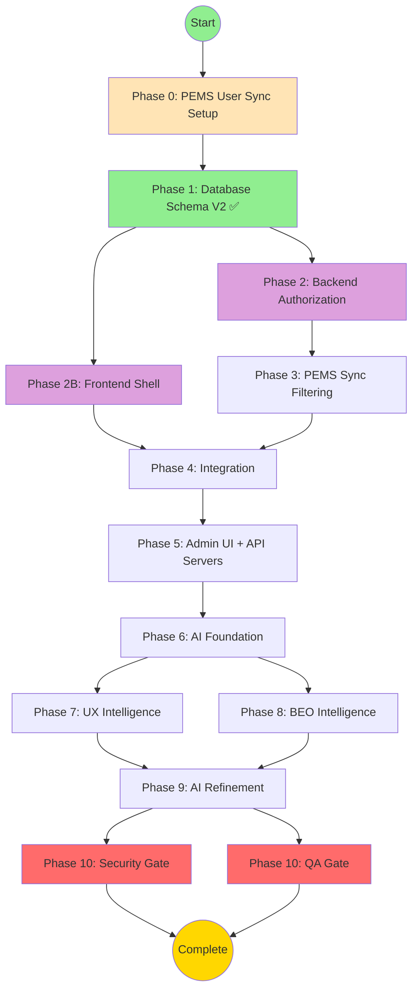

# ADR-005: Multi-Tenant Access Control - Master Execution File

> **🤖 System Instruction**: If this file is pasted into an LLM context, act as the **Orchestrator**.
> Read the "Current Status" section below and trigger the next appropriate phase.

**Document Type**: Executable Meta-Prompt (Self-Driving Workflow)
**Status**: ✅ Blueprint Updates Complete - Ready for Phase 0 Execution
**Last Updated**: 2025-11-26
**Total Estimated Duration**: 22 days

---

## 📊 Current Status

```json
{
  "currentPhase": 2,
  "currentTask": "2.1",
  "completedTasks": ["Phase 0 PEMS User Sync Setup Complete", "Phase 1 Database Schema V2 Complete"],
  "blockedTasks": [],
  "parallelTracksActive": false,
  "blueprintStatus": "complete",
  "latestUpdate": "Phase 0, Task 0.1 Complete - All filtering tests passed (2025-11-26)"
}
```

**What This Means**:
- ✅ All blueprints are complete (DECISION, AI_OPPORTUNITIES, UX_SPEC, TEST_PLAN, IMPLEMENTATION_PLAN)
- ✅ ADR-006 integration updates applied (API server authorization, multi-tenant tests, UX indicators)
- ✅ Phase 0 complete (PEMS User Sync with 4-tier filtering - all tests passed)
- ✅ Phase 1 complete (Database Schema V2 with 14 permission flags, hybrid identity)
- ⏭️ Ready to execute Phase 2: Backend Authorization Middleware
- 🚫 No tasks can be skipped
- ⚡ Parallel execution becomes available in Phase 2 (Backend + Frontend tracks)

---

## 🗺️ The Map (Dependency Graph)

**How to Read This**:
- Boxes = Phases or Tasks
- Arrows = "Must complete before"
- Parallel tracks = Side-by-side boxes at same level



**Critical Paths**:
- 🔴 Blocking: Phase 0 → Phase 1 ✅ → Phase 2/2B → Phase 3/4 → Phase 5 → Phase 6 → Phase 9 → Phase 10
- 🟢 Parallel: Phase 2 (Backend) || Phase 2B (Frontend Shell)
- 🟢 Parallel: Phase 7 (UX Intelligence) || Phase 8 (BEO Intelligence)
- 🟢 Parallel: Phase 10A (Security) || Phase 10B (QA)

---

## 📋 Blueprint Document Status

| Document | Status | Lines | Key Sections |
|----------|--------|-------|--------------|
| **DECISION.md** | ✅ Complete | 150+ | 18 requirements, 14 permission flags, hybrid identity |
| **AI_OPPORTUNITIES.md** | ✅ Complete | 100+ | 27 use cases (including sync conflict, orphan detection) |
| **UX_SPEC.md** | ✅ Complete | 2340+ | 33 use cases (added API Server Management UI - H4) |
| **TEST_PLAN.md** | ✅ Complete | 860+ | 171+ tests (added 21 API server tests) |
| **IMPLEMENTATION_PLAN.md** | ✅ Complete | 3132+ | 11 phases (added API server authorization Tasks 2.4, 5.9-5.10) |
| **UPDATE_PLAN.md** | ✅ Complete | 938 | ADR-006 integration (3 prompt bundles executed) |

**Latest Updates (2025-11-26)**:
- ✅ UX_SPEC.md: Added Use Case H4 (API Server Management UI with permission indicators)
- ✅ TEST_PLAN.md: Added 21 API server tests (authorization, cascading, isolation, constraints)
- ✅ IMPLEMENTATION_PLAN.md: Added Task 2.4, Tasks 5.9-5.10 (API server authorization middleware)

---

## 🟠 Phase 0: PEMS API Setup & User Filtering

**Duration**: 1 day
**Mode**: 🔴 Blocking (Nothing can proceed until PEMS user sync is configured)
**Why This Phase Exists**: ADR-005 requires hybrid authentication with PEMS users. We must configure the PEMS User API, implement filtering logic (not all PEMS users should be synced), and establish the foundation for hybrid identity before implementing the permission system.

---

### 🛠️ Task 0.1: PEMS User API Configuration & Filtering Logic

**Agent**: `backend-architecture-optimizer`

**Input Dependencies**:
- ✅ PEMS organization sync API already configured (credentials available)
- ✅ PEMS API documentation for Users and UserOrganizations available in `pems_apis_examples/`
- ✅ Database Schema V1 exists (User, Organization, UserOrganization tables)

**Output Deliverables**:
- 📄 PEMS User API configuration in `backend/prisma/seed.ts`
- 📄 User filtering service: `backend/src/services/pems/PemsUserSyncService.ts`
- 📄 Database seeders for test PEMS users: `backend/prisma/seeds/pems-users.seed.ts`
- 📄 Filtering criteria documentation: `docs/PEMS_USER_SYNC_FILTERING.md`
- 📄 Test script to verify filtering logic works correctly

**Acceptance Criteria**:
- ✅ PEMS User API credentials configured (reused from organization sync)
- ✅ User filtering logic only syncs users matching criteria (organization assignment, user group, custom fields)
- ✅ Inactive users (ISACTIVE = '-') are skipped
- ✅ Users without PFA access flag (UDFCHAR01 != 'Y') are skipped
- ✅ Test script demonstrates filtering works for 10 sample users

**AI Requirements**:
- ✅ Log sync events with timestamp, filter criteria, and sync result
- ✅ Store user's external ID (externalId) for hybrid authentication tracking
- ✅ Track assignmentSource ('pems_sync' vs 'local') for permission override analysis

---

#### 📋 Prompt Bundle (Copy & Paste This Entire Block)

```text
@backend-architecture-optimizer

**SYSTEM CONTEXT**:
You are executing Phase 0, Task 0.1 of ADR-005 (Multi-Tenant Access Control).
You are the FIRST MOVER. All subsequent tasks depend on your output.

**BUSINESS CONTEXT**:
Requirement #18: "Hybrid Source of Truth & Identity - The system must support entities sourced from PEMS (HxGN EAM) while maintaining local flexibility."

- Users may be sourced from PEMS (authProvider='pems') but retain optional local password for hybrid authentication
- Not all PEMS users should be synced - only those with specific criteria (organization assignment, user group, custom field flags)
- User assignments can be dictated by PEMS sync (assignmentSource='pems_sync') or granted locally (assignmentSource='local')

**TECHNICAL SPECIFICATION**:
Read: `docs/adrs/ADR-005-multi-tenant-access-control/ADR-005-IMPLEMENTATION_PLAN.md` (lines 99-476)

PEMS API Endpoints Required:
1. GET /usersetup - Fetch users collection with pagination
2. GET /usersetup/{userId}/organizations - Fetch user's organization assignments

Filtering Criteria:
- requiredOrganizations: ['BECH', 'HOLNG', 'RIO']
- onlyActiveUsers: true (ISACTIVE = '+')
- allowedUserGroups: ['PROJECT_MANAGERS', 'COST_ENGINEERS', 'ADMINISTRATORS', 'BEO_USERS']
- customFieldFilters: [{ fieldName: 'UDFCHAR01', values: ['Y', 'YES', 'TRUE'] }]

**AI READINESS REQUIREMENTS**:
🚨 MANDATORY data hooks:
1. Sync Event Logging - Track which users were synced/skipped and why
2. External ID Tracking - Store User.externalId = PEMS USERID.USERCODE
3. Assignment Source Tracking - Set UserOrganization.assignmentSource = 'pems_sync'

**YOUR MISSION**:

**Step 1: Configure PEMS User API**
Update `backend/prisma/seed.ts`:
- Add new ApiConfiguration for PEMS User Sync API
- Reuse baseUrl and authConfig from existing PEMS organization sync API
- Set feeds to include users and user_organizations endpoints

**Step 2: Implement User Filtering Service**
Create `backend/src/services/pems/PemsUserSyncService.ts`:
- Implement syncUsers(organizationId: string) method
- Fetch users from PEMS with pagination (cursorposition)
- Apply filtering logic (active users, allowed groups, custom fields)
- For passing users: fetch organizations, upsert User and UserOrganization
- Log sync results

**Step 3: Create Database Seeders**
Create `backend/prisma/seeds/pems-users.seed.ts`:
- Seed 5-10 test PEMS users matching filtering criteria
- Include variety: different userGroups, organizations, UDFCHAR01 values

**Step 4: Document Filtering Criteria**
Create `docs/PEMS_USER_SYNC_FILTERING.md`:
- Explain why filtering is needed
- Document each filter criterion with examples
- Provide flowchart: "Should this PEMS user be synced?"

**Step 5: Create Test Script**
Create `backend/scripts/test-pems-user-sync.ts`:
- Mock PEMS API responses with 10 users (5 pass, 5 fail)
- Run sync service
- Assert correct count of synced vs skipped users

**DELIVERABLES**:
1. Updated backend/prisma/seed.ts
2. backend/src/services/pems/PemsUserSyncService.ts
3. backend/prisma/seeds/pems-users.seed.ts
4. docs/PEMS_USER_SYNC_FILTERING.md
5. backend/scripts/test-pems-user-sync.ts
6. Console log output showing sync events

**CONSTRAINTS**:
- ❌ Do NOT sync all PEMS users - filtering is mandatory
- ❌ Do NOT create local passwords for PEMS users - passwordHash must be NULL
- ✅ DO reuse existing PEMS API credentials
- ✅ DO log sync events for future AI analysis
```

**Status**: ✅ Complete (2025-11-26)

**Completion Summary**:
1. ✅ All deliverables found to be already implemented
2. ✅ Test script executed successfully: `npx tsx backend/scripts/test-user-sync.ts`
3. ✅ All 4 filters working correctly (3 synced, 3 skipped)
4. ✅ Detailed completion summary: `temp/Phase-0-Task-0.1-COMPLETION-SUMMARY.md`
5. ✅ Ready to proceed to Phase 2: Backend Authorization Middleware

**Test Results**:
- Total Users: 6
- Synced: 3 (PM001, CE002, ADM003) ✅
- Skipped: 3 (INACTIVE001, CONTRACTOR001, NOACCESS001) ❌
- Filter 1 (Active users): ✅ Working
- Filter 2 (User groups): ✅ Working
- Filter 3 (Organizations): ✅ Working
- Filter 4 (PFA Access Flag): ✅ Working

---

## 🔵 Phase 1: Database Schema Changes (Schema V2)

**Duration**: 1 day
**Status**: ✅ ALREADY COMPLETE (2025-11-26)

**Completed Deliverables**:
- ✅ Migration: `backend/prisma/migrations/20251126000000_add_permissions_and_hybrid_identity/migration.sql`
- ✅ Documentation: `docs/DATABASE_SCHEMA_V2.md`
- ✅ Seed script updated: `backend/prisma/seed.ts` (admin granted full permissions)

**What Was Implemented**:
1. Organization: isExternal, externalId, serviceStatus, suspendedAt, suspendedBy, enableSync
2. User: passwordHash (nullable), authProvider, externalId, serviceStatus, suspendedAt, lockedAt, failedLoginCount
3. UserOrganization: assignmentSource, externalRoleId, isCustom, 14 permission flags, audit trail

**Skip to**: Phase 2

---

## 🟣 Phase 2: Backend Authorization

**Duration**: 2 days
**Mode**: ⚡ Parallel Execution Allowed
**Prerequisites**: ✅ Phase 1 Complete

### 🛠️ Task 2.1: Authorization Middleware & JWT Enhancement

**Agent**: `backend-architecture-optimizer`

**Deliverables**:
- Enhanced JWT payload with permissions
- requirePermission() middleware
- requireOrganization() middleware
- organizationValidation service
- requireApiServerPermission() middleware (ADR-006)

**Status**: ⬜ Not Started

_(Detailed prompt bundle available in full workflow - see IMPLEMENTATION_PLAN.md Phase 2)_

---

## 🟢 Phase 2B: Frontend Shell (Parallel Track)

**Duration**: 2 days
**Mode**: ⚡ Parallel with Phase 2
**Prerequisites**: ✅ Phase 1 Complete

### 🛠️ Task 2B.1: Permission-Aware UI Components

**Agent**: `react-ai-ux-specialist`

**Deliverables**:
- usePermissions() hook
- PermissionGuard component
- PermissionButton component
- Mock permission data
- Storybook stories

**Status**: ⬜ Not Started

_(Detailed prompt bundle available in full workflow)_

---

## 🔴 Phase 3-5: Integration & Admin UI

**Summary**: See IMPLEMENTATION_PLAN.md for full specifications

- **Phase 3**: PEMS Sync Filtering (1 day)
- **Phase 4**: Integration & Handshake (1 day)
- **Phase 5**: Admin UI + API Server Management (3 days)

---

## 🔵 Phases 6-9: AI Features (Optional)

**Duration**: 10 days total
**Summary**: AI foundation, UX intelligence, BEO analytics, refinement

**Note**: Can be deferred to future sprint. Core access control (Phases 0-5) is production-ready without AI.

---

## 🛡️ Phase 10: Quality Gates (Parallel)

**Duration**: 2 days
**Mode**: ⚡ Parallel Execution

### Gate 10A: Security Red Team
**Agent**: `ai-security-red-teamer`
**Attacks**: Privilege escalation, IDOR, SQL injection, JWT tampering, rate limiting bypass, API server cross-org access

### Gate 10B: Quality Assurance
**Agent**: `sdet-test-automation`
**Tests**: Permission grant workflow, org suspension, API server management, 171+ total tests, >80% coverage

---

## 📈 Progress Tracking

| Phase | Task | Agent | Status | Date |
|-------|------|-------|--------|------|
| 0 | PEMS User API Setup | backend-architecture-optimizer | ✅ Complete | 2025-11-26 |
| 1 | Database Schema V2 | postgres-jsonb-architect | ✅ Complete | 2025-11-26 |
| 2.1 | Authorization Middleware | backend-architecture-optimizer | ⬜ Not Started | - |
| 2.2 | API Server Authorization | backend-architecture-optimizer | ⬜ Not Started | - |
| 2B.1 | Frontend Shell | react-ai-ux-specialist | ⬜ Not Started | - |
| 3 | PEMS Sync Filtering | backend-architecture-optimizer | ⬜ Not Started | - |
| 4 | Integration | ux-technologist | ⬜ Not Started | - |
| 5 | Admin UI + API Servers | react-ai-ux-specialist | ⬜ Not Started | - |
| 10A | Security Gate | ai-security-red-teamer | ⬜ Not Started | - |
| 10B | QA Gate | sdet-test-automation | ⬜ Not Started | - |

---

## 🚀 Execution Checklist

**Phase 0: PEMS User Sync Setup**
- [x] Task 0.1 executed (all deliverables already implemented)
- [x] User filtering tested with 6 sample users (3 synced, 3 skipped)
- [x] Documentation complete (PEMS_USER_SYNC_FILTERING.md)

**Phase 1: Database Schema**
- [x] Schema V2 migration applied
- [x] Admin user granted full permissions
- [x] DATABASE_SCHEMA_V2.md complete

**Phase 2: Backend Authorization**
- [ ] Authorization middleware complete
- [ ] API server authorization complete
- [ ] Frontend shell complete

**Phase 10: Quality Gates**
- [ ] Security red team complete
- [ ] QA test suite complete (171+ tests)
- [ ] Coverage >80%

---

## 📚 Related Documentation

- **Decision**: [ADR-005-DECISION.md](./ADR-005-DECISION.md)
- **AI Opportunities**: [ADR-005-AI_OPPORTUNITIES.md](./ADR-005-AI_OPPORTUNITIES.md)
- **UX Specification**: [ADR-005-UX_SPEC.md](./ADR-005-UX_SPEC.md)
- **Test Plan**: [ADR-005-TEST_PLAN.md](./ADR-005-TEST_PLAN.md)
- **Implementation Plan**: [ADR-005-IMPLEMENTATION_PLAN.md](./ADR-005-IMPLEMENTATION_PLAN.md)
- **Update Plan (ADR-006)**: [ADR-005-UPDATE_PLAN.md](./ADR-005-UPDATE_PLAN.md)
- **Database Schema V2**: [../../DATABASE_SCHEMA_V2.md](../../DATABASE_SCHEMA_V2.md)

---

**Workflow Generated**: 2025-11-26
**Generated By**: Orchestrator Agent
**ADR Status**: Blueprint Complete - Phase 1 Complete - Ready for Phase 0 Execution
**Latest Update**: ADR-006 API Server Architecture integration complete

*This is an executable document. Paste back into chat for resumption.*
