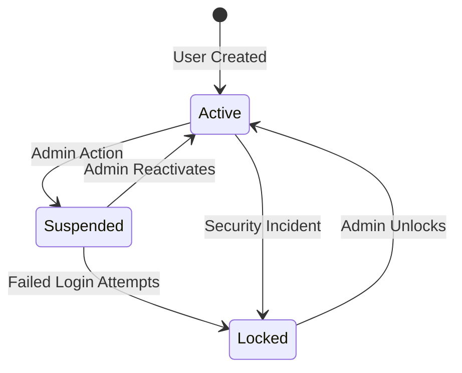
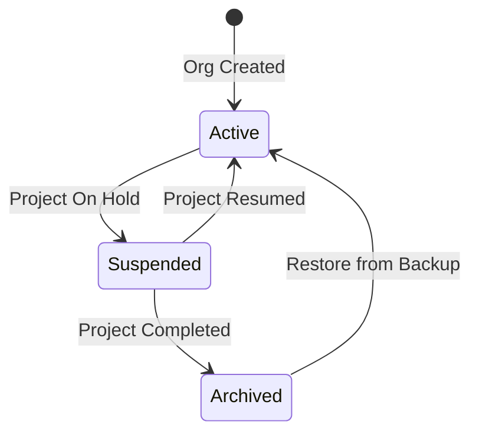

# DATABASE SCHEMA V2: Multi-Tenant Access Control

> **ADR-005 Phase 1 Deliverable**: Hybrid Identity + Granular Permissions
>
> **Migration**: `20251126000000_add_permissions_and_hybrid_identity`
>
> **Status**: ✅ Implemented (Schema Updated, Migration Created, Seed Updated)

---

## Table of Contents

1. [Overview](#overview)
2. [Hybrid Identity Model](#hybrid-identity-model)
3. [Hybrid Tenancy Model](#hybrid-tenancy-model)
4. [Granular Permissions (14 Flags)](#granular-permissions-14-flags)
5. [Service Status Lifecycle](#service-status-lifecycle)
6. [Database Schema Changes](#database-schema-changes)
7. [Migration Details](#migration-details)
8. [Examples](#examples)

---

## Overview

**PFA Vanguard Database Schema V2** introduces multi-tenant access control with three core features:

| Feature | Purpose | Key Fields |
|---------|---------|-----------|
| **Hybrid Identity** | Users from PEMS + Local users | `authProvider`, `externalId`, `passwordHash?` |
| **Hybrid Tenancy** | Organizations from PEMS + Local orgs | `isExternal`, `externalId`, `serviceStatus` |
| **Granular Permissions** | 14 permission flags (5 categories) | `perm_Read`, `perm_EditForecast`, etc. |

### Business Value

- **Seamless PEMS Integration**: Users created in PEMS automatically sync to PFA Vanguard
- **Flexible Authorization**: Fine-grained control over who can read, edit, sync, and admin
- **Service Management**: Suspend users/orgs without deletion (audit trail preserved)
- **Permission Inheritance**: PEMS roles map to PFA Vanguard permissions

---

## Hybrid Identity Model

### The Problem

Users can be created in two places:
1. **PEMS (HxGN EAM)**: Project Managers, Cost Engineers, Administrators already exist in PEMS
2. **PFA Vanguard**: Local users for testing, contractors without PEMS access

Traditional approach: Pick one source of truth (forces data duplication or manual sync).

### The Solution: Hybrid Identity

**Core Concept**: Support BOTH PEMS and local users in the same system.

```prisma
model User {
  // Standard Fields
  id           String   @id @default(uuid())
  username     String   @unique
  email        String?  @unique
  passwordHash String?  // ✅ NULLABLE for pure PEMS users

  // 🔥 NEW: Hybrid Authentication
  authProvider  String  @default("local") // "local" or "pems"
  externalId    String? @unique // PEMS user ID (e.g., "PM001")

  // 🔥 NEW: Service Control
  serviceStatus String   @default("active") // "active", "suspended", "locked"
  suspendedAt   DateTime?
  lockedAt      DateTime?
  failedLoginCount Int   @default(0)
}
```

### User Types

| Type | `authProvider` | `externalId` | `passwordHash` | Login Flow |
|------|----------------|--------------|----------------|------------|
| **Local User** | `local` | `NULL` | `<bcrypt hash>` | Username + Password → JWT |
| **PEMS User** | `pems` | `PM001` | `NULL` | Username → PEMS Auth → JWT |
| **Hybrid User** | `pems` | `PM001` | `<bcrypt hash>` | Password fallback if PEMS down |

### Service Status Lifecycle

```
ACTIVE → SUSPENDED → LOCKED
  ↓          ↓          ↓
Login     Login       Login
Success   Rejected    Rejected
          (temp)      (permanent)
```

| Status | Can Login? | Can Be Reactivated? | Use Case |
|--------|------------|---------------------|----------|
| **active** | ✅ Yes | N/A | Normal operation |
| **suspended** | ❌ No | ✅ Yes | Temporary leave, investigation |
| **locked** | ❌ No | ✅ Yes (admin) | Failed login attempts, security |

---

## Hybrid Tenancy Model

### The Problem

Organizations (construction projects) can exist in:
1. **PEMS**: HOLNG, RIO, BECH (main construction projects)
2. **PFA Vanguard**: Test projects, internal cost tracking

Traditional approach: Hardcode PEMS org codes OR block local orgs.

### The Solution: Hybrid Tenancy

**Core Concept**: PEMS organizations are read-only (core fields), but settings are writable.

```prisma
model Organization {
  // Standard Fields
  id          String  @id @default(uuid())
  code        String  @unique
  name        String
  description String?

  // 🔥 NEW: Hybrid Tenancy
  isExternal  Boolean @default(false) // TRUE if sourced from PEMS
  externalId  String? @unique // PEMS organization ID

  // 🔥 NEW: Service Control
  serviceStatus String   @default("active") // "active", "suspended", "archived"
  suspendedAt   DateTime?
  suspendedBy   String?  // User ID who suspended

  // 🔥 NEW: Settings (writable even for external orgs)
  enableSync    Boolean @default(true)
}
```

### Organization Types

| Type | `isExternal` | `externalId` | Core Fields | Settings | Example |
|------|--------------|--------------|-------------|----------|---------|
| **PEMS Org** | `true` | `BECH001` | ❌ Read-Only | ✅ Writable | HOLNG, RIO, BECH |
| **Local Org** | `false` | `NULL` | ✅ Writable | ✅ Writable | Test Project, Internal |

**Core Fields** (read-only for PEMS orgs): `code`, `name`, `description`
**Settings** (always writable): `enableSync`, `serviceStatus`, `logoUrl`

### Service Status Lifecycle

```
ACTIVE → SUSPENDED → ARCHIVED
  ↓          ↓          ↓
Users      Users       Users
Active     Suspended   Frozen
```

| Status | Users Can Login? | Data Syncs? | Can Be Reactivated? |
|--------|------------------|-------------|---------------------|
| **active** | ✅ Yes | ✅ Yes | N/A |
| **suspended** | ❌ No | ❌ No | ✅ Yes |
| **archived** | ❌ No | ❌ No | ✅ Yes (restore from backup) |

---

## Granular Permissions (14 Flags)

### The Problem

Traditional RBAC (owner/admin/member/viewer) is too coarse-grained:
- A "member" can read AND edit (what if they should only read?)
- An "admin" can do EVERYTHING (what if they should only manage users, not delete data?)

### The Solution: 14 Permission Flags (5 Categories)

```prisma
model UserOrganization {
  id             String @id @default(uuid())
  userId         String
  organizationId String
  role           String @default("member") // Legacy (use permissions instead)

  // 🔥 NEW: Hybrid Assignment Tracking
  assignmentSource String  @default("local") // "local" or "pems_sync"
  externalRoleId   String? // PEMS LDAPROLEID.ROLECODE
  isCustom         Boolean @default(false) // TRUE if permissions differ from PEMS/template

  // 🔥 NEW: 14 Permission Flags (5 Categories)

  // 1. Data Scope (The "What") - 4 permissions
  perm_Read          Boolean @default(true)
  perm_EditForecast  Boolean @default(false)
  perm_EditActuals   Boolean @default(false)
  perm_Delete        Boolean @default(false)

  // 2. Data Operations (The "How") - 3 permissions
  perm_Import        Boolean @default(false)
  perm_RefreshData   Boolean @default(false)
  perm_Export        Boolean @default(false)

  // 3. Financials (The "Mask") - 1 permission
  perm_ViewFinancials Boolean @default(false)

  // 4. Process (The "Workflow") - 2 permissions
  perm_SaveDraft     Boolean @default(false)
  perm_Sync          Boolean @default(false)

  // 5. Admin (The "Control") - 4 permissions
  perm_ManageUsers   Boolean @default(false)
  perm_ManageSettings Boolean @default(false)
  perm_ConfigureAlerts Boolean @default(false)
  perm_Impersonate   Boolean @default(false)

  // 🔥 NEW: Audit Trail
  grantedBy      String?
  grantedAt      DateTime @default(now())
  modifiedBy     String?
  modifiedAt     DateTime @updatedAt
}
```

### Permission Categories (The 5 P's)

#### 1. Data Scope (The "What")

**Purpose**: Control which data users can see and modify.

| Permission | Description | Use Case |
|------------|-------------|----------|
| `perm_Read` | View PFA records | Everyone should have this |
| `perm_EditForecast` | Modify forecast dates/rates | Project Managers |
| `perm_EditActuals` | Modify actual dates/costs | Billing Admin only |
| `perm_Delete` | Mark records as discontinued | Senior PM, Admin |

**Example**: A Cost Engineer can `Read` and `EditForecast`, but cannot `EditActuals` or `Delete`.

#### 2. Data Operations (The "How")

**Purpose**: Control data ingestion and export.

| Permission | Description | Use Case |
|------------|-------------|----------|
| `perm_Import` | Upload CSV files | Data Admin |
| `perm_RefreshData` | Trigger PEMS sync | Integration Admin |
| `perm_Export` | Download PFA data | Analysts, Auditors |

**Example**: A Viewer can `Export` (for analysis) but cannot `Import` or `RefreshData`.

#### 3. Financials (The "Mask")

**Purpose**: Mask financial data (costs, rates) for security.

| Permission | Description | Use Case |
|------------|-------------|----------|
| `perm_ViewFinancials` | See cost numbers | Finance, Senior PM |

**Example**: A Junior PM can view timeline and status but NOT see `monthlyRate` or `purchasePrice`.

#### 4. Process (The "Workflow")

**Purpose**: Control workflow actions (drafts, sync).

| Permission | Description | Use Case |
|------------|-------------|----------|
| `perm_SaveDraft` | Save changes without committing | All editors |
| `perm_Sync` | Push changes to PEMS | Senior PM, Integration Admin |

**Example**: A Cost Engineer can `SaveDraft` (sandbox mode) but only Senior PM can `Sync` to PEMS.

#### 5. Admin (The "Control")

**Purpose**: System administration and delegation.

| Permission | Description | Use Case |
|------------|-------------|----------|
| `perm_ManageUsers` | Add/remove users | Project Admin |
| `perm_ManageSettings` | Change org settings | Project Admin |
| `perm_ConfigureAlerts` | Set up notifications | Project Admin |
| `perm_Impersonate` | View app as another user | Super Admin only |

**Example**: A Project Admin can `ManageUsers` and `ManageSettings` but cannot `Impersonate`.

### Common Permission Templates

| Role | Read | EditForecast | EditActuals | Delete | ViewFinancials | Export | Sync | ManageUsers |
|------|------|--------------|-------------|--------|----------------|--------|------|-------------|
| **Viewer** | ✅ | ❌ | ❌ | ❌ | ❌ | ✅ | ❌ | ❌ |
| **Cost Engineer** | ✅ | ✅ | ❌ | ❌ | ✅ | ✅ | ❌ | ❌ |
| **Project Manager** | ✅ | ✅ | ❌ | ✅ | ✅ | ✅ | ✅ | ❌ |
| **Project Admin** | ✅ | ✅ | ❌ | ✅ | ✅ | ✅ | ✅ | ✅ |
| **Super Admin** | ✅ | ✅ | ✅ | ✅ | ✅ | ✅ | ✅ | ✅ |

---

## Service Status Lifecycle

### User Lifecycle



### Organization Lifecycle



---

## Database Schema Changes

### Organization Table

```sql
-- New Fields
ALTER TABLE "organizations" ADD COLUMN "isExternal" BOOLEAN NOT NULL DEFAULT false;
ALTER TABLE "organizations" ADD COLUMN "externalId" TEXT;
ALTER TABLE "organizations" ADD COLUMN "serviceStatus" TEXT NOT NULL DEFAULT 'active';
ALTER TABLE "organizations" ADD COLUMN "suspendedAt" TIMESTAMP(3);
ALTER TABLE "organizations" ADD COLUMN "suspendedBy" TEXT;
ALTER TABLE "organizations" ADD COLUMN "enableSync" BOOLEAN NOT NULL DEFAULT true;

-- Unique Constraint
CREATE UNIQUE INDEX "organizations_externalId_key" ON "organizations"("externalId") WHERE "externalId" IS NOT NULL;
```

### User Table

```sql
-- Make passwordHash nullable (for pure PEMS users)
ALTER TABLE "users" ALTER COLUMN "passwordHash" DROP NOT NULL;

-- New Fields
ALTER TABLE "users" ADD COLUMN "authProvider" TEXT NOT NULL DEFAULT 'local';
ALTER TABLE "users" ADD COLUMN "externalId" TEXT;
ALTER TABLE "users" ADD COLUMN "serviceStatus" TEXT NOT NULL DEFAULT 'active';
ALTER TABLE "users" ADD COLUMN "suspendedAt" TIMESTAMP(3);
ALTER TABLE "users" ADD COLUMN "lockedAt" TIMESTAMP(3);
ALTER TABLE "users" ADD COLUMN "failedLoginCount" INTEGER NOT NULL DEFAULT 0;

-- Unique Constraint
CREATE UNIQUE INDEX "users_externalId_key" ON "users"("externalId") WHERE "externalId" IS NOT NULL;
```

### UserOrganization Table

```sql
-- Hybrid Assignment Tracking
ALTER TABLE "user_organizations" ADD COLUMN "assignmentSource" TEXT NOT NULL DEFAULT 'local';
ALTER TABLE "user_organizations" ADD COLUMN "externalRoleId" TEXT;
ALTER TABLE "user_organizations" ADD COLUMN "isCustom" BOOLEAN NOT NULL DEFAULT false;

-- 14 Permission Flags
ALTER TABLE "user_organizations" ADD COLUMN "perm_Read" BOOLEAN NOT NULL DEFAULT true;
ALTER TABLE "user_organizations" ADD COLUMN "perm_EditForecast" BOOLEAN NOT NULL DEFAULT false;
-- (... 12 more permission columns ...)

-- Audit Trail
ALTER TABLE "user_organizations" ADD COLUMN "grantedBy" TEXT;
ALTER TABLE "user_organizations" ADD COLUMN "grantedAt" TIMESTAMP(3) NOT NULL DEFAULT CURRENT_TIMESTAMP;
ALTER TABLE "user_organizations" ADD COLUMN "modifiedBy" TEXT;
ALTER TABLE "user_organizations" ADD COLUMN "modifiedAt" TIMESTAMP(3) NOT NULL DEFAULT CURRENT_TIMESTAMP;
```

---

## Migration Details

**Migration File**: `backend/prisma/migrations/20251126000000_add_permissions_and_hybrid_identity/migration.sql`

### Part 1: Schema Changes

- ✅ Add hybrid tenancy fields to `organizations`
- ✅ Add hybrid authentication fields to `users`
- ✅ Make `User.passwordHash` nullable
- ✅ Add 14 permission flags to `user_organizations`
- ✅ Add audit trail fields

### Part 2: Data Migration

```sql
-- Set defaults for existing organizations
UPDATE "organizations" SET "serviceStatus" = 'active', "isExternal" = false, "enableSync" = true;

-- Set defaults for existing users
UPDATE "users" SET "authProvider" = 'local', "serviceStatus" = 'active', "failedLoginCount" = 0;

-- Grant read-only to all existing user-org assignments
UPDATE "user_organizations" SET
  "assignmentSource" = 'local',
  "perm_Read" = true,
  (all other permissions = false);
```

### Part 3: Seed Script Updates

```typescript
// Grant full permissions to admin user
await prisma.userOrganization.updateMany({
  where: { userId: adminUser.id },
  data: {
    perm_Read: true,
    perm_EditForecast: true,
    perm_EditActuals: true,
    perm_Delete: true,
    perm_Import: true,
    perm_RefreshData: true,
    perm_Export: true,
    perm_ViewFinancials: true,
    perm_SaveDraft: true,
    perm_Sync: true,
    perm_ManageUsers: true,
    perm_ManageSettings: true,
    perm_ConfigureAlerts: true,
    perm_Impersonate: true,
  },
});
```

---

## Examples

### Example 1: Create a PEMS User

```typescript
// Synced from PEMS User Sync API
await prisma.user.create({
  data: {
    username: 'JSMITH',
    email: 'john.smith@contractor.com',
    firstName: 'John',
    lastName: 'Smith',
    authProvider: 'pems', // ✅ PEMS user
    externalId: 'PM001',  // ✅ PEMS user ID
    passwordHash: null,   // ✅ No password (auth via PEMS)
    serviceStatus: 'active',
  },
});
```

### Example 2: Create a Local User

```typescript
// Created directly in PFA Vanguard
await prisma.user.create({
  data: {
    username: 'testuser',
    email: 'test@example.com',
    passwordHash: await bcrypt.hash('password123', 10),
    authProvider: 'local', // ✅ Local user
    externalId: null,      // ✅ No PEMS ID
    serviceStatus: 'active',
  },
});
```

### Example 3: Grant Cost Engineer Permissions

```typescript
await prisma.userOrganization.create({
  data: {
    userId: 'user-id',
    organizationId: 'org-id',
    role: 'member', // Legacy field
    assignmentSource: 'local',

    // Grant Cost Engineer template
    perm_Read: true,
    perm_EditForecast: true,
    perm_ViewFinancials: true,
    perm_Export: true,
    perm_SaveDraft: true,

    // Deny dangerous permissions
    perm_EditActuals: false,
    perm_Delete: false,
    perm_Sync: false,
    perm_ManageUsers: false,
  },
});
```

### Example 4: Suspend an Organization

```typescript
await prisma.organization.update({
  where: { code: 'PROJECT_ABC' },
  data: {
    serviceStatus: 'suspended',
    suspendedAt: new Date(),
    suspendedBy: adminUserId,
  },
});

// Result: All users of PROJECT_ABC cannot login until org is reactivated
```

### Example 5: Lock a User After Failed Logins

```typescript
// After 5 failed login attempts
await prisma.user.update({
  where: { username: 'compromised_user' },
  data: {
    serviceStatus: 'locked',
    lockedAt: new Date(),
    failedLoginCount: 5,
  },
});

// Result: User cannot login until admin unlocks
```

---

## Summary

✅ **Hybrid Identity**: PEMS users + Local users in one system
✅ **Hybrid Tenancy**: PEMS orgs + Local orgs with service control
✅ **Granular Permissions**: 14 flags across 5 categories
✅ **Service Status**: Suspend/lock without deletion (audit trail)
✅ **Backward Compatible**: Existing records migrated with safe defaults

**Next Steps** (ADR-005 Phase 2):
- [ ] Implement PEMS User Sync Service (read from PEMS `usersetup` API)
- [ ] Map PEMS roles to PFA Vanguard permissions
- [ ] Build Permission Enforcement Middleware (backend)
- [ ] Update Frontend to check permissions before UI actions
- [ ] Add Permission Management UI (Admin Dashboard)

---

## ADR-007: API Connectivity & Intelligence Layer

### 3-Tier Connectivity Schema

> **ADR-007 Task 1.1**: Support admin-configurable field mappings without code changes.

#### Overview

The 3-tier connectivity model separates connection, endpoint, and field mapping concerns:

| Tier | Model | Purpose |
|------|-------|---------|
| **Tier 1** | `ApiServer` | Connection credentials (base URL, auth) |
| **Tier 2** | `ApiEndpoint` | Resource paths + sync configuration |
| **Tier 3** | `ApiFieldMapping` | Field transformation rules with Time Travel |

#### ApiFieldMapping (New)

Maps source API fields to destination model fields with versioning support:

```prisma
model ApiFieldMapping {
  id               String   @id @default(cuid())
  endpointId       String

  // Field Mapping
  sourceField      String   // Source API field (e.g., "udf_char_01")
  destinationField String   // Destination model field (e.g., "category")
  dataType         String   @default("string")

  // Transformation Rules
  transformType    String?  @default("direct")
  transformParams  Json?    @default("{}")
  defaultValue     String?

  // Time Travel Support (CRITICAL)
  validFrom        DateTime @default(now())
  validTo          DateTime?
  isActive         Boolean  @default(true)

  // AI Metrics
  avgTransformTime Int      @default(0)
  errorCount       Int      @default(0)
}
```

#### ApiEndpoint Enhancements (ADR-007)

New fields added to support delta sync and promotion filters:

```prisma
// Added to ApiEndpoint
targetModel      String?  // Prisma model: "PfaRecord", "AssetMaster"
defaultParams    Json     @default("{}") // Default API query params
supportsDelta    Boolean  @default(true)
deltaField       String?  // Field for delta queries ("last_modified")
deltaStrategy    String   @default("timestamp") // timestamp | id
promotionRules   Json     @default("[]") // JsonLogic filters for Bronze -> Silver
lastSyncAt       DateTime?
avgLatency       Int?
errorRate        Float?
```

#### Time Travel Support

Field mappings support versioning via `validFrom`/`validTo`:

- **Current Rules**: `validTo IS NULL` (active mapping)
- **Historical Rules**: `validFrom <= batchDate <= validTo`
- **Replay**: Transformation service uses rules active at batch ingestion time

Example: Replay Bronze batch from Nov 1st using Nov 1st mapping rules, even if mappings changed since.

#### Migration

**File**: `backend/prisma/migrations/20251127_add_api_field_mapping/migration.sql`

```sql
-- CreateTable: api_field_mappings
CREATE TABLE "api_field_mappings" (
    "id" TEXT NOT NULL,
    "endpointId" TEXT NOT NULL,
    "sourceField" TEXT NOT NULL,
    "destinationField" TEXT NOT NULL,
    -- ... (see migration file for full schema)
);

-- AlterTable: api_endpoints (add ADR-007 fields)
ALTER TABLE "api_endpoints" ADD COLUMN "targetModel" TEXT;
ALTER TABLE "api_endpoints" ADD COLUMN "defaultParams" JSONB NOT NULL DEFAULT '{}';
-- ... (see migration file for full schema)
```

---

## ADR-007 Task 1.2: Medallion Architecture (Bronze/Silver/Gold)

### Overview

The Medallion Architecture implements a three-tier data quality pattern:

| Layer | Purpose | Mutability | Data Source |
|-------|---------|------------|-------------|
| **Bronze** | Raw API responses (append-only) | **Immutable** | External APIs (PEMS, etc.) |
| **Silver** | Transformed, validated data | Mutable | Bronze → Transformation Service |
| **Gold** | Aggregated analytics | Computed | Silver → Materialized Views (future) |

### Bronze Layer: Immutable Raw Data

The Bronze layer stores unmodified API responses for audit trail and Time Travel replays.

**Critical Rule**: Bronze records are **append-only**. Updates and deletes are blocked by Prisma middleware.

#### BronzeBatch

Tracks ingestion batches with AI-powered schema drift detection:

```prisma
model BronzeBatch {
  id                 String    @id @default(cuid())
  syncBatchId        String    @unique
  organizationId     String
  endpointId         String
  entityType         String    // "PFA" | "ASSET" | "CLASSIFICATION"
  ingestedAt         DateTime  @default(now())
  completedAt        DateTime?

  recordCount        Int       @default(0)
  validRecordCount   Int       @default(0)
  invalidRecordCount Int       @default(0)

  // AI Hook: Schema fingerprinting for drift detection
  schemaFingerprint  Json?     @db.JsonB  // { fields: string[], types: Record<string, string> }
  warnings           Json      @default("[]") @db.JsonB
  errors             Json      @default("[]") @db.JsonB

  syncType           String    @default("full") // "full" | "delta"
  deltaFromBatchId   String?   // Reference to previous batch for delta sync
}
```

**AI Hook**: `schemaFingerprint` enables automatic detection of API schema changes (field additions/removals/type changes).

#### BronzeRecord

Stores raw JSONB payloads from external APIs:

```prisma
model BronzeRecord {
  id             String   @id @default(uuid())
  syncBatchId    String
  organizationId String
  entityType     String   // "PFA" | "ASSET" | "CLASSIFICATION"
  ingestedAt     DateTime @default(now())

  rawJson        Json     @db.JsonB
  schemaVersion  String?  // Hash of field names for version tracking

  // Relations
  lineage        DataLineage[]
  batch          BronzeBatch   @relation(fields: [syncBatchId], references: [syncBatchId])
}
```

**Immutability Enforcement**: Prisma middleware (`backend/src/config/database.ts:18-28`) blocks all `update`, `updateMany`, `delete`, and `deleteMany` operations on `BronzeRecord`.

### Silver Layer: Transformed Data with Lineage

The Silver layer (`PfaRecord`, `AssetMaster`) contains business-ready data transformed from Bronze records.

#### DataLineage

Tracks Bronze → Silver transformations for audit trail and Time Travel replay:

```prisma
model DataLineage {
  id              String   @id @default(cuid())
  silverRecordId  String   @unique
  silverModel     String   // "PfaRecord" | "AssetMaster"
  bronzeRecordId  String

  // Snapshot of mapping rules at transformation time (for Time Travel)
  mappingRules    Json     @db.JsonB

  transformedAt   DateTime @default(now())
  transformedBy   String   // "PemsTransformationService" | user ID

  bronzeRecord    BronzeRecord @relation(fields: [bronzeRecordId], references: [id])
  pfaRecord       PfaRecord?   @relation(fields: [silverRecordId], references: [id])
}
```

**Time Travel Support**: `mappingRules` stores a snapshot of `ApiFieldMapping` rules active at transformation time, enabling replay of Bronze batches with historical transformation logic.

#### PfaRecord Enhancements

Added lineage tracking and orphan detection:

```prisma
model PfaRecord {
  // ... existing fields ...

  // ADR-007: Medallion Architecture - Bronze -> Silver lineage
  lastSeenAt     DateTime     @default(now()) // For orphan detection
  bronzeRecordId String?      // Link to source Bronze record
  lineage        DataLineage?
}
```

**Orphan Detection**: Records missing from the latest Bronze batch (based on `lastSeenAt`) can be flagged for review.

### Migration

**File**: `backend/prisma/migrations/20251128000000_add_medallion_bronze_silver_gold/migration.sql`

**Tables Created**:
- `bronze_batches`: Batch metadata with schema fingerprinting
- `bronze_records`: Immutable raw JSONB payloads
- `data_lineage`: Bronze → Silver transformation audit trail

**Indexes**:
- `bronze_batches`: Organization + time-based queries, endpoint-level queries
- `bronze_records`: Batch queries, organization + entity type queries
- `data_lineage`: Bi-directional lookups (Silver → Bronze, Bronze → Silver)
- `pfa_records`: Orphan detection queries (`organizationId + lastSeenAt`)

### Immutability Middleware

**Location**: `backend/src/config/database.ts`

```typescript
prisma.$use(async (params, next) => {
  const modelName = params.model as string | undefined;
  const mutatingActions = ['update', 'updateMany', 'delete', 'deleteMany'];

  if (modelName === 'BronzeRecord' && mutatingActions.includes(params.action)) {
    const errorMessage = `Bronze records are immutable. Operation '${params.action}' on BronzeRecord is not allowed.`;
    logger.error(`[IMMUTABILITY VIOLATION] ${errorMessage}`);
    throw new Error(errorMessage);
  }
  return next(params);
});
```

**Verification**: Run `npx tsx backend/scripts/test-bronze-immutability.ts` to verify immutability enforcement.

### Use Cases

#### 1. Time Travel Replay

When PEMS changes field mappings (e.g., `udf_char_01` → `category`), replay old Bronze batches with new mapping rules:

```typescript
const batch = await prisma.bronzeBatch.findUnique({ where: { syncBatchId: 'batch-2025-10-01' } });
const records = await prisma.bronzeRecord.findMany({ where: { syncBatchId: batch.syncBatchId } });

// Apply current mapping rules to historical data
const transformedRecords = await transformationService.applyMappings(records, getCurrentMappingRules());
```

#### 2. Schema Drift Detection

Compare `schemaFingerprint` across batches to detect API changes:

```typescript
const latestBatch = await prisma.bronzeBatch.findFirst({ orderBy: { ingestedAt: 'desc' } });
const previousBatch = await prisma.bronzeBatch.findFirst({
  where: { ingestedAt: { lt: latestBatch.ingestedAt } },
  orderBy: { ingestedAt: 'desc' },
});

if (JSON.stringify(latestBatch.schemaFingerprint) !== JSON.stringify(previousBatch.schemaFingerprint)) {
  // Alert: API schema changed!
  await notifyAdmin('PEMS API schema changed - review field mappings');
}
```

#### 3. Orphan Detection

Find PFA records that disappeared from PEMS:

```typescript
const orphans = await prisma.pfaRecord.findMany({
  where: {
    organizationId: 'RIO',
    lastSeenAt: { lt: latestSyncTimestamp },
  },
});
```

### Future: Gold Layer (Phase 5)

The Gold layer will implement materialized views for pre-computed KPIs:

- Variance summaries by category/organization/month
- Cost trend analysis (rental vs purchase)
- Budget utilization dashboards

**Design**: See `KpiDefinition` and `KpiExecutionLog` models (Task 1.3).

---

**Generated**: 2025-11-26
**ADR**: ADR-005 Multi-Tenant Access Control
**Phase**: Phase 1 (Database Schema)
**Status**: ✅ Complete

**Updated**: 2025-11-27
**ADR**: ADR-007 API Connectivity & Intelligence Layer
**Phase**: Phase 1 - Task 1.1 (3-Tier Connectivity Schema)
**Status**: ✅ Complete

**Updated**: 2025-11-28
**ADR**: ADR-007 API Connectivity & Intelligence Layer
**Phase**: Phase 1 - Task 1.2 (Medallion Storage Layers)
**Status**: ✅ Complete
